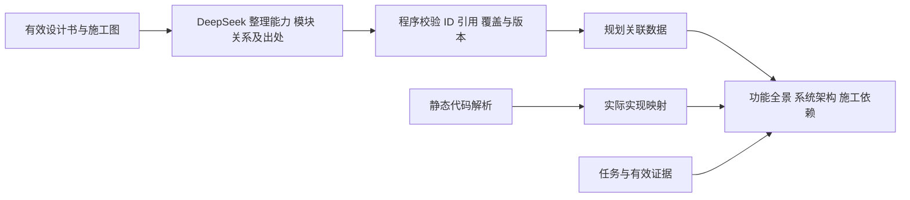
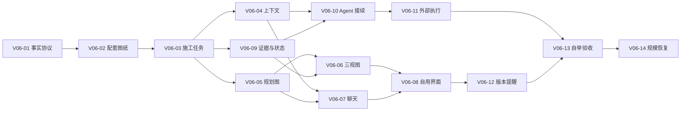

# 塔台（Tatai）设计书 v0.6

| 项 | 内容 |
| --- | --- |
| 文档版本 | v0.6，自用工作流、图纸与 Agent 接续修订稿，2026-09-20 |
| 本轮状态 | 用户授权修订已落稿；新增机制待施工与场景验收，不表示已实现或已逐项终验 |
| 修订依据 | 原设计与运行现场；2026-09-19 至 20 日关于非程序员界面、施工图、三视图、聊天、Agent 接续和自用范围的讨论 |
| 设计角色 | 本轮由 Codex 按用户授权深化并修订；默认后续设计/关键抽查角色为 GPT-6 |
| 产品与文档事实源 | 本文件；施工任务与依赖见 PLAN.md，验证流水见 PROGRESS.md，施工约束见 AGENTS.md |
| 仓库 / 许可证 | https://github.com/sannongwangluo/tatai / MIT |

> 先读 §1.5 工作链、§1.7 实现边界和 §11.7 建设总图，再按职责进入对应章节。普通施工者可提异议，不能自行改变目标或基线；用户明确授权的设计修订角色可以改稿。附录 B 是保留历史，现行口径以正文与附录 A 为准。

## 1. 项目概述

### 1.1 一句话定位

塔台是**一个人持续推进多个 Agent 项目的工作台**：把用户意图、设计依据、任务、执行状态和验收证据保存在项目中，让人能作出决定，让不同 Agent 在换模型、换会话、换执行器之后继续同一件事。

用户管理的是“项目最终做成什么、为什么这样做、现在是否可信”，不应靠记住所有聊天、逐个搬运提示词、观察终端滚动来维持项目。塔台负责连接这些信息和行动；外部执行器负责启动工作进程、运行命令和修改代码。

**可见只是入口，持续推进才是目的。** 图、聊天和任务列表都要能回答：为什么做、依据哪一版、当前缺什么、下一步谁负责、什么证据足以交付。只有图而没有决策与任务连接，仍会让用户成为人工中转站。

### 1.2 要解决的痛点与隐性价值

| 痛点 | 产品需要提供的能力 | 用户实际得到的价值 |
| --- | --- | --- |
| 意图分散在多轮聊天里 | 将目的、用户场景、边界、取舍和验收场景编成有来源的意图记录 | 少重复解释，也能发现“功能做了但目的没实现” |
| 原型看着能用，背后的规则不完整 | 原型与正式设计分开；补状态、异常、权限、数据和非功能要求 | 低成本探索可以保留，高成本返工可以提前减少 |
| 换模型、窗口或执行器就断档 | 可校验版本的交接包、检查点、未决问题和下一步动作 | 项目连续性不依赖某一个模型一直在线 |
| 多个 Agent 各自推进却互相覆盖 | 任务依赖、工作范围、认领与交付契约、集成责任 | 并行增加产出，同时让冲突可发现、可恢复 |
| 文件在变，但不知道是否接近目标 | 意图—能力—设计—任务—代码—证据的关联 | 人可以沿结果追到依据，Agent 可以沿任务拿到必要上下文 |
| 贵模型反复读仓库，便宜模型重复踩坑 | 分层上下文、结构化审计包、失效检测、针对风险升级 | 节省的是重复劳动，而不是省掉必要判断 |
| 完成状态来自执行者的一句话 | 执行完成、机械验证、独立审计、用户验收分别记录 | “完成”变成可查证的结论，降低虚假的安全感 |
| 项目越来越大，所有内容挤在同一屏与上下文 | 按子系统和变更范围展开，先显示需要人处理的例外 | 管理复杂度随当前决策范围增长，不随全仓文件数直接增长 |

### 1.3 设计原则（总纲）

1. **人保留目的与取舍，Agent 承担有边界的工作。** 用户明确授权的日常动作连续执行；仅遇到目标冲突、超出授权或必要信息缺失时升级。禁止把每一步都变成人工确认，也禁止把未获授权的动作包装成自动推进。
2. **同一事实，两种表达。** 人看到意义、变化、风险和可选动作；Agent 得到版本、依赖、约束、输入与验收方法。两者指向同一记录，不能各维护一套进度。
3. **事实、目标、推断和提案分开。** 代码存在不证明设计合理；模型认为完成不证明验证通过；旧记忆和已被替代的决定不能冒充现行规则。
4. **上下文持久化，并校验是否仍然适用。** 保存文件是基础，版本与来源、任务依赖、失败现场和恢复流程才构成交接能力。摘要是入口，可回到原始依据。
5. **按工作性质分配模型。** 低成本模型承担样板、调查、施工、机械整理和大量初审；高能力模型承担设计判断、关键节点审查和独立抽查。角色可替换，项目事实不能绑定某一供应商、模型名称或会话。
6. **文件即事实源，一事一源。** md/json/jsonl 保持可读；索引、视图和摘要可重建。新结构必须有版本、迁移和并发保护，不让多份 Markdown/JSON 无规则互写。
7. **完整目标，分段形成闭环。** 不用“以后再说”掩盖必要能力；每个建设阶段都交付可以真实验收的一段链路。禁止用旧任务全部 done 推导新设计已经实现。
8. **自用先验，规模用证据说话。** 先用塔台自身验证，再扩大项目体量；不预先承诺支持任意超大型项目或没有 bug。

### 1.4 当前自用范围与后续方向

- 当前使用者是不懂代码、但清楚自己工作链的项目主人。本机、单用户、多项目；用户自行打开需要的 Agent、选择工具、模型和档位。**面向人的“下一步打开哪个工具/模型/档位”引导、自动选型及一键启动向导延期**，不作为当前首页功能或验收门槛。
- 当前必须完成：DeepSeek 讨论方向；GPT-6 定设计书和施工图；内置 DeepSeek 辅助将已审定材料转换为可校验图数据；程序生成三视图并自动同步实际进度；接入的 Agent 获取接续任务、依据和完成要求。
- 塔台管理项目事实、任务资格、认领、交接和证据；外部协调器负责启动/终止执行进程、隔离目录、拉起 Kimi Code。支持已接入执行端的连续工作，不在塔台重建一个进程调度中心。
- 当前主界面不保留面向用户的终端。后台诊断与外部 Agent 的终端能力按需要保留；用户看可体验结果、验证说明和问题原因（§3.7）。
- 不建设代码编辑器、通用聊天聚合器、跨供应商自动选型平台或完整计费产品。用量只记录执行端可提供的实测值；缺失标未知。
- 远程/手机、人类多租户、通用引导及自动云备份另列方向；已有远程代码默认关闭。本机私有事实的备份恢复属于连续性，不能因代码已提交 Git 就省略。

### 1.5 用户指定的默认工作链

本版按用户 2026-09-20 的纠正收紧当前范围：工具、模型与档位由用户自行选择；流程记录角色及实际执行环境，不提供逐步操作教学。下表是项目职责安排，不保证任意客户端接上 MCP 后自动运行。

| 环节 | 默认责任方 | 给下一环的产物 | 自动接续边界 |
| --- | --- | --- | --- |
| 讨论方向 | 用户 + 塔台内置 DeepSeek | 目标、场景、范围、取舍、疑问；可附低成本交互样板 | 讨论与草稿保存，不自动当成定版 |
| 定设计与施工图 | GPT-6；用户提供业务取舍与纠正 | 设计书、施工图、任务依赖与验收条件；两份材料绑定同一基线 | 获委派的技术设计与拆卡直接完成，不把技术判断逐项交回用户 |
| 生成项目图 | 内置 DeepSeek + 程序 | 带章节/任务来源的能力与模块关系，三种视图及未映射清单 | DeepSeek 整理语义；程序校验、布局、渲染；不得修改审定架构或编造进度 |
| 持续施工 | 用户打开 Claude Code；协调 Kimi Code，默认 DeepSeek V4.1 Flash | 任务认领、实际修改、验证、检查点与结果 | 已授权范围内取就绪任务→执行→验证→回报→再取下一项；换会话不重新交代背景 |
| 审计与修复 | 脚本、低成本独立审计与施工会话 | 缺陷证据、覆盖清单、修复与复测 | 日常机械检查不占高端长上下文；同因反复失败按风险升级 |
| 关键判断与终审抽查 | GPT-6 | 关键接口与风险判断，独立抽样和原文核查 | 不逐任务调用高端，也不只看作者摘要；发现系统性遗漏扩大同类检查 |
| 体验验收 | 用户 | 场景是否满足、接受/退回与已知限制 | 技术审定、质量通过与人工接受分别记录；Agent 不冒签用户 |

外部协调入口为 Claude Code；客户端与底层模型分开记录，实际启动和配置已在 V06-11 核对。内置 DeepSeek 与外部 Kimi Code 的配置独立，不混用标识。

五环质量流程沿用找错→找丑→修复→终审→回写。节省高端投入靠减少重复扫描、机械转述与返工，同时保留高能力角色直接查验原始证据的责任（§5.5）。

**需求 → 设计 → 施工的派生方向（2026-09-24 用户澄清）**：客户需求是最终交付目标；**审定的 DESIGN.md 是施工依据，PLAN.md 由 DESIGN.md 派生**——施工卡、依赖与验收都要能追到设计依据与需求。实现与 DESIGN 偏离时按 §4.5 处置（标异常、给出处与影响、修正实现）；**不得依据代码自动修改 DESIGN.md 或 PLAN.md**。只有确认 DESIGN 漏写或误解了用户需求，或用户明确授权变更时，才由设计角色修订 DESIGN 并同步 PLAN。

### 1.6 一条完整使用故事

用户进入项目，与 DeepSeek 聊出希望达到的方向；必要时先让低成本模型提供交互样板。GPT-6 读取讨论、原设计与当前实现，定下设计书和施工图，明确做什么、先后关系与如何验收。塔台识别这一有效基线，内置 DeepSeek 整理模块/关系并给出来源，程序检查后画出尚未施工的灰色规划图。

用户自行打开熟悉的执行 Agent。Agent 按项目入口规则读取交接简报，核对当前任务、依赖、现场与权限，接续工作。提交代码与检查结果后，塔台自动更新任务、图与证据状态；执行者能继续就继续，阶段切换则保存交接资料等待对应角色接入。用户无需逐卡发“继续”。

用户回来查看新增的可体验结果和必要的业务问题。图中每个颜色都能展开解释依据；换 Agent、模型或重启协调器后仍能接着做。若设计有修改，新的草稿先保留，只有激活新的配套基线才影响已接任务。最终抽查与用户体验通过后保留版本和证据，用于下一次迭代。

### 1.7 文档状态与阅读规则

本版为 **v0.6 设计与施工依据修订稿**，用户已授权将本轮讨论落实到 DESIGN.md 与 PLAN.md。软件功能仍以运行实现为准；本次改文档不表示目标功能上线、不替用户作最终体验验收。

| 内容 | 当前性质 | 阅读方法 |
| --- | --- | --- |
| §2.3、§6.3–§6.4 及明确标“当前”的段落 | 既有格式/工具与已知缺口 | 当前 Agent 只能使用实际暴露的能力 |
| §2.5–§2.9、§3、§4、§5.4–§5.8、§6.5–§6.7、§8.5 | 目标契约；部分复用既有能力 | 按 PLAN 的 V06 施工卡实现，不将文中名称当作现有工具 |
| §11.1、旧 PLAN 卡、PROGRESS 历史 | 既有模块身份与当时施工证据 | 不重置旧状态，不作为 v0.6 验收依据 |
| 附录 A / B | 当前决定导航 / 原始待议历史 | 当前正文优先；历史条目不因排在末尾而恢复效力 |
| 需求 → 设计 → 施工的派生方向 | 用户需求是最终交付目标；审定 DESIGN 是施工依据，PLAN 由 DESIGN 派生（2026-09-24 用户澄清） | 代码与 DESIGN 偏离时按 §4.5 标异常、给出处与影响并修正实现；**不得依据代码自动修改 DESIGN/PLAN**。只有确认 DESIGN 漏写或误解用户需求、或用户明确授权变更时，才由设计角色修订 DESIGN 并同步 PLAN |
| 历史归档 | 被替代设计 | [v0.4 历史](docs/design-history-v0.4.md)、[v0.5 历史](docs/design-history-v0.5.md)，只供追溯 |

本轮文档任务为 DES-V06；原 V05-01 至 V05-07 尚未施工，由 V06 具体卡承接。施工卡中的实现产物和验证命令是后续要求，状态全部保留 todo。

**2026-09-24 现行正文修订（按用户同日两轮澄清）**：§1.5、§2.6、§2.9、§3.2、§3.3、§4.1、§4.2、§4.4、§4.5、§11.2、§11.3、§11.8、§12.1 的现行正文已**直接修正**（不只在文末追加「最新口径」）；逐条依据、来源与遗留待办见**附录 G**。本轮为文档修订，不改代码、不激活基线、不代签任何验收。原先「正文一字未改」的说法自本稿起不再成立，相关历史声明按附录 G 读。

## 2. 核心概念与数据模型

### 2.1 三个核心概念

**项目 = 独立目录。** 每个项目就是一个真实的目录（D 盘根目录下另起，如 `D:\xxx`），塔台不把项目"装进"自己的数据库，只记住它的路径。
依据：项目本来就是目录，agent 本来就在目录里干活，中间插一层虚拟文件系统纯属自找麻烦。

**项目管理 = 一张全局注册表。** 注册表就是"项目名 → 目录路径"的映射，落在运行服务实际使用的全局数据目录中，默认 `~/.tatai/registry.json`，可通过配置覆盖。连接 MCP 时以 health 返回的 `data_dir` 对齐，不硬编码旧机器位置。
依据：注册表是唯一需要跨项目存在的东西，其余状态都下沉到各项目目录。

**自举。** 工作台程序本体也被它自己管理，是第一个试用项目。
依据：作者自己就是第一个用户，自己吃自己的狗粮，问题暴露最快。

### 2.2 每个项目内的 `.工作台/` 目录

```
<项目根>/
├── .工作台/                    # 默认 gitignore，不外泄
│   ├── design.md               # 设计书（唯一事实源）
│   ├── design.discuss.md       # 待议记录（执行 agent 只能追加到这里）
│   ├── progress.json           # 进度：Gate 与模块状态；任务列表在 tasks.json
│   ├── gate.jsonl              # Gate 过关/打回流水（带时间戳）
│   ├── tasks.json              # 任务级状态（agent 经 MCP 自报）
│   ├── chat/
│   │   └── <session>.jsonl     # Flash 聊天记录，按会话落盘
│   ├── changes.jsonl           # 变更流水（文件监听顺带产出，简版）
│   ├── arch/
│   │   ├── modules.json        # 顶层模块骨架（tree-sitter + Flash 起名后的产物）
│   │   ├── layout.json         # 布局位置记忆（刷新不跳动）
│   │   ├── names.json          # 模块人话名缓存（Flash 起名结果，重命名刷新用）
│   │   ├── mindmap-fold.json   # 思维导图折叠记忆（展开/收起状态）
│   │   ├── reconcile-last.json / reconcile-request.json  # 对账上下文（上次结果 / 待处理请求）
│   │   └── supplement.json     # 聊天补全层（§3.2；节点 id 一律 chat: 前缀）
│   └── logs/                   # 运行日志
├── AGENTS.md                   # 项目约定（含"接入了塔台 MCP"那句）
└── ...（项目本体文件）
```

### 2.3 数据模型

以下为当前 v1 基础格式，不含目标的认领、审计与版本协议；新增设计见 §2.5–§2.8，不能直接要求当前程序读取新字段。

#### 2.3.1 全局注册表 `<工作根目录>/.tatai/registry.json`

```json
{
  "version": 1,
  "projects": [
    {
      "id": "brain-memory",
      "name": "第二大脑",
      "path": "D:\\Github 资料\\5.0 类脑记忆",
      "kind": "backend",
      "registered_at": "2026-09-17T10:00:00+08:00",
      "last_opened_at": "2026-09-17T11:20:00+08:00"
    },
    {
      "id": "tatai",
      "name": "塔台",
      "path": "D:\\tatai",
      "kind": "fullstack",
      "self_managed": true
    }
  ]
}
```

字段说明：

| 字段 | 含义 | 备注 |
| --- | --- | --- |
| `id` | 稳定标识 | 目录改名不变，用于内部引用 |
| `name` | 显示名 | 与目录名解耦，可手工改 |
| `path` | 绝对路径 | 唯一真实指向 |
| `kind` | `backend` / `frontend` / `fullstack` / `static`（静态站） | 决定是否出现"页面预览 Tab" |
| `self_managed` | 是否自举项目 | 塔台自身标记为 true |

#### 2.3.2 进度 `progress.json`

```json
{
  "version": 1,
  "gate": {
    "current_step": "design",
    "history": [
      { "step": "kickoff", "result": "pass", "at": "2026-09-10T09:00:00+08:00", "note": "立项确认" },
      { "step": "requirement", "result": "pass", "at": "2026-09-11T14:00:00+08:00", "note": "需求冻结" },
      { "step": "design", "result": "pending", "at": null, "note": null }
    ]
  },
  "modules": [
    { "id": "m-registry", "name": "项目注册表", "status": "done" },
    { "id": "m-arch", "name": "架构图引擎", "status": "doing" },
    { "id": "m-gate", "name": "Gate 时间线", "status": "todo" },
    { "id": "m-mcp", "name": "MCP 接口", "status": "issue" }
  ]
}
```

模块状态四色（后续架构图着色直接读这里）：

| status | 颜色 | 含义 |
| --- | --- | --- |
| `todo` | 灰 | 未开始 |
| `doing` | 黄 | 进行中 |
| `done` | 绿 | 已完成 |
| `issue` | 红 | 有问题 |

#### 2.3.3 Gate 流水 `gate.jsonl`

一行一条，只追加不修改：

```jsonl
{"ts":"2026-09-10T09:00:00+08:00","step":"kickoff","result":"pass","by":"user","note":"立项确认"}
{"ts":"2026-09-11T14:00:00+08:00","step":"requirement","result":"pass","by":"user","note":"需求冻结"}
{"ts":"2026-09-12T10:30:00+08:00","step":"design","result":"reject","by":"user","note":"架构图方案没想清，打回"}
```

#### 2.3.4 任务 `tasks.json`

```json
{
  "version": 1,
  "tasks": [
    {
      "id": "t-001",
      "title": "实现 tree-sitter 顶层模块解析",
      "module_id": "m-arch",
      "status": "doing",
      "reporter": "kimi-code",
      "updated_at": "2026-09-17T11:00:00+08:00",
      "note": "卡在 wasm 加载，换 node binding 中"
    }
  ]
}
```

任务级状态（`todo` / `doing` / `done` / `blocked`）由 agent 经 MCP 自报，**不是用户手点**。`note`（可选）是 agent 自报时附带的备注，**落盘留痕**（2026-09-19 主人拍板收口）：再报不传 note 保留旧值，传非空即覆盖——agent 干活时的说明不只在回执里闪一下就丢。
依据：agent 是唯一知道任务真实状态的人，让它自己报最准、最省人力。

#### 2.3.5 变更流水 `changes.jsonl`

文件监听顺带产出，一行一条：

```jsonl
{"ts":"2026-09-17T11:02:13+08:00","path":"src/arch/parse.ts","action":"modify","size_delta":128}
{"ts":"2026-09-17T11:03:01+08:00","path":"src/arch/parse.ts","action":"modify","size_delta":-42}
{"ts":"2026-09-17T11:05:44+08:00","path":"src/ui/Gate.tsx","action":"add","size_delta":2048}
```

#### 2.3.6 聊天 `chat/<session>.jsonl`

```jsonl
{"role":"user","content":"架构图怎么防爆炸？","ts":"2026-09-17T10:00:00+08:00"}
{"role":"assistant","content":"四招：硬上限、分层懒加载、边聚合、扇出过滤……","ts":"2026-09-17T10:00:03+08:00","model":"deepseek-v4.1-flash"}
```

### 2.4 文件即事实源，SQLite 只是缓存

SQLite 里的所有表（项目索引、模块索引、全文检索、变更聚合）都是上述文件的**派生物**，删掉可全量重建。
依据：单一事实源避免双写不一致；SQLite 只在需要快速检索（跨项目搜索、变更聚合）时上场。

---

### 2.5 协作对象与稳定标识（目标设计）

项目仍以真实目录登记，但项目内的业务能力、设计模块不必与目录一一对应。为跨会话引用分配稳定 ID；改名、搬目录不换 ID，拆分/合并须记录继承关系。

| 对象 | 最少需要表达什么 | 与其他对象的关系 |
| --- | --- | --- |
| 意图/需求 `requirement` | 来源、要解决的问题、使用者、成功场景、排除项、优先级、明确/推断/待确认 | 一个需求可涉及多个模块和多个迭代 |
| 决策 `decision` | 问题、备选、结论、理由、约束、提出/确认者、适用范围、取代关系 | 引用受影响需求与设计修订；驳回的方案保留理由 |
| 图纸修订 `design_revision/plan_revision` | 草稿/基线/被替代、内容哈希、章节索引、变更摘要、确认依据 | 原文只存一份；设计与施工定义共同组成基线；任务绑定版本，不随编辑静默漂移 |
| 变更批次 `change` | 本次目标、授权范围、目标基线、受影响子系统、出口条件 | 聚合任务、评审和验收；每次迭代有独立状态 |
| 能力/模块 `capability/module` | 用户能力或技术职责、负责人角色、接口、约束 | 需求↔能力↔模块↔代码允许多对多；静态图只是代码关系来源之一 |
| 任务 `task` | 目标、输入版本、依赖、工作范围、验收方法、风险、阻塞与交付 | 属于一个变更，可关联多个模块；只能有一个有效执行认领 |
| 执行 `run/attempt` | 客户端、实际模型、角色、父执行、工作目录、基线、开始/心跳/结束、检查点 | 同一任务重试产生新 attempt，历史失败不覆盖 |
| 审计/缺陷/证据 | 审计范围、方法、独立性、来源、复现步骤、结果、验证环境与哈希 | 证据绑定具体任务版本和代码；失效后不得继续用于过关 |
| 决策请求/执行请求 | 请求原因、可选动作、建议、影响、状态与回执 | 人的决定和协调器实际执行分开；可追踪从提出到处理全过程 |

需求/变更批次的登记与引用完整性按下列契约执行（目标设计，2026-09-21 对齐审计 R20260920-1 C015）：

- **登记有效性**。登记一条 requirement 至少要有稳定 ID、来源、要解决的问题和“明确/推断/待确认”标记；使用者、成功场景、排除项、优先级可缺，但须如实为空，不用占位文本冒充内容。缺必填字段、含未定义的多余键（闭键校验）或把正文走私进非法字段的登记一律拒绝，不接受空载荷登记。
- **引用有效性**。任务卡的 `requirement_ids` 中每个 ID 在写入时必须指向已登记且未被撤销的 requirement；存在悬空 ID 则整次写入拒绝（原子，不落部分数据），错误回执点名悬空 ID 与所在字段。不接受“先引用、后补登记”的中间态。
- **一致校验面**。需求登记/修订、任务定义导入（`task.definition_imported`）、经 WorkService.submit 的直接命令写入及未来任何 MCP/HTTP 路由，都在唯一写入服务处执行同一套校验；调用方自查不替代服务侧校验。修改 requirement 产生新修订，不回写历史登记；撤销被引用的 requirement 须带变更记录并处置受影响任务（§5.6）。
- **旧数据与回放**。校验只约束新写入：历史事件原样重放、不回改；迁移前已存在的悬空引用或空登记在投影中显式标“未通过现行校验/待处置”，不静默视为有效，也不让重放失败。
- **单源分工**。需求登记只有一条写路径（写入服务事件＋投影）；§2.6 的 `intent.json` 是人的意图记录，可作为 requirement 的来源被引用，不另建一份可独立编辑的需求库。变更批次 change 对象的登记遵循同一族校验（必填、闭键、引用有效、原子拒绝），完整字段契约随其施工任务细化。

### 2.6 权威数据与派生内容（目标设计）

不在 `PLAN.md`、`tasks.json`、聊天摘要里各存一套可独立修改的任务状态。迁移前按现有流程人工对账，不能假称已自动同步；迁移后按下表写入和派生。

| 事实 | 唯一写入源 | 派生内容与失效条件 |
| --- | --- | --- |
| 设计原文 | DESIGN.md（塔台）或已登记的项目设计路径，是唯一当前编辑源 | 章节索引、任务上下文随内容哈希失效；旧版只作不可变历史，不出现两个可独立编辑的现行稿 |
| 施工定义原文 | PLAN.md（塔台）或已登记的项目施工图路径，**由设计原文派生**（卡、依赖与验收都能追到设计依据与需求） | 导入为不可变任务定义修订；任务状态来自事件；人工直接改状态不构成事实写入；代码与设计偏离**不得反改**本行或设计原文（§4.5） |
| 意图/决策/基线确认 | `.工作台/intent.json`、`decisions.jsonl`、`baselines.jsonl` 各管一种记录 | 基线只引用原文哈希及恢复位置；摘要注明引用，不改原事实 |
| 任务、执行请求、认领、检查点、交付、审计状态 | `.工作台/work/events.jsonl` 的已提交事件 | `work/state.json` 为带 `last_seq` 的可重建快照；tasks/progress 与 PLAN 标记的状态区（含**第一张当前任务表的卡行**）是**兼容投影/文档对账位**，**工程运行事实以事件账本为准**（卡行不是运行事实源）；施工定义区仍由授权设计角色编辑 |
| Gate 人工验收 | 既有 `gate.jsonl`，扩展变更与基线引用 | progress 中的 Gate 是投影；Agent 报任务完成不能写人工验收 |
| 证据正文 | `.工作台/evidence/<evidence_id>/` 中不可变内容与清单 | 事件只引用 ID/哈希；摘要失效不删除历史证据 |
| 图/文件变化/聊天 | 现有 arch、changes、chat 各自原源 | 图不产生任务完成事实；聊天可提出记录草稿，不能自动成为设计基线 |

这些新增路径和结构**尚未实现**，不能直接往当前文件补字段并要求运行版支持。先发布 v2 格式规范与兼容读取器，再迁移。`tasks.json` v1 仅能表达四态，无法替代认领、执行、审计和验收。

基线确认必须保存可取回的确切原文：已提交且可长期保留的 Git blob 可直接引用；未提交或不在 Git 中的设计，写入 `.工作台/design-revisions/<sha256>.md` 不可变历史对象并校验哈希。基线记录引用该对象或 blob，不只记录当前文件路径；引用丢失则基线不可用于新任务。历史对象不接受编辑，不是第二份现行设计，受引用保留与备份策略保护。施工定义同样保存到 `.工作台/plan-revisions/<definition_sha256>.md` 或可长期保留的 Git blob；基线同时绑定 design_revision 与 plan_revision。施工定义哈希只覆盖任务目标、范围、依赖、接口与验收内容，不含派生状态、更新时间和执行日志，避免每报一次进度就把基线作废。

事件最小信封：`schema_version/event_id/project_id/change_id/entity_id/entity_revision/seq/type/actor_id/role/occurred_at/received_at/idempotency_key/payload`。写操作带预期实体版本；校验、追加事件和生成成功回执由同一个本地写入服务串行负责。重复幂等键与相同内容返回原回执，不生成第二次效果；键相同但内容不同明确拒绝；旧版本冲突返回当前版本及差异入口。

stdio MCP 与桌面服务不能各自无锁改同一份 v2 事实。目标方案是在项目写入服务处统一仲裁，MCP 做转接；服务离线时读最后快照并标陈旧，写入报不可用。离线 CLI 写入/多写入者不在第一阶段。落盘顺序为校验→追加完整事件并持久化→返回提交序号→更新投影；投影失败可重放修复，不能撤销已经回执成功的事实。残缺尾行只在恢复校验时隔离并记录，不能静默吞掉中间事件。

旧 v1 写工具在迁移后映射成事件，不能绕过版本/认领检查；缺少必要字段时返回升级要求。旧任务 `done` 只迁移成“执行者自报完成”，不补造审计或验收。V06-03 先在隔离项目交付迁移工具；真实项目切换 v2 必须等 V06-10 的认领和兼容写入口交付并验证通过。切换前继续 v1 与 §6.6 过渡，不能提前停用旧接口，也不写 v2 文件让旧程序误读。迁移前备份，提供预览、校验和回滚；旧版程序面对新格式应拒写，防止降级覆盖。

### 2.7 任务契约与交接包（目标设计）

一张可开工的任务卡至少有：`task_id/change_id/requirement_ids/design_revision/plan_revision/base_commit`，一句话目标，输入与依赖版本，允许修改的路径/接口，禁止越界事项，验收场景与可运行方法，风险等级，期望交付物，责任角色，当前状态及阻塞原因。非 Git 项目用内容清单哈希表达基线；只有目录路径不够。其中 `requirement_ids` 按 §2.5 的登记与引用契约校验：每个 ID 必须指向已登记需求，悬空即整次拒绝，导入与直接写入同一套口径。

协调器认领任务后追加 `run_id/attempt_id/owner_id/claim_token/lease_expires_at/workspace`。租约到期表示“当前所有权需核实”，不证明旧进程已停止。重派写任务前必须隔离新工作目录，或确认旧进程停止且旧认领失效；所有交付检查当前认领 token。命令与文件系统不受 token 自动保护，所以执行器仍须落实目录隔离和进程终止。

交接包不是长篇聊天总结，应包含：目标与当前基线；已完成且有效的结果；正在处理的任务/文件/未提交差异；真实失败命令及输出位置；已排除方案与原因；仍待决定的问题；下一步建议及前置条件；相关来源的版本与读取入口。每次产生可继续工作的成果、遇到阻塞、发生交接或结束 attempt 时写检查点；长任务按可配置间隔补写，不依赖最后一刻才总结。

例：任务 `T-017` 因进程退出中断。接手者先核对任务版本、旧 run 与工作目录、基线以及未提交 diff；测试“上次通过”若针对旧哈希则标失效；确认可继承成果后以新 attempt 继续。不得将旧 `doing` 改回 `todo` 后从头覆盖，也不得因无心跳直接宣称开发失败。

### 2.8 分层上下文与可信覆盖（目标设计）

读取顺序是项目简报→变更/子系统包→任务包→按需原文。简报解释为什么做与当前例外；任务包包含完成任务需要的所有约束引用，而不是一律塞进全仓。原始文件、章节和证据始终可取，角色之间复用同一份有来源的索引。

每个上下文包带 `package_id/generated_at/design_revision/source_manifest/token_or_char_size/omitted/stale_reasons`。来源清单含路径、内容哈希、读取的行/字节范围、成功/失败/截断状态；摘要注明实际覆盖和未覆盖的范围。读取请求被提交不等于读取成功，成功读文件的一段不等于全文件读完；目录清单也不等于代码理解或质量审计。

源文件变化后，相关包标为陈旧并按影响范围增量重建；决策被取代或接口变化时，依赖任务收到明确失效项。启动前若缺关键约束，协调器补读或升级，不能凭摘要猜测。缓存命中可节省重复读取，但高能力审计者有权绕过摘要直接取原文。

长文件必须有分段取回与续读游标，返回总长和已取范围；达到工具轮次、清单或上下文上限时明确停止并留下续接位置。不得通过缩小清单、跳过 tests、隐藏二进制排除或把失败路径计为已读，制造“全量覆盖”。现有聊天约 2 万字符设计背景与单文件截断属于已知约束，不能承担本节完整协议。

### 2.9 设计书、施工图与三视图的共同基线（目标设计）

设计书回答目的、行为和架构约束；施工图回答任务、依赖、修改范围和验收；三视图是二者与执行事实的派生表达。塔台自身固定读取根 DESIGN.md 和 PLAN.md；其他项目在登记时选择根目录内的现有文档，缺省为 `.工作台/design.md` 与 `.工作台/plan.md`。同一角色文档只能登记一份当前源，不自动复制为另一份有效稿。

基线记录至少为 `baseline_id/design_revision/plan_revision/approved_by/approval_basis/active_at`。审定来源可以是用户确认，也可以是用户已委派的 GPT-6 设计职责；后者如实标为技术审定，不伪造用户 Gate。任一份材料缺失、任务有悬空依赖/循环、阻塞性取舍未决时，基线不可激活。V06-02 提供最小施工结构校验（稳定 ID、依赖与验收完整性），V06-03 在此基础上实现完整导入与运行投影，不能等任务导入后才发现已激活基线不合法。源在审定中改变则版本冲突，保留草稿与差异供重新审定。

施工图 UI 读取同一份任务定义与运行投影：卡片显示设计出处、依赖、验收与状态，可返回原文。Agent 读取结构化定义与对应版本原文。图关联使用稳定能力/模块/任务 ID 与章节引用，不靠中文名字猜对应；改名不换身份，拆并要记录继承。某一视图隐藏的内容不等于项目不存在。

外部 Agent 修改两份源文件后，文件监听标记新草稿并重建相关索引；只读查看、聊天结束或保存 Markdown 均不自动激活基线。已有委派允许自动提交审定结果时按该授权执行，不再追加逐项人工确认。

**派生方向与偏离处置（2026-09-24 用户澄清）**：需求是最终交付目标，DESIGN 是施工依据，PLAN 由 DESIGN 派生——施工卡、依赖与验收都要能追到设计依据与需求（追踪链契约见 §2.7，端到端验收见 §11.8）。**代码与设计不一致时的处置程序见 §4.5**（不得依据代码自动反改 DESIGN/PLAN）。

## 3. 信息架构与界面详述

### 3.1 自用工作面的整体布局（目标设计）

当前左栏有项目/Agent 列表，主区已有项目图、设计书、施工图、聊天、实况与验收等页面（终端已移出主导航，收进辅助入口的「维护诊断」）；下述组织已按 V06-08 落成。v0.6 保留成熟组件，按非程序员的查看和验收方式重新组织：

```text
左栏：项目列表          顶部：当前项目 · 当前目标 · 有效版本 · 保存/连接状态
                       页面：项目图 / 设计书 / 施工图 / 聊天 / 实况与验收
                       主区：当前页面；可展开关联详情
                       辅助入口：最近变化 / 版本提醒 / 设置与诊断
```

- 项目图默认展示功能全景；三种视图在同一页面切换。设计书与施工图并列可达，点击图节点可定位相应章节和任务。
- 左栏 Agent 管理列表按最近活跃倒序、最多显示 6 个；超出的折叠为一行计数提示（另有 N 个不常活跃的 agent 未显示），不撑高上半区挤压项目管理区。
- 终端从用户主导航移除；不新增“下一步用什么工具/模型/档位”卡或启动向导。执行 Agent 的实际信息在实况详情里可查。
- 项目切换保留各自的页面、图缩放/折叠、选中项、聊天草稿和滚动位置。异步返回按项目与请求版本核对，旧项目响应不得写进新项目界面。
- 加项目沿用桌面目录选择；浏览器模式沿用当前路径录入。加载、无资料和连接失败分别显示；自动重连不清空最后成功数据，并显示观测时间。
- 不做任意增开浏览器式 Tab 的新功能。最近变化为辅助入口，普通变化合并显示，避免日志占据主要空间。

### 3.2 六图：三张主视图与三张技术详情图（目标设计）

**六图（用户口径，2026-09-24）**＝功能全景、系统架构、施工依赖、模块方框图、数据流向图、思维导图。前三张是**主视图**（下表），后三张收在「技术详情」页签，三张共用同一份静态 import 依赖关系、只有渲染取向不同——**这是当前实现**，其中**数据流向图的目标口径不是它**（见 §11.2）。六图不要求节点集合完全相同，但必须引用同一基线、稳定 ID 与状态事实；设计书与 README 都不得把静态依赖层的方向渲染冒充「业务数据实际流向」。

| 主视图 | 回答的问题 | 节点与关系来源 |
| --- | --- | --- |
| 功能全景 | 项目能为人做什么，哪些能力已经验证 | 设计中的用户能力/场景；关联验收证据、模块与任务 |
| 系统架构 | 这些能力由哪些模块协作实现 | 审定的模块职责、接口/数据关系；叠加实测代码映射 |
| 施工依赖 | 当前变更有哪些工作，哪些先后依赖，哪里受阻 | 施工图的任务与依赖，叠加执行/质量状态；Agent 下一任务同源 |

**「功能能力」与「设计/治理章节」的分类（2026-09-26 GPT-6 裁定，落实索引见附录 E.17）**：功能全景回答「项目能为人做什么」——能力节点只含**功能能力**类章节。**设计/治理章节**（讲定位/方向、技术选型、开源策略、建设顺序、风险治理的章节）不是产品功能能力：不作功能全景的能力节点、其引用的任务与模块不作功能全景成员、不以「已验证能力」显示、不计入产品能力计数；其稳定 ID、出处与 §11.1 模块清单声明（`design_interface`）在系统架构、施工依赖与技术详情中保持完整可追溯——系统架构保留全部 level-2 章节分组并逐组标注分类，治理章节分组的状态文案必须带「设计/治理章节，非产品功能能力」限定，其引用任务属施工治理工作、在施工依赖视图照常可见。分类的唯一来源是下表（设计声明）**：解析器按「能力分类声明」表通用读取分类，代码不硬编码任何项目的章节号；没有声明表的项目，全部 level-2 章节按功能能力处理并在口径句注明「能力分类未声明」。各章分类按实际内容逐章核实登记，不只凭标题序号自动判功能。**表存在但损坏时不得静默回退（2026-09-26 非作者复审 R-1，落实索引见附录 E.18）**：缺章／分类列写法认不出（如「设计治理」「设计／治理」）／同章重复且分类矛盾／表里的章节在设计书里不存在／出现多处声明表，都要**逐项登记受影响章节**，并按「旧有效图/更新失败」规则披露——**阻断该版图的发布、保留上次有效图并显示原因**（§3.3／§4.4），**不得**把受影响章节默认当功能能力、不得据此判绿或给「可请求验收」结论；只有**确实没有声明表**的项目才走「全部功能能力＋注明未声明」的兼容口径。**标记字样误命中**（声明表的标记行字样出现在待议/引用正文、而其后并没有表）不再让真表读不到：解析器逐处向后找**第一处真能读出分类行的表**，被跳过的字样逐条登记（登记不等于阻断）。

**能力分类声明（机器可读）**

| 章节 | 分类 | 依据 |
| --- | --- | --- |
| §1 项目概述 | 设计/治理 | 定位、痛点、设计原则与默认工作链——讲方向与分工，不是产品功能 |
| §2 核心概念与数据模型 | 功能能力 | 意图/设计依据/任务的保存、协作对象稳定标识、权威数据与派生——产品核心数据与协作能力 |
| §3 信息架构与界面详述 | 功能能力 | 六图、工作面、聊天成稿、验收界面——人直接使用的产品能力 |
| §4 架构图生成引擎 | 功能能力 | 图纸派生规划图、实测实现映射、进度由事实派色——产品核心引擎能力 |
| §5 Gate 生命周期与状态机 | 功能能力 | 七步 Gate、任务状态机、连续施工与审计协议——用户验收与执行流程能力 |
| §6 MCP 接口设计 | 功能能力 | Agent 经 MCP 进入项目即获得接续工作——面向 Agent 的产品能力 |
| §7 技术选型与依赖清单 | 设计/治理 | 技术选型与许可红线——工程治理约束 |
| §8 数据存储与目录约定 | 功能能力 | 三层数据、私人数据隔离、备份恢复——对用户的数据安全承诺，属产品行为 |
| §9 逆向落稿流程 | 功能能力 | 老项目补设计书/施工图的逆向工作流——产品流程能力 |
| §10 开源策略 | 设计/治理 | 许可、仓库与发布策略——治理 |
| §11 建设顺序与里程碑 | 设计/治理 | 建设顺序、里程碑与验收矩阵；§11.1 模块清单的声明位与可追溯性保留 |
| §12 遗留风险与未决项 | 设计/治理 | 风险与未决登记——治理 |

**技术详情三图的当前实现与目标口径（2026-09-24 用户澄清）**：模块方框图、数据流向图、思维导图当前共用同一份静态 import 依赖层，只有渲染取向不同——这是**当前实现**，不是目标。**数据流向图的目标**是业务/项目数据从**输入 → 处理 → 存储 → 输出/外部系统**的实际路径，逐条标明「设计声明／代码证据·实测／未核实」；它要服务于两件事：帮 Agent 施工、给未来交付对象做项目说明。**图的实体口径**＝**输入源、处理节点、存储、输出/外部系统**；**关系口径**＝数据的**产生、传递、读写与转换**（不是静态 import 的取向）；**每条关系要有稳定 ID 与方向**，并逐条给出**出处与验证态**——出处分「**设计声明／代码静态分析／可复跑实测**」三档（归不进这三档的标「未核实」），**验证态**分「已验证／未核实／缺证」。**静态 import 只是线索，不得据此生成「已验证」的数据边**。这项工作的**任务输入**不止「蓝图＋代码依赖」，还要有**设计源**（声明的数据输入/存储/输出）、**代码线索**（I/O、调用与持久化落点）与**可用的测试证据**。口径与落地见 §11.2、附录 G-3 与 PLAN V09-11。

**触发范围（2026-09-24 用户澄清）**：不是只有顶层目录变化才更新图。**目录、深层模块、接口与依赖关系**的变化都要触发六图中**与它相关的那几张**更新（防抖、去重、有界与失败降级见 §4.4、附录 E.8）。

**来源与证据（2026-09-24 用户澄清）**：六图中**每个模块与每条关系**都要有需求、设计或代码来源，并给出映射关系与**与其状态相符的有效证据**；未映射、未验证、证据已失效的对象必须显式标注，且**不得**据此得出「项目可交付」的结论（§4.2）。灰色 planned 可以如实存在，但必须能追到经核实的规划依据，且不算已交付。

**同组关系的可见性（2026-09-24 用户澄清）**：同一分组内的设计接口等关系**必须在图上真实可查看、可点开追到来源**，不能只用一段文字解释充数。

**模型产出的边界（2026-09-24 用户澄清）**：模型可以给根目录模块起人话名、写说明、标出来源与不确定性，但输出**一律待审**——不自动升格为审定设计、不改任务状态、不写颜色（§4.1）。

没有代码的新项目也应能从有效设计与施工图生成灰色规划节点及连线；空仓库不是空图的理由。未审定方案可预览，但明确标“草稿图”，不能混进正在施工的有效图。

点击任何节点，详情按“它的作用→当前情况与原因→设计/施工出处→验证结果→技术资料”展开。跨视图跳转保留同一能力/模块/任务的关联范围，返回保留位置。关系有种类与来源：设计接口、任务依赖、静态引用、模型推断分别标识；静态 import 不称为运行时业务流。

现有 `supplement.json` 的 chat 概念补全保留为历史/分析来源，不自动升格为审定架构。原 100 节点/200 边与静态唯一写口规则仍约束旧入口；新的规划图走 §4.1 的独立派生管线。被引用的概念只能通过变更记录移除，不用 replace 空集连带删除有效关系。GLM 常驻图语义监工保持移除。

### 3.3 图的浏览与定位（目标设计）

功能与架构概览优先显示 5–15 个主要分组；不足 5 个不凑数，超过 15 个聚合并显示隐藏数量。**聚合不得吃掉可达性**：被聚合的分组必须能从聚合入口展开并找到它的每个成员，聚合后不可达的成员按缺失处理、逐条点名（交付判据 P11 同口径；隐藏≠没有，但隐藏且不可展开到达＝缺失）。展开/收起保留上下文与布局；文件明细按需下钻。施工依赖是有向依赖图，可以存在多前置，不强制转换成母子树。

颜色同时配文字/图标；鼠标、键盘均可选中节点和打开详情。提供搜索、回到全图、返回上次位置、只看本次变更/问题的筛选；过滤后显示范围，不能因隐藏未完成节点而呈现“全项目已完成”。无匹配、无规划、加载失败使用不同说明。

增量更新保留已有位置，新节点局部安放；若源已更新但新图尚未生成，继续显示上次有效图并显式标“图正在更新/图已过期”，同时给出**有依据的预计用时**——依据只认可追的实测量（如本机历史派生耗时、已完成的阶段数），**依据不足就如实说“无法估计”，不编造 ETA**。用户**下一次打开应拿到本次变更对应的完整新图**；未完成时要么如实等待（显示正在更新＋当前进度＋依据），要么明确失败/过期并给出原因，**不得把旧图当新图展示**。不在用户查看时自动跳回全局。

### 3.4 阶段与验收视图

现有七步 Gate 与人工过关/打回记录保留，属于用户阶段验收。技术设计审定、施工任务完成、测试通过不冒充用户 Gate。目标界面将阶段摘要置于实况与验收页，显示实际阶段、已有证据与仍需用户取舍的事项。

已委派给 GPT-6 的设计/施工图审定及已有范围内的常规技术工作不要求用户反复点关卡。Agent 自动接续以有效基线、依赖及执行授权为准；历史 Gate 停在旧阶段不直接冻结全部新任务。明确的用户暂停/退回作用于相关变更，优先阻止受影响任务继续；最终体验接受仍由用户本人记录（§5.8）。

### 3.5 设计书与施工图视图、修订权及基线

设计正文只读展示与显式落稿、施工图页面、章节修订与双文档基线均已落成（V06-02、V06-03、V06-07）。两份图纸都提供可读正文、当前/待审定标识、变更差异和来源入口；施工图另提供按依赖/状态筛选的任务卡，卡片与原文双向定位。

用户与 DeepSeek 形成方向，GPT-6 负责正式设计及施工图的审定。授权设计者可直接修正对应章节、任务定义和验收条件；普通施工者只提异议，不自行改目标。模型品牌不等于权限凭证，按实际委派角色与范围执行。

正式修订采用“读取现行原文→提出章节/任务差异→检查关联影响→审定配套版本→激活基线”，保留被替代原文。日常讨论保存为草稿；已授权的机械整理不逐次再问许可。设计有变而施工图未跟进时，显示待同步原因，不静默采用半套新图纸。

当前落稿按聊天提炼后追加：塔台插入附录 B 前，其他项目插到 design.md 末尾。这是现状，不作为 v0.6 目标；新修订必须归入正确章节并保留出处，不反复追加“最新收口”。塔台展示正文仍在附录 B 前截断，MCP read_design 仍返回全文及待议；B 原条目不可改删，处理结论另建关联。

待议处理引用 `discussion_ref`（原源、条目序号与原内容哈希），在 §2.6 的 `decisions.jsonl` 追加处理记录，包含提出/采纳/驳回/被替代、理由、处理者、适用版本与替代关系；界面据此派生状态。采纳不等于代码已实现，采纳后关联设计修订或施工任务；相同文字的两条历史记录也不能合并丢失来源。当前正文与待议原文都不为销账改写历史。

### 3.6 DeepSeek 聊天：讨论、成稿与结果回执

当前每项目 Flash 流式聊天、七个读文件/搜代码/读图/补图工具已存在。自动背景只有设计前约 2 万字符、部分图与进度，不默认含施工图；当前落稿主要根据会话提炼后追加，工具行动记录也未完整持久化。这些限制由 V06-04、V06-07 修正。

聊天承担两类当前职责：与人聊清方向；依据有效图纸解释项目、整理草稿与绘图。GPT-6 作正式设计判断。聊天理解以下动作及结果，不增加一个要求用户先选模式的复杂向导：

| 用户表达 | 系统行为与回执 |
| --- | --- |
| “我想做……” | 整理目标、场景、边界和少量关键疑问；保存讨论草稿，标出推断 |
| “整理成方案/交给设计审定” | 读取现行设计与施工图及相关决定，生成有出处的差异与交接资料；显示待审定 |
| “按定版图纸画图/更新图” | 读取有效基线，调用 §4.1 派生流程；回执列新增/修改/未映射、实际覆盖与图版本 |
| “这里不对/我想改这里” | 携带当前选中能力/任务与项目，形成变更或问题；不把一次不满直接改成整个项目失败 |
| “现在做得怎么样” | 从任务、证据与观测状态回答，给可查入口；未知和未验证如实说明 |

每次动作显示“正在读取/整理中/已保存草稿/待审定/图已更新/失败”，以真实回执决定文案。卡片可展开修改位置、原因和影响；点击回到设计、施工任务或图。后端持久化 `action_id/project_id/source_versions/tool/result/affected_ids` 与错误/覆盖信息，重新打开会话仍能核实做过什么。删除普通聊天不删除它已产生的决定与证据；有有效引用的内容归档留引用，删除行为如实说明。

背景按 §2.8 分层取回：项目简报、当前有效设计/施工版本、相关章节、选择对象、任务与未决项；不把截断前半本当作全部理解。工具结果失败不能计入已读；达到预算留下已证实结果、未完成项和续接位置。刷新或换会话可续接，不承诺“绝不重读”，版本变了应重新读取必要范围。

保持发送后输入焦点与未发草稿；切项目不串稿。流式中断保留已收到内容，提供继续/重试而不重复提交写动作；写动作使用幂等键。当前 8192 输出预算、最多 4 次续写、20 轮工具上限和空闲 60 秒超时只描述现有实现，不替代可靠接续。

内置 DeepSeek 当前默认本机网关 `http://127.0.0.1:3456`，`/v1/chat/completions`；环境变量 `TATAI_DEEPSEEK_BASE_URL` 或配置 `deepseek_base_url` 可覆盖。当前模型/思考配置以 `src/server/flash.ts` 及实际服务为准，不在产品流程中暴露网关调参说明，也不假定外部 Kimi Code 使用相同开关。无服务时显示具体不可用状态；已有图纸、图和任务的只读查看仍可用。

### 3.7 体验结果与诊断分离（目标设计）

用户主导航移除终端，不要求用户输入命令判断项目。外部执行 Agent 与维护者仍可使用自己的终端；现有 xterm.js/node-pty 先保留在维护诊断范围，后续确需清理依赖再核对影响，不将移除页面扩大成重写运行服务。

前端项目的结果给可打开的实际运行入口、对应场景和验证时间；没有可用入口就明确“尚不可体验”。本期使用受控外部打开方式，自动嵌入页面预览另期。纯后端项目给可读的场景试验：输入是什么、期望什么、实际得到什么、通过/失败与证据；用户无需读日志。试验执行由外部执行端完成，塔台展示真实结果，不能用模拟响应冒充已运行。

**可体验入口的登记与复核口径（2026-09-20 定）**：入口**随成果登记**（谁交付的、哪一批成果、哪一版、什么时候实测的），不塞进全局项目注册表——那张表只记“这台机器上有哪些项目、路径在哪”，而运行入口是项目自己的事实。登记至少两条**等价**路径，都要落到既有事实与既有写入服务上：走成果登记（`audit.submission_submitted`）与走 Agent 结果回报（`task.result_submitted`）；读取从权威事实装配，界面与读口不另立一套存储、也不靠调用方在进程内传参决定。

**验证时间只作“可达性复核提醒阈值”**（默认 24h）：超过阈值显示“**待重新验证**”，**不把入口自动判为不可达，也不因此撤掉打开入口**——临时地址会换，但“该重新看一眼”不等于“已经失效”，更不等于塔台可以替用户关闭一个他可能还要用的入口。**执行者实测的“不可达”**与**“该入口绑定的成果版本已不是当前版本”**是两件不同的事，分别显示、不合并成一种状态；前者是“验过、打不开”，后者是“还能开，但对应的那版成果已经旧了”。塔台不代替执行者探测入口，`status` 是执行者实测写下的；也不因超时把展示降级成“尚不可体验”（那是“从没登记过入口”的意思）。受控打开的硬边界不变：**只打开 http(s)，其余协议连尝试都不做**。打开入口不等于用户接受（§5.8）。

技术命令、堆栈与原始输出放到展开的诊断详情，并提供可交给 Agent 的问题资料；默认先解释影响与下一责任方。

### 3.8 变更流水（简版）

- **不占主页面**：只在右栏顶部一行小入口显示「最近变更 · N 条新」。
- 点击后**开出独立子页面**看完整流水。
- 数据由文件监听顺带产出，写入 `changes.jsonl`。
  依据：变更流水是"查证"用的，不需要常驻视野；但入口要显眼，有新东西时要能一眼看到。

### 3.9 自动同步与保存状态

当前 chokidar 监听文件变化。目标同时监听文档源、任务事件与证据状态：提交事实后更新派生视图，失败时标出同步落后与最后成功版本。设计/施工定义变化走草稿和基线规则，任务上报只更新执行投影，不回写设计结论。

界面分别显示“内容已保存”“图正在更新”“执行结果已收录”“本地代码版本未保存”。模型生成完成不等于文档落盘，文档落盘不等于 Git 提交。恢复连接按版本重新取数；不能把最后一次响应晚到当成最新事实。

### 3.10 实况与验收视图

显示谁正在处理哪项任务、依据哪个版本、最后确认成果、正在等待什么，以及可体验结果。Agent、实际模型、档位和原始活动流放详情，便于追查，不呈现为要求用户照做的工具指引。

现有实况按自报和活动时间提示异常；无活动不能证明卡死，无心跳不能证明停止。目标优先采用执行回执区分运行中、等待输入、失联、停止未确认、已结束；读取失败显示状态未知。活动超时只提示“长时间无新观测”，不能标任务失败或覆盖已有质量证据。原有 10 分钟黄、再 10 分钟红的活动提示不用于项目完成色。

待验收区聚合场景、检查结果、限制与退回原因。普通进度变化合并成摘要；业务取舍、阻塞关键路径的问题、证据失效和版本提醒按影响展示，不每次文件保存弹窗。

### 3.11 面向人的主工作面（目标设计）

首页回答“项目要实现什么”“目前可信地做到哪里”“有哪些结果可体验或问题需要我决定”。用户熟悉自己的工作链，因此本期不展示下一工具、推荐模型、档位和开哪个 Agent 的教学卡。Agent 的下一任务仍是必需能力，两者范围不能混淆。

顶部显示当前目标和有效版本，主要区域显示项目图、正在变化的能力、验证结果与必要待决事项。一般进度不打断工作；每个待决事项说明问题、影响、建议和取舍，已有授权工作照常继续。返回后保留位置。

空数据、未接入、没有任务、状态未知与证据过期分别表达；所有状态配文字/图标和来源时间，不能只靠颜色。没有数据不能渲染为完成。

**六图页面的默认态与按需详情（2026-09-26 用户澄清）**：六张图（功能全景／系统架构／施工依赖／模块方框图／数据流向图／思维导图）是**给人看图**的页面，画布是主件。因此画布上方那组「交付结论／可请求验收／未映射／用户待验」的信息区**默认至多简短一行**（有可行动异常时是这一行；健康态整条不出现，见下一段）——结论徽标＋一句白话状态（含"尚未验收"这一限定，免得「可请求验收」被读成用户已接受）＋异常或待办条数＋一个查看入口；有阻断时那一行写「不可请求验收｜阻断 N 项（各档构成）｜查看原因」。**默认态不得平铺**五档图例、能力分类长解释、逐条待验名单、规范性长句，以及重复的"Agent 不代签"常显说明；技术详情里的长对账说明同样只给简短摘要＋按需查看。

**默认态也不是"把长条折起来"**——折叠件的摘要本身也要短。

**健康态整条不出现、有问题最多一条合并栏（2026-09-27 用户澄清，现行）**：这组信息区进一步收敛为**一条**。① **没有任何可行动异常时**（交付无阻断、能力分类未定＝0、没有待审线索——关系侧与节点侧都没有），**整条信息区不占任何常驻行**；「可请求验收」「尚未验收」「人工待验」本身**不是**图结构或证据异常，不得因此常驻占行（完整机器读数仍在 `data-*` 与 MCP/HTTP 读口；逐条人工待验在被选对象的详情侧栏可查——不删数据、不抽样、不改判据、不代签）。② **有**可行动异常时（交付阻断、能力分类未定、待审线索），图面只出现**一条合并问题栏**：白话摘要逐类给数量＋一个查看入口，**交付读数与待审线索不各占一排**；交付结论徽标与「尚未验收」限定随这条栏一同出现（**出栏时那句限定必须在场**，防「可请求验收」被读成已接受）。③ 详情仍是**浮层**（限高、独立滚动、可关闭，展开不吃画布），完整计数／五档图例／逐条阻断／逐条人工待验／逐条待审线索都在其中。④ 判据只此一份（`ProvenancePanel.attentionCountsOf`），六个画布调用点共用同一个 `GraphAttentionBar`，不各写一套。其余真正的异常横幅（草稿图／图正在更新／更新失败／图已过期）仍按各自的原条件显示，不并入这条栏。

**收起不等于删数据**：完整计数、五档含义、能力分类、逐条阻断原因、逐条人工待验、来源与对账详情**仍须完整可查**（展开或侧栏），展开区**可关闭、可独立滚动**；不删数据、不抽样、不改证据判据、不影响 MCP/HTTP 读口。

**异常在默认态必须一眼可见**：阻断、缺证、证据失效、图更新失败或过期等，默认态就要显示状态与一句简短原因；**不得**因为收起文字让灰块看起来变绿，也**不得**让「可请求验收」被读成「用户已验收」（§4.2、§5.8）。

**信息区不吃掉画布**：无论详情展开到什么程度，画布都要保留可操作空间（长名单在详情内部滚动，不把画布压成 0 高）；下钻控件的屏幕命中区与展开后的视口口径见 §4.6。

### 3.12 从讨论到连续施工的交互（目标设计）

| 动作或事件 | 塔台记录与呈现 | 接续条件 |
| --- | --- | --- |
| 用户与 DeepSeek 聊方向 | 讨论草稿、明确意图、推断与问题 | 资料能被设计角色按项目取回 |
| GPT-6 定设计与施工图 | 章节与任务差异、审定依据、配套基线 | 缺失或冲突明确阻塞相关基线 |
| 基线生效 | 自动生成/更新规划图，呈现覆盖与缺口 | 生成失败保留旧图并标陈旧；不影响无关任务 |
| 用户自行打开执行 Agent | 项目入口返回可接续任务与版本资料 | 按 §6.7 核实身份、能力、依赖与认领 |
| Agent 提交成果 | 执行结果、证据与图状态自动更新 | 满足完成条件后取下一就绪任务，无需用户逐卡继续 |
| 设计变更/中断/审计退回 | 影响分析、检查点、旧成果、修复或交接任务 | 不相关工作可继续，失效依据不可继续用于通过 |
| 用户体验验收 | 场景结果与接受/退回记录 | 人工 Gate 不由 Agent 代签 |

角色切换资料由塔台准备，当前用户自行选择接入哪一个工具。暂时没有适任执行端时显示“等待该角色接入”；不伪报已启动，也不增加强制引导流程。

### 3.13 断档恢复与多项目注意力（目标设计）

重新打开项目显示上次目标、有效图纸、最后确认成果、当前未完成工作、期间变化和阻塞；接续任务详情供 Agent 读取，人不需要重读聊天或学习工具配置。

项目选择、聊天输入和后台生成结果按项目隔离。切走后长任务继续记录结果，返回显示摘要；一个项目失败不清空其他项目。普通提醒可暂缓并保留恢复条件，同一事件不重复轰炸。保持现有列表分桶规则作为迁移起点；改变排序时保留当前选中项，不因每条日志跳动。长任务的取消只来自显式动作；断连、切项目或 SSE 重连不自动取消，语义见 §11.8。

### 3.14 界面与接续验收（目标设计）

以用户自己的三个登记项目作为候选，首先对塔台进行隔离试验；接入候选不代表已通过验收。人应能不看代码地指出目标、当前改动、可体验结果、未验证范围和需要自己判断的事情，不考核其是否能按向导选模型。

必须演练：空仓库有灰色规划图；设计与施工图可互相定位；同一任务在聊天、图和施工图显示同源状态；切项目不串消息；刷新不丢草稿与动作回执；未知不显示成功；旧证据失效后不继续显示已验证；纯后端场景可读；终端不出现在主导航；Git 提醒不误报已备份。

换一位没有旧聊天的受支持 Agent，只给项目入口，应能正确说明目标、有效版本、剩余任务及完成条件，在已有授权内接着做。记录补问次数、误读和重复劳动；若必须用户逐任务复述，接续验收不通过。

### 3.15 Git 保存版本提醒（目标设计）

本期增加轻量只读提醒：相关成果已通过必要检查且工作树仍有改动时，提示“这批成果还没有保存为本地 Git 版本”；展示变更摘要、文件范围与最后检测时间，支持查看、复制给执行 Agent 的整理说明、稍后提醒。未验证改动可显示未保存，但不称为稳定成果。

触发按成果事件、项目重新打开或用户刷新，并合并同一批改动；不每保存一个文件弹窗。不自动执行 git add/commit/push，不修改 Git 配置或工作树。不是仓库时明确未使用 Git，不擅自初始化。

本地提交成功、远端同步与私有事实备份分开：本地提交只看实际 HEAD 和工作树；远端仅显示最近已知跟踪状态及观测时间，不做隐式 fetch、联网、认证或推送，无法确认标未知。`.工作台/` 通常被忽略，其聊天、任务和证据不能因代码提交而显示已备份。

检查工作树的跟踪、暂存、未跟踪、冲突与忽略范围；只读探测失败不当作干净。不同项目提醒相互隔离，用户稍后提醒的记录不能隐藏新的重要成果。

## 4. 架构图生成引擎

目标采用“图纸规划 + 实现观察 + 执行证据”三种来源。内置 DeepSeek 辅助语义整理，程序负责结构检查、布局与状态投影。

### 4.1 从审定图纸生成规划图（目标设计）



输入为同一基线的设计/施工原文与稳定 ID 索引。DeepSeek 输出结构化节点与关系、来源章节、关联任务、确定/推断标记和未能映射项；不输出进度色、任务完成或新的架构决定。程序校验基线仍有效、ID 唯一、端点存在、任务依赖无环、来源可定位、覆盖完整性与上限；名称和布局不影响身份。派生数据里每个节点与每条关系都要带**需求／设计／代码来源**、映射与证据指针；模型给出的人话名、说明与不确定性标记**一律待审**，不自动升格设计、不改状态、不写颜色（§3.2）。

规划数据派生缓存为 `.工作台/arch/blueprint.json`，保存基线、生成器版本、来源清单、覆盖/省略及推断；不是另一份可独立编辑的设计。模型解释及其原始回执保留，可基于已保存的整理结果重建视图，不要求每次重画都重新调用模型。结构合法不证明语义正确：新增的无出处关系标待核实，冲突项交设计角色，不让模型自行审定自己的新架构。

**模型提案的正式性边界（2026-09-26 GPT-6 裁定，落实索引见附录 E.17；节点侧补充见附录 E.18）**：语义整理层输出的是**待审线索**，模型在提案里自报的 `certainty`（declared/observed）**不构成 DESIGN 或 PLAN 的声明**——不能仅因定位符指向某张卡，就认定这张卡声明了该关系。正式的 `task_design_ref`／`implementation_map` 只由确定性管线从权威原文（PLAN 卡面设计依据、卡面声明路径）与实际路径复算产生；提案边只有被该复算**独立命中**时才是正式关系（此时它本就会被派生，提案不新增正式边）。未通过复算的提案保留为可追溯的**待审线索**——带模型自报标记、出处与处置状态，但**不参加**能力成员、二级派生、绿色状态与交付读数；界面与 MCP 不得把它展示成已审定关系。提案跨基线继承不升格：缓存复用/继承来的提案同样只是线索。已发布的旧提案边被移除时，按 §4.2 留**批准移除与前后对象 ID** 的记录（设计修订/决定记录/变更批次），不得靠对象消失让交付读数变绿。

**提案的节点侧同款（2026-09-26 非作者复审 R-2，落实索引见附录 E.18）**：同一条边界**对称适用于节点**——模型提案里的**新节点**与**给既有节点补的 `source_refs`** 同样只留在待审线索层，**未经权威原文复算不得进入正式节点集、不得改变正式节点的出处**。理由与边相同且方向同为「变红」：一条编造出处若并入正常节点的出处账，会经来源复算（`refStatusOf` → 证据状态 P5）把**正式对象**判成 `invalidated`、进入交付阻断；自报的新节点（如 `plan:task:*`）若并入正式节点集，会进交付对象清单而状态投影查不到它，凭空产生 `missing`——两者都让**未审定的线索参与交付读数**。模型给出的人话名、说明与不确定性标记仍照 §3.2 处理（可给人话名与说明，**一律待审**；根目录模块的人话名走 `names.json` 那条既有路径，不借提案节点升格）。

蓝图的权威来源是已审定图纸基线与合法变更事实，本期不提供直接编辑派生蓝图的独立入口。删除/拆并节点的唯一合法路径是：获授权设计角色先修订设计/施工权威原文，并登记带基线、影响范围与前任/继任关系的合法变更事实，再按 §4.4 重新派生。`blueprint.json` 及其旁挂继承账本只是派生数据，不单独保存权威变更——变更事实不落在权威原文与变更记录里，重建即丢失，因此不承诺“只编辑派生图、重建后效果仍持久”这类无来源效果。`change_ref` 不是任意非空字符串：必须指向真实存在的变更记录，并核对授权、关联基线与影响范围；伪造、未知、跨基线或越权的引用一律拒绝，拒绝是原子的、蓝图保持不变。被有效任务或证据引用的节点，必须先在权威记录中合法迁移或处置这些引用，再重派生，不得只凭 change_ref 越过引用守卫；拆分必须登记至少一个继任者，零后继拒绝；受影响边如实入账、不造假边。同一权威事实重新派生与回放结果稳定。这与 §3.2 的聊天补全层（`supplement.json`，chat: 前缀概念层）是两层：补全层的引用守卫约束旧概念数据，蓝图层的权威来源与引用守卫约束派生规划数据，各自适用、互不替代。用户未要求可直接编辑派生蓝图的独立入口，本期不立项（§12.1 第 16 项）。

程序检查通过且没有未处理的基线冲突后自动发布该基线的派生图；失败保留上次有效图并显示原因。正常派生不逐次要求用户确认。模型响应过时或部分失败不得覆盖较新结果；删除/拆并节点先核对有效任务和证据引用。

实现观察沿用 tree-sitter 与静态目录/引用扫描，声明忽略、失败与动态关系盲区；文件级按需展开，不调用模型逐文件起名。旧 `modules.json` 的 parse 写口与 `supplement.json` 概念写口保留兼容，新规划图不覆写它们；实际映射用稳定关系连接，不能把目录名相同当作已完成。

### 4.2 进度颜色由事实自动派生（目标设计）

当前 v1 的任务四态汇总与模块四色仍在运行，只能说明自报进度。v0.6 使用下列规则，界面不提供人工涂色入口，模型也不能写颜色当作进度。

| 表达 | 条件 | 点开后的解释 |
| --- | --- | --- |
| 灰：已规划，未开始 | 有效图纸中存在，但没有执行记录 | 来源、对应任务及前置条件 |
| 蓝：正在实现 | 当前有有效运行/执行任务 | 执行者、当前动作与最后确认时间 |
| 橙：结果待验证 | 已交成果，必需检查/审计还不齐或待复核 | 缺哪项证据、由哪个角色处理 |
| 绿：要求的验证已通过 | 该对象所有必需验收项均有当前有效通过证据，无未收口阻断问题 | 验证范围、版本与证据；人工接受另显示 |
| 红：有已确认问题或明确阻塞 | 缺陷/阻塞仍有效且影响该对象 | 具体原因、波及范围及修复任务 |
| 中性虚线与文字：未知/陈旧 | 事实读取失败、图版本落后或证据有效性待核实 | 最后有效状态、观测时间及缺失项 |

同一对象有多个状态时，主状态按“未知有效性→明确问题/阻塞→进行中→待验证→全部通过→未开始”选择，并保留各维度计数；未知不抹掉已知问题，陈旧图叠加版本提示不伪造执行状态。有效运行消失只改变观测状态，不自动把质量设为失败。

模块/能力按关联的必需任务与验收项汇总；没有任务或验收映射显示未映射，不空集判绿。父级全部通过要求所有必需子项及自身集成检查通过；跨模块依赖也需有关系/集成证据，两个端点绿不代表连线绿。施工依赖线只表示前置交付是否满足，不代表数据链路已联通；单纯静态引用线保持来源样式，不着完成色。

图纸中的静态关系分三类，各自以**该边自身**的出处与映射的当前复算为验证，与两端点状态无关（2026-09-25 GPT-6 复审裁定，落实记录见附录 E.15）：①`task_design_ref`（任务→设计章节）是来源引用，验证＝所引设计章节在当前 DESIGN 中可定位且引用哈希与当前章节相符——**所引章节含附录章节**（「附录 D」「附录 E.15」「附录 C.5-1」形态按附录字母＋子号定位，章节索引建在**全量正文**上；附录引用定位后不产生能力边、不报缺）；**非设计章节引用**（需求 ID、审计报告、AGENTS／存档稿本等外部文档）按真实类别登记为信息性遗漏、不按设计章节解析，真正定位不到的设计依据仍报缺并阻断（2026-09-25 终审返工，落实记录见附录 E.16）；②`implementation_map`（任务→代码模块）是可复算映射，验证＝卡面声明路径与模块目录的对应按当前施工图定义与模块清单重算命中，且**声明路径真实存在并落在该具体模块**——路径相交带根模块兜底，声明不存在的路径也可能产生映射，所以只命中根模块兜底、或声明路径在仓库中不存在（规划路径）都不算映射成立，必须区分已存在代码与规划路径（它同时是附录 D.2 成员账目输入，不重复记账、不事件化）；**（2026-09-25 终审返工细化，用户指令，附录 E.16）**：根模块不是「其余都归根」的兜底，而是**根目录散文件的真实归属模块**——卡面声明的单段文件名在仓库根真实存在（是文件）⇒ 落根模块的映射成立；**非代码路径不产生映射**（`.工作台/` 私有/证据、`.git/` VCS 内部、`node_modules/`·`dist/`·`target/` 依赖/构建产物），多段路径未命中任何具体模块、或裸文件名在仓库根不存在，同样不产生映射——这些情形登记为信息性遗漏（如实可见、不报缺、不阻断），不得冒充代码模块映射；③`design_interface`（能力→声明模块）是设计模块清单声明的**归属关系，不是模块间运行接口**，验证＝该清单章节来源可定位且未失效。三类边复用五档证据状态，**不新增档位**：通过档为 `verified`，语义只读作「**来源/映射有效**」，**不表示功能已完成、不表示集成已联通**；图线保持中性来源样式、不着完成色；读数把「来源核实」与「功能验证」分两档呈现；解释文案按边类写死上述口径，`design_interface` 的文案必须写明「设计声明的归属关系，非运行接口」。**来源或映射失效**（章节改名/删除/内容变化、路径或模块消失、施工图定义变化）⇒ 转 `invalidated`、显式报缺、继续计入交付阻断并逐条点名。**消失不等于消失得对**：设计引用或映射在重新派生后直接消失时，必须在遗漏/覆盖对账中**报缺并继续阻断**；除非该关系的移除已获批准并留痕（变更批次/设计修订记录），不得靠对象消失让交付读数变绿。语义层的模型提案**待审线索不是关系对象**：不计入本节三类边的验证读数、不计入交付阻断、不进入能力成员与派生账目，另以「待审线索」独立列出并可追出处（§4.1，2026-09-26 GPT-6 裁定；**提案节点与补出处同款**，见 §4.1 末段与附录 E.18）。真正的跨模块运行时调用、接口与数据流关系，仍须各自具备关系/集成证据，三类静态边的核实结果**不能顶替**；§11.2 与 PLAN V09-11 已要求真实数据流关系及证据，该要求**不延期**到「未来设计声明之后」——本期对六图中实际接口与数据流关系做覆盖对账，已有证据逐条指明、缺口显式登记（§12.1-21、PLAN V09-17）。

设计/接口/代码版本变化触发证据复核，旧绿转待验证或未知并保留历史。用户接受已知限制显示独立标签，不把已知问题染绿。默认展示数量与缺口，不用节点数计算整个项目的虚假完成百分比。

**交付阻断与人工待验（2026-09-24 用户澄清）**：六图中每个模块/关系都要有需求、设计或代码来源，并给出映射与**与其状态相符的有效证据**。**未映射、未验证、证据已失效的对象必须显式标注，并阻止得出「项目可交付」的结论**——绿＝该对象当前全部必需验证证据有效，缺一项就不是绿（§4.5、附录 D）；灰色 planned 可以如实存在，但必须能追到经核实的规划依据，且**不得算作已交付**。涉及人工操作（需用户动手确认或验收）的项另标**「用户待验」**，由用户本人记录，**Agent 不代签**（§5.8）。「用户待验」项本身**不阻断**「可请求验收」——它阻断的是「已交付／已接受」结论（2026-09-25 GPT-6 复审裁定，附录 E.15）。

**读数的上屏口径（2026-09-26 用户澄清）**：这组读数与逐条点名在六图页面**默认至多简短一行**（结论徽标＋一句白话状态＋异常/待办条数＋查看入口），完整计数、五档含义、能力分类、逐条阻断与逐条待验、来源与对账详情**按需展开或进侧栏**（可关闭、独立滚动）；异常态（阻断、缺证、证据失效、图更新失败或过期）在默认态必须可见。**收起只改上屏篇幅，不改判据**：`data-*` 读数、MCP/HTTP 读口与逐条数据一个都不少（§3.11）。

**上屏口径的进一步收敛（2026-09-27 用户澄清，现行）**：六图信息区**合并成一条**——交付读数与待审线索（模型提案·未审定，§4.1／附录 E.17／E.18）**不各占一排**；**无可行动异常（交付无阻断、能力分类未定＝0、无待审线索）时整条不占常驻行**，有异常时恰好一条合并问题栏（白话摘要逐类给数量＋查看入口）。**出栏时**交付结论徽标与「尚未验收」限定必须在场（防误读成已接受）；**不出栏不等于删数据或放宽判据**：读数仍在 `data-*`／MCP/HTTP 读口，逐条人工待验在被选对象侧栏可查，「可请求验收」永不被写成「已接受」，Agent 不代签。判据只此一份（`attentionCountsOf`），六个画布调用点共用同一个 `GraphAttentionBar`。

### 4.3 防爆炸四招

大项目（几千文件）直接画图必然卡死。四招组合：

1. **硬性节点/边上限**：JSON 层面就截断，超过上限的部分不渲染，改为"还有 N 个"的聚合节点。
2. **分层懒加载**：顶层先出，展开才解析下一层；不展开的分支完全不计算。
3. **边聚合**：目录 A → 目录 B 的多条 import 合成一条边，**粗细表示权重**。
   依据：模块间的边本来就该表达"依赖强度"，而不是逐条画箭头。
4. **扇出过滤**：被引次数爆高的公共工具节点（如 `utils/index.ts`）忽略或只保留 top-K。
   **可参考 aider repomap 的 PageRank 思路**——按被依赖的重要度排序，掐掉长尾。

### 4.4 增量刷新与生成失败

有效基线激活触发规划关联重建；草稿变化只影响草稿预览。代码结构变化触发实现观察更新；任务/验证变化只重算状态，不调用 DeepSeek 全量重画。缓存键包含基线、源版本与生成器版本，重复事件合并，过时结果丢弃并留回执。**触发范围（2026-09-24 用户澄清）**：不只顶层目录——**目录、深层模块、接口与依赖关系**的变化都要触发六图中相关图的更新，经**安全防抖**（合并突发变更、限定最小间隔与总预算）后确定性重解析；忽略 `dist`／构建产物／`.工作台`／证据等生成物以免自触死循环，同一批变更去重，重解析有界。

刷新保留已有布局和选中上下文。模型不可用时仍显示上次有效图与当前可核实状态；没有旧图时明确缺图原因，施工依赖可按结构化任务直接展示。手动重试只重做失败派生阶段，不重新审定设计或重置执行记录。**更新期间的呈现（2026-09-24 用户澄清）**：图正在更新时显示「正在更新」与**有依据的预计用时**（依据不足就不给数字、**不编造 ETA**）；用户下一次打开应拿到本次变更对应的完整新图；未完成则如实等待或明确失败/过期并给出原因，不得以旧图冒充新图（§3.3）。

### 4.5 规划与实现对账

规划存在而代码尚不存在，是正常的灰色待建项。不能仅凭“设计有、代码没有”一律标黄报警。代码存在但没有规划关联时显示“待归属”，由设计/执行角色核实是既有能力、遗漏设计还是偏离；模型不自行删代码或补造需求。

**代码与设计偏离的处置（2026-09-24 用户澄清）**：发现实现与 DESIGN 不一致时，先**标异常**并给出**出处**（设计条款／任务／代码位置）与**影响**，再判定性质（欠施工／遗漏设计／偏离），按判据**修正实现**。**不得依据代码自动修改 DESIGN.md 或 PLAN.md**；只有确认 DESIGN 漏写或误解了用户需求、或用户明确授权变更时，才由设计角色修订 DESIGN 并同步 PLAN（§2.9、§3.5、§5.6）。「代码已经这样」不构成修改设计的理由；模型既不自行删代码，也不补造需求。

在基线激活、相关实现变更及申请验收时按影响范围对账，记录章节/任务映射、静态解析范围、关系证据、未映射与确定冲突。结构检查只能证明相应规则通过；原 check_arch 的悬空路径/重复/目录树检查不能显示为“业务正确”。

既有自举模块解析依赖 §11.1 的十个名字，在迁移卡通过前保留该表，目标规划图改用稳定 ID 与审定材料索引。不得为了让旧图对上而手工伪造目录模块。

### 4.6 布局与交互实现

- **顶层布局用 dagre（MIT）**：自动分层排布，成熟稳定。
- **展开子树时局部重排**：只重排受影响的那棵子树，不动全局。
- **数据流向图的展开子树落位**（2026-09-19 主人拍板收口）：落在本视图全图最右边界外侧的空地——父节点右侧会与顶层模块簇坐标重叠，子节点盖上层后会挡住被覆盖模块的拖拽；模块方框图维持「父节点右侧」口径。
- **交互照 React Flow 官方 `expand-collapse` / `subflow` 示例改**：不自己发明轮子。
  依据：官方示例已经解决了折叠/展开的绝大部分坑，改造比重写便宜。
- **下钻控件可达性与展开后的视口（2026-09-26 用户澄清）**：展开/折叠控件的**屏幕命中区**必须保持正常可点击大小（约 20 px 见方以上），**不随画布缩放缩到亚像素**——"能点中"由人的鼠标证明，不由自动化点击证明。展开后新节点不在视口内时按下列顺序：**放得下就只平移**（保用户当前缩放、拖动与布局记忆）；放不下就把**本次新长出来的那棵子树**框进视口，且缩放**不低于可读下限**；新节点本来就在视口内时**不动视口**。**不得**用「把整棵大树收进画布」的整图重 fit 把节点缩到点不着——可达性不能用缩小整图来换。

---

### 4.7 同源关联与可追溯理解

功能、模块、任务、代码和证据允许多对多关联，三种主视图按自己的问题选择粒度与关系类型；它们不再受“完全相同节点集合”约束。事实一致通过稳定 ID、基线与共同状态投影保证，不能通过分别生成三套无关联的图保证。

人沿能力查看场景与成果，Agent 沿任务取接口、设计和源码依据；不要求 Agent 看图片猜工作。搜索、过滤、聚合显示省略范围和数量；补全未覆盖与模型推断保留标记。代码图继续作为技术下钻入口，不替代需求/施工全景。

## 5. Gate 生命周期与状态机

### 5.1 七步生命周期

```
① 立项 ──► ② 需求 ──► ③ 设计 ──► ④ 任务拆解 ──► ⑤ 开发 ──► ⑥ 联调验证 ──► ⑦ 交付/运维
                                                                              │
                     ◄──────────────── 迭代回「需求」步 ─────────────────────┘
```

| 步 | 名称 | 过关意味着什么 |
| --- | --- | --- |
| ① | 立项 | 项目该做，目录已登记 |
| ② | 需求 | 要做什么已冻结 |
| ③ | 设计 | 设计书定版，架构方案明确 |
| ④ | 任务拆解 | 任务列表就绪，可派给 agent |
| ⑤ | 开发 | 代码写完，任务自报完成 |
| ⑥ | 联调验证 | 真跑通，验收标准满足 |
| ⑦ | 交付/运维 | 上线可用，进入维护 |

**既有流程以七步展示生命周期。** 目标设计按变更批次保留基线：改变用户目标时重新确认需求，已确认范围内的缺陷修复引用原需求与验收项，不强迫用户每修一个 bug 重讲意图（§5.6）。

### 5.2 既有人工 Gate 状态机

```
                 user: pass
  [pending] ────────────────► [passed]
      ▲                            │
      │ user: reject               │ user: reject / 迭代
      │                            ▼
      └────────────────────── [rejected]
```

- **状态转移只有人（用户）能触发**：手点过关 / 打回。
- 每次转移写一条 `gate.jsonl`（带时间戳、结果、note）。
- **过关只对当前步**（顺序推进，别让步乱跳）；**打回不限步**——任意步都可打回，含已过的历史步（2026-09-19 主人拍板，与上方状态机图 passed --user:reject--▶ rejected 一致）：打回历史步时 `current_step` 拉回该步、其后各步重置为待定（与 §5.1 迭代重置同款语义），`gate.jsonl` 照常留痕。
- Gate 状态与**任务状态解耦**：Gate 是阶段验收，任务是执行颗粒度。

### 5.3 既有任务状态机（agent 自报）

```
  [todo] ──► [doing] ──► [done]
              │  ▲
              ▼  │ 解除阻塞
           [blocked]
```

- 由 agent 经 MCP `report_task_status` 自报。
- 当前任务挂在模块上（`module_id`），四态汇总只反映执行者自报；目标的自动状态与颜色以 §4.2、§5.4 为准。
  依据：人关心模块，agent 报任务，中间用汇总连接，两边都不用迁就对方。

---

### 5.4 连续施工、集成与恢复（目标设计）

协调器先核实本批次目标、授权、基线及任务依赖，再生成有限的可执行队列。每个写任务在隔离工作目录内执行，或由协调器明确串行化重叠修改；两个 Agent 不得仅因任务标题不同而同时改同一接口。跨模块接口先定契约与契约验证，再并行实现；独立任务可并行，依赖未满足的任务保持等待并说明原因。

采用四个分开的状态维度，避免一个 `done` 含混承载所有结果：

| 维度 | 目标状态 | 谁可推进 |
| --- | --- | --- |
| 任务执行 | 待准备→就绪→已认领→执行中→结果已提交；旁路为阻塞/取消 | 协调器和持有效认领的执行者；结果提交不等于审计通过 |
| 运行现场 | 启动请求中/运行中/等待输入/停止请求中/已停止/失联/已结束 | 外部执行器报告；文件活动只作辅助观测 |
| 质量 | 未验证→机械验证完成→审计中→有待修复项/审计通过/证据失效 | 验证器、独立审计者和证据失效规则；保留方法与范围 |
| 人工验收 | 待验收/接受/退回/接受已知限制 | 用户，关联场景、基线和证据；不能由质量状态自动代写 |

v1 `todo/doing/done/blocked` 在兼容期保留，映射由 V06-03 实现：未提交的待准备/就绪/取消映射 todo（取消另带标记）、认领/执行中映射 doing、已提交结果映射 done、阻塞映射 blocked；其中 `done` 的最强含义仍只是执行者已交结果。项目展示不得把这种四态聚合为“已经交付”。

协调器负责收件、检查提交范围、集成和分派审计。交付包至少含基线与结果 commit/内容哈希、diff、受影响接口、实际验证命令/退出码/输出位置、未测项与原因、已知问题、需求与任务引用。集成顺序服从依赖；合并冲突由指定集成责任方处理，合并后重新验证受影响契约，不能沿用分支上的全绿结果。

故障恢复顺序：读最后检查点→确认旧 run 是否仍有写入可能→核对当前工作树与基线→判断哪些成果/证据有效→处理旧认领→为剩余工作建立新 attempt→继续。协调器自身退出也按此恢复，不依赖它的临时聊天。未提交改动先保存现场再判断，不因“重新开始”清空用户或其他 Agent 的工作。

必须单独处理“外部动作已发生、成功回执尚未落盘就退出”：MCP 上报幂等并不能保证任意命令只执行一次。协调器在动作前保存 `effect_id`、目标、授权与预期检查方式，动作后保存外部结果标识；恢复时先查询实际效果。外部系统支持幂等键时复用原键；能够核实已经完成时补交回执；结果无法核实时标为“效果待核实”，暂停该动作的自动重试，由协调器调查，必要时交用户决定补偿或再执行。不能承诺对所有外部系统自动做到 exactly-once，也不能因任务卡仍是 doing 就再次发布、迁移或发送。

执行者连续失败、长期无成果或上下文不够时，停止无界循环：默认建议同一原因失败两轮就补证据/换处理路径，具体阈值可配，不是已确认的用户偏好；只有预计能提供新信息的重试才继续。等待输入、任务阻塞、服务不可达、进程失联分别显示。因服务离线不能上报时，执行器保留本地待提交回执并暂停领取新写任务；恢复后按幂等键补交，不直接改塔台事实文件。该待提交链路的能力证明分两级：隔离夹具中可复用适配层的证据，与接入真实写入服务、真实协调器的端到端验收；后者必须覆盖实际发起→回执→落账与失败恢复全链，前者不能冒充"已生产接入"。

### 5.5 审计降用量的五环质量协议（目标设计）

**目标是降低残留风险与总返工成本，不是最大化报错条数或让模型互相盖章。** 首先固定验收场景和风险覆盖，再让低成本模型广泛检查，高能力模型有针对性地判断。双低成本审计若可获得不同模型，优先交叉；只有同模型时至少独立会话、独立取样和不先看作者结论，并明确其盲点仍可能相关。

| 环节 | 日常工作与产物 | 升级条件/出口 |
| --- | --- | --- |
| 找错 | 脚本跑确定性检查；低成本审计按行为/边界、数据/并发、接口/集成、异常/恢复、权限/信任五个视角检查。每项结论带来源、复现步骤或未证实标记 | 契约争议、无法证实的重大风险、重复失败交高能力判断；覆盖矩阵列出已查/未查/不适用及依据 |
| 找丑 | 在里程碑检查重复、复杂度、死代码与可维护性热点；复用既有 jscpd/lizard/vulture 等方案中适用的工具 | 热点不是 bug；只有关联维护风险或当前改动时立任务，不以指标驱动大改 |
| 修复 | 独立施工任务引用缺陷 ID，低成本执行者做最小修复，跑能重现原缺陷的验证及受影响回归 | 修复自述不直接关闭缺陷；复测者检查结果版本、复现已消失和回归范围 |
| 终审 | GPT-6 看审计包并独立选择源码、用户路径和未报错区域抽查；其他高能力模型可沿用既有“轮流、不默认并行”的审计约定 | 关键缺陷解决或明确阻塞交付；抽到系统性遗漏，扩大同类范围重审，不仅修抽中的一处 |
| 回写 | 发起协调会话负责将修复、验收、设计/图/规则影响写回，并留证据 | 本项目经验留本项目；同类模式在第二个项目再出现才考虑升级通用规则，避免单例污染所有项目 |

重大设计和关键接口基线、数据迁移/不可逆操作、核心权限边界、大范围依赖变更以及审计者持续分歧，是建议的高能力检查节点。风险按后果、波及面、可逆性、陌生程度和证据缺口判断，不按改动行数或模型品牌判断。小改且验证充分的任务可合并到里程碑抽查，不逐任务调用高端模型。

审计包必须包含：本批次目标与基线、实际 diff 和可取回原文、风险清单与覆盖矩阵、验证命令及原始输出位置、已确认/未证实/误报/重复缺陷、修复及复测关系、设计偏离与已知限制、用量/耗时的实测值或未知。作者提供的摘要仅是导航，不代替证据。固定清单之外保留周期性自由检查，避免所有模型沿同一清单漏同一类问题。

缺陷最小记录为 `finding_id/severity/status/source/repro/expected/actual/affected_revision/fix_revision/retest_evidence/reviewer`；状态至少区分待复现、已确认、重复、误报、已修复待复测、已关闭和接受风险。严重度按用户后果定义：阻断核心目标、数据丢失或越权等属于必须拦截的风险；具体分级准则在审计工作包中给项目实例。

没有复现条件的风险可以阻塞高风险交付，但要明确写“风险未排除”，不能伪装成已证实 bug。高端抽查不是全量证明；未发现问题只表示在所述范围和方法内未发现。所有必须通过的验收项都有有效证据、关键缺陷已收口、其他已知限制经用户接受，才可请求该批次 Gate 验收。

### 5.6 需求变更、退回与证据失效（目标设计）

变更先引用旧需求/决定，给出新目标及理由，再分析受影响能力、接口、任务、代码和验证。已完成部分保留历史，不回写成“当时没有做”；新的基线明确取代哪些约束。受影响的进行中任务先写检查点，再按是否仍有效选择继续、暂停、修订或取消；不相关任务可以继续。

任务依赖不仅是“前卡 done”，还包括输入版本和接口满足。设计/代码/测试环境变化时，按证据依赖标记失效；影响不确定时说明不确定并复核，不默认为没有影响。用户接受风险记录适用版本、期限/复查条件和理由，不能变成永久免审。

生效时点明确分开：编辑草稿只使“基于当前草稿”的摘要失效，不替换任务绑定的旧基线；新基线被激活时，先记录确定受影响与影响待查对象，后者在查清前不可作为就绪任务派发或申请交付。任务重绑新基线必须产生可追溯修订，已有 run 收到继续/调整/暂停处置，不静默换输入。结果接收和 Gate 验收请求两处重新核对绑定版本、依赖、证据及未决影响，不能仅相信此前发过一条失效通知。纯措辞调整若不改变契约，可在变更分析中记录不影响哪些证据及理由，不能一律全量重跑或一律无影响。

现有单条 Gate 时间线保留历史验收行为。目标为每个变更批次关联自己的 Gate 记录，界面突出当前批次，不把所有子系统硬挤成同一步。迭代可在已确认需求范围内进入修复流程；改变用户目标时才回到需求确认。既有打回历史步后重置后续阶段的兼容行为见 §5.2，新增细粒度影响语义不能靠修改旧流水冒充已经支持。

### 5.7 怎样判断节省了高端投入（目标设计）

同时记录高能力模型调用次数/输入量、上下文复用率、失败重试、交接补问次数、审计误报/重复率、验证后逃逸缺陷和交付周期。token/耗时以调用方可提供的实测值为准，无法采集标未知；不为了统计而读取无关私人会话或接入计费账户。

比较相近任务和相同验收强度下的变化，既看高端消耗，也看返工和残留风险。廉价模型重复多轮仍可能更费钱和时间；若低成本环节不断误解接口、给高端制造大量复核工作，应缩小任务或调整分工。具体预算是项目可配置约束，在达到阈值前交检查点和剩余工作，不用“节省 token”作省略验证的理由。预算口径回归用户意图：让资源与模型成本可见、受项目配置约束并在接近阈值时提醒，约束的单位和含义必须明示。任务认领配额（按认领次数的上限）只是运营节流，不是金额或 Token 实耗，不能当成本硬限或“已经花了多少”的证据；模型 Token/金额指标只在执行端能提供可核对来源时统计，缺来源显式标“未计量”。不虚构计费链路、不设金额阈值或计价算法——完整计费产品不在建设范围（§1.4）。

### 5.8 自动接续与人工验收的边界（目标设计）

能否领取下一任务由当前有效的设计/施工基线、执行授权、依赖质量、角色能力、现场安全性共同决定；不能把整条旧七步 Gate 是否全绿当成唯一条件。已委派的 GPT-6 技术审定以审定记录进入基线，不假写 `by=user`。用户仍可暂停当前变更、退回某项体验或改变业务目标。

用户退回时记录影响范围并暂停受影响的交付/任务资格；设计者或协调器在既有修复授权内建立修复任务，沿原验收要求继续。无关任务不全局冻结；尚未明确修复授权或目标变化时才形成待决事项。所有状态变更保留来源与时间。

依赖释放不能只看前卡自报 done：任务定义明确所需交付与证据条件；没有特别声明时，前置结果须经定义的必要验证/审计通过，输入版本仍有效，才可释放。最终用户验收是批次交付条件，不成为每张内部技术卡的必经点击。

## 6. MCP 接口设计

### 6.1 定位与方向

- 所有 Agent 通过同一个塔台 MCP 入口读项目、取依据、提交协作记录。当前传输为 stdio，与运行桌面服务共享数据目录；HTTP health 仅用于探活，不是现有 MCP HTTP 传输端点。
- Agent 主动调用工作台，不妨碍目标设计通过“待领取执行请求”连接人的决定与外部协调器。塔台记录和验证协作事实，Claude Code 等外部协调器负责启动、终止和隔离执行进程。
- 现有版本无 §6.5 的完整协调接口；新增单写入服务与 MCP 转接方案须兼容当前只读工具和数据位置。

### 6.2 项目入口约定

受支持的 Agent 客户端在进入项目时必须载入自己的项目规则。塔台提供可重复接续的入口资料；AGENTS.md 等客户端实际识别的文件写明：先对准项目，读取有效设计与施工图、当前状态与接续任务；按职责执行、核实、回报，再获取下一项。

MCP 提供工具不等于客户端必然主动调用。各接入端需要验证项目规则加载与入口行为，记录“仅可读取/可接续/可协调执行”的实际能力。未适配客户端只提供读取或明确接续指令，不假称全自动。当前用 §6.6 过渡，目标用 §6.7。

### 6.3 当前基础工具（8 个）

| 工具名 | 入参 | 返回 | 用途 |
| --- | --- | --- | --- |
| `list_projects` | 无 | 项目列表（id/name/path/kind） | 选项目 |
| `select_project` | `project_id` 或 `path` | 项目根目录、`.工作台/` 路径 | 拿根目录 |
| `read_design` | `project_id` | `design.md` 全文 + 待议记录 | 读设计书 |
| `read_progress` | `project_id` | Gate 状态 + 模块状态 | 看进展 |
| `report_task_status` | `project_id`, `task_id`, `status`, `note?`, `title?`, `module_id?`, `reporter?` | 更新结果 | 报任务状态 |
| `update_progress` | `project_id`, `module_id`, `status` | 更新结果 | 更新模块进度 |
| `append_discuss` | `project_id`, `content` | 写入行号 | 追加待议记录（提疑权） |
| `list_tasks` | `project_id`, `module_id?` | 任务列表 | 查任务 |

**权限约束（硬性）：**

- `read_design` 只读，当前没有 `write_design` 工具；授权设计修订走 §3.5，施工者只提案。
- `append_discuss` 只能追加，**不能修改已有待议记录**。
  依据：提疑权是"提"，不是"改"。

### 6.4 扩展工具（get_arch / ask_flash 已于 2026-09-19 主人拍板当日实现）

加上下述两个，本组扩充到 10 个；2026-09-20 V06-10 又补 `project_entry`/`claim_task`/`submit_task_result` 三个；批3 C-015（§2.5/§2.6）再补需求/变更批次对象命令与受检施工定义导入三个：`manage_requirement`/`manage_change`/`import_plan_definitions`（写操作经唯一写入服务转接提交，read 只读投影），当前 MCP 共 19 个工具（工具数一律以 `src/mcp/tools/index.ts` 的注册表为唯一来源；上文的 10／13／16／18 是各轮当时的历史数量，2026-09-22 V07-02／V07-04 再补待重绑出口 `rebind_task`（§5.6）与接续入口体检 `doctor`（附录 C.5-4）两个，2026-09-26 V09-19 再补六图完整状态读口 `get_project_graphs`（正文见下条），本条数字的定向修正与依据见附录 E.14.2／E.18）。`ask_flash` 会调用模型，且其内部 `write_arch` 能写概念补全层，不能被当作保证无副作用的普通只读查询。下述覆盖机制有失败读取被计入已读的已复现缺口；历史“全读齐”回执不保证真实成功读取，待 V06-04 修正并回归失败/截断场景。

- `get_arch`：读架构图的**技术详情层**渲染数据（模块方框图／数据流向图／思维导图三张技术图共用的**代码关系层**：顶层代码模块 + 依赖边 + 聊天补全层节点 `origin:"chat"`；「三主视图／三技术图／六图」的映射见附录 E.5——**不是** §3.2 那三张主视图的规划层数据）。只读；未解析项目返回空态说明。**已实现**（2026-09-19 主人拍板，提前自二期规划）。**状态口径分两支**（2026-09-24 定向修正，判据见附录 E.6 第 2 条）：**已迁移项目**的模块状态取 **v2 证据派生**——`status`＝派生上屏键、`status_display`＝短标、`status_source="v2_evidence"`，映射不到写「无状态记录」，**不返回 `progress.json` 自报四色**；**没有已发布蓝图时同样全部「无状态记录」，不回退 v1 假状态**。**未迁移项目**照旧原样返回 v1 渲染数据（`progress.json` 四色原样，不另加状态来源字段）。工具描述、本正文、`docs/agent-integration.md` 与返回体一致。
- `get_project_graphs`：**六图的完整当前状态读口**（2026-09-26 用户指令；V09-19 落地）。它回答的不是「有哪些节点」而是「**这六张图现在各是什么、算到哪一版、哪里没验证、下一步读什么**」——Agent 只给项目入口就能据此说出六图内容并按节点/关系追到证据，**不必先读仓库代码**。**只读**：不写盘、不调模型、不给纳管项目加运行时埋点。
  - **六图**＝功能全景／系统架构／施工依赖（三张主视图）＋模块方框图／数据流向图／思维导图（三张技术详情图，映射见附录 E.5）。每张图返回**实际节点、关系、分组与同组关系**，并逐对象带：稳定 ID、名称、**状态键**、**界面短标与颜色口径**（与图面同一份调色判据，见下）、来源（需求／设计／代码）、映射（需求 id／设计章节／代码模块）、**证据状态**、**有效版本**、**阻断原因**、**用户待验标记**。
  - **四档读取**：① 一次取**全部六图**；② `graph=<六图之一>` 取**指定单图**；③ `node_id=<稳定 ID>` 取**指定节点**（含它的分组、同组关系、来源与证据）；④ `relation_id=<稳定关系 ID>` 取**指定关系**（含两端、种类、语义、来源与当前状态）。四档都带同一份**快照标识**（基线 + 生成时刻 + 来源修订），跨档结果可拼。
  - **完整性口径**：塔台当前规模下一次「全部六图」应返回**完整数据**；超过安全上限时**必须**返回 `total`／`returned`／同一快照 `cursor` 与明确的 `incomplete:true` 标记并允许续取——**不得静默截断后仍称「全图」**。
  - **数据流向图分两层**（§3.2／§11.2）：同时给 `current_implementation`（**当前实现＝三张技术图共用的静态 import 依赖层方向渲染，不是业务数据流**）与 `target_semantics`（**目标＝输入源→处理→存储→输出/外部系统的实际路径**，含逐跳出处与验证态、已验证链与**缺口**）；**静态依赖不得被称为已验证业务数据流**。
  - **真实状态**：六图更新中／失败／过期时返回真实状态与原因（`updating`/`failed`/`stale` + 阶段 + 原因）；预计用时只给**有依据的实测值**，依据不足就如实说「无法估计」，**不编造 ETA**（§3.3／§4.4）。
  - **模型待审线索单列**：提案节点与提案关系（`model_node_leads`／`model_leads`）**单独列出并标「未审定」**，不混进正式节点或正式关系、不计入任何验证读数与交付阻断（§4.1／附录 E.17；节点侧口径见 E.18）。
  - **三种「到哪一步」分开表达**：交付读数（`verdict`：可请求验收／不可判定项目可交付，**仍不等于用户接受**）、工作流 `next_action`（如 `review_pending`）、**用户 Gate 状态**各自表达，**不混为「已交付」**；`user_pending` 项由用户本人记录，Agent 不代签（§5.8）。
  - **同源红线**：本工具的图面与状态**复用现有唯一实现**——规划图读 `.工作台/arch/blueprint.json`、三主视图视图模型走 `src/ui/arch/projectGraph.ts#buildViewModel`、技术详情走 `src/arch/render.ts`、数据流向走 `dataFlowLayerOf`（`src/arch/dataflow.ts`）、来源/映射/证据状态与交付阻断走 `src/ui/arch/provenance.ts`、颜色与短标走 `src/ui/arch/statusColor.ts`。**不另造一套颜色或绿灯计算**；界面、HTTP 与 MCP 读的是同一份事实与同一套判据（§3.2「六图必须引用同一基线、稳定 ID 与状态事实」）。
  - 工具描述、本正文、`docs/agent-integration.md` 与接续说明（§6.7）四处的口径必须一致；现有 `get_arch` 的**技术详情层**含义与兼容返回**保持有效**（本工具不取代它：`get_arch` 是技术详情三图共用的代码关系层读口，本工具是**六图状态总口**）。
- `ask_flash`：把"读项目代码/文档并回答"的一次性问答**委托给塔台里的 Flash**。背景注入（§3.6）与七只手（含 `write_arch` 只写补全层、`check_arch` 机器对账；2026-09-19 试用反馈补 `list_files`/`read_files`/`check_arch` 后与聊天同步）与聊天页签**同一份**——不另起行为档案，输出截断自动续写（§3.6）也同款；回答**不落会话 jsonl**（一次性问答不是会话），工具轮次同样只活在本次调用里。**已实现**（2026-09-19 主人拍板新增）。
- `ask_flash` 可选 `full_coverage` ＋ `coverage_scope`（**覆盖对账**，2026-09-19 主人拍板，交接简报场景）：agent（如 Codex）让塔台 Flash 读全量代码交回交接简报时，「读全」不能靠模型自觉（实测会自行缩范围跳过 tests 等）。开启后**服务器机械对账**：设计要求记录本回合 `read_file`/`read_files` 成功实读路径（当前实现缺口见本节开头），终答前与文件清单（`collectFiles`，与 `list_files` 同源收集）做差集——差集非空自动点名续读（对账续读上限 10 轮、每轮点名至多 60 条；开启时总轮次帽 20→30，实测 193 个真文件的项目 20 轮烧不完），读齐/续满都在回答末尾附「覆盖对账」回执（范围、清单数、已读数；未读如实列出、不静默漏）。边界口径都是**声明不算偏差**：`coverage_scope` 限定对账目录（项目根混着审计备份/归档垃圾时用，目录无效直接报错不静默缩范围）；二进制/数据文件按扩展名不计入（回执写明数量）；缓存目录（`__pycache__`/venv/`.egg-info` 等，2026-09-19 补进与 list_files/search_code 共用的跳过清单——实测 140 个 `.pyc` 曾混进对账清单把真代码淹了）。委托问题由服务器加注「先读全再答＋开头覆盖声明＋关键结论标来源文件」指引。聊天页签暂不启用（聊天有自己的「继续」口径）。
  依据：接手 agent 拿到缺角的地图会误判——覆盖必须依据成功读取范围，准确性靠出处可查。历史第二大脑试用曾回报清单 169 个已读、24 个二进制排除、约 2.5 分钟；因本节已记录覆盖计数缺口，这只是当时工具回执，不能作为已经完整读取的证明。
  依据：贵模型把"读代码总结"的粗活外包给便宜的 Flash——省钱且可并行；速度预期如实：Flash 按需读文件是分钟级，不是秒级全量吞（秒级看全貌走静态解析/架构图）。
- `query_memory`：走第二大脑 MCP 检索项目历史记忆（逆向落稿要用）。（仍规划）
- `list_changes`：读变更流水。（仍规划）
- `read_chat`：读聊天记录（供跨会话续接）。（仍规划）

---

### 6.5 目标协作接口与权限边界（尚未暴露）

本节描述接口职责，不是当前 MCP 工具名承诺。V06-01/V06-10 落地时固化 schema、错误码、能力发现与兼容测试；旧客户端通过能力协商知道哪些接口可用，不凭设计文档猜工具存在。

| 接口族 | 主要输入/输出 | 写入权限与约束 |
| --- | --- | --- |
| 读取项目/任务上下文 | 项目/任务/角色/已知版本/预算；返回上下文包、清单和原文游标 | 只读；省略/失效必须显式；不暗中触发模型调用或图写入 |
| 提议需求/决策/修订 | 来源、目标基线、修改范围、理由；返回提案 ID | 执行者可提案；只有用户或获授权设计角色可提交设计修订，基线审定保留用户授权或委派依据 |
| 领取/续约/释放任务 | task、expected_revision、run、幂等键；返回 claim token/期限 | 协调器认领；执行者只能更新自己的有效认领，冲突不覆盖 |
| 上报执行/保存检查点/提交结果 | 认领、attempt、基线、证据引用、幂等键 | 不能顺带更改需求、扩大授权、确认 Gate 或替他人签审计 |
| 提交/处理审计 | 范围、finding、复测证据、审计者与方法 | 作者与终审责任分开；没有对应证据的“通过”拒收 |
| 创建/领取/回执执行请求 | 用户意图、授权范围、协调器、请求版本、执行回执 | “请求已接收”和“动作已完成”是不同状态；取消/停止不虚报效果 |

上下文包中的“预算”只表达项目配置约束与可核实用量：任务认领配额属运营节流（§5.7），Token/金额消耗只在有可核对来源时提供，缺来源显式标“未计量”；接口不得把配额数字表述为费用。

用户身份与 Agent 自报的 `reporter` 分开。角色名称不是安全凭证；本地服务须将客户端能力与实际会话绑定，Agent 不能传 `role=user` 获得人工 Gate 权限。不同项目的输入校验、路径边界和写入能力必须在服务端执行。当前 v1 自报身份属于协作记录，尚无本节完整角色强制机制。

塔台负责验证并保存项目协作事实；Claude Code 适配层负责拉起 Kimi Code、选择已配置的模型、隔离工作目录、执行/中止和回执。启动失败须回报失败及现场，不能先把任务标成运行中。外部命令模板来自项目受控配置，模型生成的说明文本不能直接成为命令；调度适配方案复用用户已有 worker/审计体系，避免建设第二套互不相认的任务中心。

### 6.6 当前版本的过渡接法

在目标接口完成前，任何客户端先 `list_projects/select_project`，再 `read_design/read_progress/list_tasks` 核实范围；通过现有 `report_task_status` 报开工、阻塞和结果。交接包、审计包以明确路径落在私有目录，任务 `note` 引用该路径与版本；需要修订设计时走本轮明确授权的设计角色，普通施工者用 `append_discuss` 提案。

此接法需要协调器在 PLAN 与任务文件之间人工对账，**没有自动认领防冲突、可恢复调度、版本化上下文和强制审计 Gate**。当前能力不足以安全无人值守地并行推进超大型项目。塔台内置 Flash 与外部 Kimi Code 的模型配置也不是同一开关，应各自显示实际配置和来源，不将内置 `deepseek-flash` API 标识当成所有执行器的通用名称。

### 6.7 Agent 进入项目即获得接续工作（目标设计）

当前 select_project 主要返回目录与初始化信息，不会返回下一项工作。目标通过独立项目入口契约提供以下资料，兼容原选项目接口；具体 MCP 工具必须在能力发现中暴露后才能调用。

入口输入为 `project_id/role/client_capabilities/known_revision/resume_hint?`，只读返回 `project/baseline/context_manifest/current_change/current_runs/next_action/reasons/required_reads`。`next_action` 取 `resume_task/claim_task/review_result/await_role/await_decision/blocked/complete`，附任务或交接 ID、依据版本、依赖、允许范围与完成要求。读取入口不自动认领，也不悄悄调用付费模型。

**六图摘要（2026-09-26 用户指令；V09-19 落地）**：入口另带一份**简短**的 `graph_summary`——六图各一行内容摘要、**同一快照标识**（基线 + 生成时刻 + 来源修订）、基线/更新时间、**更新中或过期状态**（含原因；预计用时只给有依据的实测值）、**异常**（如能力分类声明表损坏、蓝图未发布/缺图、解析未就绪），以及**下一读取入口**（`get_project_graphs`，四档读取口径见 §6.4）。摘要只给**指针与状态**，不内联整图（完整状态走 `get_project_graphs`，避免把入口包撑大）；摘要与整图必须出自**同一份事实与同一套判据**，不得各算一套。Agent 因此**不必先读仓库代码**就能知道六张图现在各是什么、算到哪一版、哪里没验证、下一步读什么。

判定规则：先核对有效基线和用户暂停/变更，再核对未结束 run 与现场；能够安全恢复本角色任务时优先续接；否则从依赖与证据已满足的队列按已定义优先级、依赖顺序和稳定 ID 选择。候选若有冲突范围或角色不符，返回具体原因；没有就绪任务不等于项目完成。只有当前批次全部必需工作和交付条件满足，才返回 complete；无人处理的任务不可被忽略。

领取是带预期版本的单独原子写，成功后返回认领凭证及任务包；失败重新读状态，不重复开工。执行者按“取入口→认领/恢复→执行→检查→提交证据→读取下一动作”循环，既有授权内无需人逐卡说继续。需另一个角色时保留完整交接，等待合适客户端接入；当前不增加面向人的选工具/模型/档位向导。

提交结果时重新校验任务版本、依赖、认领及证据；恢复时核对旧进程与实际效果（§5.4）。**提交结果时可一并声明本次交付的可体验运行入口**（场景 / 入口 / 实测时间 / 结果或不可用原因，§3.7）：走同一条结果回报与同一次事实写入，复用同一套读侧校验与版本绑定，不另造存储；旧调用不声明该字段仍照常可用。新 Agent 获得的是图片背后的结构化事实及原文入口，不要求它从截图猜项目进度，也不默认它继承旧会话记忆。

## 7. 技术选型与依赖清单

### 7.1 前端

| 依赖 | 用途 | License |
| --- | --- | --- |
| React | UI 框架 | MIT |
| TypeScript | 类型系统 | Apache-2.0 |
| Vite | 构建 / 开发服务器 | MIT |
| Tailwind CSS | 样式 | MIT |
| shadcn/ui | **已评估未采用**（2026-09-19 主人拍板收口）：实装 Tailwind 手写组件，全仓 grep 零命中、无复制件 | MIT（仅存档） |
| @xyflow/react | 架构图 / 数据流向图（React Flow） | MIT |
| dagre | 图自动布局 | MIT |
| markmap | 思维导图 | MIT |
| xterm.js | 既有终端，目标移出用户主界面，保留维护诊断 | MIT |
| dnd-kit | **已评估未采用**（2026-09-19 主人拍板收口）：一期无看板拖拽场景，未引入 | MIT（仅存档） |
| react-markdown | Markdown 渲染 | MIT |
| streamdown | 流式 Markdown 渲染 | Apache-2.0（发布前核对） |

### 7.2 后端

| 依赖 | 用途 | License |
| --- | --- | --- |
| Node.js | 本地服务运行时 | MIT |
| tree-sitter（node binding） | 静态解析目录结构（web-tree-sitter 已评估未采用：WASM ABI 不匹配，2026-09-19 主人拍板收口） | MIT |
| chokidar | 文件监听 | MIT |
| SQLite（better-sqlite3） | **已评估未采用**（2026-09-19 主人拍板收口）：实现态 jsonl 直存，缓存层未引入；§2.4 缓存口径留作将来检索需求出现时再启用 | SQLite: Public Domain / better-sqlite3: MIT（仅存档） |
| @modelcontextprotocol/sdk | MCP server | MIT |
| node-pty | 本地终端伪终端后端 | MIT；发布记录见 LICENSE-AUDIT |

Tauri 直接依赖以 `src-tauri/Cargo.toml` 为准：`tauri-build`（构建）、`tauri`、`tauri-plugin-opener`、`tauri-plugin-dialog`。不把历史收口列举的间接 crate 当作当前直接依赖。许可证核对按 §10.3 执行。

### 7.3 参考基座（非最终依赖）

| 项目 | 角色 | License | 说明 |
| --- | --- | --- | --- |
| T3 Code | **已否**（fork 判否；卡 0 定版自写壳，2026-09-19 主人拍板收口） | MIT | spike 源码在 gitignore 的 `.工作台/spike/`，未进仓库 |
| Vibe Kanban | 看板交互参考 | Apache-2.0 | 仅记录设计参考，不作为运行依赖 |
| AionUi | 桌面壳参考 | Apache-2.0 | 仅设计参考，未作为依赖引入 |
| Tauri | 桌面打包 | MIT / Apache-2.0 | 已实现，当前有运行桌面壳 |

### 7.4 许可证红线

**必须避开：**

| 项目 | License | 原因 |
| --- | --- | --- |
| swark | AGPL | 传染性强，不适合闭源可用 / 商用场景 |
| Sourcetrail | GPL | 传染 |
| pyan3 | GPL | 传染 |

新增依赖延续原准入约束：优先选用已允许的 MIT / Apache / BSD，其他许可不自动放行，先核对原文和项目准入决定。历史 L1 已登记超出旧白名单的在用依赖；“审计做过”不等于“例外已获接受”，当前例外确认状态列入 §12.1 第 13 项。本轮不作新的许可判断，也不因文档冲突擅自移除依赖。**待办（2026-09-24）**：桌面壳子进程树收口（§11.3、PLAN V09-14）计划引入 Windows `windows` 系 crate；它属**新增依赖**，必须先按本节**打开 LICENSE 原文核对**并登记准入依据（附录 B 里“MIT/Apache 双许可”只是当时的许可印象，**不构成准入结论**），未登记前不得提交。

**发布前逐个核对 LICENSE 原文**（见第 10 章核对清单）。
依据：LICENSE 会变，选型时的记忆不可靠，发布前必须看原文。

### 7.5 基座 spike 决策（已完成，保留依据）

**已决（2026-09-19 主人拍板收口）**：自写壳。半天 spike 已跑——把 T3 Code 的会话面板替换成「三视图 + Gate 时间线」需要动它的核心状态模型，按下面判定标准判否；spike 源码留在 gitignore 的 `.工作台/spike/`，未进仓库。判定标准留档：

- 先做**半天 spike**：把 T3 Code 拉下来跑起来，看代码结构、看它解决了哪些壳层问题、看改造代价。
- 半天后拍板，不无限调研。
- **判定标准**：把它的会话面板替换成"三视图 + Gate 时间线"的改造，若集中在组件层（换视图组件、复用它的数据源与壳）就能完成，选 fork；若要动它的核心状态模型、路由或构建管线，选自写壳。fork 预估改造量超过自写壳的一半时，选自写壳。
依据：壳层选型靠读文档判断不准，跑起来看代码才知道；fork 省的是壳层工程量，省不到一半就不值得背上游包袱。

---

## 8. 数据存储与目录约定

### 8.1 三层数据

| 层 | 位置 | 是否进 git | 内容 |
| --- | --- | --- | --- |
| **工作台全局** | 实际服务的 `data_dir`；默认 `~/.tatai/`，可配置 | 否 | 注册表、全局配置、全局缓存 |
| **项目私有** | `<项目>/.工作台/` | **否（默认 gitignore）** | 设计书、进度、聊天、Gate、变更 |
| **项目公开** | `<项目>/` 正文 | 是 | 代码、AGENTS.md、README |

### 8.2 gitignore 隔离

塔台 repo 的 `.gitignore` 至少包含：

```gitignore
.工作台/
node_modules/
dist/
```

**每个被纳管项目**也建议在自己的 `.gitignore` 加上 `.工作台/`。塔台注册项目时可自动检查并提示。
依据：私人数据泄漏一次就是灾难，宁可在接入时多提示一次。

### 8.3 repo 只出代码 + 空模板

开源仓库里只放：

- 源码
- 依赖清单
- **空模板**：`templates/.工作台.example/`（只有结构，没有真实数据）
- 文档（本设计稿、README）

依据：别人 clone 下来能跑，但看不到作者的任何项目数据。

### 8.4 SQLite 缓存范围

以下为备选缓存设计，目前未引入 SQLite；确有检索/索引瓶颈再启用。

| 表 | 内容 | 可否重建 |
| --- | --- | --- |
| `projects` | 注册表索引 | 是（从 registry.json） |
| `modules` | 模块骨架索引 | 是（从 arch/modules.json + 现场解析） |
| `changes_agg` | 变更流水聚合 | 是（从 changes.jsonl） |
| `search_fts` | 全文检索 | 是（从所有 md/jsonl） |

**任何表删掉都能重建，不丢事实。**

---

### 8.5 连续性、归档与恢复（目标设计）

可丢的是缓存与视图；不能丢的是意图、有效决定、任务/执行历史、检查点、验收和证据。代码进 Git 不代表 `.工作台/` 的这些私有事实已有备份。先做本机显式备份/恢复流程，用户选择私有备份位置与保留策略；默认不把它们提交公开仓库或上传外部服务。

备份使用事件提交边界：记录各事实源版本、截止序号、内容哈希及证据清单，避免拼接出不同时间点的半份项目。恢复到隔离目录验证可重放、设计来源可定位、证据哈希相符，再由用户决定是否替换当前数据；恢复与缓存重建分开说明。该流程尚未实现，V06-03 先验证迁移恢复，V06-14 验证整项目恢复。

聊天与运行日志可按策略归档；被有效任务/决定/验收引用的事实和证据不能被普通清理删除。大日志分段，读取有游标；归档后仍保留来源位置与哈希。损坏或丢失的证据标缺失，不能把错误当空列表再显示全部正常。第二大脑保存跨会话原因与已确认结论，项目内记录保留原始证据；记忆检索不到不等于决定不存在。

## 9. 逆向落稿流程

**老项目补设计书**，这是正式功能（不是实验）。

### 9.1 触发

登记老项目目录 → 点「补全设计书」。

### 9.2 从既有实现形成图纸

当前逆向设计草稿功能已存在；完整的第二大脑自动调用与双文档审定按实际工具能力判断，不把尚未暴露的 query_memory 当现有接口。

目标流程：读取项目文件/现有文档/测试与变更→按可用入口检索历史决策→区分事实、推断与缺失→形成设计草稿及剩余施工草稿→GPT-6 审定配套图纸→规划图与实际实现映射→按有效证据显示进度。

已写代码不能自动判定功能通过；没有验证证据的既有实现标待验证。逆向图只描述可观测实现，不单独成为新项目需求；与用户目的不一致处交设计角色处理。原始材料和覆盖范围保留，不要求用户重新口述已能查到的信息。

### 9.3 逆向接入的验收边界

Gate 初值只能建议，由人决定；逆向完成不自动填全绿。未实现规划项保留灰色，既有代码的未映射项供核实；对账遵循 §4.5，不把每个差异都当错误。历史记忆作为原因线索，现行源码/设计与用户最新纠正优先，检索不到不等于没有历史。

现有登记项目包括塔台、第二大脑、货架参谋。先在隔离数据中验证不同起点，不重写真实项目的旧 Gate/任务来制造漂亮进度。

### 9.4 从样板或既有项目开始（目标设计）

接入新样板先建立来源清单：原型文件/截图或可运行入口、用户的目标说明、已有约束与已知缺口。设计者逐条还原正常路径、异常/空态、可恢复操作、数据变化和验收条件；凡根据样板推断的业务规则，都标待确认。样板代码是否沿用，由架构与质量核查决定，不因“已经写了”而默认继承。

接入老项目先看目录、有效文档、当前代码/测试、近期变更，再查第二大脑中的决策与踩坑，形成“已知事实/推断/冲突/缺失”的分层报告。对已有代码的说明称“现状”，对将来行为的约定称“目标”；一个运行入口不能证明所有用户路径完成。推定 Gate 仅为建议，由用户确认。

塔台自举按 V06 具体施工卡推进，先打通图纸/任务与上下文，再验证接续、外部协调执行与分级审计。不能因为塔台目前缺少目标功能而重新发明临时私有协议：过渡用 §6.6，缺口显式登记，待对应工作包实现后迁移。

## 10. 开源策略

### 10.1 许可与仓库

- **MIT License**，仓库：https://github.com/sannongwangluo/tatai
- 具体许可范围与条件以仓库 LICENSE 原文为准。
  依据：个人项目，无商业化诉求，MIT 最省事、最容易被采用。

### 10.2 私人数据隔离（重申）

三层隔离（见 8.1）：全局注册表在 `~/.tatai/`，项目私有数据在 `.工作台/` 且默认 gitignore，repo 只出代码 + 空模板（见 8.3）。

### 10.3 发布前 LICENSE 核对清单

发布前**逐个**打开依赖的 LICENSE 原文核对，而不是凭记忆：

- [ ] React / TypeScript / Vite / Tailwind（shadcn/ui 已评估未采用，2026-09-19 拍板收口）
- [ ] @xyflow/react / dagre / markmap / xterm.js（dnd-kit 已评估未采用，2026-09-19 拍板收口）
- [ ] react-markdown / streamdown
- [ ] Node.js / tree-sitter（node binding）/ chokidar / @modelcontextprotocol/sdk（web-tree-sitter、better-sqlite3+SQLite 已评估未采用，2026-09-19 拍板收口）
- [ ] 若 fork T3 Code：核对 T3 Code 及其传递依赖
- [ ] 若参考 Vibe Kanban / AionUi：确认只是"抄设计"，未拷贝受约束代码
- [ ] 确认全程未引入 AGPL / GPL 依赖（swark / Sourcetrail / pyan3 已排除）

历史核对证据见 `docs/LICENSE-AUDIT.md` 与构建生成的第三方声明。这里是发布复核清单，不因旧勾选为空抹掉既有记录，也不在本轮文档修订中宣称完成新一轮许可审计。新增依赖或版本变更仍须复核。

### 10.4 README 与文档

- README 说明产品目的、当前可用能力、目标建设范围、外部协调器边界、启动与数据位置。
- 本设计稿随仓库发布，作为架构与决策的公开说明。

---

## 11. 建设顺序与里程碑

建设目标从“看见项目”扩展到“凭可靠上下文持续推进项目”。保留既有基础能力和任务历史，新增工作独立编号，不靠重置历史或增加一条未编号收口来替代设计修订。先让一条真实链路闭环，再扩大自动化与规模。

### 11.1 既有一期基础模块

本表的编号与模块名是当前自举对账解析契约；其稳定身份保留。列出模块不表示其中全部设想均已实现，具体边界见 §11.6。

| # | 模块 | 说明 |
| --- | --- | --- |
| 1 | 项目注册表与目录接入 | 加项目、切项目、目录校验 |
| 2 | 模块方框图 | 下钻、状态色、结构对账 |
| 3 | Gate 时间线 | 七步、人工过关/打回、留痕 |
| 4 | 设计书只读 + 落稿 | 正文展示、显式落稿；目标修订/基线管理另建 |
| 5 | 每项目 Flash 聊天 Tab | 流式、落盘 jsonl、工具辅助 |
| 6 | 逆向落稿 | 老项目补设计书草稿 |
| 7 | 变更流水简版 | 入口、子页面和文件事件 |
| 8 | MCP server 基础工具 | 选项目、读设计、报状态、更新进度 |
| 9 | 终端视图基础版 | 历史模块身份保留；目标移出用户主导航，诊断按需保留 |
| 10 | 流程实况视图 | 执行者、阶段、事件与活动异常提示 |

### 11.2 既有二期能力

数据流向图、思维导图、终端增强和跨项目概览已有实现。它们仍以静态关系、执行者自报及文件事件为基础；不能由图的完整外观推导业务理解完整，也不能由终端活动推导质量通过。

**数据流向图的口径（2026-09-24 用户澄清）**：目标是**业务/项目数据从输入 → 处理 → 存储 → 输出/外部系统的实际路径**，用途有二：帮 Agent 施工、给未来交付对象做项目说明；每条关系标明「设计声明／代码证据·实测／未核实」。**当前实现只是三张技术详情图共用的静态 import 依赖层的方向取向渲染**（历史口径见附录 C.3）——它是**当前实现**，不得在设计书或 README 里被当成目标数据流。需要的是**可追溯的关系与验证标准**，**不要求**对所有项目做运行时侵入采集；静态依赖可以作为线索，**不单独证明数据流**，也**不得**据此生成「已验证」的数据边；**不得**因「不要求侵入采集」而降低真实路径的证据要求。**图的实体口径**＝输入源／处理节点／存储／输出·外部系统；**关系口径**＝数据的产生／传递／读写／转换；**每条关系要有稳定 ID、方向、逐条出处（设计声明／代码静态分析／可复跑实测）与验证态**。**输入**＝设计源（声明的数据输入／存储／输出）＋代码线索（调用、I/O 与持久化落点）＋可用测试证据。**验收**＝至少一个**真实项目**的一条**端到端完整数据链**与一条反例，并对该项目**所声明的**数据输入／存储／输出做**覆盖对账**：缺路径必须**显式报缺并阻断「项目可交付」结论**——**不得**只抽 5 条边代表全量、**不得**只检查文案措辞。落地与验收见 PLAN V09-11。

### 11.3 桌面壳与另列范围

Tauri 桌面壳已有构建与运行记录；桌面服务与 stdio MCP 须对齐全局数据目录。已有远程相关代码保留、默认关闭；远程/手机端仍按用户 2026-09-19 决定单列未来建设期，不能从旧 S 系列卡状态推导本轮启用授权。

**桌面壳与后端进程的生命周期（2026-09-24 用户澄清）**：壳被**正常关闭或强制结束**时，**由它启动/接管并服务桌面的后端进程及其子树必须退出并释放其占用的端口（尤其 8787）**；已持久化数据不得丢失（重开能重读、Agent 能接续）。**其他 Agent 客户端/进程不得被误杀**。独立 MCP 后续需要写时，按既有 v0.7 自愈机制按需拉起写服务，不改这条自愈链。**「已有端口占用提示 ＋ 手动清理」不算交付**。Windows Job Object（`JOB_OBJECT_LIMIT_KILL_ON_JOB_CLOSE` 收口子进程树）是候选技术方案，新增依赖须按 §7.4 核对 LICENSE 原文并登记。落地与真机验收（正常退出／强杀、端口释放、数据重读、Agent 接续）见 PLAN V09-14。

### 11.4 开源发布就绪

公开源码、README、空模板、依赖声明和安装验证分别有交付要求。历史 L 系列卡和 LICENSE-AUDIT 作为证据索引，不因本轮改稿重新声称已发布。v0.6 文档修订、v0.6 能力验收、实际软件发布是三件不同的事。

### 11.5 试用范围

先用塔台自身完成设计修订与一个真实改动的跨会话交接，再在独立项目验证迁移能力。既有候选包括 Python MCP 后端、Astro 站和 Electron 桌面应用；候选不是当前全部已接入或已验收项目。Electron 的 `kind` 识别和预览适用性有遗留缺口，不能以它验证一个尚不存在的预览 Tab。

### 11.6 当前实现与目标能力矩阵

以下为本轮对源码与运行 MCP 的读取核对，不等于全产品回归；目标均需完成对应施工卡并提交证据。

| 能力 | 当前起点 | v0.6 目标 | 施工卡 |
| --- | --- | --- | --- |
| 事实写入 | 已有单一事实写入与版本协议、冲突/幂等（V06-01） | 单写入仲裁、事件与投影、冲突/幂等 | V06-01 |
| 设计与施工图 | 已有施工图页面与配套基线（V06-02、V06-03） | 两份原文、章节差异、技术审定与任务定义版本 | V06-02、V06-03 |
| 上下文 | 已有分层材料、成功读取覆盖对账与续读（V06-04） | 分层材料、范围/版本、续读与检查点 | V06-04 |
| 三视图 | 已有图纸驱动的功能全景/系统架构/施工依赖三视图与代码图下钻（V06-05、V06-06） | 图纸驱动的功能全景/系统架构/施工依赖；代码图下钻 | V06-05、V06-06 |
| 聊天 | 已有讨论草稿、章节修订与可追溯动作回执（V06-07） | 讨论草稿、章节修订、可追溯行动、同源图/任务关联 | V06-07 |
| 用户主界面 | 终端已移出主导航、收进辅助入口的维护诊断；主工作面已落成（V06-08） | 图纸并列、上下文反馈、非代码结果、项目状态隔离 | V06-08 |
| 进度/质量 | 已有证据与执行分开、按证据自动着色与状态投影（V06-09） | 证据与执行分开、自动着色、连线与父级验收规则 | V06-09 |
| Agent 接续 | select_project 只交项目/目录；13 个基础工具 | 入口简报、下一动作、认领、回报后继续 | V06-10 |
| 外部执行 | 已有外部协调器适配与中断恢复协议（V06-11，Kimi Code 真实演练） | 复用 Claude/Kimi worker，实际运行/中断/恢复回执 | V06-11 |
| Git 提醒 | 已有结果化版本提醒（V06-12） | 区分本地提交、远端状态与私有工作台备份 | V06-12 |
| 自举与规模 | 已有自举端到端演练与分档规模实测（V06-13、V06-14；十万档如实记 partial、未全量覆盖） | 隔离演练、真实变更、交接/审计/体验与规模报告 | V06-13、V06-14 |
| 工具/模型/档位引导 | 用户自己清楚，无需本期建设 | 后续方向；无本期任务 | §12.1 第 14 项 |

### 11.7 v0.6 建设施工总图

DES-V06 仅修改文档。下面 14 张施工卡由 PLAN 具体化，当前已按用户授权施工、逐卡状态与证据以 PLAN 为准；不通过本次改文档启动 worker、重启服务或改变生产数据格式。

| ID | 交付目标 | 依赖 | 出口 |
| --- | --- | --- | --- |
| V06-01 | 事实写入服务与版本协议 | 有效施工授权 | 重复请求/并发冲突/服务恢复有确定结果 |
| V06-02 | 设计与施工源登记、配套基线、审定差异 | V06-01 | 精确原文可恢复，半套图纸不能激活 |
| V06-03 | 施工任务定义、导入、状态投影与 v1 迁移 | V06-01、V06-02 | 一事一源，依赖合法，旧 done 不变验收 |
| V06-04 | 上下文、成功读取覆盖与续接材料 | V06-02、V06-03 | 长文/失败/源变化均有可信范围和续读 |
| V06-05 | 图纸语义整理与规划图数据 | V06-02、V06-03 | 空仓可出规划图，关系来源与覆盖可核实 |
| V06-06 | 三种主视图与自动状态展示 | V06-05、V06-09 | 跨视图同源，灰色规划与证据色正确 |
| V06-07 | 聊天成稿、行动记录与图纸关联 | V06-02、V06-04、V06-05 | 不盲目追加，不谎报修改，刷新可核对 |
| V06-08 | 自用主工作面、施工图页与体验验收 | V06-03、V06-06、V06-07、V06-09 | 无终端主入口、无模型向导、切项目不串状态 |
| V06-09 | 质量证据、五环审计与自动状态规则 | V06-01、V06-03 | 自报/验证/审计/人工接受分开，旧证据失效 |
| V06-10 | Agent 项目入口、下一动作与原子认领 | V06-03、V06-04、V06-09 | 不靠用户逐卡提示，不重复领、错版不派 |
| V06-11 | 外部协调器适配与中断恢复 | V06-10 | 真实 worker 接续，未知效果不盲重试 |
| V06-12 | Git 保存版本提醒 | V06-08 | 只读探测，提醒准确，不暗中提交/推送 |
| V06-13 | 塔台自举端到端验收 | V06-06、V06-07、V06-08、V06-11、V06-12 | 图纸到体验闭环，换 Agent 无需重述 |
| V06-14 | 规模、长期变化与私有事实恢复 | V06-13 | 明确实测支持边界与恢复证据 |



依赖表是完整定义，图省略传递依赖以便阅读。可独立的任务是否并行由已授权协调器结合文件范围决定，图本身不是并行施工命令。先完成 V06-01，再按依赖取就绪卡；V06-09 需早于 V06-06/V06-10，不按卡号机械顺排。

旧 V05 工作包由本表取代，旧编号只在历史记录保留。验收方法与文件责任在 PLAN 中，产品契约以正文为源；实现时不从历史卡重启旧终端增强、三张代码图或面向人的工具引导。

**历史施工与审计的效力**：PLAN 中 v0.4 四期卡、旧「审计约定」及「附：出口条件」只解释历史，不作为 v0.6 的施工顺序或验收判据；现行出口使用本节 14 卡、§11.8 与 PLAN 的「v0.6 验收与审计出口」，审计采用 §5.5。旧审计问题不因文档归档而关闭，也不整批加入当前必做范围；其唯一现行处置表在 PLAN「历史审计项的现行处置」，按相关卡复核、现行契约必要修复或条件触发延期分别承接。具体编号与责任只在 PLAN 维护，不另起第二份待办表；历史状态和证据保留追溯。

### 11.8 端到端验收与规模证据

| 场景 | 必须观察到的结果 |
| --- | --- |
| 空仓规划与自动绘图 | 已审定设计/施工图在无源码时生成灰色能力、模块与任务关系；无来源推断明确标记，生成失败保留旧图；不调用模型决定完成色 |
| 图纸变化与任务接续 | 半套图纸不生效；入口返回有效版本与就绪任务，提交后自动给下一动作；无就绪任务不误报全完工 |
| 自用界面与版本提醒 | 设计/施工/图/聊天可互相定位，无终端主入口和工具模型教学；提交提醒区分代码、远端与私有事实 |
| 换会话/换 Agent/协调器重启 | 新接手者无需旧对话就能定位目的、当前基线、剩余任务与失败现场；核对后继续；外部动作结果不明时进入效果待核实，不能盲目重做 |
| 断线、重复上报与并发认领 | 重复幂等键只产生一次效果；冲突有明确回执；旧 run 不能提交到新认领；未知状态不冒充停止 |
| 外部副作用成功、回执前中断 | 可核验时补交结果；不可核验时进入效果待核实并停止自动重放；通过外部幂等键或实际状态检查消除重复执行风险 |
| 修改需求或公共接口 | 找出关联任务与证据；正在执行者看到失效原因；未受影响任务可继续 |
| 原文太长、工具读取失败、清单超过上限 | 回执准确标明范围/失败/截断及续接位置；没有虚假全量覆盖 |
| 审计发现缺陷与随机抽查 | 预置缺陷可复现、修复有复测；抽查包含未被初审标红区域；命中系统性遗漏会扩大检查 |
| 用户回来验收 | 看见具体场景、有效证据与限制；自己决定 Gate；任务 done 不自动转人工接受 |
| 私有状态损坏与恢复 | 从独立备份恢复设计引用、任务、决定及证据；重建缓存不会丢事实；损坏清楚暴露 |
| 需求→设计→任务→实现/六图→证据→用户 Gate | 一条已登记需求能正向追到设计依据、承接卡、实现与六图读数、证据，反向也能追回；链上缺环时界面与读口如实报缺；**不得抽一条链就代表全量通过**，最终交付结论只由用户 Gate 给出 |
| 图更新期间与下次打开 | 图正在更新时有「正在更新」与**有依据的预计用时**；用户下一次打开拿到本次变更对应的完整新图，或如实等待／明确失败过期＋原因；**不以旧图冒充新图、不编造 ETA** |
| 桌面壳退出与被强杀 | 正常关闭与强制结束两种情况下，随壳启动/接管的后端子树都退出并释放端口（尤其 8787），已持久化数据可重读、Agent 能接续；其他 Agent 客户端/进程不受影响 |

规模验证建议覆盖约 1 千/1 万/10 万文本文件档位，并单独扩大任务数、事件数和子系统关系；这些是**测试档位，不是当前支持承诺**。分别记录硬件、语言/目录构成、索引冷启动与增量更新、上下文包生成、页面交互的 p50/p95、内存、磁盘和模型输入规模。全量扫描放后台且可取消；前台按范围读取。全量扫描包括全量解析类入口（如 POST /arch/parse、逆向起草的内联全量扫描、文件监听预扫描）；所有实际全量扫描/解析必须后台可取消、前台保持响应，“当前实现是同步接口”不构成豁免。同步有界读只允许用于明确标为部分/预览的非全量操作，且必须显示省略量；它不能替代全量入口，不作为全量扫描/解析的豁免口径。取消只来自显式取消动作：客户端断连、SSE 断线或切换项目不等于取消（§3.13 长任务继续记录，重连或返回后可续看进度）；显式取消生效后不得把部分结果当完整结果发布，保留上次有效结果并标明未完成原因；扫描/解析进行中界面、health 与 SSE 保持可响应。每档由实际验收确定支持上限和降级方式，不用文件数单独代表业务复杂度。

一次自举成功不足以证明适用于所有项目。中大型支持需再验证跨语言、多人工作目录习惯下的多 Agent 冲突、长周期需求变化和恢复；超大型支持取决于分区、索引和依赖分析实测，未达标先登记瓶颈和扩展触发条件。

## 12. 遗留风险与未决项

### 12.1 已决与待决分开登记

| ID | 事项 | 当前口径/状态 | 后续启动条件 |
| --- | --- | --- | --- |
| 1 | fork 或自写壳 | 已决：自写壳，保留卡 0 历史 | 无需重做 spike |
| 2 | tree-sitter 形态 | 已采用 node binding；WASM 方案未采用 | 仅在跨平台打包/性能实测出现具体瓶颈时重议 |
| 3 | 图/读取硬上限 | 有当前限制，尚非大型项目能力证明 | V06-04/V06-14 根据失败回执与实测调节 |
| 4 | 待议记录展示与销账 | 有待议显示，缺少与现行决定清晰的处理关系 | V06-08 做提出/采纳/驳回/被替代状态，保留原条目 |
| 5 | 多项目状态 | 每项目一行；既有任务四态聚合仅描述当前自报，目标按证据状态表达 | V06-09 实现状态投影，V06-08 验证列表与主视图同源 |
| 6 | 六图区别与数据流向图口径 | 六图＝功能全景／系统架构／施工依赖（主视图）＋模块方框图／数据流向图／思维导图（技术详情）；**静态 import 依赖层是当前实现，不是目标数据流**（§3.2、§11.2） | V06-05/06；数据流向图的目标语义（**实体＝输入源/处理/存储/输出·外部系统，关系＝产生/传递/读写/转换，每条带稳定 ID、方向与逐条出处＋验证态**）、来源标注与验证标准由 **V09-11** 落地（**依赖 V09-16 的需求登记前置卡**） |
| 7 | 任意新增 Tab、嵌入页面预览与手动重命名刷新 | 本期不建设；V06-08 提供实际体验链接与失败说明 | 确有日常阻塞并明确体验验收时另立卡 |
| 8 | Electron 类型识别与预览适用性 | 已登记缺口，未在本轮改代码 | 接入桌面项目并明确 kind/预览语义后立卡 |
| 9 | schema 与运行参数 | 本文定产品契约，V06-01 固化序列化；租约/预算由实际执行配置 | 缺配置给出不可启动原因，不靠隐藏默认值无限重试 |
| 10 | Claude Code/Kimi Code 的具体调用与已有审计中心归属 | 用户给角色链；连接方式待现场核对 | V06-11 开工前核对已有配置和 worker，避免双中心 |
| 11 | 超大型项目边界 | 目标方向，未验证 | V06-14 出测试数据后再定义支持范围 |
| 12 | 远程、手机、多用户、通用模型调度 | 本轮范围外；远程已有代码默认关闭 | 用户另立目标与验收范围后启动 |
| 13 | 既有依赖超出旧许可白名单 | L1 审计已登记，例外是否获用户接受需核对；声明产物已有后续实现记录 | 下一次新增相关依赖/发布前核实准入决定与实际分发物；不扩大为本轮许可审计 |
| 14 | 面向人的下一工具/模型/档位提示与启动向导 | 用户 2026-09-20 明确延期；自己清楚工具链 | 以后面向其他使用者或用户明确需要时再设计；当前无卡 |
| 15 | 终端依赖彻底移除 | 当前仅移出用户主界面，后台诊断保留 | V06-08 核实使用范围后，确无维护需要再单独清理 |
| 16 | 派生蓝图直接编辑的独立入口 | 非既有用户需求，本期不立项、不提供；删除/拆并统一走修订权威原文＋登记合法变更事实后重派生（§4.1） | 用户明确提出面向人的编辑入口并确定验收后另立卡，届时须先解决权威变更事实的存储与回放设计，不沿用“直接编辑派生缓存”方案 |
| 17 | 任务认领配额类节流配置的定位 | 仅运营节流，非金额/Token 预算；现有实现若保留须按 §5.7 口径标明意义 | 用户确认保留/撤除，或提出成本可见的具体需求后调整 |
| 18 | 数据流向图的真数据流口径 | **已决（2026-09-24 用户澄清）**：目标＝输入→处理→存储→输出/外部系统的实际路径并标来源；当前静态依赖渲染只是**当前实现**，不得冒充；静态依赖只作线索、不单独证明数据流（§3.2、§11.2） | V09-11 落地；**不要求**运行时侵入采集 |
| 19 | 桌面壳退出/被强杀后的后端子树与端口 | **已决（2026-09-24 用户澄清）**：必须退出并释放端口（尤其 8787）、数据不丢、不误杀其他客户端；「端口占用提示＋手动清理」不算交付；Job Object 按 §7.4 核对许可（§11.3） | V09-14 落地＋真机验收 |
| 20 | 通配绑定逃生口 `TATAI_REMOTE_ALLOW_WILDCARD` | **已决（2026-09-24 用户澄清）**：**保留**该显式开关、**默认拒绝**，README 如实写明它存在，删除「去留待用户裁定」的现行口径；**远程仍默认关闭**（§10.2、§12.1-12） | **V09-05** 承接文档口径（**不再单独立卡**；显式放行/警告/真实通配绑定的断言 `verify:s1` ⑤ 与默认拒/显式放行的断言 `verify-v09-05` ④ **已经存在**，复跑核对即可） |
| 21 | 六图实际接口/数据流关系的覆盖对账 | **已决（2026-09-25 GPT-6 复审裁定，附录 E.15）**：§11.2 与 PLAN V09-11 的真实数据流关系与证据要求**不延期**到「未来设计声明之后」；本期完成六图实际接口/数据流关系的覆盖对账——已有证据逐条指明，缺的列为本期必需缺口（对账表见 PLAN V09-17 交付物与 `.工作台/evidence/V09-17/`）；三类静态边的来源核实**不得顶替**运行时关系证据 | 缺口需要另立实施卡时先明确范围交 GPT-6 复核，**不塞进 V09-17 冒充完成** |

### 12.2 必须防住的失败方式

| 风险 | 如何发现 | 设计约束 |
| --- | --- | --- |
| 低成本模型持续误解同一个核心规则 | 反复同因失败、初审与抽查差异、交接补问增多 | 缩小任务/补依据，关键取舍升级；不无限重复 |
| 高端只看低端摘要，盲点被共同继承 | 抽未报错路径、核对原文和覆盖清单 | 摘要可追溯；保留独立取样和自由检查 |
| 看板全绿但核心场景不可用 | 分开执行状态、质量和用户验收 | 没有证据不得推断通过；已知限制显式 |
| 多 Agent 覆盖文件或旧 run 复活 | 认领 token、工作目录和提交版本对账 | 受控写入与执行器隔离配合，租约不能当进程锁 |
| 设计与实现、PLAN 与运行任务各有一套真相 | 版本、实体来源与投影对账 | 迁移后单点写事实、派生可重建；迁移前人工明确同步 |
| 所有功能一次铺开，塔台自身继续无法推进 | 每阶段检查是否有真实可复用出口 | 先自举交接闭环，再扩大；计划外问题有触发条件 |
| 日志/模型调用太多反而增加负担 | 页面响应、上下文输入、重试和人工处理耗时 | 局部增量、通知聚合、预算与限额回执 |
| 私有状态被 Git 忽略后丢失 | 隔离恢复演练、哈希与清单核验 | 事实备份与缓存重建分别设计 |

### 12.3 不以自动化替代责任

塔台不承诺不存在缺陷、不用统一分数证明项目质量，也不把某个模型的“通过”当用户验收。它要让每个结果有出处、每个动作有边界、每次中断有可核实的接续点，让用户能逐步减少机械中转，把注意力放在目标、取舍与最终体验上。

## 附录 A：当前设计决策与来源

U 为用户明确意图/纠正，D 为据此形成的设计机制。D 已写入本次授权修订稿，但不冒充逐项用户验收或已实现。被替代原文见 [v0.4 历史](docs/design-history-v0.4.md)、[v0.5 历史](docs/design-history-v0.5.md)。

| ID | 当前结论 | 来源/状态 | 正文 |
| --- | --- | --- | --- |
| U-01 | 非程序员自用、本机多项目、多 Agent，先完善塔台自身 | 用户反复明确 | §1.1、§1.4 |
| U-02 | DeepSeek 聊方向，GPT-6 定设计书与施工图，Claude/Kimi 施工、分级审计与抽查 | 用户 2026-09-20 再确认 | §1.5 |
| U-03 | 人自行选择工具模型档位，面向人的下一步引导延期 | 用户 2026-09-20 本轮纠正；取代前轮将它列入当前范围的建议 | §1.4、§3.11、§12.1 |
| U-04 | Agent 进入项目应知道接着做什么，无需人反复交代 | 用户明确核心价值 | §6.7 |
| U-05 | 先有设计书与施工图，再生成灰色规划图，颜色按实际进度自动变 | 用户本轮讨论明确 | §2.9、§3.2、§4 |
| U-06 | 终端对本人无用，增加 Git 提交提醒，主动完善交互细节 | 用户本轮明确 | §3.7、§3.15 |
| U-07 | 文件事实源、私有数据隔离、塔台设计源为根 DESIGN.md；Gate 不代人签 | 既有决定延续，技术审定与人工验收区分 | §2.6、§5.8、§8 |
| U-08 | 高端省重复劳动，五环审计与独立抽查；GLM 常驻图监工保持移除 | 既有分工与用户意图 | §5.5、§4.1 |
| D-01 | 主三视图为功能全景/系统架构/施工依赖，静态代码图为详情 | 本轮界面讨论形成的设计方案 | §3.2 |
| D-02 | DeepSeek 整理语义，程序校验/渲染，证据投影状态；生成失败保留旧图 | 自动绘图的实现职责 | §4 |
| D-03 | 双文档共同基线，施工定义与运行状态分别单源 | 为防图纸不同步与进度反复失效 | §2.6、§2.9 |
| D-04 | 聊天动作可追溯，章节修订代替追加收口，项目切换不串状态 | 本轮聊天问题分析与设计 | §3.5、§3.6 |
| D-05 | 入口下一动作、原子认领、有效证据和恢复现场形成持续循环 | Agent 接续的目标协议 | §5.4、§6.7 |
| D-06 | 当前用现有 MCP 过渡，目标接口完成后才启用；不新造调度中心 | 自举范围与实现边界 | §6.5–§6.7 |
| D-07 | 14 张 V06 施工卡取代 7 个 V05 工作包，历史原状态保留 | 本次文档改动；软件未施工 | §11.7、PLAN.md |

下面附录 B 的原始 43 条待议完整保留。历史状态、旧设计与旧建议不能推翻本版正文；待议处理记录需另建关联，不能修改原条目。

## 附录 B：待议记录（design.discuss.md 镜像）

> 此处为设计书文末的待议区。执行 agent 只能追加，不能修改已有条目；界面标黄显示。
> 口径说明：对塔台自身项目，本附录即待议记录本体（自举例外——设计书事实源就是 repo 根本文件，无 `.工作台/` 副本）；对被纳管项目，待议记录写在各项目 `.工作台/design.discuss.md`，本附录是它的镜像格式示例。
> 2026-09-21 清账（用户授权）：附录 B 做一次性收尾清理——已收口/已被 §12.1 现行口径覆盖/已执行的 41 条移出，保留待裁定 4 条；明细与沉淀口径见文末「附录 C：收尾清理与修复备注」。既有条目本应 append-only，本次删除属用户明示授权，PROGRESS 同日记档。

- `2026-09-18` `[审计 2026-09-18]` 问题：附录 B S1 条定版红线②按字面是「0.0.0.0 与公网 IP 一律拒绝启动」，但实现留了一个显式逃生口——`TATAI_REMOTE_ALLOW_WILDCARD=1`（叠加 `TATAI_REMOTE=1`）可放行通配绑定，仅记警告不拒（`src/server/remote-config.ts`）。红线⑥「不面向公网」对公网 IP 字面量确实无开关（审计已核对一致），但通配开关与 S1 条的字面口径并存是偏差；且 `TATAI_HOST` 传**主机名**（如公网 DDNS 域名）时只警告不解析，Node 解析后可绑上公网接口（审计 F2，已随审计批修复为：主机名先 `dns.resolve` 再过公网判定）｜ 依据：附录 B S1 条（「`TATAI_HOST=0.0.0.0` 与公网 IP 一律拒绝启动」）vs `remote-config.ts` 的 `TATAI_REMOTE_ALLOW_WILDCARD` 分支与 `classifyBindHost` 的 hostname 分支 ｜ 建议：由人 / Max 裁定——① 删掉通配开关（最严，红线②字面成立）；② 保留开关但在 S1 条补一句「通配地址可由 `TATAI_REMOTE_ALLOW_WILDCARD=1` 显式放行（自担风险，仅警告）」；③ 保留现状，verify:s1 补开关放行路径的断言（现状该路径零覆盖）
- `2026-09-18` `[审计 2026-09-18]` 问题：壳对后端子进程的回收承诺「正常退出 taskkill /T + Drop 兜底」，但 release 构建 `panic="abort"` 使 panic 时不展开、Drop 不跑，且壳无 Windows Job Object——壳被外部强杀（任务管理器「结束进程」不带树）或 panic abort 时，node 后端子树孤儿化并占住 8787，跨启动长存（审计 M-1；审计批已加 spawn 前端口预检把影响面收窄为「下次启动报占用并明示」）｜ 依据：`src-tauri/src/backend.rs` 回收注释承诺 vs `src-tauri/Cargo.toml` 的 `panic = "abort"`（release）；2026-09-18 全项目审计路径分析 ｜ 建议：彻底修法是给壳挂 Job Object（`JOB_OBJECT_LIMIT_KILL_ON_JOB_CLOSE`，需显式引入 `windows` 系 crate——MIT/Apache 双许可，但属新增依赖，须按 §7.4 核对后由人批准）；或接受为已知限制，在 src-tauri/README 记一行「强杀壳会留 node 孤儿，下次启动会报端口占用」
- `2026-09-18` `[审计 2026-09-18]` 问题：A1 顶层模块划分含「候选不足 MIN_MODULES 时把最大目录按二级细分」启发式（`src/arch/parse.ts`），仓库一级目录数变化会**翻转骨架形态**——发布期新增 `docs/`、`templates/` 后，塔台自身顶层从 7 模块（src-server/src-ui/src-arch/src-mcp/scripts/src-tauri/root）翻成 6 模块（src 整体），`.工作台/arch/modules.json` 今晨重生成后：塔台自身 progress.json 的模块四色脱锚（旧模块 id 状态悬空、新模块全 todo），且锚定旧形态的五个验证脚本（a4/a5/n1/n3/f4）全量重跑时 FAIL（审计实测，已随审计批改为动态取形）｜ 依据：§3.3 规则 1（数量硬性 5–15）＋ §4.1 混合管线第一层（细分启发式）vs 仓库演化实况（2026-09-18 审计） ｜ 建议：由人 / Max 裁定——① 细分决策是否加「粘性」：modules.json 已存在时不因目录数变化自动重划分，除非显式重建（代价：新增一级目录不反映，需手动刷新）；② `docs/`、`templates/` 这类非代码目录是否计入顶层候选（不计入则 src 仍会被细分，形态回到 7 模块）；③ 都不改则维持现状，但约定外部内容（测试/对账）一律动态取形不锚定 id（审计批已照此执行）
- `2026-09-19` `[审计 第二轮 Q197]` 问题：左栏项目列表「状态点」口径三叉——§3.1（:241）正文未定义取色规则；本附录 P1 条裁定「项目级最严重色供左栏取色」；实装 `src/ui/components/ProjectList.tsx:38-42` 用的是目录存在态（exists 绿/灰），severity 只落右栏 CrossProjectView，无任何卡把左栏接到 P1 口径 ｜ 依据：§3.1 vs 本附录 P1 条建议②（「§3.1 补一句左栏列表序/状态点取色」）vs 实装 ｜ 建议：由人/Max 裁定——若认可 P1 口径则正文补定义并由新卡接线；若维持实装（exists 态）则登记为已审议口径

---

- `2026-09-23` 【phase2 收尾实测，2026-09-23】老项目逆向链只有「补设计书」这半步（§11.1 的模块 6「逆向落稿：老项目补设计书草稿」），**没有逆向补施工图的入口**：V06-07 双文档链虽然会起草 plan.draft.md，但只在项目还没有 design.md 时生成（本项目有 design.md → 直接 conflict 返回、不产草稿）；聊天整理方案与 MCP import_plan_definitions 都要求 plan 源已经存在；设计根本身也说「其他项目在登记时选择根目录内的现有文档，缺省为 .工作台/plan.md」，即假定施工图源**已存在**。结果是：像第二大脑（brain-memory）这种「已有设计书、没有施工图」的老项目在塔台侧长期没有生效基线、规划图只能作草稿、v2 任务账本是空壳。本次由 agent **手工起草** .工作台/plan.md（现状锚定施工图：done 卡只锚定现有代码/测试/文档，规划中项如实标 todo）后走 preserve＋activate 解的，并顺带按同款最小流程处理了货架参谋（huojia-camou）——两处都是同一类缺口。建议设计角色裁定：是否把「逆向补施工图（从现有代码与设计书生成现状锚定的 plan 草稿 → 由设计角色审定转正）」补成正式入口，并明确该草稿由谁审定（本次是 agent 以委派技术审定身份激活的，不是用户逐条审定）。
- `2026-09-23` [V08-02 收尾待议，2026-09-23] 模块与能力层为什么只能停在「结果待验证」：功能全景/系统架构里模块与能力节点的状态按 V08-02 的封顶口径（`taskDerivedModuleStatus`，只到「结果待验证」）显示，这是防止把「任务交结果」当成「模块经验证」的必要保守做法；但要**合法转绿**目前缺一个设计层的正式判据——「模块级验证」到底以什么证据链闭合为准（例如：该模块名下全部必需任务的独立审计通过 + 模块声明与代码落点的一致性对账 + 集成线检查三者齐备才算通过？还是只要任务层全绿即可？以及模块没有集成线时的边界如何处理）。现状是实现侧按最保守口径封顶、不给绿，方向正确但缺设计依据；建议由设计角色裁定「模块级验证」的判定条件与最小证据集，再决定模块层是否开放绿态。本条仅为待议追加，不改变任何现行正文与判据。
- `2026-09-23` [实测待议 2026-09-23] 附录 B 追加待议与「基线重验」口径不一致：设计定义哈希的口径明确**排除附录 B 待议区**（`src/server/work/documents.ts` 注释原文：待议记录只追加、补一条待议不该让成套图纸的基线作废；实测追加前后正文段哈希同为 `6ce27ead…`、逐字节相同），但入口的基线重验 `baselineRevalidateOf`（`src/server/work/entry.ts`）设计侧比的是**整份内容哈希**（含附录 B）。实测：往附录 B 追加一条待议后，`revisions.design` 由 `ba6f4559…` 变 `0ae219d2…`，塔台自身 `project_entry` 立刻给出 `impact_unknown`「设计/施工图源在基线激活后发生了变化：影响待查，查清前不作为就绪任务派发（§5.6）」，必须重新激活基线才能恢复派活——这与「补一条待议不该让基线作废」的设计意图相反（图纸与蓝图侧不受影响：蓝图 manifest 绑的是设计**定义**哈希）。建议设计角色裁定：基线重验的设计侧该比内容哈希还是定义哈希，即附录 B 待议区是否算「源在基线激活后变过」。本条只追加待议，未改任何代码。
- `2026-09-24` [V08-06 实测待议，2026-09-24] 对账差只剩契约边界、要不要扩展对账口径：塔台自身当前 matched=11／only_in_design=0／only_in_code=4（audit、src-tauri、docs、root）。这 4 条都不是「设计过时」也不是「代码跑偏」，而是**对账口径的边界**——① `src-tauri` 在设计书里声明在 §11.3（三期：桌面打包），而对账只比 §11.1 的模块清单；② `audit/` 是 git 忽略的产物目录（V06-13 已按文件责任补登，但它是产物不是源码模块）；③ `docs/`、`root` 是结构性目录（文档库与仓库根），设计书没有对应条目。建议设计角色裁定两点：(a) 对账的声明侧范围是否从 §11.1 扩展到 §11.3 等其它声明模块的章节；(b) 结构性目录（产物目录/文档/根）算不算「待归属的代码模块」，还是应在对账面标成「结构性目录·非待归属」而不计入 only_in_code。本条只追加待议，未改任何代码与对账口径。
- `2026-09-24` [v0.9 批次施工发现，2026-09-24] verify:v06-05-e ⑥-a 四条断言与 V08-05（367c734）的现行语义冲突：V08-05 把「一个坏出处毁掉整层」改成「逐节点剔除+照常发布」，但 ⑥-a 断言仍写着旧语义（整段拒发+blocking 落回执）。A/B+影子树钉死引入点（.工作台/evidence/V09-07/1/fix-v06-05-e-06a-根因.md）。待裁定：以现行口径定向更新 ⑥-a 断言，还是复核「整段全是坏出处时应否整段拒发」。判据未擅动。
- `2026-09-24` [v0.9 批次施工发现，2026-09-24] 状态机缺口：result_submitted 态任务没有任何「重开/新 attempt」入口（claim_task 直接 NOT_CLAIMABLE；18 个工具与 HTTP 路由里都没有 reopen）。本轮 V09-01/02/05/06 的改版结果因此无法经 MCP 正式重交，且依赖闸（必需验收过期 0/8）挡住后续卡的认领。建议设计角色裁定：补一个协调器侧的 reopen/new-attempt 入口，或明确「回炉」的法定通道。
- `2026-09-24` [审计实测待议，2026-09-24] 问题：接续入口的任务事件折算不认识 `task.reopened`——auditor 只读身份调 project_entry，context_manifest 的 task_state 来源报「任务事件不合法：未知任务事件类型 task.reopened（事件 5438aa3b-682f-4b56-a4f2-c305ba43b61c）」，facts_unreadable → next_action=blocked（读不出按未知处理、不判 complete、不派活，§2.6/§5.6——该防伪行为本身正确，不改）。疑点：附录 F 的 reopen_task 写侧 2026-09-24 已交付（E.14.3 待独立审计），读侧折算面未同步认识新事件类型；且同刻 doctor 的 event_surface 检查全绿（registered=39 无缺口），注册面与折算面口径至少一面滞后。｜ 依据：本会话 22:41 实测 project_entry 回执（read_only auditor）＋ doctor 回执，事件 id 见上。｜ 建议：开卡修读侧折算按附录 F 语义认 `task.reopened`（fold 新 attempt）；修复期间 next_action 维持 blocked 是正确行为；修完顺带核一遍 event_surface 体检是否应纳入「折算面认识所有已注册事件类型」这条对账。
- `2026-09-24` [更正 2026-09-24，接上条] 撤回上条「开卡修读侧折算认 task.reopened」的建议：经 Flash 只读核实（file:line 在案），当前工作树源码读写两面均已认识该类型——src/server/work/tasks.ts:74 词表在册、tasks.ts:331 折算分支、src/server/work/types.ts:102 登记面、src/server/work/eventSurface.ts:47 事件面；且写入服务本就不按白名单拒 type（开放词法，types.ts:74-80 注释）。22:41 报错的唯一产地是版本滞后的运行副本（旧 mcp.js 进程／未重编的 target/release／旧安装包，与附录 E.3.5「安装包不代表当前代码」同族），非源码缺陷。｜ 处置改为：本批次收口后统一「先杀后编」（build:server＋cargo custom-protocol）重启全部实例，再复测 project_entry；各 MCP 会话的塔台连接同为旧副本，新会话自然刷新；毋须开代码卡。｜ 附带登记两处语义跟进（不抛错、低优先，随下批收）：src/server/work/budget.ts countTaskClaims（budget.ts:184-190）与 src/server/work/usage.ts:176 起的 live 状态机不处理 task.reopened——被重开的卡其 live 统计会停留至上一次 result_submitted，直至下次 task.claimed 重置。
- `2026-09-25` 2026-09-25 复核批次登记（设计裁定请求）：§4.2 要求「跨模块依赖也需关系/集成证据，两个端点绿不代表连线绿」，但现行代码里 task_design_ref（107 条）／implementation_map（122 条）／design_interface（10 条）共 239 条关系边没有状态投影对象、也没有证据提交通道——状态投影的对象只有任务／模块／依赖边三类（src/server/work/statusProjection.ts objectsFromFacts），audit.self_check_recorded 的 task_id 只能落到已有对象。后果：archProvenanceModelOf 的交付读数恒有 239 条 unverified，「可请求验收」结论在现行实现下不可达。请设计角色裁定：关系级证据的对象 id 口径、必需项来源与提交入口（或明确这些关系只需来源可定位、不需独立证据——那要改 §4.2 措辞）。裁定后立卡施工。本轮复核已按「不删对象、不放宽判据、不批量涂绿」保留全部 239 条如实 unverified。
- `2026-09-25` 2026-09-25 复核批次处置结论（收口 2026-09-24 附录 B「v06-05-e ⑥-a 待裁定」条）：按用户复核任务书项 6「给出当前设计下的处置结论」执行——查明 4 红真相＝①⑥-a 断言语义过期（写 V08-05 前的整层连坐旧语义）＋②实现死写缺陷（blueprint.ts 三处剔除账目 push 进被 assembleBlueprint 拷贝掉的数组，图 omitted/回执/分段缓存全读不到，PROGRESS V08-05 行记载的账目面未兑现）。处置＝修代码不迁就：修 blueprint.ts 死写（3 处 push 改到 blueprint.omitted）；verify:v08-05 新增 ②′ 四条断言钉住「剔除账目必须落进图账目」（先红后绿 A/B 实证）；⑥-a 五条按现行语义定向更新（保留意图：坏出处仍剔除、被点名、不静默通过）。结果 verify:v06-05-e 73/0、verify:v08-05 22/0。证据 .工作台/evidence/review-fix-20260925/v06-05-e/。判据未放宽、4 红未计入全绿（现为由真实修复转绿）。
- `2026-09-25` [终审收口 2026-09-25] 接上一条「239 条关系边证据通道」设计裁定请求：逐类技术方案已备齐，见 .工作台/handoff/2026-09-25-终审收口-关系边证据方案.md——task_design_ref 107 条（建议静态来源引用边，来源复算即验证）、implementation_map 122 条（建议可复算映射边，确定性复算＋两端状态，注意它已是附录 D 成员账目输入、勿重复记账）、design_interface 10 条（建议按「跨模块依赖需集成证据」立卡：集成检查要求小节 by_object 扩到边对象 id＋audit.* 事件落账）；§4.2 歧义点 5 条逐条列在该文 §2（含「单纯静态引用线」适用范围、「可复算」是否算证据、边对象 id 口径 a>b:kind vs from->to、是否新增 source_valid 档、裁定前维持 239 条 unverified 不放宽）。本条只追加待议与方案指针，未改任何代码与判据。
- `2026-09-26` 【待审定·设计口径变更】2026-09-26 安装版架构灰块复核（复核记录 D:\tmp\tatai-audit\closure\2026-09-26-安装版架构灰块复核.md）施工图外两处视图口径变更，请设计角色审定：① 系统架构视图的能力→模块成员归属新增**二级派生**：能力 ← task_design_ref ← 任务 → implementation_map(observed、靶点 plan:code:*) → 代码模块。依据：设计书里「能力↔模块」唯一声明位是 §11.1 模块清单（仅 cap:11 有 design_interface），但其余 11 个能力章节引用的任务全部带实测实现映射（94 条 task_design_ref／119 条 observed implementation_map 实测），证据链真实可追；画布口径句已如实标注「这是派生归属、不是设计书模块清单的声明归属」。差异效果：12 个能力分组均有模块成员（3–16 个），治理类章节（§1/§7/§10/§12）也会经其引用任务的代码责任获得模块成员——是否接受治理章节同样派生，或仅限功能能力章节，请裁定。② 同组关系判据由「两端解析到同一分组节点」改为「两端有没有共同分组」（共享模块同属多组时，任务→模块关系如实算它自己分组内的同组关系，不画跨组线）。构造性后果：系统架构视图跨组关系线恒为 0（原 V09-02 的 95 条跨组线全部转为 123 条逐条可点的同组关系，列在分组节点上，§3.2 同组关系可见性不变）；跨能力模块共享改由「模块同时出现在多个分组」表达。若审定希望保留跨组连线，可选路径：连线端点解析只按声明归属（不含派生），或同组判据不认派生来的共同分组——请裁定。另备查两项 bug 修复（非口径变更）：成员→能力归属由单值 Map 后写覆盖改为多值（真实 32 张卡指向 ≥2 个能力，cap:01/07/10 分组成员曾被静默吃成 0）；架构画布徽标把字符串 "unmapped" 兜底错标为「已规划」（与详情「未映射」矛盾），已按 scripts/lib/displayStatus.ts 既有期望修为「未映射」。
- `2026-09-26` 【待审定·能力章节分类与两项遗留】2026-09-26 安装版复核对 12 个能力节点（DESIGN level-2 章节）逐项核对（数据：2026-09-26 蓝图复算，每章格式＝任务引用数／带实测实现映射任务数／派生代码模块）：§1 项目概述 6/6/6、§2 核心概念与数据模型 14/14/5、§3 信息架构与界面详述 17/17/5、§4 架构图生成引擎 16/16/4、§5 Gate 生命周期与状态机 7/7/5、§6 MCP 接口设计 9/9/5、§7 技术选型与依赖清单 2/2/5、§8 数据存储与目录约定 5/5/4、§9 逆向落稿流程 1/1/3、§10 开源策略 1/1/4、§11 建设顺序与里程碑 11/11/6＋10 声明模块、§12 遗留风险与未决项 5/5/6。结论：11 个原无模块成员的章节**全部**有真实任务＋代码证据链（不是空章节）；但按章节内容可分两类——功能能力类（§2/§3/§4/§5/§6/§8/§9）与文档/治理类（§1 项目概述、§7 技术选型、§10 开源策略、§11 建设顺序、§12 遗留风险）。「能力节点＝全部 level-2 章节」把两类混为一种对象，是否在设计层区分（例如治理章节不派生模块成员、或不作能力节点）请设计角色裁定，施工侧未改动 DESIGN/PLAN。遗留一：V08-01／V08-02 两张卡只有表格卡行、无卡片小节 ⇒ 没有「设计依据」段可抽，其 6 条 observed implementation_map（→root/scripts/src）在分组视图无能力归属（施工依赖视图可见，非本次回归）；P11 暂不覆盖此形态，请裁定补卡（走 PLAN 修订流程）或登记豁免。遗留二：交付判据新增 P11（画布真实缺口对账：功能全景必须含 task_design_ref 指向的任务成员、系统架构必须给出有实测映射能力的模块成员，断裂逐条点名并阻断）——真实项目复算 0 缺口，verdict 维持「可请求验收」、74 项 user_pending 不变。
- `2026-09-26`【勘误一·过期数字与已变化事实（不改历史原句，以本条与修后复算为准）】对上行两条（2026-09-26【待审定·设计口径变更】与【待审定·能力章节分类与两项遗留】）的事实更正，依据非作者独立复审（`D:\tmp\tatai-audit\closure\independent-graph-slimdown-review-20260926\` evidence/10、11）与本代理 13:0x 复核：①「94 条 task_design_ref／119 条 observed／95 条转 123 条同组关系」是 09:38:01 重派生**之前**的旧蓝图读数；重派生后权威读数＝task_design_ref **108**（98 declared＋10 inferred）、implementation_map **121**（119 observed＋2 inferred）、架构视图同组关系 **131**、两端落空 **0**、施工依赖 205 边／功能全景 118 关系／修前算法副本 32 线。②「V08-01／V08-02 无能力归属、6 条映射悬空」**已不成立**：现蓝图 V08-01 有 2 条 task_design_ref→cap:02/11（其 declared 身份系模型提案自报，非卡面声明）、V08-02 有 2 条 inferred task_design_ref→cap:03/11，6 条 observed 映射全部落组——该归属部分源自**未审定模型提案**，最终归属以本轮裁定后确定性复算为准（见下条与附录 E.17）。③行 1230 逐章数字同为旧蓝图时点值：§2 14/14/5→**19/18/5**、§3 17/17/5→**21/20/5**、§5 7/7/5→**8/8/5**、§11 11/11/6→**14/14/6**、§12 5/5/6→**6/5/6**。④108/121/131 本身也是时点快照；本轮施工后以修后真实蓝图重新复算为准，测试不得用过期固定数量自证（GPT-6 裁定 9）。
- `2026-09-26`【勘误二·「+16 边＝现行 PLAN 合法声明」定性更正与 16 条提案边处置】2026-09-26 收口材料（PROGRESS 当日行、收口与瘦身报告、graph-recheck 交付报告）中「较 09-25 蓝图 +16 边全为现行 PLAN 合法声明」**不属实**：323−307=16 条新增边全部来自 `.工作台/arch/semantic-cache.json`（2026-09-24 07:44 缓存，跨基线继承）design/plan 两 scope 的**模型提案**（14 条 task_design_ref＋2 条 implementation_map），经 09:38 重派生合并进发布蓝图，不是 PLAN 声明的重放（非作者复审 F-2，evidence/11）。其中 `plan:task:DES-V06>plan:code:docs:implementation_map` 与 `plan:task:DES-V06-CLARIFY>plan:code:docs:implementation_map` 两条 inferred 边**没有任何卡面声明路径依据**，构成当时的全部 2 条交付阻断。按 GPT-6 2026-09-26 裁定 1–4 处置：提案一律作待审线索、已发布 16 条提案边按 §4.2 **批准移除并留前后对象 ID**（决定记录与附录 E.17）；不给这两卡补登 docs 路径（`docs/design-history-v0.4/v0.5.md` 在 git 上由 2026-09-22 收尾批 `986253e` 创建，非这两卡的卡面成果；DES-V06 卡期 PROGRESS 自述「新增 docs/design-history-v0.5.md」与 git 提交时间的差异如实登记，仍按裁定不补登 docs）；两卡确有根目录 `DESIGN.md`/`PLAN.md` 成果（PROGRESS 2026-09-20 行＋git `986253e`），只按真实记录补登根级路径声明。
- `2026-09-28` -ui 验证脚本连跑偶发红（系统性待议）：backfill 战役 r3–r5 三轮里 v09-19（超时型）、review-arch-badges-ui、v09-20-ui 各偶发失败一次，逐个单跑均通过（badges-ui 95/0、v09-20-ui 321/0）；疑因多脚本背靠背连跑时浏览器/子进程残留与资源争用（实测残留 chrome×7/msedge×18/node×12）。影响：V09-21 卡的九命令自检套餐无法在单轮内稳定全绿（投影 137 绿+1 橙，V09-21 保持如实待验证）。建议另立卡：给 -ui 脚本族加进程清理/隔离或串行资源栅栏；本条只登记不擅自扩项。
## 附录 C：收尾清理与修复备注（2026-09-21）

> 背景：项目进入收尾，用户定规矩——设计书与施工图**正文不再改动**，一切收尾动作只在文末备注；已处理的待议清掉、功能类留着、缺陷修复后在此登记（改过哪里、哪里有问题）。本附录按该指令建立。

### C.1 待议记录清账（41 清 / 4 留）

- **早期卡口径类，已按后续拍板收口**（5 条）：G3 任意步打回、D3 塔台落稿解锁、M2 note 留痕、T1 node-pty（§7.2 依赖表已列）、F1 两图口径。
- **已被 §12.1 v0.6 现行口径覆盖**（6 条）：F3 Electron kind（→#8 缺口已登记）、P1 多项目汇总（→#5，常量已落 `src/server/projects-summary.ts`）、S1 远程解锁（→#12，代码默认关闭）、Q194/Q195 页面预览 Tab（→#7 本期不建设）、L1 许可白名单（→#13；①已评估未采用、③随包 THIRD-PARTY-NOTICES.txt 已由 build-server 自动生成）、审计-六/九条口径差（九条为准，见 C.3）。
- **已审议口径/维持现状**（2 条）：审计-原子写无 fsync（边界见 C.3）、Q205 本机脱敏（终审维持现状，仅备查）。
- **试用反馈已执行类**（28 条，2026-09-17~09-21）：路径选择/首屏加载/聊天背景/聊天工具/聊天反哺五连与转正落稿、MCP 扩充、对账收口批次、M2/D3/G3 三件收口、会话删除、待议重复显示、读全量+输入焦点、输出上限续写、工具轮次与落稿流程、简报覆盖对账、三视图核对纠错、GLM 补全校验器（后停用）、Kimi Code 对齐、DeepSeek 走网关、GLM 监工移除、Agent 列表上限、Q139/Q200/Q218/Q120 四条审计收口、2026-09-21 补数据实测（缺陷修复见 C.2）。
- **保留待裁定**（4 条）：通配绑定逃生口 `TATAI_REMOTE_ALLOW_WILDCARD` 口径、壳被强杀留 node 孤儿（Job Object 需新增依赖须人批）、A1 顶层模块划分翻转启发式、Q197 左栏状态点取色三叉。

- **2026-09-24 现行处置（本条原文保留为历史）**：其中两条已由用户裁定——① 通配绑定逃生口**保留**（默认拒绝、README 已如实写明，见 §12.1-20 与附录 G）；② 壳被强杀留 node 孤儿**不再列为待拍板项**，改为**立卡交付**（PLAN V09-14；Job Object 按 §7.4 核对许可）。另两条（A1 划分启发式、Q197 取色）维持原状，现行处置见 §12.1 与附录 E.10。

### C.2 本轮缺陷修复（代码，未提交；随收尾批统一打包）

1. **定义哈希绑定口径错位**（2026-09-21 补数据实测发现）：`import_plan_definitions` 带 `bind_change_id` 时定义哈希含批次 id（plan.ts definitionCanonical），读侧重解析不带绑定 → 绑定导入的任务全被判 needs_rebind 且无 MCP 工具可走重绑，派活堵死。修法：读侧**回放**状态里的 definition_change_id 再算哈希——tasks.ts fold 补录该字段（显式 null=声明无绑定，重导不残留旧值）、alignDefinitionsAndStates 回放、claims.ts 结果回执同口径。实证：绑定导入模拟与真实现场双场景零待重绑。
2. **「未完成必需工作」清单静默截断**：entry.ts 该理由只列前 12 项且不提示总数 → 改列前 30 项并明示「…等共 N 项」。
3. **陈旧写入服务描述符无指路**：服务实例死亡不撤 `~/.tatai/work-service.json`，MCP 摸死端口只报 fetch failed → 探活/提交失败时检测描述符 pid 存活，已死则提示「重启塔台桌面应用可重新发布写入服务」（service.ts）。

验证：`pnpm typecheck` 0 错；`verify:v06-01` 65/0、`v06-03` 100/0、`v06-05` 72/0、`v06-05-e` 73/0、`v06-09` 149/0、`v06-09-c` 40/0、`v06-10` 81/0、`c016` 62/0；按修验循环杀树重编重拉（build:server + cargo custom-protocol），写入服务 health 200。

### C.3 现行口径沉淀（正文未动，以本备注为准）

- **远程安全红线九条**（R1–R9），唯一口径源 `src/server/remote-config.ts`；§1.4「本期不做远程」维持——远程代码默认关闭，本轮不解锁（§12.1 #12）。
- **原子写边界**：承诺「进程被杀」档（实测两轮强杀零脏数据），不承诺「硬断电」档（rename 无 fsync）；要覆盖断电档另立卡统一加 fsync 并给 registry.json 补 .bak。
- **数据流向图**（历史口径，原 F1 裁定）＝同一份静态依赖边的方向取向渲染，无运行时数据流。**2026-09-24 现行更正**：这只描述**当前实现**，不是目标口径；目标语义（输入→处理→存储→输出/外部系统＋逐条来源标注）见 §3.2、§11.2，落地与验收见 PLAN V09-11，且**不要求**对所有项目做运行时侵入采集。
- **项目级最严重色/项目间排序**：常量在 `src/server/projects-summary.ts`（右栏跨项目视图在用）；左栏项目列表状态点暂用目录存在态（绿/灰），接不接最严重色待 Q197 裁定。
- **左栏 Agent 列表**：按 last_active_at 倒序最多显示 6 个（2026-09-21 拍板）。

### C.4 基线提示

本轮清账与备注使 DESIGN.md/PLAN.md 内容哈希变化，生效基线 bl-d890e5ef-784296fe 显示「源已变化（影响待查）」——任务定义与依赖本身未动，影响面＝附录 B 清账、本附录与 PLAN 文末备注；**需用户重新激活基线**后恢复派活。
### C.5 v0.7 轮设计要点（2026-09-22，用户授权开卡：授权语「都按照你的建议来，开始施工」）

本节按收尾规矩以文末备注形式登记 v0.7 轮的四项设计决定（施工定义见 PLAN v0.7 卡区；正文未动）：

- **C.5-1 写入服务独立进程化**：唯一写入服务从桌面应用后端拆为独立常驻进程（daemon），应用与 MCP 一律为其客户。描述符即所有权锁：谁先起谁发布，后起者探活复用，绝不出现第二个写者；MCP 首写发现无活服务即自行拉起 daemon（按需拉起，用户拍板不做开机自启）后重试一次；应用启动发现活 daemon 则不宿主、/api/work 路由转接。验收线＝三杀矩阵（杀 daemon／杀应用／全杀）下 agent 写入无人工干预全部恢复。token、鉴权、事件 schema 零变化。
- **C.5-2 状态机工具面补全**：原则「系统能进的状态必须有出口」——补 `rebind_task` 工具（disposition＝continue/adjust/pause，产出 `task.rebound`）；事件注册表逐类型检查「有工具触发路径或白名单标仅系统内部」并进 verify；施工定义导入落盘前在内存彩排折算＋对齐，自伤状态（needs_rebind/orphan）当场拒收；2026-09-21 绑定哈希缺陷固化为回归用例。
- **C.5-3 v2 迁移收口**：三真实项目切 v2 投影（v1 数据备份不删）；塔台自身 V06-01～14 历史完成状态按 PLAN 完成证据回放成事件（证据指针＝.工作台/evidence/，验收＝V06-13 用户 Gate 记录，用户拍板搬移历史）；list_tasks 与 project_entry 同源；回放结果用户 Gate 过目。
- **C.5-4 接续入口体验件**：`doctor` 工具一次探明写服务／描述符／基线／迁移／事件面五项健康度；read_design 支持章节/范围分段读（复用上下文包续读游标口径）；manage_change 省略批次号由服务端自动生成稳定 id。

## 附录 D：模块级与能力级「验证通过」的定义（2026-09-23 追加）

> **定位（沿用附录 C 的先例）**：本附录是对 §4.2 / §4.5 的**补充定义**，不修改正文任何一字。六态键表、优先级序、颜色规则、基线口径（§2.9）与对账口径（§4.5）都不变；本附录只回答此前没有正式定义的问题：**模块与能力这两层，「验证通过」（绿）到底以什么为准**。
> **背景（用户 2026-09-23 裁定）**：图面上模块/能力长期停在「结果待验证」，源于把「任务交了结果」与「模块验证通过」混为一谈的封顶做法（V08-02）——方向保守但缺正式判据。用户裁定「这是设计缺陷，必须现在补齐」，故在此定义；实现见 PLAN.md 的 V08-03。

### D.1 三个对象

| 对象 | 是什么 | 稳定 ID |
| --- | --- | --- |
| 代码模块 | 静态解析出的仓库模块（真实目录） | `plan:code:<模块 id>` |
| 声明模块 | 设计书模块清单里声明的条目（`§11.1` 一类） | `plan:mod:<材料声明的稳定 ID>` |
| 能力 | 设计书 level-2 章节 | `plan:cap:<序号>` |

### D.2 卡 → 模块的映射（按优先级）

1. **声明真实路径（优先）**：卡面「文件责任」段与「完成证据／交付」列里声明的**真实路径**，与代码模块目录做**路径相交**判定（声明路径落在模块目录内、或模块目录落在声明的目录内；目录边界对齐，`src` 不覆盖 `src-other`）。**根模块（`.`）只在该卡没有更具体的模块命中时才算命中**。判据只看形状与路径事实：盘符/绝对路径/上跳/章节号/裸标识符一律不当路径——**认不出的不硬凑**（§4.1）。
2. **既有实现映射边（`implementation_map`）**：上述派生的结果边。**只有 `certainty=observed`**（可按声明路径复算）的边算成员；模型整理给出的线索边（declared / inferred / unverified）不进成员账目、也不参与验证通过判据。同一条边只记一次。

### D.3 「验证通过」的判据

- **代码模块**：**映射到它的卡不得为空**，且这些卡的 `display_status` **全部＝`verified`** ⇒ 模块验证通过（绿，短标「已存在·已验证通过」）。否则按 §4.2 优先级序取成员里最靠前的状态（**不给绿**）。没有任何卡映射到它 ⇒ 如实「无状态记录」。
- **声明模块**：按 **§4.5 对账的配对结论**（审定材料索引）对应到代码模块；对应模块**非空且全部**验证通过 ⇒ 验证通过；有对应但未全通过 ⇒ 取最差、不给绿；**没有对应** ⇒ 「无状态记录」（不硬凑落点）。
- **能力**：**不另设验证对象**，由**本视图的成员**派生——成员非空且全部「验证通过」⇒ 能力验证通过；成员里有「无状态记录」、或不是全部通过 ⇒ **不给绿**（口径句点名有几个成员没有状态记录）。空集不算过。
- **空映射 / 无证据一律不许绿**：没有成员、成员都没有状态结论、成员里有真 todo（`planned`）——都不判验证通过。

### D.4 与既有口径的衔接

- **§4.2 六态与颜色**：键表与优先级序不动，本附录只决定「什么时候可以给绿」。展示层文字面向人读（模块验证通过的短标写作「已存在·已验证通过」），但六态的完整口径句（`full`）与服务端口径**逐字一致**，不改。
- **§2.9 基线**：本附录位于**待议区（附录 B）之后**，故不改变设计书定义哈希的取值区间（定义哈希＝附录 B 之前的正文，见 `src/server/work/documents.ts` 的 `designDefinitionText`）；施工图或正文变更仍按 §2.9 走保留＋重激活。
- **§4.5 对账**：声明模块 ↔ 代码模块的落点**直接沿用对账的配对结论**，不另立一套匹配；没有配对就如实留「无状态记录」，不拿名字相近硬配。
- **§3.2 能力分类（2026-09-26 GPT-6 裁定）**：本附录的「能力」验证判据适用于**功能能力**类章节；设计/治理章节不作功能全景能力节点、不判「已验证能力」，其在系统架构的分组保留稳定 ID 与成员可追溯、状态文案带「设计/治理章节，非产品功能能力」限定；分类唯一来源是 §3.2 的「能力分类声明」表。
- **§5.8 人工验收**：颜色只表示「要求的验证已通过」，**不等于**用户 Gate 接受——模块/能力变绿不代签用户验收。
- **不发明事实**：不新增事件类型、不新增状态来源、不写完成色到任何源；派生只读蓝图（实现映射边）与状态投影。

### D.5 已知边界（如实）

- 声明模块的落点依赖对账配对：**配不到就没有状态**（塔台自身 §11.1 十项当前对上 4 项，其余如实「无状态记录」）；把更多声明模块钉到代码模块属 §4.5 对账的后续工作，本附录不"猜"。
- 卡面声明路径的写法差异会影响命中率（`{a,b}.ts` 这类花括号展开写法不解析，按「认不出」处理）——这是**保守**方向的限制：宁少映射，不多认。
- 状态随事实变化：任务结果或验收记录一变，模块/能力颜色随之变，不需要人工涂色（§4.2 界面不提供涂色入口）。

### D.6 附录 B 相关待议的处置

- 附录 B 第 6 条（模块级验证口径待设计角色裁定）：**由本附录收口**——判据见 D.2/D.3；处置记录按机制走（`.工作台/decisions.jsonl`），**历史条目原文不改**。
- 附录 B 第 7 条（追加待议打脏入口的口径冲突）：**现行处置＝追加后重激活基线即可**。实测：追加待议只改设计书**内容**哈希、不改**定义**哈希（定义哈希排除附录 B，追加前后正文段哈希逐字节相同）；入口的基线重验设计侧比的是**内容**哈希，故会报「源在基线激活后变过（影响待查）」并暂不派发——按 §2.9 走一次保留＋技术审定重激活即恢复（本卡收尾即如此处置）。本附录**不改** `baselineRevalidateOf` 的行为语义；若要让它按设计侧**定义**哈希比较，属另一次设计裁定与代码变更（需配测试），不在本附录范围内。

## 附录 E：现行实现边界、判据分层与修复索引（2026-09-24 技术审定）

> **定位（沿用附录 C/D 先例）**：本附录是对正文相关条款的**补充定义、现状更正与修复索引**；在本附录登记时**不修改正文**，但**自 2026-09-24 第 4 稿起，正文已按用户同日两轮澄清直接修订**（清单见 §1.7 末段与附录 G），本附录随之同步——本附录与正文冲突处，以**正文与附录 G 的现行口径**为准；附录 A–D 原文仍未改（仅附录 C 在其后追加 2026-09-24 现行处置）。涉及的正文位置：§1.7、§2.2、§2.3、§2.6、§2.9、§3.2、§3.9、§4.2、§4.5、§5.5、§5.8、§6.4、§8.5。
> **来源**：用户在 2026-09-24 授权的「全面健康修复」任务书给出的技术裁定要点；依据为同日三份只读审计报告（`audit/2026-09-24-全链审计/` 的 01 / 02 / 03）与只读复核。共经两轮 Codex 技术复审定向返工：**第 1 轮 12 条**（2026-09-24 第 2 稿；逐条处置见 E.12）、**第 2 轮 5 条**（2026-09-24 **第 3 稿**；逐条处置见 E.13）。凡本附录引用的数字，都标出是**本包复核**（只读复算）还是**报告记录**（未由本包复跑）。
> **状态（不得读成用户终验）**：本附录由 Flash 起草三稿，经 Codex/GPT-6 对审计证据、历史适用范围、卡依赖与解析结果复核后，在 E.14 作技术审定。本附录是本轮施工的设计判据；**不代表代码已实现、独立审计已通过或用户 Gate 已接受**。其余正文与附录 A–D 原文未改（此句只覆盖附录 E 的登记动作）——正文的直接改正在 §6.4 之外还有 **2026-09-24 第 4 稿**的一批（逐条见附录 G）；§6.4 已经本轮授权**直接改正**（工具数 18、`get_arch` 技术详情层与状态两支口径，改正前后的读数与依据见 E.14.2；V09-08 定向返工落地）；起草者未激活基线、未代签任何验收（起草者声明见 E.11）。
> **效力边界**：与本附录冲突的旧表述按本附录阅读；正文修订仍按 §3.5 走授权的设计修订，本附录不替代它。

### E.1 现行实现边界与阅读更正（覆盖 §1.7 / §2.2 / §2.3 / §2.6 的时态表述）

**结论：v2 事实层已上线，并在塔台自身项目上真实运行。**

| 正文位置 | 原文表述 | 现行事实（本包复核，2026-09-24） | 阅读更正 |
| --- | --- | --- | --- |
| §2.6 末段 | 「这些新增路径和结构**尚未实现**，不能直接往当前文件补字段并要求运行版支持」 | `.工作台/work/events.jsonl` 491 事件、`.工作台/work/state.json`、`baselines.jsonl` 15 条、`decisions.jsonl`、`design-revisions/`、`plan-revisions/`、`evidence/` **均已落地运行** | 该段的「尚未实现」**只适用于历史版本**；现行 v2 事实层按「已实现」读 |
| §1.7 阅读规则第 2 行 | 把 §2.5–§2.9、§3、§4、§5.4–§5.8、§6.5–§6.7、§8.5 整段标为「目标契约；不将文中名称当作现有工具」 | 其中多数条目已由 V06/V07/V08 卡交付并在塔台自身运行（唯一写入服务、双文档基线、任务定义导入与投影、三主视图、状态投影、`project_entry`/`claim_task`/`submit_task_result`、`doctor`…） | 这些章节中**已交付**的条目按「已实现、可调用」读；**未交付**的按目标读，逐条见 E.10 的清单。判断某条是否已交付，仍以「实际暴露的工具/路由 + 有效证据」为准（§1.7 的原始意图不变） |
| §2.2 `.工作台/` 目录树 | 只列 v1 文件 | 真实目录另有 `work/`（events/state/migration-backup）、`baselines.jsonl`、`decisions.jsonl`、`design-revisions/`、`plan-revisions/`、`evidence/`（报告 03 H-05，本包复核同） | 该树是 v1 形态描述，不是完整清单；新增文件的字段口径见 §2.6 与 `docs/work-v2-contract.md` |
| §2.3 开头 | 「以下为当前 v1 基础格式」 | 与 §11.6「已有…（V06-01）」在同一份文档里两种时态并存 | v1 格式在**未迁移项目**上仍是现行；对**已迁移项目**（tatai／brain-memory／huojia-camou）按「兼容期保留、不是事实源」读（§5.4、E.6） |

**边界**：本小节只更正**阅读方法**，不宣布任何目标条目已实现、也不宣布任何既有实现已验收。

### E.2 需求：来源 → 卡 → 证据（追踪链）

**现行事实**：需求层在真实账本上**完全空转**——`requirement.*` 事件 0 条、101 条 `task.definition_imported` 的 `requirement_ids` **全部为 `null`**（报告 01 F-02、报告 03 H-04；本包复核一致）。机制本身是齐的（`requirements.ts` 闭键 fail-closed、悬空引用整次拒绝、写前拒），缺的是**真实数据**与**责任方/时机**。

**裁定（责任方与时机）**：

1. **需求只登记一次、只由一条写路径**：`manage_requirement`（写经唯一写入服务），投影只读（§2.5「单源分工」不变）。
2. **登记时机**：设计角色给出/确认意图时登记；施工图卡引用已登记需求。**不**允许「先引用、后补登记」（§2.5 已定）；也不允许把意图**正文**塞进 payload 走私（闭键校验不变）。
3. **来源必须可回查，且必须逐条核源（不得无差别登记）**：候选来源＝`DESIGN.md` 附录 A 的 U-01…U-08、§1.2 的痛点行、用户历次原话（可回查引用），以及本轮用户明确的三条要求（六图、全面审计与修复、图随项目状况及时更新；来源见 PLAN v0.9 入口「来源与授权」段与三份报告抬头登记的「用户原话要点」）。**逐条核源**＝每条都要核**适用范围与生效时点**：附录 A 记的是当时的用户明确意图，仍须核对后续决定。具名例：`U-02` 描述塔台产品对外的 Claude/Kimi 执行链；2026-09-21 的 agent-workers Flash-only 定版约束 **Codex 自己通过该 MCP 委派的后端**，不能据此推断塔台产品不再支持用户自行选择外部 Agent。只有找到同一适用范围内的后续取代决定，才把相关部分标为「历史」；无法核实时标「待核」，不得当作当前施工依据。**U-02 的具体裁定（2026-09-24 用户第 2 轮澄清，修正本附录早先的措辞）**：附录 A 的 **U-02 当前仍有效**——它是用户 2026-09-20 再确认的**塔台产品对外执行链**（账本 seq 626 已按「当前有效」登记）；2026-09-21 起的 agent-workers Flash-only 定版约束的是 **Codex 自己经该 MCP 委派的后端**，与塔台产品对外的执行链**不是一回事**，**不构成对 U-02 的取代**。因此**不得**把 U-02 标成「历史／待核」，也不得据此推断塔台产品不再支持用户自行选择外部 Agent。**判不出用户原意的一律标「待确认」，不得代用户补编**（§2.5「明确/推断/待确认」）。**不得伪造来源**：不得编造消息 ID／会话 ID／原话；取不到可回查来源就标「待确认」，不得用「用户想要」这类不可核的转述冒充。
4. **本项目的播种范围与承接方式**：先按第 3 条**逐条核源并分类**（当前有效／历史／待核），再**只把「当前有效」的条目**登记；登记后用**新追加的「需求映射表」**（PLAN 里新开的小节，独立表，不动任何既有卡行）把「需求 → 承接卡」写下来，经**受检导入参数** `requirement_ids` 随任务定义导入。**不修改既有卡的正文与勾选位、不回改历史账本里 `requirement_ids=null` 的记录**（§2.5「旧数据与回放」）。
5. **映射必须受检，改映射＝重新受检**：需求映射表进**施工定义区**（按表头列名判定，不靠标题名猜），改它就改变施工定义哈希；映射同时作为导入参数进入被承接卡的**任务定义哈希** ⇒ 改映射会使相关任务定义重新受检（重绑/重导入），且**不产生任何执行事实**。施工口径与验收见 PLAN 的 V09-03。

### E.3 绿态（verified）的必需证据集与检查记录采信

#### E.3.1 精确定位（更正三份报告的表述）

三份报告描述「原始检查记录里 `checks[].result = passed` 与 `exit_code = 1` 并存」（报告 01 F-01、03 H-01；报告 02 用「折算成行」措辞）。**本包复核后的精确表述是**：

- 账本中确有 **8 条** `audit.self_check_recorded`（全部是 U3 卡，实体 id `check:acc-bf240/241/242/244/245/246/247/249-u3`）同时满足 `conclusion="pass"` 且**每个** `checks[].exit_code = 1`，合计 **23 行** check。
- 这 8 条记录里的 `checks[].result="passed"` **不是作者当时的通过结论**：(a) 自检的**写入形态**（`src/server/work/audit.ts` 的 `submitSelfCheck`／`SelfCheckInput.checks[]`）**没有** `result` 字段；(b) 交付期 v0.7 轮的 6 条自检记录（`change-20260922-v07-round`，actor `claude-code`）的 check 只有 `check_id/command/exit_code/output_ref`，**无** `result`；(c) 这 8 条来自 2026-09-23「验收区欠账补齐」回填（`change-20260923-acceptance-backfill`），`result: "passed"` 是该回填脚本写死的常量（`.工作台/verify/acc-backfill-20260923.mts` 内 `result: "passed" as const`），同一条记录里同时写入 `exit_code: 1` 与命令原文「`pnpm verify:u3（当前红在安装包过期，如实照录）（exit 1）`」。**追证路径与确定性说明**：账本不带「写入者脚本名」，本条是**可复核的推断**——8 条记录的 `change_id` 全为该回填批次、实体 id 与该脚本构造的 record_id 逐一对应、check 键集（`check_id/method/command/exit_code/output_ref/evidence_sha256/scope`）与命令原文均与该脚本的构造方式一致，且交付期自检形态无 `result` 字段。若将来需要脚本级自证，应由写入方在证据目录留「本批记录的构造脚本与入参」，本附录不代为断言。
- **两类记录的字段形态不同 ⇒ 判据必须分档（见 E.3.2）**：`audit.self_check_recorded` 的 check 形态是 `check_id/method/command/exit_code/output_ref/evidence_sha256/scope`——本包复核 **85 条记录 / 289 行 check，`exit_code` 一行都不缺**（其中 **23 行非零**，全部落在上面那 8 条 U3 记录里）；`audit.independent_audit_recorded` 的 check 形态只有 `check_id/evidence_sha256/result/scope`——本包复核 **227 条记录 / 848 行 check，全部既没有 `command`、也没有 `exit_code`、更没有 per-check `method`**（方法/覆盖信息在**记录层**：`coverage`（逐 `area` 的 `basis`，实测 1135 行）、`method_limits`、`not_reported_scope`；采信见 E.3.2 第二档）。⇒ 「没有 `exit_code` 就不采信」**不能**当通用规则：那样会把 227 条独立审计**整体废掉**，本附录不采用这种读法。
- 读侧**并不信**这个 `result`：`src/server/work/statusProjection.ts` 的 `checksFromAudit` 对自检**按 `conclusion` 重新合成** `result`（`conclusion === "pass" ? "passed" : "failed"`），而 `CheckInput` **没有** `exit_code` 字段 ⇒ **投影结构上看不到这条矛盾**；`checkEffectiveness` 只拒「无证据哈希」「版本不符」；`mainDisplayStatus` 判绿只看计数；独立审计只影响 `quality` 措辞。
- 因此准确的表述是：**「记录级 `conclusion=pass` 与 `checks[].exit_code=1` 并存，`passed` 由回填脚本/投影合成」**，不是「原始自检写了通过结论」。三份报告的**结论（U3 的绿没有有效证据）成立**，但把 `result=passed` 说成原始记录字段**不准确**；本附录以此处为准。

#### E.3.2 采信判据（本裁定）：按「这条检查是怎么做的」分档，不按「有没有 `exit_code`」一刀切

**分档表（先定性，再落判据）**：

| 检查形态 | 判据 | 不得用它规避的档 |
| --- | --- | --- |
| 声明的**机械检查**（check 带 `command`） | 通过必须 `exit_code === 0`；`exit_code` 缺失**不算通过**，也不静默当 0 | — |
| **无 `command` 的检查**（独立审计记录、人工审阅） | 既有独立审计记录的 check **只有** `check_id/result/evidence_sha256/scope`（**没有 per-check `method`**）⇒ 凭 per-check `evidence_sha256`／`scope` ＋ **记录层** `coverage`（逐 `area` 的 `basis`）／`method_limits`／`not_reported_scope` 采信；**不因缺 `exit_code`、也不因缺 per-check `method` 而失效**（**新写入**可要求方法说明：per-check `method` 或记录层 `coverage`/`method_limits` 其一） | 不得用它绕开上一档的退出码要求 |
| **产物**（安装包／exe／构建输出） | 凭**产物内容哈希 ＋ 同源构建证据**采信（E.3.5） | 不得只用文档修订号充当产物已验证的依据 |

1. **写侧拒收（只对带 `command` 的检查）**：`conclusion="pass"` 而任一**带 `command`** 的 check `exit_code ≠ 0`、或该 check 的 `exit_code` 缺失（或不是数值）⇒ 写入服务返回 `EVENT_INVALID` 并**零写入**（与既有运行入口字段的写前拒同族）。**不带 `command`** 的 check 走第二档：既没有 per-check `evidence_sha256`、记录层也没有 `coverage`/`method_limits` 的「通过」同样拒收（没做法、没证据的通过不算通过），但**不要求** `exit_code`；**新写入**的独立审计**可要求方法说明**（per-check `method` 或记录层 `coverage`/`method_limits` 其一即可），**既有记录不追溯**（见第 3 条）。
2. **读侧不采信（同口径，fail-closed 只落在该落的地方）**：投影的检查输入带 `exit_code` 与 `method`（**`method` 可来自 per-check，也可来自记录层 `coverage`/`method_limits`**）；出现**带 `command` 的**矛盾（或声明了命令却缺 `exit_code`）时该检查 **fail-closed 不予采信**（不计入 `passed`，按 §4.2 降级为「结果待验证」），并如实点名原因。**不带 `command` 的检查**按既有口径判——`evidence_sha256` 缺失的「通过」仍记 `unknown`（不默认通过），但**不得**因为「没有 `exit_code`」判它失效，**也不得**因为「既有记录没有 per-check `method`」把 227 条独立审计整批判失效（方法信息在记录层，已在事实里）。
3. **历史不改**：已入库的 23 行**保留不可改历史**——不改写、不删除、不重算成「未通过」；只能新增纠正记录或如实标注处置（`EVENT_INVALID` 只作用于新写入）。**同理，历史独立审计记录不因本附录整体作废**（E.3.4）。
4. **判绿的必需证据集**：①必需项全部有当前有效的通过证据；②无未收口阻断问题；③**任务层**的绿可由**有效机械自检**单独支撑，但 `quality` 必须如实为 `mechanical_passed`，解释里点名「通过项全部来自作者自检」——**不得**写成 `audit_passed`；④**项目/批次最终交付**必须另有**非作者复核记录**＋用户 Gate（§5.5、§5.8、E.9）；⑤**证据绑定必须与被验对象的真实来源与版本相符**（见 E.3.3）。
5. **独立审计记录的采信**：见 E.3.4（**不放宽，也不整批作废**）。
6. **U3／`src-tauri` 的绿**：见 E.3.5。

**为什么必须分档（事实依据，本包复核 2026-09-24）**：`audit.self_check_recorded` 85 条 / 289 行 check，`exit_code` **一行都不缺**（23 行非零，全在那 8 条 U3 记录里）；而 `audit.independent_audit_recorded` 227 条 / 848 行 check 的字段形态里**根本没有 `command`、也没有 `exit_code`、更没有 per-check `method`**（只有 `check_id/evidence_sha256/result/scope`；方法/覆盖在**记录层** `coverage`／`method_limits`／`not_reported_scope`，实测 `coverage` 1135 行）。⇒ 若把「没有 `exit_code` 就不采信」当通用规则，**227 条独立审计会被整体废掉**；同理，若把「没有 per-check `method` 就不采信」，**同样会废掉这 227 条**（方法在记录层）。两种读法本附录都不采用。

#### E.3.3 证据绑定：按被验对象的真实来源与版本绑定（不要求一律绑 `code`）

**现行形态（本包复核）**：`binding` 只有 `{revision_kind, revision}` 两键，`revision_kind` 的合法取值是 `design`／`plan`／`interface`／`code`。85 条自检记录里 **79 条绑 `plan`、2 条绑 `code`、4 条 `binding=null`**（那 4 条是 V07-01／V07-02 的早期记录）。现行 `checkEffectiveness` 只比「绑定的那一类修订 == 当前该类修订」，**不比**被验对象究竟属不属于那一类。

**裁定**：

1. **绑定跟随被验对象的真实来源**：验的是**文档契约**（设计／施工图条款、任务定义、接口约定）⇒ 绑该文档的修订（`design`／`plan`／`interface`）；验的是**代码行为** ⇒ 必须给**源码内容指纹**（工作树实测，含未提交变更，不是只给一个 ref）；验的是**产物** ⇒ 必须给**产物内容哈希 ＋ 同源构建证据**（源码内容指纹 ＋ 构建输出清单哈希）。
2. **不要求所有代码/产物检查都绑 `revision_kind=code`**：一条检查可以合法地以文档修订绑定（当且仅当**被验对象就是那份文档**）；反过来，**凡验代码行为或产物**的检查，不得只以 `plan`／`design` 修订充当绑定依据（那等于拿「文档没变」冒充「代码没变」）。校验点：绑定种类与被验对象类别不符 ⇒ 拒收/不采信并点名。
3. **历史不整批作废，也不靠一次设计/迁移清空**：既有 79 条 `plan` 绑定的自检**保留原样**。其中「被验对象其实是代码行为」的那部分，在本附录生效后按 §5.6 的既有机制自然处理（源变化 ⇒ 旧绿转待验证并保留历史），**或**由**明确立卡的迁移行动**逐条重绑——**不得**因本条口径把所有历史绿一刀切转红，也**不得**不立卡就批量改写历史记录。
4. **反例**：以 `plan` 修订绑定一个只验代码行为的检查 ⇒ 拒收/不采信并点名；绑定种类与被验对象相符 ⇒ 不受影响。
5. 本条**不新增**修订种类、**不新增**事件类型、不改 §4.1 的派生口径。

#### E.3.4 独立审计记录的口径（不整批作废、盲点必须公开）

**事实（本包复核 2026-09-24）**：227 条 `audit.independent_audit_recorded`——`different_actor=true` **227/227**；审计者均为 `kimi-code`、被审作者均为 `claude-code`（**不同执行者、不同客户端**）；`read_author_summary_first=true` **227/227**；另有 **13 条**同时声明 `same_session_as_author=true`。检查行共 848 行，**每条记录的多项检查共用一个 `evidence_sha256`**（227 条记录各只有 1 个 distinct 哈希；其中 207 条是多检查记录）。

**裁定**：

1. **§5.5 的严格条件只对「同模型」生效**：§5.5 写的是「双低成本审计若可获得不同模型，优先交叉；**只有同模型时**至少独立会话、独立取样和不先看作者结论」。上述 227 条是**跨执行者、跨客户端**的复核，**不按同模型严格条件整体判失效**——**绝不能**宣称「227 条全部失效」，也**不得**把它们当成交叉审计的充分证据。
2. **跨模型可保留，但盲点必须公开**：`read_author_summary_first=true` 与 §5.5「作者提供的摘要仅是导航，不代替证据」相冲突；采信这类记录时必须**如实带出这个盲点**（它正是"先看作者结论"可能带来的相关性），并在解释里点名，不得含糊成"已独立复核"。
3. **「独立会话」这一条单独核**：13 条声明 `same_session_as_author=true` 的记录与 §5.5「至少独立会话」不符，须**逐条点名列明**并按二选一收口：与作者会话分离后重做，或如实降级标注（不得当成交叉审计证据）。
4. **证据哈希按检查项分别落地**：227 条的「一记录一哈希」是事实，但**不得当成交叉审计证据**；新写入的独立审计按检查项分别落 `evidence_sha256`，做不到时如实标注「一记录一哈希」。
5. 本条**不放宽** §5.5 的口径，也**不**把 §5.5 的日常低成本检查升级成全量高端复核。

#### E.3.5 U3／`src-tauri` 的绿只能靠「同源重打 ＋ 按新产物复验」恢复

- **现行实测红（本包复核 2026-09-24，`pnpm verify:u3`）**：NSIS 载荷里的 `tatai.exe` **3 805 184 B** ≠ 当前 release 产物 **3 994 624 B**，且载荷里的 `server/` 缺 4 个文件、另有 2 个文件字节数不符，MSI 载荷合计也对不上 ⇒ **安装包是旧产物**。
- **恢复绿的唯一路径**：**重打安装包**（与当前源码同源构建）→ 以**新安装包的内容哈希**（NSIS／MSI／release exe 三件的 sha256 ＋ 体积）与**同源构建证据**（源码内容指纹 ＋ 构建输出清单哈希，见 E.3.3-1）复验 → `pnpm verify:u3` 真实转绿。
- **不得**以保留旧证据、撤销证据或改写历史记录的方式维持绿；历史那 8 条矛盾记录**原样在册、不删不改**。在此之前 U3／`src-tauri` **不得**显示「已验证通过」（先按本判据清算证据：退出绿或如实降级为「结果待验证」）。去向见 E.10 与 PLAN V09-04。

#### E.3.6 失效判定的分段口径：plan 侧按单卡、design 侧按章节（2026-09-27 用户指令）

**动机（用户 2026-09-27 会话指令）**：改一处文档不该把全项目旧绿整批打回待验证——「做了一个小改动，只有改动所影响的模块变黄需要待验证，而不是所有内容全部变黄」。此前 plan 侧绑定/失效判定用**整份施工图哈希**（改任何一张卡 ⇒ 全部 `plan_task` 引用与 plan 绑定检查整体失效），与 §5.6「源变化只重验影响范围」的意图不符。

**裁定**：

1. **plan 侧绑定分段化**：`plan_task` 来源引用与 plan 类检查的失效判定，比对**本对象自己那张卡**的单卡语义哈希（`taskDefinitionHash`，canonical 排除勾选位等派生位；唯一实现在 `src/shared/planCardHash.ts`，`work/plan.ts` 转发再导出）。改**别的卡**不失效本对象的旧绿；**本卡**定义真变了 ⇒ 照旧失效（旧绿转待验证并保留历史，§5.6 红线不变）。
2. **design 侧**沿用既有按章节哈希口径（`buildSectionIndex` 每节 sha256），按章节解析（`resolveDesignRef`）下沉 `src/shared/designRef.ts` 供投影层复用（一事一源，先例同 `gateSteps`）。
3. **旧记录零迁移**：既有整份哈希绑定按「不可变历史快照（`*-revisions/<hash>.md`）＋ 本对象分段」复核——用绑定哈希取回快照，比对快照与当前里本对象那段的哈希；快照缺失／对象无分段口径 ⇒ **回退整份比对（宁严不松）**。蓝图层对旧整份引用另有 legacy 放行：引用哈希恰等于当前整份定义哈希时按分段口径继续判（不误杀存量图）。
4. **依赖边（`A->B`）的分段口径**＝两端任务卡都未变才算未失效；任一端卡变 ⇒ 该边的 plan 绑定检查失效。
5. **本条不放宽任何红线**：该失效的照旧失效、快照缺失宁可整份失效；只改失效判定的**粒度**，不改绿态必需证据集（E.3.2）、不改采信判据（E.3.3／E.3.4）、不改基线绑定的整份口径（§2.7）。
6. **验证**：`pnpm verify:plan-segment-binding`（含：改他卡不失效／本卡失效／重算后引用哈希不变性／legacy 整份引用放行／快照缺失回退／依赖边两端口径／design 按引用章节分段／端到端真事件五幕）。

### E.4 技术审定与基线激活的责任方

- 基线审定**只有两种合法形态**：`approval_kind=user_confirmed`（用户本人）与 `approval_kind=delegated_technical_review`（用户已委派的技术设计角色）。**不存在「草稿基线」这种第三种形态**——拿不到可取回的委派依据时，正确处置是**不激活**（保持上一份有效基线，或维持"源已变、暂停派活"），而不是激活出一个"不派活的新形态"。
- 以 `approval_kind=delegated_technical_review` 激活时，`approval_basis` **必须引用可取回的委派依据**（用户原话、委派记录，或技术设计角色的审定记录）；**施工者本人不得为自己交付物所在的基线提供审定依据**（拿不到依据 ⇒ 不激活）。
- 事实登记：`baselines.jsonl` 现有 15 条，其中 5 条 `user_confirmed`、**10 条** `approved_by=Kimi Code`／`delegated_technical_review`（本包复核；与报告 01 F-07 一致），现行生效基线 `bl-74eb8498-e7423e0a` 属后者。这 10 条不因此被追认为越权，但**后续不得再以同形态累积**。
- 本轮（2026-09-24 文档修订）由文档起草施工方完成：**不激活基线**。DESIGN/PLAN 的内容哈希变化会使 `project_entry` 报「源在基线激活后变过（影响待查）」并暂停派活；按 §2.9 走一次保留 ＋ 技术审定重激活即恢复。**这一步是已授权范围内的技术动作**（用户本人，或用户已委派的技术设计角色来做），**不是需要用户重新授权的门槛**。
- **实测（本包复核 2026-09-24）**：现行生效基线 `bl-74eb8498-e7423e0a` 的 design 内容哈希 `74eb8498…`／plan 内容哈希 `e55102e9…`／plan 定义哈希 `e7423e0a…`。本稿追加附录 E 与 V09 卡行后，**内容哈希两条线都已变**、plan 的**定义区**也变了（卡行 37 → 38；**历史快照**，非现行计数——现行卡区见 PLAN v0.9 段与附录 G.4）；而 **design 定义哈希未变**（仍是 `6ce27ead…`，因附录 E 写在附录 B 之后，与 E.11 ④ 同口径）。**本附录不写死"盘上当前内容哈希"这样一个自指数字**（写进去本身就会再改一次哈希）——落稿后的精确读数登记在同目录的 `audit/2026-09-24-全链审计/04-修复裁定索引.md` §0／§2／§3。

### E.5 六图与三主视图 / 三技术图；「根目录自动补全」的允许边界

- **六图（用户口径，2026-09-24）**＝ 功能全景、系统架构、施工依赖、模块方框图、数据流向图、思维导图。**自 2026-09-24 第 4 稿起「六图」已直接写进正文 §3.2**（不再有"本附录登记映射、正文不用该词"这层限制）；前三者＝§3.2 的**三个主视图**（默认落点功能全景）；后三者＝收在「技术详情」页签里的**三张技术图**，**三张共用同一份静态 import 依赖层**——这是**当前实现**；其中**数据流向图的目标语义是业务/项目数据的实际路径**（输入→处理→存储→输出/外部系统，逐条标「设计声明／代码证据·实测／未核实」），静态依赖**不等于**真实数据流（§3.2、§11.2、附录 C.3）。
- **触发范围（2026-09-24 用户澄清）**：**目录、深层模块、接口与依赖关系**的变化都要触发相关图更新，不只顶层目录（§3.2、§4.4、E.8）。
- **模型产出待审（2026-09-24 用户澄清）**：模型可给人话名、说明、来源与不确定性，但**一律待审**——不升格设计、不改状态、不写颜色（§3.2、§4.1）。
- **「说真话」的实现边界（现状）**：状态与颜色**只从投影派生**（§4.2），模型只整理关系——本包复核：203 条边中 12 条为模型 `inferred`，**模型没有新增任何节点**；`stripStatusKeys` 使模型写不进状态色（§4.1）。
- **「DeepSeek 自动补根目录状况」的允许范围**：只允许在**受控派生链**内（有效基线激活 → 确定性派生 → 分段语义整理 → 结构校验 → 发布；失败保留上次有效图并写明原因）。DeepSeek**不得**直接改权威文档、任务定义、状态或颜色，也不得新增架构决定（§4.1 红线不变）。
- **已知失守（登记为现行缺陷）**：系统架构主视图在真实数据上 `edges=0`（报告 02 G-01；本包复核为该报告记录的复现结论）——「这些能力由哪些模块协作实现」这条问题当前答不出来。修法与判据见 PLAN V09-02。
- **未自动跟随的部分**：`arch/modules.json`（六图里所有代码模块节点的来源）只由 `POST /arch/parse` 手工刷新，文件监听不触发解析；顶层目录增删后图会继续展示旧结构（报告 02 G-05）。去向见 E.8、PLAN V09-07。

### E.6 一事一源：compat 投影、MCP 读口与六图的同源边界

**事实源**＝`.工作台/work/events.jsonl` 的已提交事件；`work/state.json` 是带 `last_seq` 的可重建快照；`tasks.json`／`progress.json` 是**兼容投影**（§2.6）。实测（报告 02 G-06，本包复核）：`tasks.json` 停在 `last_seq=139`、21 行，而事实层已到 seq 491；写入服务的 submit 路径**从不刷新**它；`list_tasks`／`read_progress` 返回的投影元数据 `last_seq` 与它给出的任务行**不同源**。

**裁定**：

1. **旧 compat 文件只作迁移/回填快照，不在每次事件写入时复制一份实时源**。对外返回 v2 任务行时，`last_seq` 必须来自同一事件账本；如需报告旧文件，另给 `compat_snapshot_seq` 与 `stale=true`，绝不把旧 seq 冒充实时任务行版本。未迁移项目继续走原 v1 路径。
2. **MCP 读口必须消除 v1 假状态**。`get_arch` 当前返回的是代码关系层 + `progress.json` 自报四色，而工具描述写「三视图共用的同一份」，与六图不符（报告 02 G-07）。本轮在保持原有查询与节点/边形状兼容的前提下，让模块状态取 v2 证据派生结果，并明确返回的是技术详情层；无法映射的节点不填进度色，写明「无状态记录」。工具描述、返回和 `docs/agent-integration.md` 须一致。`read_progress` 的旧模块四色明确标为兼容读数，不得充当 v2 状态。**Agent 只能使用实际暴露的能力**（§1.7）。
3. `read_progress` 的模块四色属 v1 兼容读取，不得当作 v2 事实；`update_progress` 在已迁移项目被如实拒（`WRITE_UPGRADE_REQUIRED`）的口径不变（§2.6）。
4. **派生蓝图的边必须去重**：当前 203 行／193 个 distinct 键，重复 10 行（报告 02 G-11）。同一权威事实重复派生必须稳定且不虚高（§3.3、§4.1）。

### E.7 对账差：哪些是口径边界、哪一条是真误配

- 现行 `.工作台/arch/reconcile-last.json`：`matched=11`、`only_in_design=0`、`only_in_code=[audit, src-tauri, docs, root]`（本包复核）。这 4 条**是口径边界、不是误报**：对账的声明侧只比 §11.1；`src-tauri` 声明在 §11.3；`audit/` 是 git 忽略的产物目录；`docs`／`root` 是结构性目录（报告 02 §3.1，附录 B 2026-09-24 已登记待议）。
- **但同一份对账里有一条真误配**（报告 02 G-03，本包复核 `matched[0]` 原文）：设计模块「项目注册表与目录接入」（稳定 ID `11.1-01`）被配到代码模块 **`templates`**，依据是「§11.1 第 1 项**所在整节**里点名的唯一非根路径 `templates/.工作台.example/`」；而该声明的真实实现落点在 `src/server/registry.ts` 与 `src/ui/components/ProjectList.tsx`（该节里一个字都没被点名）。影响：附录 D.3 规定声明模块**继承**配对代码模块的状态 ⇒ `plan:mod:11.1-01` 因 `templates` 全绿而显示「已验证通过」，**绿的理由是错的**。
- **裁定**：①对账面必须区分「章节里点名的落点」与「实现映射」；一条声明只配到一个据出处路径时**不得直接继承绿**，应如实标「落点未证实」；②修法与验收见 PLAN V09-08；③对账口径是否扩展到 §11.3 与结构性目录，属设计裁定（附录 B 2026-09-24 条目），本轮**不扩项**，只修真误配。
- **裁定④（界面不得把 4 条口径边界都叫「对账差」——本轮新增，用户可见的误导）**：现状把 `only_in_code` 的 4 条（`audit`／`src-tauri`／`docs`／`root`）**一并在技术详情三图与 Gate 面板上标成「对账差」并计入点数**，用户看到的是「4 条对账差」（报告 02 G-03；本包复核：`only_in_code=[audit, src-tauri, docs, root]`）——**这 4 条没有一条是实现错配**（全是口径边界）；同一份对账里**真正的 actionable mismatch** 是 `matched` 里的 `11.1-01 → templates` 误配（修法见上一条）。判据：**保留原始事实**（`only_in_code` 原样列出），但界面必须把 **actionable mismatch** 与 **outside_scope／structural** **分类分计**、分别命名，不得合并成一个「对账差」数：`audit`＝git 忽略的**产物目录**（**不当代码模块判绿**）；`src-tauri`＝声明在 §11.3、**对账只比 §11.1**（**范围外**）；`docs`／`root`＝**结构性目录**。分类必须用**同一份共享判据**（不得在 `src/ui/arch/ArchCanvas.tsx` 与 `src/ui/components/GateTimeline.tsx` 各写一套），**三图与 Gate 面板口径一致**；**真差异**（如修前的 `11.1-01` 误配）**仍要能标黄**。修法与验收见 PLAN V09-08。

### E.8 自动更新的触发、防抖与降级（2026-09-24 第 3 稿改定）

**已实现的触发**（报告 02 §2.4，本包复核语义层现状 `outcome=semantic_ready`、`trigger=baseline_activated`、两 scope `state=tidied`）：有效基线激活 → 同步返回、异步执行「确定性派生 + 分段语义整理」（命中缓存不重复调模型）；聊天「更新图」走同一条链；显式 `POST /arch/blueprint {semantic:true}` 是重试/高级入口；**任务/证据/状态变化只重算状态、不重画**（§4.4，蓝图缓存键不含进度色）。

**缺链（如实登记为「目标未实现」）**：①图页面**不随事实自动刷新**（无 SSE、无轮询，只有手动刷新与切项目）；②代码结构变化**不自动进图**（`modules.json` 只由手工解析刷新）；③文档源变化的**文件监听链缺位**——外部 Agent 改源后只有「入口读取时重验」（§2.9 的「文件监听标记新草稿并重建索引」与 §3.9 的「同时监听文档源、任务事件与证据状态」当前无对应链路）。报告 02 的 G-04／G-05、报告 03 的 H-08。

**已实现的降级（口径不变）**：派生失败保留上次有效图 + 回执原因；语义层降级 → 三态横幅（图已过期／图正在更新／图内容是当前版但语义层未生效 + 原因 + 重试入口）；事实读不出 → 六态 `unknown`（不默认通过）；无已发布图 → 只读草稿并标 `draft_unaudited`。

**裁定（2026-09-24 第 3 稿改定：按用户口径一律交付，取消「二选一」）**：用户在 2026-09-24 明确要求「按当前项目状况及时更新六图」（来源见 E.2-3 与 PLAN v0.9 入口「来源与授权」段），因此上述缺链**一律按交付要求处理**——**不允许**在「自动刷新」与「登记延期」、「自动重解析」与「只提示」之间二选一。口径如下：

1. **工作事件写入后图页自动失效并重取状态**：工作事件提交后由前端**自动失效并重取**（SSE 类别通知，或按 `last_seq` 轮询），**无需手动刷新/切项目**即看到对应对象与图页状态变化（PLAN V09-07 ②）。这是**交付要求**，不是可延期项。
2. **关系源/结构变化 → 安全防抖 → 确定性重解析与蓝图重建**：设计/施工文档源、**目录/深层模块/接口/依赖关系**变化时，经**安全防抖**（合并突发变更、限定最小间隔与总预算）后自动重解析（**2026-09-24 用户澄清：触发范围不限于顶层目录**）。**文档尚未审定激活时只更新草稿预览与「源已变」标记，不发布为正式图，也不恢复派活；基线激活后才按确定性派生 → 分段语义整理 → 结构校验 → 发布重建正式图。**代码结构变化（含深层模块与依赖）可针对当前有效基线自动重解析并重建正式图。必要的 DeepSeek 分段语义整理仍只走受控派生链（§4.1 红线不变）。这是交付要求（PLAN V09-07 ③、**PLAN V09-12**），不能只保留「图待更新」提示。
3. **失败保留旧图并如实显示过期/降级原因**：派生失败保留上一次有效图 ＋ 回执原因；语义层降级按三态横幅如实写；无已发布图时只读草稿并标 `draft_unaudited`（口径不变，见上「已实现的降级」）。
4. **更新期间与下次打开（2026-09-24 用户澄清）**：图正在更新时界面显示「正在更新」与**有依据的预计用时**（依据＝可追的实测量；依据不足如实说「无法估计」，**不编造 ETA**）；用户**下一次打开应拿到本次变更对应的完整新图**；未完成则如实等待（附当前阶段与依据）或明确失败/过期并给出原因，**不得以旧图冒充新图**（§3.3、§4.4）。验收见 PLAN V09-12 与 V09-09。
5. **忽略生成目录/证据自触发，保证有界与去重**：`dist`／构建产物／`.工作台/arch`／证据与回执等**生成物**变化**不得**自触发本链（防 `.工作台` 自触死循环，沿用 `watcher.ts` 既有忽略与合批口径）；同一批突发变更**去重**为一次重解析；重解析**有界**（不得无界重试）。「有界与去重」是判据，不是可选项。
6. **真实 UI 验证无需手动刷新**：验收以**真机 UI**为准——写入一条工作事件后，不经手动刷新/切项目，图页与状态面板即反映该变化（PLAN V09-07、V09-09 ①）。
7. **DeepSeek 的边界**：只做受控派生链里的**分段语义整理**（整理关系、给出来源）；**不得**直接改 `DESIGN.md`／`PLAN.md`／任务定义／状态或颜色，也不得新增架构决定（§4.1 红线不变）。
8. **口径统一**：施工图侧图新鲜度与入口重验都比较**定义哈希**；只改 PLAN 状态列、勾选位或非定义备注不判正式图过期，改任务定义才判过期。设计书侧仍按 §2.9 的现行内容哈希基线口径处理附录变化。只改布局/颜色/进度不得触发模型全量重画（§4.4）。

去向见 PLAN V09-07（交付）与 V09-09（真机复核）。

### E.9 验收分层：任务绿 / 独立复审 / 用户 Gate

- 四个维度分开（§5.4）：任务执行、运行现场、质量、人工验收。**质量与人工验收不得互相代写**。
- **任务绿**可由有效机械自检支撑，条件是 `quality=mechanical_passed` 且如实点名「通过项全部来自作者自检」（E.3.2-4）；**不得**冒充独立审计，也**不得**被读成「交付已接受」。
- **项目/批次最终交付**必须满足：必需验收项都有有效证据、关键缺陷已收口、其余已知限制经用户接受，并另有**非作者复核**（§5.5、§5.8）。
- **Agent 不代签人工验收**（§5.8；审计总则 §7）。实测现状：`audit.human_acceptance_recorded` **0 条**，塔台自身的 Gate 停在 2026-09-20 用户本人点过的 `tasks`／`develop`；v0.7／v0.8／v0.9 批次**此前没有验收登记位**（报告 01 F-10、报告 03 H-14）。本轮在 PLAN 文末的 v0.9 入口段设**批次验收登记位**，**只等用户本人填写**，Agent 不代填、不代标。
- **未确认的历史需求只标「待核」**（§2.5 的明确/推断/待确认），不代用户补编（同 E.2）。**U-02 已核源为「当前有效」**，不属此类（裁定见 E.2-3 与 PLAN v0.9 入口「同批口径」）。
- **未映射/未验证/证据失效阻断交付结论（2026-09-24 用户澄清）**：六图中每个模块与每条关系必须有需求、设计或代码来源＋映射＋**与其状态相符的有效证据**；缺任一项**不得**得出「项目可交付」的结论；灰色 planned 可以如实存在，但必须能追到经核实的规划依据，且**不得算作已交付**（§4.2、附录 D）。
- **人工操作另标「用户待验」（2026-09-24 用户澄清）**：需用户动手确认或验收的项单独标注，由用户本人记录，**Agent 不代签**（§5.8）。
- **端到端结论口径（2026-09-24 用户澄清）**：终审必须覆盖「**需求→设计→任务→实现/六图→证据→用户 Gate**」全链，**不得抽一条链就代表全量通过**（§11.8、PLAN V09-09、V09-16）。
- **Gate 只留给真实业务取舍**：属已授权范围内的**技术**选择（判据顺序、实现路径、复审、基线重激活、对账口径是否扩项）由技术设计角色或施工方在既有授权内决定并留依据，**不升成用户 Gate、也不让卡无故停在 `todo`**；只有**真正的业务目标与风险取舍**（要不要放开某个开关、要不要引入新依赖、要不要启用远程/扩大范围）才升到用户本人（同 E.4、E.10 处置表、E.12）。

### E.10 尚未交付的目标条目与计划外启动条件（本轮不扩项）

**尚未交付的目标条目清单**（避免「整段都当已实现」或「整段都当未实现」）：

| 条目 | 正文位置 | 本轮去向 |
| --- | --- | --- |
| 私有事实显式备份/恢复流程 | §8.5、§12.2 | 立卡交付（PLAN V09-06） |
| 文档源变化的监听链 | §2.9、§3.9 | **立卡交付**（PLAN V09-07；按 E.8「用户口径优先」，**不得**以「明确延期＋复查点」替代） |
| 工作事件→前端失效通知（图页随事实刷新） | §3.9、§4.4 | **立卡交付**（PLAN V09-07；图页自动失效重取，**不得**以「延期」替代） |
| 代码结构变化→图（自动重解析＋蓝图重建＋如实提示） | §4.4 | **立卡交付自动重解析＋蓝图重建**（PLAN V09-07；**不取「只提示」**，E.8-2） |
| 需求登记的责任方/时机与卡的需求引用位 | §2.5、§2.7 | 本附录 E.2 定口径＋立卡（PLAN V09-03） |
| 逆向补施工图入口 | §11.1-6 的扩展（附录 B 2026-09-23） | **延期**：启动条件＝用户明确提出并确定验收；不得为自用单项目扩项 |
| 决策请求对象（人的决定与协调器执行分开） | §2.5 末行 | **待设计角色细化**：需先给字段契约，本轮不造临时协议 |
| `query_memory`／`list_changes`／`read_chat` 工具化 | §6.4 | **延期**：仍规划；启动条件＝出现真实接续阻塞并明确验收 |
| 迁移的产品入口（向导/批量） | §6.6 | **明确不扩项**（报告 03 H-09）：现行 CLI＋§6.6 过渡接法为口径；启动条件＝用户明确提出并确定验收 |
| 布局记忆旧键清理 | §3.3、§4.4 | **延期**（报告 02 G-12）：无害残渣；启动条件＝确认无有效引用后随布局相关卡处理，且需反例证明「仍在的节点坐标一个不丢」 |
| 终端增强（分屏/着色/历史检索）与搬回主导航 | §11.2、§12.1-15 | **排除**：用户明确「终端对本人无用」，已有断言守着 |
| 远程/手机/多租户/通用调度启用 | §1.4、§12.1-12 | **排除**：代码默认关闭是本轮红线，启用需用户另立目标与验收 |
| 派生蓝图直编入口 · 任意新增 Tab/嵌入预览 · 面向人的工具/模型/档位引导 · 超大型支持 · 发布与 tag 定版 | §12.1-16／-7／-14／-11、Q199 | **延期**：各自启动条件见 §12.1 对应编号；发布类必须用户授权后执行 |

**附录 B 现存 8 条的现行处置**（历史条目原文不改，处理结论另记）：

| # | 条目（简述） | 本轮处置 | 依据／关联 |
| --- | --- | --- | --- |
| 1 | 通配绑定逃生口 `TATAI_REMOTE_ALLOW_WILDCARD` 与 S1 红线②字面 | **已决（2026-09-24 用户澄清）：保留该显式开关、默认拒绝**——README 如实写明它存在；`verify:s1` ⑤ 与 `verify-v09-05` ④ 的放行/默认拒断言**已经存在**（复跑核对即可，**不单独立卡**；原 PLAN V09-15 已按此移除）；**删除「去留待用户裁定」这一现行口径**。安全边界不变：默认拒绝、公网路径无开关、只有显式环境变量能放行；**远程仍默认关闭** | 附录 B 2026-09-18 条、§12.1-12／-20；PLAN V09-05 |
| 2 | 壳被强杀/panic 留 node 孤儿占 8787 | **已决（2026-09-24 用户澄清）：不再列为待拍板项，改为立卡交付**——壳被正常关闭或强制结束时，由它启动/接管的后端子树必须退出并释放端口（尤其 8787），已持久化数据不丢、其他 Agent 客户端不被误杀；「端口占用提示＋手动清理」**不算交付**。Windows Job Object 是候选方案，新增依赖按 §7.4 核对 LICENSE 原文并登记 | 附录 B 2026-09-18 条、§7.4、§11.3；PLAN V09-14 |
| 3 | A1 顶层模块划分启发式导致骨架翻转 | **延期＋复查点**：现状「外部内容一律动态取形、不锚定 id」；形态变更时核对模块色脱锚 | 附录 B 2026-09-18 条 |
| 4 | Q197 左栏状态点取色三叉 | **延期**：左栏暂用目录存在态；启动条件＝用户确认接「项目级最严重色」时正文补定义并接线 | 附录 B 2026-09-19 条、附录 C.3 |
| 5 | 逆向补施工图入口是否立项 | **延期**（本表上行）；两个真实项目当前的手工草稿由设计角色审定转正 | 附录 B 2026-09-23 条 |
| 6 | 模块级验证口径 | **已被附录 D 收口**（D.3 判据；E.3 补采信与独立复核要求） | 附录 B 2026-09-23 条、附录 D.6 |
| 7 | 追加待议打脏入口（内容哈希 vs 定义哈希） | **现行处置不变**（追加后重激活即可）；设计侧改比**定义**哈希属另一次设计裁定＋代码变更 | 附录 B 2026-09-23 条、附录 D.6 |
| 8 | 对账口径是否扩到 §11.3 与结构性目录 | **本轮不扩项**；只修真误配（E.7） | 附录 B 2026-09-24 条；PLAN V09-08 |

**本轮（2026-09-24 用户第 2 轮澄清）新增处置项**（不在附录 B 现存 8 条之内；口径已直接写进正文，这里只登记去向）：

| # | 事项 | 现行处置 | 依据／关联 |
| --- | --- | --- | --- |
| 9 | 需求是最终交付目标；DESIGN 是施工依据；PLAN 由 DESIGN 派生；代码偏离不得反改设计 | **已决**：正文 §1.5、§2.9、§4.5 直接写明；机械校验与「需求→设计→任务→验收」覆盖表见卡 | 正文 §1.5／§2.9／§4.5；PLAN V09-16（**施工前需求登记、映射与覆盖表建账前置卡**——先登记取回真实 ID，再开新实现卡） |
| 10 | 数据流向图的真数据流口径 | **已决**：目标语义（输入→处理→存储→输出/外部系统）与逐条来源标注写入正文 §3.2／§11.2；当前静态依赖渲染只是「当前实现」 | 正文 §3.2／§11.2、附录 C.3；PLAN V09-11 |
| 11 | 六图变化触发范围；图更新期间的「正在更新／预计用时」与「下次打开拿到完整新图」 | **已决**：触发范围含深层模块/接口/依赖（不只是顶层目录）；依据不足不编造 ETA | 正文 §3.2／§3.3／§4.4、E.8-2／E.8-4；PLAN V09-12 |
| 12 | 图节点/关系的来源与证据标注；未映射/未验证阻断交付结论；人工操作标「用户待验」 | **已决**：正文 §4.2 与 E.9 写明；落地与阻断判据见卡 | 正文 §4.2、E.9；PLAN V09-13 |

### E.11 本附录的操作性边界（含起草与返工声明）

- 本附录的**技术设计已审定**（E.14），PLAN 侧对应卡**在第 1 稿时为 V09-01…V09-09 与 V09-10（历史快照）**；2026-09-24 第 4 稿起卡区扩到 V09-11…V09-16，**第 5 稿起现行为 V09-01…V09-14 与 V09-16**（V09-15 已移除），见附录 G 与 PLAN v0.9 区；**卡行只是文档投影/对账位，运行事实以 v2 事件账本为准**（§2.6）。设计审定不等于实现、独立复审或用户 Gate。开工按用户已授权的修复范围与既有节奏推进，不每步重复要许可。
- **第 2 稿（定向返工）声明（历史，如实保留）**：第 2 稿只改 `DESIGN.md` 附录 E 与 `PLAN.md` 的第一张当前任务表 V09 行／文末 v0.9 入口与卡定义，另写被 git 忽略的 `audit/2026-09-24-全链审计/04-修复裁定索引.md`；**未**改正文与附录 A–D、**未**改任何既有卡行与勾选位、**未**改任何代码/脚本/服务/`.工作台` 真实数据、**未**激活基线、**未**运行写操作（含 `import_plan_definitions`）、**未**代签任何验收。第 2 稿做了**只读复算与机械复跑**（实测清单与证据入口见 E.12 与 PLAN v0.9 入口的"机械影响"段）；**不声明"未调用任何模型"**——既有 `verify:*` 链里存在会走模型的环节，只按实测结果如实记录，不为"没调模型"作担保。
- **第 3 稿（第 2 轮定向复审返工）声明（本次，如实）**：本轮（2026-09-24 第 2 次定向设计复审）**只改** `DESIGN.md` 附录 E、`PLAN.md` 的 **v0.9 新增区**（顶部指针段／第一张当前任务表 V09 行／文末 v0.9 入口与卡定义），以及被 git 忽略的 `audit/2026-09-24-全链审计/04-修复裁定索引.md`；**未**改正文与附录 A–D、**未**改任何既有卡行与勾选位、**未**改任何代码/脚本/服务/`.工作台` 真实数据、**未**激活基线、**未**运行写操作（含 `import_plan_definitions`）、**未**代签任何验收。本轮做了**只读复算与机械复跑**（计划解析与 diff 复核；实测清单与证据入口见 **E.13** 与索引 §3）；**不声明"未调用任何模型"**——既有 `verify:*` 链里存在会走模型的环节，本稿只按实测结果如实记录，不为"没调模型"作担保。第 2 轮复审 5 条的逐条处置见 **E.13**。（**2026-09-24 补**：本次「旧施工图损坏定向修复」对既有卡行有**唯一例外**——第一张当前任务表的 **V08-05 行**重复单元格已修复，见 **E.14.1**；本声明只描述第 3 稿当时的改动，其余部分不变。）
- **第 4 稿（第 2 轮用户澄清）声明（历史）**：按用户同日两轮澄清直接修订现行正文（清单见 §1.7 末段）并新增**附录 G**；**未**改代码/脚本/服务/`.工作台` 真实数据，**未**激活基线，**未**代签验收，**未**执行导入/登记等写操作。
- **第 5 稿（Codex 定向复审 7 条返工）声明（本次，如实）**：本轮**只改** `DESIGN.md` 的引用面（§12.1-6／-20、附录 E.10、附录 G、本 §E.11）与 `PLAN.md` 的 v0.9 新增区、根 `AGENTS.md` §0、`README.md` 的两处口径句；**未**改代码/脚本/服务/`.工作台` 真实数据，**未**激活基线，**未**导入任务定义或写任何事件，**未**代签任何验收。7 条的逐条处置见 **G.4**；本轮只做**只读解析与 `git diff --check`**，**未复跑任何 `verify:*`**。**不声明"未调用任何模型"**——只按实测结果如实记录。
- 已知连带影响（须处理的后续事项）：①DESIGN/PLAN 内容哈希变化 ⇒ 塔台自身 `project_entry` 报「源已变化（影响待查）」并暂停派活，按 §2.9 由用户或已委派技术设计角色重激活（技术动作，非新门槛；E.4）；②第一张当前任务表的卡行 37 → **38**（**历史快照**，非现行计数：第 4 稿 45 行、第 5 稿 44 行）⇒ 施工图**定义区**变化（本稿后 plan 定义哈希不再等于生效基线里的 `e7423e0a…`；精确读数登记在 `audit/2026-09-24-全链审计/04-修复裁定索引.md`，不写死在这里以免自指），重新导入/重绑按 §2.9 与 PLAN 约定执行（导入只产生任务定义、不产生执行事实）；③`pnpm verify:v06-02` 的「塔台 PLAN 恰好 29 行」与 `pnpm verify:des-current` ⑮ 两条**点名登记/台账断言**会因行数变化转红（本稿实测 96 PASS / 1 FAIL、25 PASS / 1 FAIL），属项目既有的「点名登记断言定向更新」类，须逐条点名更新（旧期望/依据/新期望/保留意图留档，判据不放宽），登记在 PLAN V09-05；④本附录写在附录 B 之后 ⇒ **不进**设计定义哈希（与附录 D.4 同口径，实测 design 定义哈希仍是 `6ce27ead…`）；⑤V09-03 的需求映射表进定义区后，改映射会改变施工定义哈希与相关任务的定义哈希（E.2-5）——这是设计意图，不是缺陷。

### E.12 第 2 稿相对第 1 稿的定向返工记录（第 1 轮技术复审 12 条 → 处置位置）

> 用途：让"哪条复审意见落在哪"可回查；本附录条款与第 1 稿冲突处，**一律以第 2 稿为准**，第 1 稿不另留副本（原稿在 `.工作台/design-revisions/` 的不可改历史里）。本表是**历史记录**；第 2 轮复审的返工见 **E.13**。

| 复审条目（摘要） | 处置位置 |
| --- | --- |
| ① `exit_code=0` 只对**声明 `command` 的机械检查**生效；独立人工审计或无 `command` 的检查凭 `method`/证据采信，不得因缺 `exit_code` 全部失效；**不把 227 条独立审计一刀切失效** | E.3.1（两类记录的字段形态事实）、E.3.2（分档表 ＋ 第 1/2 条）、E.3.4；**第 2 轮修正见 E.13-③**（无 `command` 的检查**没有** per-check `method`，采信靠记录层 `coverage`／`method_limits`，同样不得整批失效） |
| ② 不要求所有代码/产物检查都绑 `binding.revision_kind=code`（实测 79 条绑 `plan`、2 条绑 `code`）；按被验对象的真实来源/版本绑定 ＋ 产物指纹；不经设计/迁移把历史绿一刀切；**U3 以新安装包内容哈希/同源构建证据复验** | E.3.3（新增）、E.3.5（新增）、E.3.2 第 4 条⑤ |
| ③ E.4 不得提**不存在的**「草稿基线」形态；未获审定则**不激活** | E.4（改写；并注明 `approval_kind` 只有 `user_confirmed`／`delegated_technical_review` 两种） |
| ④ 「先读作者摘要」只对 §5.5 所述**同模型独立性严格条件**生效；跨模型可保留但公开盲点；**绝不宣称 227 条全失效** | E.3.4（新增，含 227/227 `different_actor`、13 条同会话的事实） |
| ⑤ V09-03 **不直接改旧卡正文/勾选位**；用新追加的**需求映射表**或受检导入参数承接历史卡，映射来源可回查，并确保**改映射会使相关任务定义重新受检** | E.2 第 4/5 条、PLAN V09-03（改写） |
| ⑥ PLAN 顶部加**醒目指针**说明当前入口在文末 v0.9、旧 v0.8 标题是历史；**不改旧内容** | PLAN 顶部指针段（新增；v0.8 及更早段落一字未改） |
| ⑦ V09-04 打包**必须排在所有源代码改动卡完成之后**，依赖 V09-01/02/03/05/06/07/08；产物绑定用**实际源码内容指纹 ＋ 构建输出清单哈希**，不能只比 Git HEAD（工作树可有未提交变更） | PLAN V09-04（改写）、PLAN v0.9 入口「依赖与顺序」段 |
| ⑧ 新增 **V09-09 最终集成复审卡**：六图真实 UI／MCP 跨客户端接续／需求→设计→任务→证据正反追踪／备份恢复隔离演练／安装卸载／文档-状态-蓝图同步／计划外登记／非作者独立审计／用户 Gate 只留本人；**不称当前已完成** | PLAN V09-09（新增卡定义）、批次验收登记位的"未完成任何一卡"标注 |
| ⑨ V09-05 不仅替换 AGENTS 标记区，根 `AGENTS.md` **§0/§1/§2/§6/§7 等旧 v1/工具口径**也须同步真实现状 | PLAN V09-05（改写，检查项②新增、文件责任含 `templates/agents-md-snippet.md`） |
| ⑩ E.11「未调用付费模型」**不实**（agent flash 本身走模型），删去 | E.11（改为"不声明未调用任何模型"） |
| ⑪ 现有附录 E 写成"草案"、技术复审通过后由 Codex 更新为生效；本轮仍可写"草案"，但**不得构造"必须等用户重新授权"的门槛** | E 抬头「状态」段、E.4、E.9、E.11 |
| ⑫ 任何"用户必须拍板"与广义授权冲突时，**先给技术取舍/现行安全边界**；确实的业务风险取舍才留 Gate | E.9 末条（新增）、E.10 处置表第 1/2 行（补技术取舍）、PLAN v0.9 入口「先行条件」A/B 两段 |

### E.13 第 3 稿相对第 2 稿的定向返工记录（第 2 轮技术复审 5 条 → 处置位置）

> 用途：同 E.12（让"哪条复审意见落在哪"可回查）。第 3 稿与第 2 稿冲突处**一律以第 3 稿为准**。
> **本轮用户口径（可回查来源，未伪造消息 ID）**：① **六图**（功能图／架构图／施工图／模块方框图／数据流向图／思维导图；报告 02 抬头「用户口径」段）；② **全面审计与修复**（报告 01 抬头「授权范围（用户原话要点）：完整扫描、按需求修复」）；③ **图随项目当前状况及时更新**（报告 02 抬头「要求『按当前项目状况及时更新』」）。**不登记、也不伪造消息 ID／会话 ID**——可回查来源即上述三份报告抬头与 `audit/2026-09-24-全链审计/04-修复裁定索引.md`。

| 复审条目（摘要） | 处置位置 |
| --- | --- |
| ① V09-07／E.8／E.10 不得允许「自动刷新或延期」「自动重解析或只提示」二选一；用户明确要求图随项目状况及时更新 | E.8（抬头改「触发、防抖与降级」；「裁定」改写为七条**交付**口径：工作事件→图页自动失效重取；关系源/顶层结构变化→安全防抖→确定性重解析与蓝图重建；失败保留旧图＋如实显示过期/降级原因；忽略生成目录/证据自触发，有界与去重；真机 UI 无需手动刷新；DeepSeek 只做受控派生链分段语义；口径统一）、E.10 处置表三行（改为「立卡交付」，不取延期/只提示）、PLAN V09-07（卡行＋卡定义：设计依据／文件责任／输入输出契约／禁止越界／检查项②③／交付／完成证据改写） |
| ② V09-08 必须实际修 UI 误导：「技术详情」把 4 条对账差里的口径边界与真误配混成一个数；文件责任须含 `src/ui/arch/ArchCanvas.tsx`／`src/ui/components/GateTimeline.tsx` 与共享分类 | E.7 裁定④（新增：保留原始事实；actionable mismatch 与 outside_scope/structural **分类分计**；`audit` 产物目录不当代码模块判绿；`src-tauri` 按 §11.3 范围外；`docs`/`root` 结构目录；**真差异仍标黄**；同一份共享判据；三图与 Gate 面板口径一致）、PLAN V09-08（卡行＋文件责任＋输入输出契约＋禁止越界＋检查项①③⑤⑥／交付／完成证据） |
| ③ E.3.2 无 `command` 的独立审计旧记录 `checks[]` **无 per-check `method`**（只有 `check_id/result/evidence_sha256/scope`），记录层有 `coverage`/`method_limits`；不得因缺 per-check `method` 整批失效；新记录可要求方法说明 | E.3.1（事实更正：无 per-check `method`，方法在记录层）、E.3.2（分档表第二行 ＋ 第 1/2 条改写）、E.12-①（追注修正）、PLAN V09-01（卡行＋卡定义的文件责任／输入输出契约／检查项①②） |
| ④ V09-03 不得把 U-01…U-08 无差别登记为当前有效；`U-02`（旧 Claude/Kimi 角色链）可能被 2026-09-21 起并行的 agent-workers Flash-only 委派策略覆盖一部分；须逐条核源与适用范围/生效时点，历史被替代的标「历史」或「待核」；本轮用户三条要求须有可回查来源且不得伪造消息 ID | E.2 第 3/4 条（新增逐条核源与分类；`U-02` 具名；不得伪造来源）、PLAN v0.9 入口「来源与授权」（三条要求的可回查来源）、PLAN V09-03（卡行＋卡定义：设计依据／输入输出契约／映射表口径／禁止越界／检查项①）。**（2026-09-24 第 4 稿更正）**：本条里「`U-02` 可能被 agent-workers 策略覆盖一部分」的推断经复核**不成立**——`U-02` 是**塔台产品对外**的执行链、**当前仍有效**（用户 2026-09-20 再确认；账本 seq 626 已登记），agent-workers 约束的是 Codex 自己的委派后端，**不构成取代**；现行口径见 E.2-3 与附录 G-1。 |
| ⑤ V09-08 的 `get_arch` 若仍返回 v1 色，只加说明不满足同源目标；要求至少**不输出误导状态**、最好按 v2 同源给状态，并**保留兼容查询形状**；限制与测试写入卡 | E.6 第 2 条（改写：最低线「不输出误导状态」／优选「v2 同源＋兼容形状」／描述-文档-返回三者一致／限制与测试入卡）、PLAN V09-08（卡行＋文件责任＋输入输出契约／禁止越界＋检查项⑤） |

**本稿的机械复核（只读，2026-09-24 第 3 稿落稿后实跑）**：`PLAN.md` 卡行解析——`parsePlanTable` 仍解析出 **38** 行（其中 **9** 行 V09 卡，未增删）、`validatePlanTasks` **0 问题**；`git diff --numstat` 对 DESIGN／PLAN 的**删除数恒为 0**，且 DESIGN **仅一个 hunk** 落在附录 E 插入点、PLAN **仅三处 hunk**（顶部指针段、第一张当前任务表末段 V09 行、文末 v0.9 入口与卡定义，全在 v0.9 新增区）⇒ 正文与附录 A–D、既有卡行与勾选位**逐字未动**。盘上内容/定义哈希的**精确读数**（含 **design 定义哈希保持 `6ce27ead…` 未变**）登记在同目录 `audit/2026-09-24-全链审计/04-修复裁定索引.md` §0／§3，**不写死在这里**（与 E.4 同口径，避免自指）。本轮改动**只落在** DESIGN 附录 E、PLAN v0.9 新增区与该索引；本轮**未**跑任何写操作、**未**改代码。

### E.14 Codex/GPT-6 技术设计复审结论（2026-09-24）

**结论：附录 E 与 PLAN v0.9 九张卡准予作为本轮施工依据（**历史快照**：复审时卡区为九张；现行卡区见附录 G.4 与 PLAN v0.9 段）。**复审独立核了 U3 的原始事件与 `verify:u3` 红灯、状态接口的假绿、真实蓝图中系统架构 16 节点/0 边、`11.1-01 → templates` 的错误落点、MCP 标准客户端握手暴露 18 个工具，以及 PLAN **38 个定义（历史读数，非现行计数）**/零结构问题；并按 E.12/E.13 返工了证据采信、来源适用范围、六图自动刷新和对账分计。复审补定：未审定的文档变更只能更新草稿预览；正式蓝图仍以有效基线为准（E.8 第 2 条）。

**技术审定只批准设计与施工判据，不宣称软件修复、独立审计或用户 Gate 已完成。**V09-01…V09-09 当前均为 `todo`；每卡按实际证据推进，旧的矛盾记录留历史，计划外事项按 E.10 的启动条件处理。基线保留与激活由本次获委派的技术设计角色以真实审定依据执行，不能冒用 `user_confirmed`。

#### E.14.1 旧施工图损坏的定向修复与「既有卡原文不动」的唯一例外（2026-09-24 补；只读复核＋定向修复后落稿）

**发现（独立确认）**：第一张当前任务表的 **V08-05 行**自 `git commit 86ad4288` 起带**多余重复单元格**——「交付目标」之后重复了一段完成证据文案与依赖列 `V08-04`（该行 **7** 列，表头 **5** 列）。**HEAD 原文即如此**（Codex 已独立确认，非本轮新增），且 `dc37bae` 的原行是正常五列。该损坏**不触发任何结构校验**：`validatePlanTasks` 与 `validateTaskDefinitions` 在修前修后都报 **0 问题**，行数也仍是 **38**——它改的是**定义内容**而不是结构，这正是它此前能被基线激活一并带走的原因（**别只看"零问题"就以为施工图没坏**）。

**机械后果（可复算）**：解析器按**表头列序**取单元格，「完成证据」列拿到的是**重复段**，真证据被挤到第 7 列 ⇒ `evidence_requirement` 被写成重复文案 ⇒ `taskDefinitionHash(V08-05, change_id=null)` = `6474bbc0…`，而 v2 账本 seq 457（`change-20260923-v0805`）绑定的是 `583060cc…` ⇒ 新基线 `bl-590cd83a-76388cbc`（plan 内容 `c0d8bfea…`／定义 `76388cbc…`）激活后 `project_entry` 报 **V08-05 needs_rebind**。

**处置（唯一例外）**：只删该行多余的两格，恢复与 `dc37bae` 原 V08-05 行**逐字节等价**的五列结构（卡号／状态／交付目标／依赖／完成证据）。**未改**任何其他卡行、勾选位、证据正文与卡定义，**未改**代码/脚本/服务与 `.工作台` 真实数据。

**修前／修后读数（本包实跑）**：

| 读数 | 修前 | 修后 |
| --- | --- | --- |
| `taskDefinitionHash(V08-05, change_id=null)` | `6474bbc0…` | **`583060cc…`**（＝账本 seq 457 绑定，**恢复一致**） |
| 账本 `needs_rebind`（`alignDefinitionsAndStates`，真账本） | `["V08-05"]` | `["V08-06"]` |
| `definitionHashOf(parsePlanTable(rows))`（基线侧定义哈希） | `76388cbc…` | `20538cf9…` |
| PLAN 内容 `sha256` | `c0d8bfea…`（＝基线 `bl-590cd83a-76388cbc` 记的 plan 内容） | `14455cfd…`（修复＋本条记录落稿后的终值；精确读数见 `audit/2026-09-24-全链审计/04-修复裁定索引.md` §4） |
| 第一张表行数 ／ 两个校验器 | 38 ／ 0 问题 | 38 ／ 0 问题 |

**唯一副作用（本就该如此，不是新损坏）**：V08-06 的任务定义里带 `dependency_evidence.V08-05`（依赖方的「完成证据」原文）；修好后该段由重复文案恢复成真证据 ⇒ `taskDefinitionHash(V08-06)` `547f36eb… → d83e96c8…`，于是重绑对象由 V08-05 **转到** V08-06。按 §5.6 由有授权者在基线重激活后处置（PLAN V09-05 检查项⑧）；**历史事件不改写、不删**（seq 457／489 两条 `task.definition_imported` 原样在册）。

**「既有卡原文不动」的声明据实更正（本条优先于此前的同类表述）**：E.11 的第 2 稿／第 3 稿声明、E.12 第⑥条、`PLAN.md` 顶部指针段与 v0.9 入口里的「未改任何既有卡行／一字未改」，都**只覆盖各自稿件当时的改动**；自本次定向修复起存在**唯一例外**＝第一张当前任务表的 **V08-05 行**（见上）。**除该行外**，v0.8 及更早的台账、卡区、勾选位与证据正文仍逐字未动；正文与附录 A–D、代码与 `.工作台` 真实数据亦未动。此前各条表述不另改写（保留历史），**以本小节为现行读数**。

**连带（须处理的后续）**：PLAN 内容与定义哈希再次变化 ⇒ 刚激活的基线 `bl-590cd83a-76388cbc` 会对塔台自身报「源在基线激活后变过（影响待查）」，须按 §2.9 再走一次保留＋技术审定重激活（**技术动作，非用户门槛**；E.4）。本次**未**激活基线、**未**导入任务定义、**未**重绑、**未**运行任何写操作；**未**改代码。

**遗留观察（不在本次范围内，供后续卡判断）**：损坏能长期潜伏，是因为「表格列数」本身没有断言（结构校验只看卡号/依赖/验收内容）。是否给 `planValidate` 补一条「数据行列数 == 表头列数」的校验（或让导入报告点名「本行单元格数异常」），属另一次定向判断，本附录不代为立案。

#### E.14.2 MCP 工具计数的现行读数（2026-09-24）

正文 §6.4 所述「16 个工具」是写稿时的历史数量。V09-05 复核 `src/mcp/tools/index.ts` 的实际注册表为 **18 个工具**，并与标准 MCP 客户端 `listTools`、README 及验证脚本的清单相符。现行工具数量以注册表为唯一来源；正文的时态数字按本条解释。此处只校正读数，不改变 MCP 协议、工具语义或施工卡定义。**（2026-09-24 定向返工补）**正文 §6.4 现已经授权**直接改正**：工具数改为 18 并补登 V07-02／V07-04 两件，`get_arch` 改述为「技术详情层 + 状态口径分两支（已迁移 v2 证据派生／未迁移 v1 原样）」。本小节作为改正**之前**的读数与依据保留，不再是对正文数字的替代解释。

#### E.14.3 施工图修订对象名与「同定义哈希、不同正文」的落法（2026-09-24 定向补修；V09-05 连带缺陷，代码已交付、待独立审计）

> **定位**：本小节是对 §2.6 / §2.9 施工图**不可变对象名**与**激活幂等**的现状更正与修复索引，**不修改正文任何一字**。正文写的 `.工作台/plan-revisions/<definition_sha256>.md` 仍是**主名**；本节只补充正文未定义的那一种情形（同一定义哈希下有**两份不同正文**）。

**现象（本包实测）**：V09-05 给 `PLAN.md` 增补「体例约定」段后，`POST /api/projects/tatai/documents/activate` 被 **`revision_object_tampered`** 拒绝：`.工作台/plan-revisions/485ce179….md` 里是**旧正文**（内容 `b58e5836…`），当前 `PLAN.md` 内容已是 `f09a9396…`，而两份的**定义哈希相同**（`485ce179…`）、第一张当前任务表仍是 **38** 卡。

**根因（两类哈希被当成同一个身份）**：§2.6 让施工图不可变对象以**定义哈希**命名，而 §2.9 的定义哈希只是正文的**投影**（只覆盖卡号／交付目标／依赖／完成证据）。正文在这个范围**之外**变化时（增补体例说明、改状态列、加文末备注），**两份正文抢同一个文件名**：保存路径按"对象字节必须逐字节等于本修订"判，于是把**合法的另一份正文**报成"历史对象被改过"。同一根因另有三处连带：① `activateBaseline` 的"同一对修订"幂等判据只比施工图**定义**哈希 ⇒ 新正文被答成"已生效"、**不产生新基线**，而基线里记的是**旧**原文；② `baseline_id` 的施工图段取定义哈希 ⇒ 同定义、不同正文的两条基线**撞 id**（`supersedes` 链含糊）；③ `backup.materializeRevision` 按哈希**重算**落点而不用记录里的恢复位置 ⇒ 两次物化互相覆盖，备份里旧基线指向的原文被写坏（恢复端是按 `ref.ref` 取原文的）。

**处置（补充定义；主名落法与 §2.6 正文一字未改）**

- **对象名**：某个定义哈希下**第一次**保全的正文仍落 `.工作台/plan-revisions/<定义 sha256>.md`；**同一定义哈希下另一次保全的正文**落 `.工作台/plan-revisions/<内容 sha256>.md`。两份正文各有各的不可变对象，**旧对象一个字节都不动**。
- **判据**：主名下的对象**重算定义哈希 ≠ 它的名字** ⇒ 真篡改，保存与取回两侧都拒；重算**一致** ⇒ 视作"同定义下的另一份正文"，但若该对象**已被某条基线引用**而其字节与记录不符 ⇒ 拒（§2.6：历史对象不接受编辑）。内容哈希名下的对象必须**就是**那份正文，否则拒。
- **幂等与 id**：`activateBaseline` 的"同一对修订"改按**两份内容哈希**判；`baseline_id` 的施工图段改取**内容哈希**（`bl-<设计内容 8>-<施工内容 8>`）。已在册的历史基线**逐字节保持原样**（id 与字段都不重算、不追改）。
- **备份/恢复**：不可变副本按**基线记录里的恢复位置**物化（只有 `git_blob` 没有项目内路径时才按哈希推落点）；恢复端按 `ref.ref` 取原文的契约不变。

**边界（如实）**：主名下**未被任何基线引用**的对象内容变了 ⇒ 与"另一次保全"在证据上不可分，按另一份正文处理（不报篡改、也**不覆盖它**）；被引用的对象被改动一律拒。设计书侧没有这一档：它的对象名本来就是内容哈希。

**验证（本包实跑；命令、退出码与日志见 `.工作台/evidence/V09-05/1/` 的补修报告）**：`pnpm verify:v09-05` **106 PASS / 0 FAIL**（新增 ⑩ 段 **23** 条断言：旧对象逐字节不动、新正文另存到内容哈希名、两版原文各按恢复位置取回、重复激活幂等且零新增文件、四次真篡改仍拒、备份物化与恢复两版都在、定义哈希与**逐任务绑定**两版不变）。**负反证**：把 `documents.ts`／`backup.ts` 换回 `HEAD` 版（隔离影子树，**不动工作树**）后同一脚本 ⑩ 段 **13 条红**，正中一条逐字打印 `revision_object_tampered` 与"期望 `60619ea1…`／实际 `c629495a…`"。

**未做／未验（如实）**：未激活塔台真实基线、未导入任务定义、未改 `.工作台` 真实账本与历史副本、未提交 Git。`README.md` 与 `templates/README.md` 现写「施工图不可变历史按定义哈希命名」——**需补一句**"同定义、不同正文时另存内容哈希名"，属 V09-05 检查项④／⑤ 的文档面，本次未代改（授权只到 DESIGN 附录／PLAN v0.9 区／PROGRESS）。塔台自身基线重激活时，`bl-6d279294-485ce179` 记的施工图内容 `b58e5836…` 与当前 `f09a9396…` 不一致，按新口径应产生**第二条**基线并保留旧对象（旧基线仍能取回旧原文）。

#### E.15 关系边证据判据：GPT-6 复审裁定与落实索引（2026-09-25）

> **定位**：登记 GPT-6 对《关系边证据判据最小修订稿》（`.工作台/handoff/2026-09-25-关系边证据-GPT6裁定落实-最小修订稿.md`）的四条复审裁定与落实位置；施工卡＝PLAN **V09-17**。本小节是索引，判据正文在 §4.2。

1. **五档证据状态不变，不新增 `source_valid`**：三类静态边（`task_design_ref`／`implementation_map`／`design_interface`）的通过档复用 `verified`，语义按边类限定为「该边自身的来源/映射已核实」；图线保持中性来源样式、不着完成色；读口把「来源核实」与「功能验证」分两档呈现，绝不能显示成接口联通或功能完成（§4.2 第三段）。
2. **`implementation_map` 判据修正**：`blueprint.ts` 的路径相交有**根模块兜底**，声明一个不存在的文件路径也可能产生映射 ⇒ 不得声称「路径不存在必定 invalidated」；判据改为**实际核实声明路径与当前模块的对应关系**（声明路径真实存在且落在该具体模块，根兜底命中不算），区分已存在代码与规划路径。设计引用或映射在重新派生后直接消失 ⇒ 在遗漏/覆盖对账中**报缺并继续阻断**；除非该关系已获批准移除并留痕，不得靠对象消失使交付读数变绿（§4.2 第三段）。
3. **运行时关系不延期**：§11.2 与 PLAN V09-11 已要求真实数据流关系及证据，**不采纳**「运行时关系等未来设计声明后才立卡」的整体延期；本期对当前六图中的实际接口、数据流关系做一次覆盖对账——已有证据逐条指明，缺的列为本期必需缺口；不用 239 条静态边的来源核实替代它们；若需另立实施卡，明确范围交 GPT-6 复核，不塞进 V09-17 冒充完成（§12.1-21）。
4. **交付判词更正**：`user_pending` 等用户本人验收，**本身不阻断**「可请求验收」；当时真正阻断的是 **239 条未验证静态边**及 **V06-02 派生的 17 个未验证节点**；239 条处理后只要这 17 个仍未验证，结论仍是「不可判定项目可交付」（blocked）；V06-02 的正式独立复测留给非作者审计人（§4.2 交付阻断段；PLAN V09-17）。

#### E.16 终审返工：解析根因修复与映射判据细化（2026-09-25，用户指令）

> **定位**：登记 2026-09-25 独立审计（V0917，非作者）之后用户授权的**限定范围终审返工**。来源：用户 2026-09-25 会话指令（四项授权范围）＋独立审计报告 F-2／F-3／F-4（`D:\tmp\tatai-audit\closure\independent-audit-v0917\00-独立审计报告-V0917.md`）。施工记录见 PROGRESS 同日落水；受影响断言的定向更新留档在各 verify 脚本内。

1. **解析根因修复（审计 F-2／F-3，不是逐条手改引用）**：①施工图字段解析——字段值**内部**的「加粗＋冒号」不再被当成下一个字段标签截断字段值（字段标签须在已知标签集内、或处在行行首字段位）；②「设计依据」切分改为**括号感知**——（）()/「」/【】/《》/[] 内部的顿号逗号分号不再把一条引用切成碎片；③设计引用解析认**附录形态**（§4.2 ①），章节索引建在**全量正文**上（定义哈希口径不变，仍取待议区前正文）；④**非设计章节引用按真实类别处理**（需求 ID／审计报告／外部文档登记为信息性遗漏）。**反例保留**：真正不存在或重新派生后消失的设计依据仍 `unresolved_design_ref` 报缺并阻断，不许靠解析漏认消掉。
2. **根模块映射判据细化（§4.2 ②，用户指令）**：根模块＝根目录散文件的**真实归属模块**（根级真实文件声明 ⇒ 映射成立），不再是「其余都归根」的兜底；非代码路径（`.工作台/`、`.git/`、`node_modules/`、`dist/`、`target/`）与根下不存在的裸文件名**不产生映射**（信息性遗漏登记，不冒充、不报缺）。据此，独立审计的 40 条根兜底边分解为：根级真实文件声明（按证据判成立）、证据目录／API 名称／安装产物／误识别裸文件名（不产生映射）、以及 V08-01／V08-02 两张卡的真实缺证——后两者按实际代码与历史证据在 PLAN 第一张表**补登可追溯实现路径声明**（旧记录一字未改）。
3. **不扩项**：不扩建聊天/备份等更多数据流链（§11.2 验收原文已满足：一条端到端完整链＋反例＋声明输入/存储/输出覆盖对账）；f-37f129 已由非作者正式复测落账，不重复代签；用户待验与 Gate 保持待用户本人。
4. **流程更正（审计 F-1 的教训固化）**：终包 `tauri:build` 之后**不得再运行会改写构建产物的命令**（`build`／`build:server` 等回归必须排在打包之前）；打包后编辑纳入源码指纹的文件即视为内容未冻结，须重打重绑——`verify:u3`／`verify:v09-04` 的「包＝码」同源判据不变。

#### E.17 灰块修复与瘦身非作者复审：GPT-6 裁定 11 条与落实索引（2026-09-26，用户指令）

> **定位**：登记 2026-09-26 非作者独立复审（`D:\tmp\tatai-audit\closure\independent-graph-slimdown-review-20260926\00-独立复审报告-灰块修复与瘦身-20260926.md`，受检 `5b725ef`）之后用户转达的 GPT-6 对附录 B 行 1229/1230 等待议事项的 **11 条裁定**与落实位置。施工卡＝PLAN **V09-18**；需求 `req-2026-09-26-r1`；变更批次 `change-20260926-7a6e179f`；决定记录 `.工作台/decisions.jsonl`（2026-09-26 条）。附录 B 历史原文未改，过期数字以 2026-09-26 两条勘误条与修后复算为准。

**一、模型提案与正式关系（裁定 1–4）**

1. 提案自报 `certainty` 不构成 DESIGN/PLAN 声明；正式关系只由确定性复算产生 → §4.1「模型提案的正式性边界」；代码 `src/arch/blueprint.ts`（提案线索化）＋`src/arch/blueprintAuto.ts`（缓存继承不升格）。
2. 未通过复算的提案＝待审线索，不参加能力成员/二级派生/绿态/交付读数；已发布旧提案边**批准移除留痕（前后对象 ID）** → §4.1／§4.2（线索非关系对象段）；决定记录 2026-09-26 条含 16 条边前后对象 ID 全单。
3. `DES-V06`／`DES-V06-CLARIFY`→`plan:code:docs` 两条 inferred 边按批准移除处置；不补登 docs 路径；只按真实记录补登根级 `DESIGN.md`/`PLAN.md` → PLAN 两卡行 2026-09-26 补登段；附录 B 勘误二。
4. 16 条提案逐条复算清单（哪些被确定性管线独立命中、哪些留待审线索）→ 证据 `.工作台/evidence/V09-18/1/`；V08-01/02 归属按补登卡节确定性重算（PLAN `### V08-01`/`### V08-02`），不沿用「6 条全悬空」、也不把模型提案造成的「6 条全落组」当最终事实。

**二、六图归属与颜色（裁定 5–8）**

5. 二级派生（能力←任务设计引用←经核实 observed 实现映射→模块）作「实际关联模块」展示，非 §11.1 声明、不证明运行接口或模块协作已验证；链段可点出来源/当前版本/证据状态，任一段是未审定提案则不成正式成员 → §3.2 分类段；`src/ui/arch/projectGraph.ts`（派生链段溯源）。
6. 同组判据＝两端确有共同分组；关系逐条可见/可点/可追来源；共享模块所属全部分组可查；不钉死「跨组线必为 0」或「同组必为 131」，以修后真实蓝图复算 → §3.2；`projectGraph.ts` 同组账目与模块分组清单；verify 动态复算。
7. 能力分类来源＝§3.2「能力分类声明」表（机器可读，代码不硬编码章节号）；图面/状态文案/计数/MCP 一致；稳定 ID、出处与 §11.1 声明可追溯 → §3.2、附录 D.4；`src/arch/blueprint.ts` 分类解析、`src/ui/arch/*` 与 MCP `get_arch` 展示。
8. P11 架构侧改**逐应有模块靶点核对**（应有 2 个丢 1 个也报缺）；>15 分组聚合须可展开到达每个成员、不可达报缺；P11 只验来源账与画布可达性、**不声称证明设计语义正确**；反例覆盖「部分丢失／聚合后不可达／未归属端点／正常聚合」 → §3.3；`projectGraph.ts canvasMembershipGapsOf`；`scripts/verify-v09-18.ts`。

**三、事实更正与绑定（裁定 9–11）**

9. 过期数字与「V08-01/02 无归属」说法的勘误（带时间点与当前读数，不改历史原句）：附录 B 2026-09-26 勘误一/二；作者收口报告与 graph-recheck 交付报告勘误页（项目外证据区）；`scripts/verify-v09-02.ts` 注释动态化。108/121/131 为审计时点快照，修后重新复算，测试不以过期固定数量自证。
10. `sourceFingerprint` 排除 `__pycache__`（可再生字节码缓存，仅针对确定的生成缓存收窄，真实源码与构建输入绑定保留）；双反例：删/重建缓存指纹不变、改真实源码指纹必变 → `scripts/lib/sourceFingerprint.ts` SKIP_DIRS；verify-v09-18 反例。
11. 按 §5.6 做影响分析、决定记录、基线重激活与受影响证据重绑；**先完成全部 DESIGN/PLAN/代码/脚本/PROGRESS 内容再冻结源码指纹，之后只打一次终包和 binding**，报告写项目外或不参与指纹的证据区；核对安装包、resources、构建戳、绑定与最终源码一致 → PROGRESS 2026-09-26 行；`.工作台/evidence/V09-18/1/`；`.工作台/evidence/V09-04/`binding.json。

**边界**：74 项 user_pending 与用户 Gate 不代办；六图 MCP 完整状态读取改造属下一独立任务、本轮不施工；不清理 target/debug、.工作台、audit 等目录；最终安装包只在隔离环境做安装/启动/关闭/卸载/数据重读验证，不替换用户桌面正式安装版；不宣称用户已验收或项目已交付。

#### E.18 V09-18 非作者复审 R-1／R-2／R-3 与「六图 MCP 完整状态读取」落实索引（2026-09-26，用户指令）

> **定位**：登记 2026-09-26 非作者独立复审（`D:\tmp\tatai-audit\closure\independent-v0918-review-20260926\00-独立复审报告-V0918-20260926.md`，受检 `a4cdc18`）的三项返工与本轮用户指令「Agent 通过 MCP 直接读取六张图完整当前状态」的落实位置。施工卡＝PLAN **V09-19**；需求 `req-2026-09-26-r2`（账本 seq 2222）；变更批次 `change-20260926-v09-19`（seq 2221）。**E.17 与本节都是落实索引，不改正文一字**；正文按本节各条分别落到 §3.2／§3.3／§4.1／§4.2／§6.4／§6.7。

**一、R-1 能力分类声明表不得静默回退（审计 §二／§七 R-1）**

1. 解析层逐项登记：缺章（表缺行或未覆盖设计书 level-2 章节）、分类列写法认不出（`设计治理`／`设计／治理` 等变形）、同章重复且分类矛盾、表里的章节在设计书里不存在、出现多处声明表 → `src/arch/blueprint.ts` `capabilityClassTableOf` 返回 `state`（declared／undeclared／broken）＋`issues`（kind／chapter／detail／blocking）；**取首次出现的分类**，不再静默取后值。
2. 标记字样误命中不再让真表读不到：逐处向后找**第一处真能读出分类行的表**，被跳过的字样登记为 `marker_misplaced`（**不阻断**）；确有字样但通篇没有表 ⇒ 保留 §3.2 兼容口径（undeclared＝全部功能能力＋注明「未声明」）并登记该事实。
3. 表损坏 = **阻断发布**：`src/arch/blueprintValidate.ts` 新增 blocking 码 `capability_class_table_broken` ⇒ 保留上次有效图并显示原因（§3.3／§4.4），界面不给出误导性的绿色或「可请求验收」；未解析出分类的能力在图上标「分类未定」（`capability_class="unknown"`），**不按功能能力计数**（读数另计 `capability_unclassified`）。判据唯一实现在 `src/ui/arch/projectGraph.ts#capabilityClassTableStateOf`／`capabilityClassOf`。
4. 反例复测：审计 `probes/probe1-*` 的四类反例（缺行／重复／坏行／标记误命中）＋正常表＋设计书章节交叉对账＋「无表」「有字样无表」两个兼容反例。

**二、R-2 模型提案的节点侧同款线索化（审计 §一／§七 R-2）**

5. 提案**新节点**不进 `bp.nodes`、提案给**既有节点补的 `source_refs`** 不并入正式节点账；两者与提案边同款只进**待审线索账** `model_node_leads`（带 `target`＝existing_node／new_node、原始出处、原始 related_ids 与 `disposition`），原始提案与处置留痕（§4.1 末段）。
6. 处置口径与边一致：与正式节点**独立命中**（该节点本来就有同名出处）才算 `confirmed_by_derivation`，其余一律 `lead_pending_review`；跨轮继承不升格（§4.1）。
7. 端点指向自报新节点的提案关系**照旧入线索账**（线索不是正式边，端点在不在正式节点集里都不影响「提案被如实记下来」），并单独记账 `model_lead_unknown_endpoint`。
8. 反例复测：审计 `probes/probe2-*` 的 P2（注 refs 不改变 evidence_state）／P3（自报任务节点不进 delivery objects）＋冗余留痕／端点未解析／跨轮继承；**16 条既有边线索与正式关系读数不回退**（`pnpm verify:v09-18` 复跑）。

**三、R-3 收口报告勘误与装卸脚本前置（审计 §五／§七 R-3）**

9. 在 V09-18 收口报告**旁追加勘误**（`.工作台/evidence/V09-18/1/00-收口报告.md` §八，**只追加不改历史**）：如实写明首次 `install-test` 两次关窗失败、随后「重启数据重读」打到残留后端的**假阳性**，以及非作者按**窗口就绪前置**复测 5/5 成功、强杀零残留不误杀；全部原始日志保留不改。
10. 后续装卸脚本统一加**窗口就绪判据**（health OK ∧ `MainWindowHandle≠0` ∧ 标题非空，再稳 2s）与**新后端 PID 校验**（重启取得的后端 pid 必须 ≠ 关窗前那个；只看同一端口健康**不算数**——那正是本轮假阳性的来源）。

**四、六图 MCP 完整状态读取（用户指令，正文 §6.4／§6.7）**

11. 新增只读工具 `get_project_graphs`：四档读取（全部六图／指定单图／指定节点／指定关系）、同一快照标识、不完整时给 total／returned／cursor＋`incomplete` 标记、逐对象带状态键与界面短标/调色口径/来源/映射/证据状态/有效版本/阻断原因/用户待验、模型待审线索单列、数据流向图分「当前静态 import 方向图」与「目标业务数据流」及其已验证链与缺口、更新中/失败/过期返回真实状态与原因（不编造 ETA）、交付读数与 `next_action` 与用户 Gate 分别表达。**同源红线**：复用 `blueprint.json`／`buildViewModel`／`render.ts`／`dataFlowLayerOf`／`provenance.ts`／`statusColor.ts` 的**同一份**事实与判据，不另造颜色或绿灯计算；现有 `get_arch` 的技术详情层含义与兼容返回保持有效。
12. `project_entry` 增加**简短六图摘要**：六图各一行＋同一快照标识＋基线/更新时间＋更新中或过期状态（含原因）＋异常＋下一读取入口；摘要与整图同源同判据（§6.7）。
13. 同步面：工具描述、DESIGN 本正文、`docs/agent-integration.md`、`AGENTS.md` 的 `tatai-mcp` 标记区（经 `pnpm attach:agents-md` 收敛）与 `README.md` 的工具计数（`src/mcp/tools/index.ts` 注册表为唯一来源）。

**边界**：用户 Gate 与 `user_pending` 不代办、不代签；不替换用户桌面正式安装版；R-1／R-2 只收紧判据、不为变绿放宽任何既有断言；受影响的既有 verify 断言按「旧期望／依据／新期望／保留意图／判据不放宽」逐条定向更新留档。

#### E.19 六图信息区默认态、画布空间与下钻可达性落实索引（2026-09-26，用户指令）

> **定位**：登记 2026-09-26 用户会话指令（六图以看图为主：画布上方大段状态/证据/对账文字默认收起、重要异常仍须一眼可见；详情展开不得吃掉画布；下钻控件要有正常可点击区域且不得靠缩小整图换可达性）的落实位置。施工卡＝PLAN **V09-20**；需求 `req-2026-09-26-r4`；变更批次 `change-20260926-v0920-ui`。正文按本节落到 §3.11（人用图面口径）／§4.2（读数上屏口径）／§4.6（下钻可达性与展开后视口）。本节只登记落实位置，不改正文一字。

**一、默认态＝简短一行，不是"把长条折起来"（正文 §3.11／§4.2）**

1. `DeliveryReadoutPanel` 默认只渲染一行：结论徽标＋一句白话状态（**必带"尚未验收"限定**，防「可请求验收」被读成用户已接受）＋异常/待办条数（有阻断时给「阻断 N 项」并列出各档构成；无阻断时给「N 项待你确认」）＋查看入口。**不在默认态平铺**五档图例、能力分类长解释、逐条待验名单与规范性长句。
2. 原「摘要里塞满文字 ＋ 下面一行常显说明」的做法**停下**：常显说明行删除，规范句（"仍不等于用户接受／不代签"）进入展开区；摘要自身缩短（默认态不是靠外层再套一层折叠）。
3. 详情区（展开或侧栏）承载：五档图例与计数、能力分类计数、完整计数、逐条阻断原因、逐条人工待验、来源与对账说明句；**可关闭、独立滚动**；`data-*` 读数一个不少（不删数据、不抽样、不改判据、不影响 MCP/HTTP 读口）。
4. 异常默认可见：阻断计数与构成、能力分类未定、缺证/证据失效/未验证/未映射均计入阻断并在默认行显示简短原因；既有的「图正在更新／更新失败／图已过期」横幅保留常显（§3.3／§4.4）。
5. 技术详情里的长对账说明同样改为简短摘要＋按需查看；数据流向图保留下方「静态依赖不等于业务数据流」的简短提示（§3.2／§11.2 红线不变）。

**二、详情展开不得吃掉画布（正文 §3.11）**

6. 读数面板自身高度设上限，超出部分在面板内滚动；画布宿主保有最小高度 ⇒ 详情展开到任何规模，画布都不再出现 0 高（实测反例：面板 2002.5 px／画布 0 px）。

**三、下钻控件可达性（正文 §4.6）**

7. 展开/折叠控件的**屏幕**命中区不随缩放缩到亚像素（实测反例：`scripts-lib` 的展开钮在整图重 fit 后仅约 2.12 屏幕像素宽）；控件保持在正常可点击大小。
8. 展开后的视口补正改为**优先平移、缩放不低于可读下限**：保用户拖动/缩放/布局记忆，新节点已在视口内时不动；**不再用整图 fitView** 把节点缩到点不着。人的可用性由真实鼠标坐标与命中区截图证明，`locator.click` 成功不作为证明。

**四、验证与边界**

9. 逐页真浏览器检查六图默认态/详情态（1280×800／1600×950／1920×1080 三档），记录面板与画布实测尺寸、展开/滚动/关闭后画布仍可操作；`pnpm verify:a4`、交付读数相关断言与受影响 UI 套件复跑；上一轮 F-1 六图 MCP 分页探针（72/72）复跑防回退。
10. 既有断言若要求"五档图例永远平铺可见"，按用户指令改为「默认摘要准确 ＋ 展开后五档及逐条证据完整可见」；错标绿、漏阻断、Agent 代签等反例一律保留，不为转绿删判据（五要素逐条留档）。

**边界**：用户 Gate 与 76 项 `user_pending` 不代办、不代签；不替换用户桌面正式安装版；不做非作者审计（留给 Cloud Code）；不改判据、不抽样、不删数据。

#### E.20 六图信息区「健康态 0 行、有问题恰一条合并栏」回归修复索引（2026-09-27，用户指令）

> **定位**：登记用户 2026-09-27 就六图画布上方信息区提出的回归修复（V09-20 只压缩了单块读数盘，未覆盖整个信息区、也没有健康态隐藏）。施工卡＝PLAN **V09-20**（本附录为回归返工记录）；正文按 §3.11（六图页面的默认态与按需详情）／§4.2（读数的上屏口径）落定；脚本＝`scripts/verify-v09-20-info-bar.ts`（`pnpm verify:v09-20-info-bar`）。本节只登记落实位置与判据，不改证据判据、不删数据、不代签。

**一、用户实测反例（修前）**：`ProjectGraphView` 在画布上方**连续**渲染两块常驻信息区——交付读数盘（V09-20 已压成一行，但健康态仍常驻）＋待审线索盘（有线索时另起一排）。真实 tatai 当前 `delivery.verdict=requestable`、阻断 0、`capability_unclassified=0`，但 `model_leads`／`model_node_leads` 有 `lead_pending_review` 项 ⇒ 页面出现**两排**：第一排无异常仍常驻，第二排才是问题。

**二、现行口径（正文 §3.11／§4.2）**

1. **健康态＝0 行**：交付无阻断、能力分类未定＝0、没有待审线索（关系侧＋节点侧）时，信息区**不占任何常驻行**；不渲染折叠件（不是"把长条折起来"）。「可请求验收」「尚未验收」「人工待验」本身不是图结构/证据异常，不得因此常驻占行。完整机器读数仍在 `data-delivery-*`，HTTP／MCP 读口与逐条数据一个不少（不删数据、不抽样、不改判据、不代签）。
2. **有问题＝恰好一行**：交付阻断／能力分类未定／待审线索任一存在 ⇒ 图面只出现**一条合并问题栏**（`GraphAttentionBar`）：白话摘要逐类给数量＋一个查看入口；交付结论徽标与「尚未验收」限定随这条栏一同出现（出栏时限定必须在场）。
3. **详情是浮层**：`absolute … top-full`、限高（`max-h-[60vh]`）＋独立滚动＋可关闭；完整计数、五档图例、逐条阻断、逐条人工待验、逐条待审线索都在其中（展开不吃画布）。
4. **判据只此一份**：`ProvenancePanel.attentionCountsOf`（纯函数；可行动异常＝阻断四档合计／分类未定／`lead_pending_review` 线索）。六个调用点共用同一个 `GraphAttentionBar`——三个主视图（`ProjectGraphView`）、模块方框图＋数据流向图（`ArchCanvas`）、思维导图（`MindMapView`）。
5. **不扩大范围**：草稿图、图正在更新／更新失败／图已过期等既有异常横幅按各自原条件显示，不并入这条栏；工具条、页签、边图例、主视图「本视图口径」条与思维导图其它口径行不动。

**三、验证与边界**

6. 新增 `pnpm verify:v09-20-info-bar`（信息区整体：健康态 0 行／仅线索 1 行／阻断＋线索仍 1 行／详情完整且浮层不吃画布／六图共用一份）；`pnpm verify:v09-20`、`pnpm verify:v09-13` 按「旧期望／依据／新期望／保留意图／判据不放宽」定向更新并复跑；`typecheck`／`build` 与六图真浏览器套件（`verify:v09-20-ui`／`verify:v09-13-ui`／`verify:review-arch-badges-ui`）复跑。
7. 既有断言若要求"（无阻断也）常驻一行"，按本次用户澄清改为「健康态 0 行 ＋ 有异常恰一条且限定在场」；错标绿、漏阻断、代签等反例一律保留（五要素逐条留档）。

**边界**：用户 Gate 与 `user_pending` 不代办、不代签；不替换用户桌面正式安装版；不做非作者审计（留给 Cloud Code）；不改判据、不抽样、不删数据。

## 附录 F：返工流程——协调器受控重开同卡新 attempt（2026-09-24 用户裁定）

> **定位**（沿用附录 C–E 先例）：本附录是对 §2.7／§5.4／§6.7 的补充定义，不改正文一字。来源：用户 2026-09-24 技术裁定（逐字存档 `.工作台/handoff/2026-09-24-返工流程裁定.md`）；触发：v0.9 批次实测缺口（`result_submitted` 态任务无重开入口，V09-01/02/05/06 改版/复核无法经 MCP 正式重交，依赖闸被连锁挡住）。

### F.1 现状缺口与原则

- 缺口：`result_submitted` 终态后 executor/协调器都无 MCP 路径再开（`claim_task` 直接 `NOT_CLAIMABLE`）。原则：**结果不可覆盖**（历史提交与证据永久保留）与**返工必须有法定通道**两者同时成立——通道就是本附录的受控重开，而不是手改账本或 v1 旧口径绕闸。
- **不批量重开**：每张待重开卡先对照旧提交之后的 diff／定义／基线／证据逐卡判定「改版重交」还是「复核重验」（裁定第 1 条）；两类的返工理由在重开事件里如实分开。

### F.2 受控重开（`reopen_task`）

- **入口**：正式 MCP 工具 `claim_task` 的 `op=reopen`（协调器角色；与 claim/renew/release 同一原子写通道，不新增工具——工具面计数与既有 18 工具断言面零波及），写操作只经唯一写入服务（事件 `task.reopened`）。**不允许** executor 对已提交卡直接重领（`NOT_CLAIMABLE` 保持）。
- **授权核验（不自填角色冒充）**：`role=coordinator` 只是角色声明（§6.5 角色名不是安全凭证）；重开必须带 `reopen_basis`——**可取回的授权引用**（用户原话存档／委派记录／技术审定记录，口径同附录 E.4 的 `approval_basis`：取不回依据 = 拒）。服务端按既有信任模型留痕审计链。
- **新 attempt 语义**：`attempt + 1`、新 `run_id`/`attempt_id`、新工作目录 `.工作台/runs/<task>/<attempt>`、绑定**当前**任务定义与生效基线；事件带返工理由（`reason`）与上一提交引用（`previous_result`：其事件 seq/id）。**重开后旧 claim token 即刻作废**——提交校验只认当前 attempt 的认领 token；旧 token/错误版本/重复请求/未核实的目录冲突一律拒。
- **幂等与并发**：`expected_revision` 原子校验；同一幂等键重复重开不另起 attempt；旧运行现场按 §2.7 核实（无心跳不等于已停止），目录冲突未核实则拒。

### F.3 读侧同步

- 状态投影/接续入口/事件面/工具说明同步：协调器能看见「待返工 / 当前 attempt / 历史提交」三态；卡的历史提交只读可查（追溯链不断）。
- 依赖门禁口径不变：依赖释放仍只看**当前有效证据**（证据绑旧修订 ⇒ 旧绿转待验证照旧，§5.6）；重开不产生任何执行事实，也不把旧绿染回来。
- 未迁移项目（v1）行为不受影响；本流程不写 Gate、不碰 `progress.json` 四色。

### F.4 验收与判据

施工与验收见 PLAN.md **V09-10**（正反验证矩阵：已提交卡执行者不可直领／合法重开后可领可交／旧结果可追溯／旧 token·错误版本·重复请求·目录冲突均正确处理／重启回放一致／未迁移不受影响／依赖闸按当前证据保持与释放）。批次验收仍只由用户本人记录（E.9）。

## 附录 G：2026-09-24 用户两轮澄清的现行修订记录（第 4 稿）

> **定位**：本附录登记 2026-09-24 用户**第 2 轮澄清**（6 项决定）带入的**现行正文修订**，是 §1.5、§1.7、§2.6、§2.9、§3.2、§3.3、§4.1、§4.2、§4.4、§4.5、§7.4、§11.2、§11.3、§11.8、§12.1 与附录 C／E 同步的索引。
> **效力**：与附录 E 早期「正文一字未改」类表述冲突时，**以本附录与已修订的正文为准**；附录 A–D 的历史原文保留不改（仅附录 C 在其后追加 2026-09-24 现行处置）。
> **状态（不得读成用户终验）**：本稿由文档施工方落实用户裁定，**未改代码、未激活基线、未代签任何验收**；对应施工卡（PLAN V09-11…V09-14 与 V09-16；V09-15 已在第 5 稿移除）一律 `todo`。

### G.1 用户六项决定 → 设计落点 → 施工卡

| # | 用户决定（2026-09-24 第 2 轮） | 设计落点 | 施工卡 |
| --- | --- | --- | --- |
| 1 | 客户需求是最终交付目标；审定 DESIGN 是施工依据、PLAN 由 DESIGN 派生；代码与 DESIGN 偏离时标异常、给出处与影响、修正实现，**不得依据代码自动改 DESIGN/PLAN**；只有 DESIGN 漏写/误解用户需求或用户授权变更时，才由设计角色修订 DESIGN 并同步 PLAN | §1.5（派生方向）、§1.7（阅读规则新增一行）、§2.6（施工定义原文＝由设计派生）、§2.9（派生方向与偏离处置）、§4.5（偏离处置程序） | V09-16（**施工前需求登记、映射与覆盖表建账前置卡**；不再排在实现卡之后） |
| 2 | 六图＝功能全景／系统架构／施工依赖／模块方框图／数据流向图／思维导图；**目录、深层模块、接口、依赖变化都要触发相关图更新**；模型可给根目录模块人话名/说明/来源/不确定性但**仅待审**；同组设计接口等关系须**图上可查看且可追来源** | §3.2（六图定义＋触发范围＋来源与证据＋同组可见性＋模型待审）、§4.1（派生数据带需求/设计/代码来源；模型产出待审）、§4.4（触发范围）、附录 E.5 | V09-12、V09-13（均依赖 V09-16） |
| 3 | 数据流向图的目标＝业务/项目数据的实际路径（输入→处理→存储→输出/外部系统），逐条标明设计声明／代码证据·实测／未核实；**当前技术详情三图共用的静态 import 依赖层是「当前实现」，不得冒充目标真实数据流**；需要可追溯关系与验证标准，不要求运行时侵入采集，静态依赖只作线索 | §3.2、§11.2、附录 C.3、§12.1-6／-18 | V09-11（依赖 V09-16） |
| 4 | 图更新期间显示「正在更新」与**有依据**的预计用时；下一次打开拿到本次变更对应的完整新图；未完成如实等待或明确失败/过期＋原因，**不得以旧图当新图、不编造 ETA**；每个模块/关系有来源、映射与相符证据；灰 planned 可存在但须可追规划依据且不算已交付；未映射/未验证/证据失效须标注并**阻断「项目可交付」**；人工操作标「用户待验」、不代签；绿需当前全部必需证据；终审覆盖需求→设计→任务→实现/六图→证据→用户 Gate | §3.3、§4.2、§4.4、附录 E.8-4、E.9、§11.8（三行验收场景） | V09-16（前置登记与建账）、V09-12、V09-13 |
| 5 | **保留** `TATAI_REMOTE_ALLOW_WILDCARD`，**默认拒绝**，README 明说存在，删除「去留待用户裁定」这一现行口径；**远程仍默认关闭** | §12.1-12／-20、附录 C.1（后续登记）、附录 E.10 第 1 行；README | **V09-05**（不再单独立卡；`verify:s1` ⑤ 与 `verify-v09-05` ④ 已有放行/默认拒断言） |
| 6 | 壳被正常关闭或强制结束时，由它启动/接管的后端子树必须退出并**释放端口（尤其 8787）**、已持久化数据不丢、不误杀其他 Agent 客户端；独立 MCP 按 v0.7 自愈按需重启写服务；**「端口占用提示＋手动清理」不算交付**；Job Object 可技术评估并按 §7.4 核对许可；真机验收进 PLAN | §11.3、§11.8（一行验收场景）、§7.4（依赖待办）、附录 C.1（后续登记）、附录 E.10 第 2 行 | V09-14（依赖 V09-16 的前置登记） |

### G.2 本轮未做的事（如实）

- **未写任何事件**：本轮用户澄清**尚未经正规入口登记为 requirement**（未执行 `manage_requirement`）——PLAN 的覆盖表把这些澄清标为「**待经正规入口登记**」，登记后才可进入需求映射表并挂到承接卡。
- **未改代码/脚本/服务与 `.工作台` 真实数据**；**未**激活基线；**未**代签任何验收或用户 Gate；**未**导入任务定义（写操作）。
- **未追改历史**：附录 A–D 原文、附录 E 第 1–3 稿声明与 E.12／E.13 返工记录、PLAN 既有卡行与勾选位（此前已登记的 V08-05 行修复除外）都保留原样；本附录只登记**现行**口径。

### G.3 连带影响（须处理的后续）

1. DESIGN/PLAN **内容哈希**再变 ⇒ `project_entry` 会报「源在基线激活后变过（影响待查）」并暂停派活；按 §2.9 走一次保留 ＋ **delegated_technical_review** 技术重激活（技术动作，非用户门槛；E.4）。
2. 第一张当前任务表卡行 **39 → 44**（第 4 稿新增 V09-11…V09-16 六行为 45 行；**第 5 稿移除 V09-15 一行为 44 行**，并把 V09-16 改为施工前需求登记前置卡、给 V09-11…V09-14 补 V09-16 依赖；V09-10 行按事件账本改为「执行结果已交付（未验收）」；V09-04／V09-09 行补依赖）⇒ 施工图**定义区**变化，按脚本原文推定至少有 **4** 处**点名/钉值断言**会转红：`pnpm verify:v06-02` 的「PLAN 行数」、`verify:des-current` ⑮「每张卡都在运行中台账」、`verify:v09-05` ⑤ 的 `PLAN.includes("卡行状态是唯一状态源")` 字符串断言、`verify:v09-03` ④ 的 PLAN 前缀 sha256 钉值（`83ede1ef…`）。四项一律按项目既有口径**逐条点名定向更新**（旧期望／依据／新期望／保留意图留档，**判据不放宽**），登记在 V09-05 与相关卡／新卡。**本稿未复跑任何 `verify:*`**——上列为按脚本原文的推定；若复跑发现别的断言也依赖被改文本，同口径处理，**不得**为让断言变绿而回退现行口径。
3. 卡行与依赖的改动（V09-04 依赖含 V09-10…V09-16 去 V09-15、V09-09 依赖含 V09-10／V09-11…V09-14／V09-16、V09-11…V09-14 各补 V09-16）会改变这些卡的**任务定义哈希** ⇒ 需一次定向重绑（只产生任务定义变更，**不产生任何执行事实**；§5.6）。
4. 本附录写在附录 B 之后 ⇒ **不进**设计定义哈希（与附录 D.4 同口径）。

### G.4 第 5 稿（2026-09-24 定向复审返工：Codex 7 条 → 处置位置）

> **用途**：让"本轮复审的哪一条落在哪"可回查。本小节只登记**第 5 稿**的处置；G.1–G.3 与附录 A–F 的原文不改（其中对施工卡的引用按本次同步，逐条见下）。**第 5 稿只改文档**：`DESIGN.md` 的引用面、`PLAN.md` 的 v0.9 新增区、根 `AGENTS.md` §0、`README.md` 两处口径句。

| # | 复审发现（摘要） | 处置位置 |
| --- | --- | --- |
| 1 | PLAN V09-11 只要求「旧静态图加标签」，未要求真正的项目数据路径 | 正文 **§3.2／§11.2**（新增：**实体**＝输入源／处理节点／存储／输出·外部系统；**关系**＝数据的产生／传递／读写／转换；每条要有**稳定 ID、方向**与三档出处「设计声明／代码静态分析／可复跑实测·未核实」＋验证态；**静态 import 只作线索、不得生成已验证的数据边**；**任务输入**＝设计源＋代码 I/O·调用·持久化线索＋可用测试证据；**验收**＝至少一个真实项目的一条端到端完整数据链＋反例，并对该项目所声明的输入/存储/输出做**覆盖对账**、缺路径显式报缺并阻断交付）；PLAN V09-11（卡行＋设计依据／输入输出契约／禁止越界／检查项②③④／交付／完成证据）。**README 的「当前／目标」区分保持**（只补目标侧口径，不改当前实现描述） |
| 2 | 本轮 G-1…G-6 未经 `manage_requirement` 登记，V09-16 却排在实现卡之后，实现时拿不到 `requirement_ids` | PLAN **V09-16 改为施工前需求登记前置卡**（登记 → 映射 → 受检导入 → 覆盖表建账；依赖 V09-03 ＋按需使用的 V09-10 返工入口；**不要求**新实现卡已完工）；**V09-11／V09-12／V09-13／V09-14 依赖补 V09-16**；v0.9 入口「依赖与顺序」段重写；**消除依赖环**（原 V09-16 依赖 V09-11/12/13 与新方向互斥）。**文档稿本身不执行登记**（登记是 V09-16 的交付内容） |
| 3 | 新 V09-15 只重复 `verify:s1` ⑤ 与 `verify-v09-05` ④ 已有断言，属多余施工卡 | **移除 V09-15**（卡行、卡定义、索引行、依赖、计数同步；本轮新增、未导入，不涉历史）；G-5 由 **V09-05** 的文档口径＋**已有**断言承接（§12.1-20、E.10 第 1 行、G.1 第 5 行同步）；**不造新卡、只列既有覆盖** |
| 4 | PLAN 覆盖表 U-07 行「卡行 done（V09-06…）」与第一表 V09-06=`todo` 矛盾；README「已交付卡」易被读成已验收 | PLAN 覆盖表 U-07 行改为「**历史 V06 卡 done；V09-06 曾提交执行结果、当前卡行 `todo`／待对账；独立审计与用户验收未完成**」；`README.md` 第 224–226 行的「已交付卡」改为「**曾提交执行结果／当前批次仍待对账复审**」（与 PLAN「账本投影对照表」同义，并保留"其余 V09 卡尚未交付"的原话） |
| 5 | PLAN 第一表 V09-10 行把 `reopen_task` 称「正式工具」，与附录 F／该卡正文冲突 | 改为 **`claim_task` 的 `op=reopen`（不新增工具，工具面计数零波及）**，与 **F.2** 及 V09-10 卡定义一致；其余 `reopen_task` 只作**操作语义**（**不存在该工具**） |
| 6 | `AGENTS.md` §0 仍说 v0.9 只有九张卡；PLAN V09-09 正文仍说「前八卡已交付／八个已交付卡」；旧快照与历史行数未标历史 | `AGENTS.md` §0 改为现行卡区 **V09-01…V09-14 与 V09-16** 及待施工/提交层次；V09-09 卡改称「**前置各卡／全部前置卡（V09-01…V09-14、V09-16）**」并新增「**覆盖表全表对账＋必需项证据闭合**」要求；E.3／E.11／E.14 与 PLAN 的旧行数、旧卡数一律按**历史快照**标注（**不冒充现行计数**）；**删除 V09-15 后第一张表实测 44 行**（用项目自身解析器实测，非估算） |
| 7 | 只改文档；跑 `git diff --check`；可安全只读地复跑现有 PLAN 解析/校验并报告行数与结构问题 | 本轮实测（只读，未改任何代码/脚本）：第一张当前任务表 **44 行、逐行 5 列**；项目解析器 `parsePlanTasks` **44 行**、`validatePlanTasks` **0 问题**；`importTaskDefinitions` **44 个定义**、`validateTaskDefinitions` **0 问题**（无重复 id、无悬空依赖、**无成环**、无缺验收）；需求映射表 **6 行**（进**定义区**）；「需求→设计→任务→验收覆盖表」落在**历史归档区**（改它不改变任务定义哈希）。`pnpm verify:v06-02` 的「PLAN 恰好 N 行」点名断言**现值仍是 39**，与本稿实测 44 不符 ⇒ **仍红**，属既有「点名定向更新」类（登记在 V09-05 检查项⑥与本入口「机械影响」段），**本轮不代改脚本** |

**第 5 稿未做的事（如实）**：**未**执行任何写操作（登记／导入／重绑／激活基线），**未**复跑 `verify:*`（只做只读解析与 `git diff --check`），**未**改代码/脚本/服务/`.工作台` 真实数据，**未**代签任何验收；G-1…G-6 **仍未登记**为 requirement（登记是 V09-16 的交付内容）。**文档修正不等于已实现**；本节与 V09-11…V09-14、V09-16 的卡定义同属**待施工判据**。
