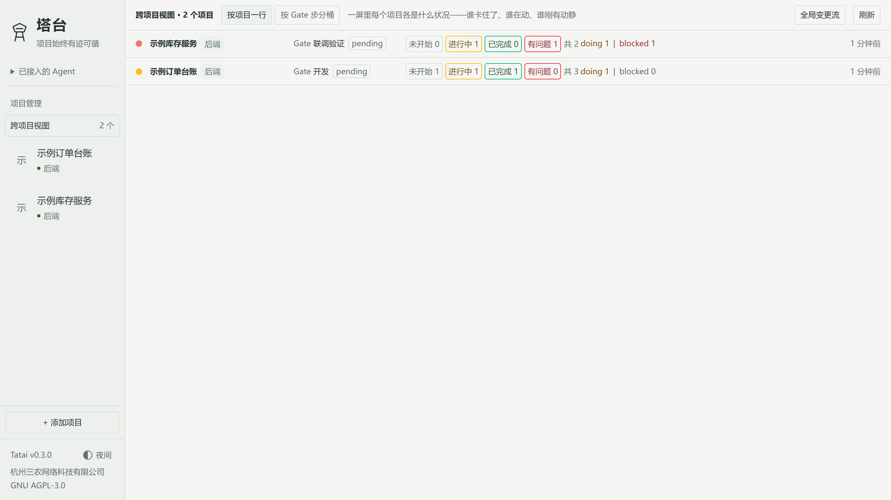
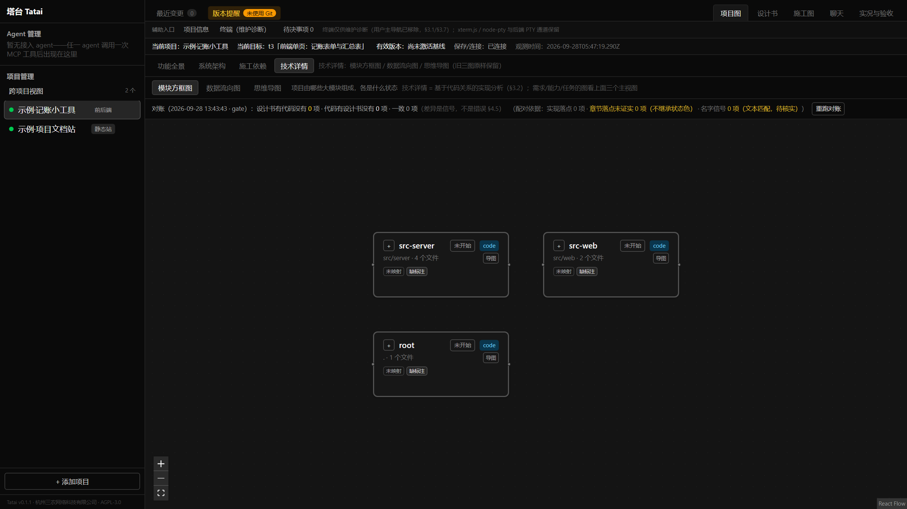

# 塔台 Tatai

**下载 Windows 版** → [Releases](https://github.com/sannongwangluo/tatai/releases/latest) ｜ [上手](docs/getting-started.md) ｜ [开发](docs/development.md) ｜ [更新日志](CHANGELOG.md) ｜ 

> 一个人 + 多个 Agent，持续推进同一个项目。

塔台面向用 Agent 开发项目的非程序员：保存意图、设计书、施工安排、进度和验收证据，让换模型、换会话后的 Agent 有依据接着做。数据全部落在你本机，六图、任务账本、Gate、MCP、备份恢复这些核心功能不连网也能用。当前以作者自用为先，作者自行选择工具、模型和档位。

**English**: Tatai ("control tower") is a local-first desktop workbench for one person running multiple AI coding agents (Claude Code, Codex CLI, Gemini CLI, or any MCP-compatible agent) on the same project. Intent, design docs, build plans, tasks, progress and acceptance evidence live in one auditable event ledger that agents read and write through a single MCP interface. It covers multi-agent orchestration, spec-driven development, requirements traceability, acceptance gates and codebase architecture visualization (six graph views). Context survives model and session switches; "done" is only true with verifiable evidence; changing one document re-verifies only what it affects. Local-first, no cloud required. **Tatai does not start your agents for you and does not approve acceptance gates on your behalf.**

**适合谁**：你本机跑 Agent（Kimi Code / Claude Code / Codex 等），项目就在本地磁盘上，希望不同会话、不同模型接的是同一份事实，而不是各聊各的。

**不适合谁**：想找一个“输入需求就自动写完项目”的一键工具。塔台管理协作事实与执行请求，不负责启动或终止 Agent 进程（那是外部协调器的职责），也不代替你验收。

**快速导航**：[能力总览](#能力总览) ｜ [一个贯穿例子](#一个贯穿例子) ｜ [六张图分别看什么](#六张图分别看什么) ｜ [当前能力与边界](#当前能力与边界) ｜ [深入文档](#文档)

## 2026-10-03 更新（未发布，版本仍 0.2.0）

本轮把「接续」这条主链路提速，并补上按需取料。逐条问题、修复与实测限制见 [CHANGELOG.md](CHANGELOG.md) 的「2026-10-03」条目。

- **修复原有链路问题**：一次接续重复读账本／同步报告／六图摘要；扫描与图重派生占用宿主导致忙时迟滞；切项目时底层旧请求没有真正取消。
- **补齐复审发现的 5 类问题**：缓存漏检内容变化、磁盘快照篡改／返回对象污染、宿主发现错误跨线程丢失、`project_index` 重复读取相同来源、工作池排队不公平。详细修复和触发条件见更新日志。
- **新增 3 个 MCP 工具**：`read_plan`（按卡／章节／行范围取施工图原文，免整本读取）、`expand_module`（深层结构下钻）、`project_index`（持久项目说明索引，需 Agent 维护，**不自动扫描全仓生成**）。
- **性能（有条件样本，非普适倍数）**：在一份冻结的真实项目镜像上取 30 个暖样本，真实 MCP 完整接续 4709 ms → 1333 ms（约 3.5×）、直接入口 2736 ms → 872 ms、六图摘要 417 ms → 263 ms。也如实列出**不如旧版**的一项：扫描幂等 3159 ms → 3588 ms（变慢）。
- **旧 MCP 连接需重连**：现有 v0.2.0 安装包不含本轮更新，需先从当前源码构建并更新程序，再重连 MCP 才生效。

## 它解决什么问题

用 Agent 做项目的人，迟早撞上四件事：

1. **换模型／换会话就失忆**——上个会话聊定的方向、做过的决定，新会话一概不知；
2. **多个 Agent 各干各的**——没有同一份事实，互相覆盖、互相打架；
3. **“做完了”说不清**——谁说的做完、凭什么算做完、验证证据在哪，翻聊天记录对不上账；
4. **改一处不知道影响哪**——文档或代码动了一行，哪些东西要重新验证没人说得清。

塔台把这四件事变成一份可追溯的账：意图、设计书、施工图、任务、进度、验证证据全部落成事件流，Agent 通过 MCP 接进来读写同一份事实；状态只来自事实与有效证据，谁也不能口头宣布“完成”。

## 能力总览

塔台把「需求 → 设计 → 施工 → 验证 → 验收」串成一份可追溯的账。下表是它现在能给你的七件事；「现状」说的是**已经做到哪一步**，不把设计里的目标当成现有功能。

| 能力 | 对你意味着什么 | 现状（如实） |
| --- | --- | --- |
| 需求、设计、施工互相关联 | 把施工卡、依赖和验收要求与设计依据、需求对应起来，变更时有据可查 | 已提供设计与施工源登记、需求/变更管理、任务定义导入；审定 DESIGN 是施工依据，PLAN 由其派生 |
| 跨模型、跨会话接续 | 换 Agent、换模型或重开会话，通过同一入口取得已登记的事实与下一步依据，减少重复交代 | 已提供接续入口 `project_entry`；分层上下文记录来源版本与实际取回范围，标明缺失、截断和续读位置。材料取回完整性与模型理解分别判断 |
| 六张图与来源追溯 | 从不同视角看清项目能力、模块关系和施工进展，查看节点关联的来源与证据状态 | 已提供六图（三张主视图＋三张技术详情）、下钻与逐对象来源/证据标注；缺证和待核实会单独呈现 |
| 多 Agent 认领与执行回执 | 发现同一任务的认领冲突，查到谁接手、执行到了哪里、交回了哪些成果 | 已提供带版本与认领凭据的原子领取、执行回执与检查点；实际目录隔离、进程启动和终止由外部协调器负责 |
| 版本与证据失效 | 按已登记的来源与依赖识别受影响的材料和证据，明确哪些部分需要重新核查 | 已提供证据分段失效；来源变更后重新判断有效性，保留历史结果并标明过期或缺证 |
| 预登记同步契约对账 | 执行前先登记「这次要同步什么」，完成后由程序逐项读**当前实际目标**核对，发现漏项/差异/旧版 | `register_sync_contract`／`scan_sync_evidence`／`read_sync_status` 已交付；只核对已登记范围，只有配置了 `blocks_entry` 的未通过批次才阻断接续 |
| 执行、审计、用户验收分层 | 「做完了」「审过了」「你接受了」是三件分开的事，谁也不能替你签收 | 自报、验证、独立审计与用户 Gate 分层已交付。**提交执行结果 ≠ 独立审计通过 ≠ 用户验收** |

## 六张图分别看什么

六张图引用同一份基线与稳定 ID，只是视角不同：前三张是主视图，后三张收在「技术详情」页签。

| 图 | 回答的问题 | 内容从哪来 |
| --- | --- | --- |
| 功能全景 | 项目能为人做什么，哪些能力已经证据支持 | 设计中的用户能力/场景，关联验收证据、模块与任务 |
| 系统架构 | 这些能力由哪些模块协作实现 | 审定的模块职责、接口/数据关系，结合代码静态解析与映射线索，标明证据状态 |
| 施工依赖 | 当前变更有哪些工作、谁先谁后、哪里受阻 | 施工图任务与依赖，叠加执行/质量状态 |
| 模块方框图 | 代码分成哪些模块、谁依赖谁 | 离线静态解析的 import 关系，可下钻 |
| 数据流向图 | 已声明的数据路径怎样连接，哪些环节有证据、哪些仍缺证 | 目标语义层按**输入源 → 处理 → 存储 → 输出/外部系统**组织关系，逐条标明来源与验证态 |
| 思维导图 | 把项目内容按结构收成一张可浏览的层级图 | 与模块方框图同源的静态解析关系 |

技术详情三张图当前共用的**静态 import 依赖层方向渲染**反映代码依赖，不能据此认定业务数据流已验证。数据流向图另有已提供的**目标语义层**，区分设计声明、代码静态分析和可复跑实测证据，标出未核实与缺失路径；覆盖范围以项目声明为准。具体口径见[能力与边界](docs/capabilities.md)。

## 一个贯穿例子

下面用一个**虚构**小项目（加一个「邮箱 + 密码登录」功能）说明协作怎么发生。这是**协作示例，不是已实测的自动端到端案例**：用哪个工具、哪个模型都由你决定，塔台只负责记录与核对。

| 阶段 | 你做什么 | Agent 做什么 | 塔台记录 / 检查什么 |
| --- | --- | --- | --- |
| 1. 聊需求 | 在内置聊天或你正在使用的 Agent 会话里说明「要邮箱+密码登录、失败要提示」 | 整理需求与待确认问题；外部会话把需保留的内容通过接入流程交回 | 保存已提交的讨论与需求记录，草稿经审定后才成为施工依据 |
| 2. 审定设计 | 确认业务取舍，或交给你委派的设计角色 | 设计角色把方向写进设计书章节，并派生施工卡与验收条件 | 登记设计与施工源、绑定同一基线；任务定义或依赖不合法则不予激活 |
| 3. 查看规划 | 打开项目图核对本次范围 | 整理已审定的能力、模块和任务关系，补充待审线索 | 程序校验并生成规划图，展示来源、执行状态和待核实项 |
| 4. 执行 | 打开你熟悉的外部执行 Agent | Agent 调 `project_entry` 取下一任务，用 `claim_task` 原子认领，在隔离目录改代码、跑测试，再 `submit_task_result` 交回改动与结果 | 记录认领与回执；认领带版本与 token，冲突会被拒 |
| 5. 独立复核 | 指定审核者 | 审核者对照验收条件检查改动与证据，需要时复跑测试 | 执行结果与独立审计分开记录：**已交付 ≠ 已审计通过** |
| 6. 验收 | 按约定场景体验正确登录、失败提示等行为，决定接受或退回 | 按反馈修复并补交证据 | 记录你的验收决定与已知限制，用户 Gate 由你本人确认 |
| 7. 改需求 | 提出「改成手机号+验证码」，确认新的业务取舍 | 设计角色修订设计和施工安排，执行者按新基线接续 | 按登记的来源与依赖核查受影响的任务和旧证据，明确需要重新验证的部分 |

## 界面一览

| 跨项目视图：一屏看清每个项目卡在哪 | 技术详情·模块方框图：离线静态解析，可下钻 |
| --- | --- |
|  |  |

> 截图为虚构示例项目（界面数据来自临时夹具目录，无真实项目数据）。

## 下载与安装（Windows）

下载入口：[GitHub Releases](https://github.com/sannongwangluo/tatai/releases/latest)。产品版本口径以 Releases 为准，逐版本的体积与 SHA256 也看对应 Release 页。

- 安装包只出 Windows x64；作者在 Windows 11 x64 上实测。
- 运行前置：PATH 里要有 Node.js ≥ 20（安装包不随包 node）；WebView2 运行时缺了的话，安装器会联网拉微软官方引导器，离线机器请先自行安装。
- 推荐 NSIS 包（装到当前用户目录、免管理员）；MSI 包装到 `Program Files`、需要管理员。两者是同一份程序，卸载都不删用户数据。

前置检查、两种安装包的差异、升级与卸载步骤见 [docs/getting-started.md](docs/getting-started.md)。逐版本的体积与 SHA256 以 [Releases](https://github.com/sannongwangluo/tatai/releases) 对应页为准。

### 升级

- 塔台没有自动更新：装新版就是从 Releases 下一个新包覆盖安装。覆盖安装与卸载都不删用户数据（数据不在安装目录里，安装目录运行期只读）。
- 升级前请正常退出塔台（关闭窗口即会带走它启动的后端并释放 8787 端口）；若安装器仍提示进程占用，再按排错确认残留，不要无差别结束 node 进程。
- 升级前建议先备份两处：全局数据目录（`~/.tatai` 或你的 `TATAI_HOME`）与每个被纳管项目根下的 `.工作台/`。
- 本次升级的安装与数据保留实测状态，以对应 Release 说明为准（不预填未生成的哈希）。

## 第一次使用

1. 双击启动塔台，左栏「＋ 添加项目」，填一个本地项目目录。第一次可以先用一个空目录或示例仓库。
2. 塔台在该项目下建 `.工作台/`（设计书、任务、进度、证据都落在这里，默认进 `.gitignore`，不碰你的代码正文）。
3. 让 Agent 接进来读同一份事实：把塔台加进 Agent 的 MCP 配置（见 [docs/getting-started.md](docs/getting-started.md) 第 5 节），再让 Agent 依次调用 `list_projects` → `select_project` → `project_entry`。三个工具都返回了结构化结果，MCP 就算接通了。
   - 空目录没有设计基线是正常的：`project_entry` 会返回缺基线（`next_action=await_decision`）或空状态——拿到这个回复本身就是连通证明，不必先取得有效基线。
   - 空目录没有可解析的代码模块，技术详情页只会显示空态（没有模块）；要解析出模块方框图／数据流向图／思维导图，需要有实际代码的项目（离线静态解析，零模型调用）。没配模型也能用，模块名会退回目录名，结构图不受影响。

数据在哪、`.工作台/` 里逐条是什么、MCP 配置怎么写，见 [docs/getting-started.md](docs/getting-started.md)。

## 让 Agent 接进来（MCP）

以下 28 个工具与 2026-10-03 优化对应当前 `main` 源码（Unreleased）。现有 v0.2.0 Release 安装包尚未包含这些更新；使用新能力需先从当前源码构建并更新程序，再重连 MCP。

- 28 个 stdio MCP 工具：项目接续（`list_projects`／`select_project`／`project_entry`／`doctor`）、任务与进度、认领与回执、设计书与图纸、施工图与结构（`read_plan`／`expand_module`／`project_index`）、需求／变更、同步证据对账（`register_sync_contract`／`scan_sync_evidence`／`read_sync_status`）等。计数以 `src/mcp/tools/index.ts` 的注册表为唯一来源（`pnpm verify:v09-05` 对账，文档计数与注册表恒等）；完整清单见 [docs/capabilities.md](docs/capabilities.md)。
- **已经运行中的 MCP 连接保留旧内存代码**：更新程序后，要让**当前会话**用上新的接续逻辑与 3 个新工具，需重连塔台 MCP；新启动的连接使用配置路径下已更新的 `server/mcp.js`。
- 桌面壳装好后，MCP 入口就是安装目录下的 `server/mcp.js`，例如 `C:/Users/<用户名>/AppData/Local/Tatai/server/mcp.js`。`%LOCALAPPDATA%` 这类变量不会被自动展开，配置里必须写实际绝对路径。
- 从源码跑时先 `pnpm build:server`，再用产物的绝对路径；不要依赖 `node --import tsx …` 这种要客户端 cwd 才解析得开的写法。完整示例见 [docs/getting-started.md](docs/getting-started.md) 第 5 节与 [docs/agent-integration.md](docs/agent-integration.md)。

`ask_flash` 会调用模型并可能写图补全层，不是保证无副作用的只读工具；只读客户端请按能力如实声明，塔台不会替它假装能自动执行。

## 需要配置 AI 服务的功能

塔台本身不需要任何模型服务就能用——六图、任务账本、七步 Gate、MCP、备份恢复全部离线可用。以下功能启用时才需要模型：模块“人话名”起名、内置 AI 项目聊天、概念图补全、逆向设计草稿、`ask_flash`。逐项需要什么、不配置会怎样，见 [docs/capabilities.md](docs/capabilities.md) 第 3 节。

**只配 Key 不够**：默认基址 `http://127.0.0.1:3456` 是作者本机的本地网关入口，普通用户机器上没有。用你自己的兼容服务时，必须再设 `TATAI_DEEPSEEK_BASE_URL` 指向可达地址，并核对实际模型名。

**隐私边界（如实说明）**：项目文件、任务账本、六图等数据都存在你本机，静态解析等核心功能可完全离线使用；但启用聊天、模块起名等 AI 功能时，发送给模型服务的内容（相关代码片段、设计书段落、你的提问）会离开本机、到达你配置的那个服务。配置了第三方服务就按该服务的隐私条款执行。

## 当前能力与边界

**已经能用**：项目登记与跨项目概览；人工确认的七步 Gate 与 Agent 自报任务；六图（功能全景／系统架构／施工依赖／模块方框图／数据流向图／思维导图）与下钻；设计书展示与追加落稿；**施工图按卡/章节/行范围原读取材**（`read_plan`）与**深层结构下钻**（`expand_module`）；**持久项目说明索引**（`project_index`，职责/接口/来源/关系/影响覆盖，声明关系不冒充验证事实）；内置 AI 聊天；任务认领与执行回执；**私有事实**（`.工作台/`）的显式**备份**与**隔离目录**恢复——恢复只落在隔离目录并逐项核验，塔台**不会自动替换**你当前的数据；MCP 接续入口。

**本轮统一优化（2026-10-03，未升版本、未打 tag、未发 Release）**：**按需接续与缓存 worker**——接续入口在一次请求内共享同一份账本快照与派生事实（不再重复读盘、不跨请求缓存旧绿）；只读重计算挪到**进程内有界工作线程池**（含**内容校验的解析缓存**），唯一写入宿主承担写；文件读取做**内容校验 + 前缀增量**（同长度改写/保留 mtime/截断/中段坏行均能识别，不拿 size/mtime 当身份）；界面**合并同条件在途只读请求、切项目真正取消旧请求**，并显示明确新鲜度与失败原因。**已经运行中的 MCP 连接保留旧内存代码，需重连才生效**（见上一节）。

**性能（有条件样本，非普适倍数）**：在一份**冻结的真实项目镜像**（约 2146 文件、约 53 MB 事件账本、9200 事件、44 个批次）上，每种链路取 30 个暖样本，本轮相对"首轮提速后"的旧源码快照实测中位改善：真实 MCP 完整接续 p50 约 4709 ms → 1333 ms（约 3.5×），直接接续入口 p50 约 2736 ms → 872 ms（约 3.1×），唯一宿主 HTTP 同步读取 p50 约 1436 ms → 1021 ms（约 1.4×），六图摘要 p50 约 417 ms → 263 ms（约 1.6×）。**这是该镜像/该现场下的样本结论，不是普适倍数、也不是"全链路秒回"**：完整同步报告与新增证据写入仍有百毫秒级尖峰，拟议的暖界面 300 ms／轻接续 1 s／小证据 2 s 目标未全面达标；**另有一项如实列出变慢**——扫描幂等单次约 3159 ms → 3588 ms，新增证据场景约 5309 ms → 5009 ms（小幅改善）；不同项目规模与并发负载下读数会不同。

**边界与如实限制**：

- 技术详情三张图当前共用**静态 import 依赖层方向渲染**，**不是业务数据流**，也不证明质量通过；数据流向图另有带来源与验证态的目标语义层。
- 没有完整的产品级自动闭环：Agent 进程由**外部协调器**启动和终止，塔台不代劳；“完整自动接续、图纸派生与审计证据闭环”尚未具备，中大型／超大型支持须经自举、故障与规模验证。
- 认领 token 与角色声明不是文件系统锁，读到材料也不等于模型理解；目录隔离与进程终止仍由协调器负责。
- 同步对账只就**已登记范围**下结论，只有配置了 `blocks_entry` 的未通过批次才阻断接续；同步通过不代表业务实现、独立审计或你的验收。
- 取齐六图不代表读遍全部源码，也不代表业务验收。
- 安装包只出 Windows；WebView2 与 node 不随包；远程访问默认关闭、不提供“允许公网”开关；没有自动更新。

逐条能力、六图与数据流向图口径、远程访问细节、AI 与隐私边界、已知限制见 [docs/capabilities.md](docs/capabilities.md)。

## 设计与施工方向

典型协作流程（各环节用什么工具／模型完全由你决定，塔台不绑定任何品牌）：任一会话与用户聊方向 → 设计角色审定设计书和施工图 → 塔台整理图关系并生成规划图 → 用户选定的执行 Agent 认领施工 → 低成本模型做审计／修复 → 关键节点独立终审 → 用户体验验收。角色与模型／客户端分开；这是分工模板，不是自动启动命令。

施工卡的逐卡状态与证据见 [施工图](PLAN.md)，独立验收与收口结论以 PLAN 与审计记录为准；范围、依赖与验收见 [设计及建设总图](DESIGN.md#117-v06-建设施工总图)。提交执行结果 ≠ 独立审计通过 ≠ 用户验收。

## 文档

| 文件 | 是什么 |
| --- | --- |
| [docs/getting-started.md](docs/getting-started.md) | 上手：前置检查、安装／升级／卸载、第一次使用、MCP 接入、数据在哪 |
| [docs/development.md](docs/development.md) | 从源码跑起来、Node／pnpm 版本口径、验证脚本清单与数据边界 |
| [docs/capabilities.md](docs/capabilities.md) | 当前能力、六图口径、AI 与隐私边界、远程访问、已知限制 |
| [docs/agent-integration.md](docs/agent-integration.md) | 外部执行接入：谁启动/终止 Agent 进程、认领与回执协议、MCP 读口的同源边界 |
| [docs/sync-evidence-contract.md](docs/sync-evidence-contract.md) | 同步证据对账契约：登记「应同步清单」、逐项实读核对、阻断与自动解阻 |
| [CHANGELOG.md](CHANGELOG.md) | 版本变更记录（当前 0.2.0，2026-09-30） |
| [GitHub Releases](https://github.com/sannongwangluo/tatai/releases) | 发布说明与安装包；产品版本口径以此为准 |
| `DESIGN.md` / `PLAN.md` / `PROGRESS.md` | 设计依据 / 施工图与验收标准 DoD / 施工流水 |
| [CONTRIBUTING.md](CONTRIBUTING.md)、[SECURITY.md](SECURITY.md) | 如何反馈问题与提交改动；安全漏洞的私密报告渠道 |

## 许可与第三方声明

- 本项目：GNU AGPL-3.0，见仓库根 `LICENSE`。
- 随包第三方声明：安装目录下的 `server/THIRD-PARTY-NOTICES.txt`，由 `pnpm build:server` 按实际打进包里的依赖树自动生成。
- 完整许可审计见 [docs/LICENSE-AUDIT.md](docs/LICENSE-AUDIT.md)（含 WebView2 分发条款与证据缺口登记）。

## 反馈与贡献

- 问题反馈：欢迎在 [Issues](https://github.com/sannongwangluo/tatai/issues) 提交，模板见 [.github/ISSUE_TEMPLATE/](.github/ISSUE_TEMPLATE/)；贴日志先脱敏，绝不贴密钥。
- 安全漏洞：请走私密报告渠道，不要开公开 Issue，见 [SECURITY.md](SECURITY.md)。
- 提交改动：fork → 分支 → PR；基础检查命令见 [CONTRIBUTING.md](CONTRIBUTING.md)。CI 对每条 push／PR 自动跑冻结安装、typecheck、build 与隔离版注册表回归，不使用任何私有数据。
