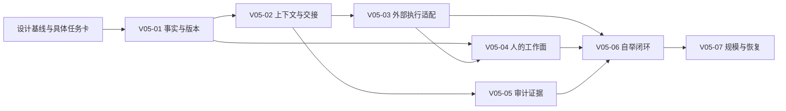

# 塔台 v0.5 设计历史（2026-09-19）

> 本文件是被 v0.6 取代的历史，只供追溯；现行源见 [DESIGN.md](../DESIGN.md)。以下完整保留原 v0.5 附录 B 之前正文；原 43 条待议仍原样保留于现行设计附录 B。原完整文件 SHA256：963ffdba3458126751e28d2e15904f90da7e82d37b0552490c0b5f610c4065c1。

# 塔台（Tatai）设计书 v0.5

| 项 | 内容 |
| --- | --- |
| 文档版本 | v0.5，人机协作与持续项目管理修订稿，2026-09-19 |
| 本轮状态 | 用户授权修订已落稿；新增机制待施工与场景验收，不表示已实现或已逐项终验 |
| 修订依据 | 原设计全文、既有决定与运行现场；用户本轮说明的原型—设计—协调施工—分级审计链路 |
| 设计角色 | 本轮由 Codex 按用户授权深化并修订；默认后续设计/关键抽查角色为 GPT-6 |
| 产品与文档事实源 | 本文件；施工工作包见 PLAN.md，验证流水见 PROGRESS.md，施工约束见 AGENTS.md |
| 仓库 / 许可证 | https://github.com/sannongwangluo/tatai / MIT |

> 先读 §1.5 工作链、§1.7 实现边界和 §11.7 建设总图，再按职责进入对应章节。普通施工者可提异议，不能自行改变目标或基线；用户明确授权的设计修订角色可以改稿。附录 B 是保留历史，现行口径以正文与附录 A 为准。

## 1. 项目概述

### 1.1 一句话定位

塔台是**一个人持续推进多个 Agent 项目的工作台**：把用户意图、设计依据、任务、执行状态和验收证据保存在项目中，让人能作出决定，让不同 Agent 在换模型、换会话、换执行器之后继续同一件事。

用户管理的是“项目最终做成什么、为什么这样做、现在是否可信”，不应靠记住所有聊天、逐个搬运提示词、观察终端滚动来维持项目。塔台负责连接这些信息和行动；外部执行器负责启动工作进程、运行命令和修改代码。

**可见只是入口，持续推进才是目的。** 图、聊天和任务列表都要能回答：为什么做、依据哪一版、当前缺什么、下一步谁负责、什么证据足以交付。只有图而没有决策与任务连接，仍会让用户成为人工中转站。

### 1.2 要解决的痛点与隐性价值

| 痛点 | 产品需要提供的能力 | 用户实际得到的价值 |
| --- | --- | --- |
| 意图分散在多轮聊天里 | 将目的、用户场景、边界、取舍和验收场景编成有来源的意图记录 | 少重复解释，也能发现“功能做了但目的没实现” |
| 原型看着能用，背后的规则不完整 | 原型与正式设计分开；补状态、异常、权限、数据和非功能要求 | 低成本探索可以保留，高成本返工可以提前减少 |
| 换模型、窗口或执行器就断档 | 可校验版本的交接包、检查点、未决问题和下一步动作 | 项目连续性不依赖某一个模型一直在线 |
| 多个 Agent 各自推进却互相覆盖 | 任务依赖、工作范围、认领与交付契约、集成责任 | 并行增加产出，同时让冲突可发现、可恢复 |
| 文件在变，但不知道是否接近目标 | 意图—能力—设计—任务—代码—证据的关联 | 人可以沿结果追到依据，Agent 可以沿任务拿到必要上下文 |
| 贵模型反复读仓库，便宜模型重复踩坑 | 分层上下文、结构化审计包、失效检测、针对风险升级 | 节省的是重复劳动，而不是省掉必要判断 |
| 完成状态来自执行者的一句话 | 执行完成、机械验证、独立审计、用户验收分别记录 | “完成”变成可查证的结论，降低虚假的安全感 |
| 项目越来越大，所有内容挤在同一屏与上下文 | 按子系统和变更范围展开，先显示需要人处理的例外 | 管理复杂度随当前决策范围增长，不随全仓文件数直接增长 |

### 1.3 设计原则（总纲）

1. **人保留目的与取舍，Agent 承担有边界的工作。** 用户明确授权的日常动作连续执行；仅遇到目标冲突、超出授权或必要信息缺失时升级。禁止把每一步都变成人工确认，也禁止把未获授权的动作包装成自动推进。
2. **同一事实，两种表达。** 人看到意义、变化、风险和可选动作；Agent 得到版本、依赖、约束、输入与验收方法。两者指向同一记录，不能各维护一套进度。
3. **事实、目标、推断和提案分开。** 代码存在不证明设计合理；模型认为完成不证明验证通过；旧记忆和已被替代的决定不能冒充现行规则。
4. **上下文持久化，并校验是否仍然适用。** 保存文件是基础，版本与来源、任务依赖、失败现场和恢复流程才构成交接能力。摘要是入口，可回到原始依据。
5. **按工作性质分配模型。** 低成本模型承担样板、调查、施工、机械整理和大量初审；高能力模型承担设计判断、关键节点审查和独立抽查。角色可替换，项目事实不能绑定某一供应商、模型名称或会话。
6. **文件即事实源，一事一源。** md/json/jsonl 保持可读；索引、视图和摘要可重建。新结构必须有版本、迁移和并发保护，不让多份 Markdown/JSON 无规则互写。
7. **完整目标，分段形成闭环。** 不用“以后再说”掩盖必要能力；每个建设阶段都交付可以真实验收的一段链路。禁止用旧任务全部 done 推导新设计已经实现。
8. **自用先验，规模用证据说话。** 先用塔台自身验证，再扩大项目体量；不预先承诺支持任意超大型项目或没有 bug。

### 1.4 产品边界

- 本期面向单用户、本机、多项目和多 Agent。人类多租户协作、云服务、远程/手机端仍另列建设期；已有远程代码保留且默认关闭，不代表本轮重新启用。
- 塔台提供意图、任务、交接、决策和证据的管理入口；**进程启动、工作目录隔离、执行重试和终止由外部协调器承担**。界面的“推进/暂停”在目标设计中产生可追踪请求，由外部协调器领取并回执，不以按钮动画冒充执行结果。
- 不建设代码编辑器、通用聊天聚合器或自动选择所有供应商的模型平台。现有 Flash 聊天保留，承担项目理解与草稿辅助。
- 记录本工作链可获得的模型用量、耗时、重试和上下文大小，用于比较投入与结果；不做未经来源核实的跨平台账单统计，不把缺失用量记为零。完整计费产品不在范围内。
- 不把 Git 忽略的项目状态误称为已有备份。私有事实的本地恢复方案属于连续性要求；自动云备份不在本期。

### 1.5 用户指定的默认工作链

这里将用户所说的“Cloud Code”按 **Claude Code** 理解为外部协调入口；客户端/执行器与底层模型分开记录。下表是用户希望采用的分工模板，不是对各模型能力、价格或产品接口的保证。具体启动命令、模型标识和已有审计中心接法，在适配工作包中核对。

| 环节 | 默认责任人/工具 | 必须交给下一环的东西 | 不可混同的边界 |
| --- | --- | --- | --- |
| 意图与探索 | 用户 + 低成本模型 | 目标用户、场景、基本交互样板、疑问与明确未实现项 | 原型是可讨论的证据，不能自动成为生产架构 |
| 设计深化 | GPT-6，用户提供取舍与纠正 | 正式设计修订、异常流程、接口/数据契约、验收场景、未决项 | 补出隐含需求时标明推断；不将建议冒充用户原话 |
| 设计基线与任务准备 | 用户确认方向，协调器组织可执行任务 | 有版本的基线、任务依赖、范围、风险和证据要求 | 用户已授权的细化无需逐句再批；新的高影响取舍仍交用户 |
| 持续施工 | Claude Code 协调；Kimi Code 执行，默认 DeepSeek V4.1 Flash | 任务认领、代码变更、验证结果、检查点、交付包 | 协调器可以委派与收回任务；塔台记录协调事实，不直接拉进程 |
| 找错、找丑与修复 | 脚本 + 低成本审计者；独立施工会话修复 | 可复现缺陷、风险覆盖矩阵、修复差异、复测记录 | 同一模型换提示词不等于充分独立；避免作者同时签署最终审计 |
| 关键节点审查与终审抽查 | GPT-6；其他高能力审计者可按既有规则轮换 | 对关键接口/高风险变更的判断，以及独立选择的抽查结果 | 高端模型不用全程搬运资料，但必须能读抽中范围的原文与现场证据 |
| 用户验收与继续迭代 | 用户 | 场景是否满足、已知限制、接受/退回决定、后续变更 | 测试通过、审计通过、交付授权和发布成功分别记录 |

既有“审计降用量体系”五环（找错→找丑→修复→终审→回写）继续作为质量流程依据。其“高档只做判断不做阅读”在本设计中修正为：**高档不承担常规全量扫描和机械转述，但保留核查原始证据的责任**。高端投入不能只留在末尾，否则错误的核心设计会被大量低成本施工放大。具体审计协议见 §5.5。

### 1.6 一条完整使用故事

用户交来一个低成本模型做出的项目样板，说明希望解决的真实问题。塔台记录哪些是明确意图、哪些只是样板表现、哪些规则还缺失。设计者把它补成可验收的用户路径，用户看关键取舍和前后差异。基线确认后，协调器把任务交给 Kimi Code；工人只拿本任务所需的依据，完成后附验证证据。审计者读取差异和风险场景，提出可复现问题；修复者复测，关键处交 GPT-6 看原文抽查。

其中任一会话结束，接手者从塔台取得仍有效的基线、任务现场、未解决问题和下一步，不要求用户重新讲历史。用户回来先看到“哪些结果可验收、哪些决定需要我、哪里被阻塞”，需要时再深入架构和日志。一次交付留下的有效规则成为下一次迭代的输入，单个缺陷不自动上升为跨项目禁令。

### 1.7 文档状态与阅读规则

本版是 **v0.5 设计修订稿**，用户已授权本轮改稿；新增机制属于待建设的目标设计，未宣称用户已逐项终验或软件已实现。历史决定的现行版本已归并到正文；附录 A 标明来源与状态；附录 B 保留原始待议历史，旧条目不自动推翻正文。

| 内容 | 当前性质 | 阅读方法 |
| --- | --- | --- |
| §2.3、§3.1–§3.10、§4.1–§4.6、§5.1–§5.3、§6.3–§6.4 | 既有文件格式/功能契约；局部尚未实现或存在缺口 | 以相邻实现说明和 §11.6 能力矩阵为边界，不能一概当成已完成 |
| §2.5–§2.8、§3.11–§3.14、§4.7、§5.4–§5.7、§6.5–§6.6、§8.5、§9.4 | 本轮新增目标设计 | 由 PLAN V05 系列工作包落实；当前不可调用其中拟议接口 |
| PLAN 原卡及 PROGRESS 历史 | 当时范围内的施工/验证记录 | 保留原状态，不继承为 v0.5 验收结论 |
| 历史归档 | 被替代的决策表及重复收口原文 | 仅追溯使用，见 [v0.4 历史记录](design-history-v0.4.md) |

## 2. 核心概念与数据模型

### 2.1 三个核心概念

**项目 = 独立目录。** 每个项目就是一个真实的目录（D 盘根目录下另起，如 `D:\xxx`），塔台不把项目"装进"自己的数据库，只记住它的路径。
依据：项目本来就是目录，agent 本来就在目录里干活，中间插一层虚拟文件系统纯属自找麻烦。

**项目管理 = 一张全局注册表。** 注册表就是"项目名 → 目录路径"的映射，落在运行服务实际使用的全局数据目录中，默认 `~/.tatai/registry.json`，可通过配置覆盖。连接 MCP 时以 health 返回的 `data_dir` 对齐，不硬编码旧机器位置。
依据：注册表是唯一需要跨项目存在的东西，其余状态都下沉到各项目目录。

**自举。** 工作台程序本体也被它自己管理，是第一个试用项目。
依据：作者自己就是第一个用户，自己吃自己的狗粮，问题暴露最快。

### 2.2 每个项目内的 `.工作台/` 目录

```
<项目根>/
├── .工作台/                    # 默认 gitignore，不外泄
│   ├── design.md               # 设计书（唯一事实源）
│   ├── design.discuss.md       # 待议记录（执行 agent 只能追加到这里）
│   ├── progress.json           # 进度：Gate 与模块状态；任务列表在 tasks.json
│   ├── gate.jsonl              # Gate 过关/打回流水（带时间戳）
│   ├── tasks.json              # 任务级状态（agent 经 MCP 自报）
│   ├── chat/
│   │   └── <session>.jsonl     # Flash 聊天记录，按会话落盘
│   ├── changes.jsonl           # 变更流水（文件监听顺带产出，简版）
│   ├── arch/
│   │   ├── modules.json        # 顶层模块骨架（tree-sitter + Flash 起名后的产物）
│   │   ├── layout.json         # 布局位置记忆（刷新不跳动）
│   │   ├── names.json          # 模块人话名缓存（Flash 起名结果，重命名刷新用）
│   │   ├── mindmap-fold.json   # 思维导图折叠记忆（展开/收起状态）
│   │   ├── reconcile-last.json / reconcile-request.json  # 对账上下文（上次结果 / 待处理请求）
│   │   └── supplement.json     # 聊天补全层（§3.2；节点 id 一律 chat: 前缀）
│   └── logs/                   # 运行日志
├── AGENTS.md                   # 项目约定（含"接入了塔台 MCP"那句）
└── ...（项目本体文件）
```

### 2.3 数据模型

以下为当前 v1 基础格式，不含目标的认领、审计与版本协议；新增设计见 §2.5–§2.8，不能直接要求当前程序读取新字段。

#### 2.3.1 全局注册表 `<工作根目录>/.tatai/registry.json`

```json
{
  "version": 1,
  "projects": [
    {
      "id": "brain-memory",
      "name": "第二大脑",
      "path": "D:\\Github 资料\\5.0 类脑记忆",
      "kind": "backend",
      "registered_at": "2026-09-17T10:00:00+08:00",
      "last_opened_at": "2026-09-17T11:20:00+08:00"
    },
    {
      "id": "tatai",
      "name": "塔台",
      "path": "D:\\tatai",
      "kind": "fullstack",
      "self_managed": true
    }
  ]
}
```

字段说明：

| 字段 | 含义 | 备注 |
| --- | --- | --- |
| `id` | 稳定标识 | 目录改名不变，用于内部引用 |
| `name` | 显示名 | 与目录名解耦，可手工改 |
| `path` | 绝对路径 | 唯一真实指向 |
| `kind` | `backend` / `frontend` / `fullstack` / `static`（静态站） | 决定是否出现"页面预览 Tab" |
| `self_managed` | 是否自举项目 | 塔台自身标记为 true |

#### 2.3.2 进度 `progress.json`

```json
{
  "version": 1,
  "gate": {
    "current_step": "design",
    "history": [
      { "step": "kickoff", "result": "pass", "at": "2026-09-10T09:00:00+08:00", "note": "立项确认" },
      { "step": "requirement", "result": "pass", "at": "2026-09-11T14:00:00+08:00", "note": "需求冻结" },
      { "step": "design", "result": "pending", "at": null, "note": null }
    ]
  },
  "modules": [
    { "id": "m-registry", "name": "项目注册表", "status": "done" },
    { "id": "m-arch", "name": "架构图引擎", "status": "doing" },
    { "id": "m-gate", "name": "Gate 时间线", "status": "todo" },
    { "id": "m-mcp", "name": "MCP 接口", "status": "issue" }
  ]
}
```

模块状态四色（后续架构图着色直接读这里）：

| status | 颜色 | 含义 |
| --- | --- | --- |
| `todo` | 灰 | 未开始 |
| `doing` | 黄 | 进行中 |
| `done` | 绿 | 已完成 |
| `issue` | 红 | 有问题 |

#### 2.3.3 Gate 流水 `gate.jsonl`

一行一条，只追加不修改：

```jsonl
{"ts":"2026-09-10T09:00:00+08:00","step":"kickoff","result":"pass","by":"user","note":"立项确认"}
{"ts":"2026-09-11T14:00:00+08:00","step":"requirement","result":"pass","by":"user","note":"需求冻结"}
{"ts":"2026-09-12T10:30:00+08:00","step":"design","result":"reject","by":"user","note":"架构图方案没想清，打回"}
```

#### 2.3.4 任务 `tasks.json`

```json
{
  "version": 1,
  "tasks": [
    {
      "id": "t-001",
      "title": "实现 tree-sitter 顶层模块解析",
      "module_id": "m-arch",
      "status": "doing",
      "reporter": "kimi-code",
      "updated_at": "2026-09-17T11:00:00+08:00",
      "note": "卡在 wasm 加载，换 node binding 中"
    }
  ]
}
```

任务级状态（`todo` / `doing` / `done` / `blocked`）由 agent 经 MCP 自报，**不是用户手点**。`note`（可选）是 agent 自报时附带的备注，**落盘留痕**（2026-09-19 主人拍板收口）：再报不传 note 保留旧值，传非空即覆盖——agent 干活时的说明不只在回执里闪一下就丢。
依据：agent 是唯一知道任务真实状态的人，让它自己报最准、最省人力。

#### 2.3.5 变更流水 `changes.jsonl`

文件监听顺带产出，一行一条：

```jsonl
{"ts":"2026-09-17T11:02:13+08:00","path":"src/arch/parse.ts","action":"modify","size_delta":128}
{"ts":"2026-09-17T11:03:01+08:00","path":"src/arch/parse.ts","action":"modify","size_delta":-42}
{"ts":"2026-09-17T11:05:44+08:00","path":"src/ui/Gate.tsx","action":"add","size_delta":2048}
```

#### 2.3.6 聊天 `chat/<session>.jsonl`

```jsonl
{"role":"user","content":"架构图怎么防爆炸？","ts":"2026-09-17T10:00:00+08:00"}
{"role":"assistant","content":"四招：硬上限、分层懒加载、边聚合、扇出过滤……","ts":"2026-09-17T10:00:03+08:00","model":"deepseek-v4.1-flash"}
```

### 2.4 文件即事实源，SQLite 只是缓存

SQLite 里的所有表（项目索引、模块索引、全文检索、变更聚合）都是上述文件的**派生物**，删掉可全量重建。
依据：单一事实源避免双写不一致；SQLite 只在需要快速检索（跨项目搜索、变更聚合）时上场。

---

### 2.5 协作对象与稳定标识（目标设计）

项目仍以真实目录登记，但项目内的业务能力、设计模块不必与目录一一对应。为跨会话引用分配稳定 ID；改名、搬目录不换 ID，拆分/合并须记录继承关系。

| 对象 | 最少需要表达什么 | 与其他对象的关系 |
| --- | --- | --- |
| 意图/需求 `requirement` | 来源、要解决的问题、使用者、成功场景、排除项、优先级、明确/推断/待确认 | 一个需求可涉及多个模块和多个迭代 |
| 决策 `decision` | 问题、备选、结论、理由、约束、提出/确认者、适用范围、取代关系 | 引用受影响需求与设计修订；驳回的方案保留理由 |
| 设计修订 `design_revision` | 草稿/基线/被替代、内容哈希、章节索引、变更摘要、确认依据 | 原文只存一份；任务明确绑定某版，不随编辑静默漂移 |
| 变更批次 `change` | 本次目标、授权范围、目标基线、受影响子系统、出口条件 | 聚合任务、评审和验收；每次迭代有独立状态 |
| 能力/模块 `capability/module` | 用户能力或技术职责、负责人角色、接口、约束 | 需求↔能力↔模块↔代码允许多对多；静态图只是代码关系来源之一 |
| 任务 `task` | 目标、输入版本、依赖、工作范围、验收方法、风险、阻塞与交付 | 属于一个变更，可关联多个模块；只能有一个有效执行认领 |
| 执行 `run/attempt` | 客户端、实际模型、角色、父执行、工作目录、基线、开始/心跳/结束、检查点 | 同一任务重试产生新 attempt，历史失败不覆盖 |
| 审计/缺陷/证据 | 审计范围、方法、独立性、来源、复现步骤、结果、验证环境与哈希 | 证据绑定具体任务版本和代码；失效后不得继续用于过关 |
| 决策请求/执行请求 | 请求原因、可选动作、建议、影响、状态与回执 | 人的决定和协调器实际执行分开；可追踪从提出到处理全过程 |

### 2.6 权威数据与派生内容（目标设计）

不在 `PLAN.md`、`tasks.json`、聊天摘要里各存一套可独立修改的任务状态。迁移前按现有流程人工对账，不能假称已自动同步；迁移后按下表写入和派生。

| 事实 | 唯一写入源 | 派生内容与失效条件 |
| --- | --- | --- |
| 设计原文 | DESIGN.md（塔台）或已登记的项目设计路径，是唯一当前编辑源 | 章节索引、任务上下文随内容哈希失效；旧版只作不可变历史，不出现两个可独立编辑的现行稿 |
| 意图/决策/基线确认 | `.工作台/intent.json`、`decisions.jsonl`、`baselines.jsonl` 各管一种记录 | 基线只引用原文哈希及恢复位置；摘要注明引用，不改原事实 |
| 任务、执行请求、认领、检查点、交付、审计状态 | `.工作台/work/events.jsonl` 的已提交事件 | `work/state.json` 为带 `last_seq` 的可重建快照；tasks/progress 与 PLAN 状态区是兼容投影 |
| Gate 人工验收 | 既有 `gate.jsonl`，扩展变更与基线引用 | progress 中的 Gate 是投影；Agent 报任务完成不能写人工验收 |
| 证据正文 | `.工作台/evidence/<evidence_id>/` 中不可变内容与清单 | 事件只引用 ID/哈希；摘要失效不删除历史证据 |
| 图/文件变化/聊天 | 现有 arch、changes、chat 各自原源 | 图不产生任务完成事实；聊天可提出记录草稿，不能自动成为设计基线 |

这些新增路径和结构**尚未实现**，不能直接往当前文件补字段并要求运行版支持。先发布 v2 格式规范与兼容读取器，再迁移。`tasks.json` v1 仅能表达四态，无法替代认领、执行、审计和验收。

基线确认必须保存可取回的确切原文：已提交且可长期保留的 Git blob 可直接引用；未提交或不在 Git 中的设计，写入 `.工作台/design-revisions/<sha256>.md` 不可变历史对象并校验哈希。基线记录引用该对象或 blob，不只记录当前文件路径；引用丢失则基线不可用于新任务。历史对象不接受编辑，不是第二份现行设计，受引用保留与备份策略保护。

事件最小信封：`schema_version/event_id/project_id/change_id/entity_id/entity_revision/seq/type/actor_id/role/occurred_at/received_at/idempotency_key/payload`。写操作带预期实体版本；校验、追加事件和生成成功回执由同一个本地写入服务串行负责。重复幂等键与相同内容返回原回执，不生成第二次效果；键相同但内容不同明确拒绝；旧版本冲突返回当前版本及差异入口。

stdio MCP 与桌面服务不能各自无锁改同一份 v2 事实。目标方案是在项目写入服务处统一仲裁，MCP 做转接；服务离线时读最后快照并标陈旧，写入报不可用。离线 CLI 写入/多写入者不在第一阶段。落盘顺序为校验→追加完整事件并持久化→返回提交序号→更新投影；投影失败可重放修复，不能撤销已经回执成功的事实。残缺尾行只在恢复校验时隔离并记录，不能静默吞掉中间事件。

旧 v1 写工具在迁移后映射成事件，不能绕过版本/认领检查；缺少必要字段时返回升级要求。旧任务 `done` 只迁移成“执行者自报完成”，不补造审计或验收。迁移前备份，提供预览、校验和回滚；旧版程序面对新格式应拒写，防止降级覆盖。

### 2.7 任务契约与交接包（目标设计）

一张可开工的任务卡至少有：`task_id/change_id/requirement_ids/design_revision/base_commit`，一句话目标，输入与依赖版本，允许修改的路径/接口，禁止越界事项，验收场景与可运行方法，风险等级，期望交付物，责任角色，当前状态及阻塞原因。非 Git 项目用内容清单哈希表达基线；只有目录路径不够。

协调器认领任务后追加 `run_id/attempt_id/owner_id/claim_token/lease_expires_at/workspace`。租约到期表示“当前所有权需核实”，不证明旧进程已停止。重派写任务前必须隔离新工作目录，或确认旧进程停止且旧认领失效；所有交付检查当前认领 token。命令与文件系统不受 token 自动保护，所以执行器仍须落实目录隔离和进程终止。

交接包不是长篇聊天总结，应包含：目标与当前基线；已完成且有效的结果；正在处理的任务/文件/未提交差异；真实失败命令及输出位置；已排除方案与原因；仍待决定的问题；下一步建议及前置条件；相关来源的版本与读取入口。每次产生可继续工作的成果、遇到阻塞、发生交接或结束 attempt 时写检查点；长任务按可配置间隔补写，不依赖最后一刻才总结。

例：任务 `T-017` 因进程退出中断。接手者先核对任务版本、旧 run 与工作目录、基线以及未提交 diff；测试“上次通过”若针对旧哈希则标失效；确认可继承成果后以新 attempt 继续。不得将旧 `doing` 改回 `todo` 后从头覆盖，也不得因无心跳直接宣称开发失败。

### 2.8 分层上下文与可信覆盖（目标设计）

读取顺序是项目简报→变更/子系统包→任务包→按需原文。简报解释为什么做与当前例外；任务包包含完成任务需要的所有约束引用，而不是一律塞进全仓。原始文件、章节和证据始终可取，角色之间复用同一份有来源的索引。

每个上下文包带 `package_id/generated_at/design_revision/source_manifest/token_or_char_size/omitted/stale_reasons`。来源清单含路径、内容哈希、读取的行/字节范围、成功/失败/截断状态；摘要注明实际覆盖和未覆盖的范围。读取请求被提交不等于读取成功，成功读文件的一段不等于全文件读完；目录清单也不等于代码理解或质量审计。

源文件变化后，相关包标为陈旧并按影响范围增量重建；决策被取代或接口变化时，依赖任务收到明确失效项。启动前若缺关键约束，协调器补读或升级，不能凭摘要猜测。缓存命中可节省重复读取，但高能力审计者有权绕过摘要直接取原文。

长文件必须有分段取回与续读游标，返回总长和已取范围；达到工具轮次、清单或上下文上限时明确停止并留下续接位置。不得通过缩小清单、跳过 tests、隐藏二进制排除或把失败路径计为已读，制造“全量覆盖”。现有聊天约 2 万字符设计背景与单文件截断属于已知约束，不能承担本节完整协议。

## 3. 信息架构与界面详述

### 3.1 整体布局

**实现边界**：现有项目页签与目录选择已存在；下述浏览器式 Tab 组/手动 `+` 并未全部实现。当前左栏按有 blocked、有 doing、其余分桶，同桶按最近活动倒序，最终按项目 ID 稳定排序；Gate 与色点不参与排序。目标工作面另见 §3.11。

参照 Codex / Harness 的项目列表式 UI：

```
┌──────────────┬──────────────────────────────────────────────────┐
│  左栏         │  右栏主区                                        │
│              │  ┌────────────────────────────────────────────┐  │
│  Agent 管理   │  │ 最近变更 · 3 条新 │  [Tab][Tab][Tab][+]     │  │  ← 顶部一行小入口 + 浏览器式 Tab
│  ──────────  │  └────────────────────────────────────────────┘  │
│   项目 A ●    │                                                  │
│   项目 B ●    │            当前 Tab 的内容区                      │
│   项目 C ●    │                                                  │
│              │                                                  │
│  项目管理     │                                                  │
│  ──────────  │                                                  │
│   + 添加项目  │                                                  │
│              │                                                  │
└──────────────┴──────────────────────────────────────────────────┘
```

- **左栏**：上半是 **Agent 管理**（登记有哪些 agent、查看它们最近干了什么），下半是 **项目管理**（项目列表、添加/移除项目、状态点）。
- **添加项目的路径录入**（2026-09-19 主人试用拍板）：桌面壳内提供原生目录选择框（「浏览…」按钮，tauri-plugin-dialog，权限只放 `dialog:allow-open`）；浏览器/远程模式无此入口，维持手敲。
- **左栏加载期表现**（2026-09-19 主人试用拍板）：两块列表首拉落地前显示「加载中…」，不渲染误导性空态；连不上后端时 0.5 秒自动快重试，后端起来后自愈。
- **右栏主区**：顶部一行是浏览器式 Tab，Tab 左侧嵌一个小入口「最近变更 · N 条新」。
- **Tab 生命周期**：每个项目打开时，Tab 组自动生成（架构图 / 设计书 / 聊天 / 终端 / 实况）；`+` 可手动再开。实况 Tab 的规则见 §3.10。变更流水**不做 Tab**——走顶部「最近变更」小入口 + 独立子页面（见 §3.8）。

### 3.2 三视图（同一份数据，三种渲染）

**当前口径**：三视图共用静态节点/关系。数据流向图是静态依赖方向投影：去自环、互惠对归并、提供者→消费者；不是运行时业务流。下文按项目 kind 出页面预览 Tab 属未实现设想，Electron 类型适用性待 §12.1 处理。GLM 图语义监工代码已按用户决定移除，本版不恢复常驻模型监工。

| 视图 | 技术 | 回答的问题 |
| --- | --- | --- |
| 模块方框图 | React Flow（@xyflow/react） | 项目由哪些大模块组成，各是什么状态 |
| 数据流向图 | React Flow（数据流向渲染器） | 数据从哪来、到哪去、谁依赖谁 |
| 思维导图 | markmap | 层级结构一览，适合快速总览与折叠 |

**关键点：三视图共享同一份邻居数据。** 方框图与数据流向图是同一份静态数据的不同渲染；节点集合相同，边集合按本节开头的方向投影规则处理。该口径已决，不再等待运行时数据流方案，见 §12.1 第 6 项。
依据：两套数据必然不同步，一套数据两种画法才能保证口径一致。

**聊天补全层**（2026-09-19 主人试用拍板）：三视图的数据 = **静态解析层 ∪ 聊天补全层**。聊天（§3.6 工具调用）读过代码/文档后，可把静态解析覆盖不到的概念模块（如「消息总线」「外部服务」）与连边补进图；补全写入独立文件 `.工作台/arch/supplement.json`（节点 id 一律 `chat:` 前缀、图上带 chat 徽标、上限 100 节点/200 边），渲染合成时在唯一合并点并入三视图共用的同一份节点集合——「同一份数据」红线不变。静态解析层唯一写口仍是 `POST /arch/parse`（幂等覆盖），重新解析冲不掉补全；清空补全 = 聊天 replace 空集。补全层**只装概念节点**——静态解析覆盖不到的外部服务、跨目录机制、系统级调度；不把目录树/文件清单重建进补全层，文件明细走 §3.3 下钻（2026-09-19 试用反馈补口径：实测模型曾为"对齐三视图"把目录树整棵重建进补全层 76 节点）。写入回执**逐条对账**：跳过/丢弃逐条点名原因，边端点写错附相近节点建议，去重按 id/name/path 三路——错不静默（同日补）。
依据：直写解析层会与"parse 唯一写口、幂等覆盖"冲突（下次解析即冲掉）；分层后两个写口各管一个文件，互不踩踏。

**页面预览 Tab**：有前端的项目（`kind` 为 `frontend` / `fullstack` / `static`）多一个页面预览 Tab，内嵌显示项目跑起来的页面。纯后端项目没有这个 Tab。

### 3.3 图的交互模型：母子关系可折叠树

所有图都是**母子关系可折叠树**，规则统一：

1. **顶层只有大模块**，数量硬性控制在 **5–15 个**。
   依据：超过 15 个人眼就抓不住，等于没图。
2. **点方块原地展开子模块**——不跳页、不换图，在当前画布上原地长出子节点。
3. **逐级下钻到文件级**：模块 → 子模块 → …… → 文件。
4. **可收起回概览**：任何一级都能折叠回上一层，随时回到全局视图。
5. **初次进入默认全部折叠**，只显示顶层 5–15 个方块。

### 3.4 Gate 时间线视图

- 横向 7 步生命周期时间线，每步一个 Gate 节点。
- 每步状态三态：**已过（绿）/ 打回（红）/ 待定（灰）**。
- 每个 Gate 过关或打回，都留一条**带时间戳的记录**，可点开看 note。
- **Gate 过关 / 打回 = 用户手点**。
  依据：Gate 是"人对阶段成果的验收"，只有人能判定，agent 自评等于没验收。
- **任务级状态（进行中 / 完成）= agent 经 MCP 自报**。
  依据：任务颗粒度细、变化快，只有干活的 agent 知道真实状态；人手点会累死且过时。

### 3.5 设计书视图、修订权与基线

现有界面用 react-markdown 只读展示正文，聊天有显式落稿按钮；界面只读不等于产品只能看不能推进。当前没有完整草稿/基线管理，落稿会写原文，不能据此声称完成了基线确认。

- **修订权按角色和当次授权确定。** 用户可授权设计者（本轮即 Codex，默认设计链为 GPT-6）直接深化、重写或修正原文；不再把笔权绑定为 Flash/K3 Max 两个固定模型。低成本模型可草拟或按确认结论机械改稿。
- **普通施工者保留提疑权。** 执行代码任务时只读设计，发现偏差追加待议，不自行改目标、范围或验收标准。已有用户授权优先，不因历史“两条笔”再索取同一许可。
- **目标交互：草稿→可比较修订→基线确认→被替代记录。** 用户看变更理由、受影响需求/任务与未决项；Agent 读取任务绑定的基线。用户未决的取舍明确保留，不能由模型落稿自动确认为用户决定。该版本/基线机制由 V05-01/V05-04 建设。
- 塔台自身设计源为根 DESIGN.md，正文展示在附录 B 前截断；待议区单独显示 B。MCP read_design 返回全文与待议，不能因 UI 折叠推断接口不含历史。
- 现有落稿对塔台同样开放，插入点是附录 B 标题之前；其他项目写 design.md 末尾。插入成功仅表示内容已保存，不表示其已消除重复和冲突。正式修订应归并到对应章节，保留历史追溯入口。

### 3.6 Flash 聊天视图

- 每个项目一个聊天 Tab。
- 接 **DeepSeek V4.1 Flash API**，**流式输出**。基址走**本机网关 cc-glm-router**（`http://127.0.0.1:3456` 的 `/v1/chat/completions` OpenAI 透传，2026-09-19 主人拍板 DeepSeek 统一走网关：凭据头原样透传、网关侧强制注入 `temperature=0.2`——客户端温度参数走网关时无效，调温只改网关一个数；直连官方 API 用 `TATAI_DEEPSEEK_BASE_URL` 或 config.json `deepseek_base_url` 覆盖）。模型口径（2026-09-19 Kimi Code 对齐）：正式 id `deepseek-flash` ＋显式 `reasoning_effort=high`、不传温度——探针实测 `deepseek-chat` 与 `deepseek-flash` 同后端，**显式 `reasoning_effort` 会强制开思考（与 id 无关）**、id 只定默认档（chat 不发 effort 时关、flash 默认开）；关脑跑=同 prompt 三次三个性格。当日二次实测：服务端把 `reasoning_tokens` **计入** `max_tokens`（思考先扣预算，剩多少才给正文）。思考增量 `reasoning_content` 不在 `delta.content` 里，流式解析天然只透传正文，无需剥。
- 聊天记录实时落盘 `chat/<session>.jsonl`；会话可在列表里手动删除（条目右上「×」两击确认，连带该会话记录、不可恢复；2026-09-19 主人试用拍板补——原设计漏了删会话入口，测试/误建的会话清不掉）。
- **自动携带项目实时状态背景**（2026-09-19 主人试用拍板）：每条消息发出前，服务端现读只读快照（实况五源合成 + 模块清单 + 架构图数据 + 设计书全文超 2 万字截前段）拼成背景随历史发给 Flash——聊天与项目现状实时对齐，不是"盲聊"。背景材料只进模型请求，不写进会话 jsonl。
- **工具调用（七只手）**（2026-09-19 主人试用拍板；同日试用反馈陆续补三只手）：模型可点名 `list_files`（列项目文件清单——先摸清项目里有哪些文件，清单 400 项截断、跳依赖垃圾）、`read_file`（读项目根内单个文件，绝对路径/`..` 穿越一律拒绝、超长截断）、`read_files`（批量读最多 10 个文件——通读全量代码用，单文件 4.8 万字、整批 9.6 万字截断）、`search_code`（全项目关键字搜索，跳 node_modules 等）、`get_arch`（三视图共用数据）、`write_arch`（架构图补全层写入，回执逐条对账，见 §3.2）、`check_arch`（**架构对账，只读**：悬空 path / 重复节点 / 补全层目录树嫌疑逐条只报不修，干净时结论「图与代码对齐」——2026-09-19 试用反馈补）。文件系统对聊天**只读**；架构图只能写补全层；设计书落稿仍是聊天 → `design.md` 的唯一写口。**三视图核对口径**（2026-09-19 试用反馈补）：图上节点是概念模块不是文件清单（文件明细走下钻），核对代码与三视图对不对得上时先用 `check_arch` 拿机器对账清单逐条修，不靠肉眼对。
- **不自动写设计书**：聊完只是聊完，用户点「落稿」才写入 `design.md`。
  依据：自动写入会让设计书变成聊天记录垃圾场，"落稿"这个动作本身就是一次人工筛选。
- **发送后输入框保持焦点**（2026-09-19 主人试用拍板）：Enter 发送 / 点「发送」后光标留在输入框，等待回答期间可继续打字——不需要鼠标点回输入框。
- **输出上限与自动续写**（2026-09-19 主人试用拍板，逆向落稿长输出场景）：单次请求显式带 `max_tokens=8192`（此前不传，API 按自家默认截断且无从感知）；流结束透出 finish_reason，检测到截断（length）**自动从断点续写**——最多续 4 次、用户无感，续写指令只进当次请求不落盘；续满仍截断则回答末尾如实标记「再发『继续』可接着写」。落稿草稿提炼（§3.5）与逆向起草（§9）同款续写。流式超时口径从「总时长 60 秒」改为「**空闲 60 秒**」（每收到一块新数据重置）——几分钟的长回答不再被中途掐断。
  依据：逆向项目要 Flash 按全量代码补设计书，输出量远超单次上限；静默截断等于活干一半扔那。
- **工具轮次预算与落稿流程指引**（2026-09-19 主人试用拍板）：工具循环上限 8→**20 轮**（每条用户消息重置）——「读全量代码补设计书」实测 8 轮不够烧、任务中途撞顶；撞上限的收尾话术改为可行动：「发『继续』接着干，已读过的不会重读」。聊天背景（§3.6）明示**落稿流程**：设计书不是聊天写的（没有写设计书的工具，落稿按钮是唯一写口），被要求「补全/修改设计书」时直接读代码、产出可落稿的 markdown 条目——不问「写到哪个文件」、不找设计书文件、不尝试用工具写它。
  依据：实测卡点两叠——轮次撞顶任务断在半路；模型不知道落稿流程，干问「写到哪个文件」把球踢回用户。
- **执行纪律**（2026-09-19 Kimi Code 对齐，主人拍板「按 Kimi Code 的调教来」）：聊天背景明示三句——被要求查证/改图就**直接动手**（工具就是手，不请示、不等确认、不只给计划就停下）；**完成声明以真实工具回执为据**（没调 write_arch 不许说「已改图」，没读文件不许说「已核实」）；拿不准停下说明缺什么，不猜不编；轮次预算快烧完时先把已确证结论落笔再收尾，别把预算全花在读文件上。
  依据：MCP 端到端实测同一句自然口吻三种行为（谎报完工 / 等确认不干活 / 正常干活）——V4.1 Flash 在 Kimi Code 表现稳，靠的是「正式 id＋思考档＋任务合同纪律」三件套；塔台此前三件全无。对齐后同句两轮实测均直接干活并自纠参数错误（见附录 B）。

### 3.7 终端视图

- 基于 **xterm.js**（成熟零件，不自己造）。
- 纯后端项目的"眼睛"：没有页面预览，就看终端。
- 一期先做到能看能敲；二期再做增强（多终端分屏、日志着色、命令历史检索）。

### 3.8 变更流水（简版）

- **不占主页面**：只在右栏顶部一行小入口显示「最近变更 · N 条新」。
- 点击后**开出独立子页面**看完整流水。
- 数据由文件监听顺带产出，写入 `changes.jsonl`。
  依据：变更流水是"查证"用的，不需要常驻视野；但入口要显眼，有新东西时要能一眼看到。

### 3.9 无刷新更新：文件监听

界面对项目目录挂**文件监听**（chokidar）：agent 改文件，界面自动变。
依据：由此**"文档只展示不编辑"自动成立**——用户不需要在界面里编辑，编辑由 agent 在文件系统里完成，界面只是镜子。

### 3.10 流程实况视图

**语义边界**：当前基于自报与活动时间提示异常；无文件活动不能证明任务卡死，读取失败只能显示未知。目标增加运行回执、等待输入、失联与停止未确认等区分，见 §5.4。

每个项目的 Tab 组里有一个**实况 Tab**，一眼回答三件事：**谁在干、干到哪、刚干了什么**。

- **当前阶段**：任务流水线走到哪一步（如"Flash 起草中 / Max 审查第 N 轮 / 照单修改中 / 待用户终审"），大字常驻。
- **谁在干活**：当前持有任务的 agent（来自全局数据目录 `agents.json` 登记），还是球在用户这边。
- **状态区**：任务卡 todo / doing / done 计数与当前卡、Gate 当前步三态（数据源：`tasks.json` / `progress.json` / `gate.jsonl`）。
- **滚动动作流带时间戳**：每一条动作（文件变更、Gate 过关/打回、任务自报）进流，经文件监听实时上屏（§3.9），全程不需要手动刷新。
- **卡死变色报警**：超过阈值（可配，默认 10 分钟）没有任何新事件，视图自动变黄；黄态下再过同一阈值仍无事件，变红。不允许用"转圈动画"冒充活着。刷新失败（数据源死了）时色条转「状态未知」中性态（错误横幅 + 重试），不参与超阈值变色——不把"看不见"假报成"项目卡死"（2026-09-19 主人拍板收口）。
  依据：黑盒干活像卡死——干活可以慢，但不能没动静；实况是项目持续推进的观测入口（§1.1）；它必须与任务结果和可信证据结合，不能用活动量代替完成判断。

---

### 3.11 面向人的主工作面（目标设计）

首页先回答三个问题：“这个项目要得到什么结果”“现在可信地做到哪里”“有哪些事需要我处理”。顶部保留当前变更目标与设计基线；中部展示已验证结果、正在推进的工作、阻塞及下一步；需要人决定的事项按影响和等待时长排序。Agent 名单、模型和滚动日志放在可展开执行详情，不要求用户用终端活动量判断项目好坏。

每条待决事项用完整语义表达：发生了什么、影响哪个目标、可选处理、协调器建议及理由、各选项代价、决定后将触发的动作。证据缺失与代码有缺陷分别显示；一般进度变化合并通知，目标冲突、范围变更、关键失败及时提醒。已有明确授权的工作持续进行，提醒不自动成为所有任务的暂停按钮。

用户可以从能力卡进入用户场景、设计章节、关联任务、代码位置和验收证据；返回后保留筛选与位置。状态同时有文字/图标和时间、来源，不仅依靠红黄绿。空数据写“尚未接入/尚无任务”，读取失败写“状态未知”，过期写“上次观测于…”，三者不能同画成完成或正常。

### 3.12 从意图到任务的交互（目标设计）

| 用户动作 | 塔台呈现/记录 | 下一责任方与完成条件 |
| --- | --- | --- |
| 提交原型并说明“我想做成什么” | 并列展示意图、样板表现、隐含规则和待确认取舍；保留来源 | 设计者补设计，形成可比较修订，不直接生成无限任务 |
| 修订一个需求 | 展示受影响能力、接口、任务和证据，区分确定影响/待查影响 | 设计者给变更方案；用户或既有授权规则决定范围；协调器重排受影响任务 |
| 确认设计进入施工 | 展示基线与验收场景、仍未决但可延期的项 | 保存确认依据并生成执行请求；阻塞性未决项不允许伪装成可开工 |
| 让项目继续推进 | 显示已授权范围、依赖就绪任务与当前协调器 | 请求状态为待领取→已接收→执行中→结果待审/失败，分别有回执 |
| 暂停/换 Agent | 显示受影响 run、检查点、未提交成果和请求确认状态 | 协调器确认停止/交接后显示已暂停/已切换；无回执显示未确认，可复制恢复指令 |
| 验收/退回 | 展示场景结果、证据、已知限制和剩余问题；退回需关联原因 | Gate 保留人工决定；新修复任务引用原缺陷与验收项 |

“落稿”可以生成草稿或提交修订，不能自动提升为基线。“接受建议”必须写入决定并展示具体影响；可撤销的是未执行请求，已产生外部效果则提出补偿/恢复动作，不冒充一键回滚。

### 3.13 断档恢复与多项目注意力（目标设计）

重新打开项目提供“从这里继续”卡：上次目标与基线、最后确认成果、当前未完成工作、与上次相比的变化、阻塞、下一步。用户不需要重读聊天；新 Agent 读取同源结构化交接包。

多项目总览每行一个项目，不合并各项目 Gate。优先呈现需要用户决定、被阻塞、证据失效或超出预期耗时的项目，其次才是普通进行中项目；目标排序改动须通过可用性验证，现有列表排序在 §3.1 保留。用户可以暂缓某项决定并注明恢复条件，不反复弹出同一提醒。一个项目服务异常不能阻断其他项目的只读概览。

### 3.14 典型界面验收问题（目标设计）

给首次接手的人一份有未完成任务的真实项目，要求其仅靠塔台指出：项目目的、当前版本、正在改变什么、哪个结果有证据、下一步是否需要自己决定。记录答对比例、耗时和误读原因，初次试用建立基线后再确定目标值。

对“等待协调器”“停止请求未确认”“证据过期”“模型审计结论待复现”“用户已接受已知限制”分别做演练。若任一状态被误读为“项目已通过”或“进程已停止”，该交互不通过验收。用户的任务是判断结果与取舍，不能用“必须懂 MCP/哈希/租约才会操作”作为解释界面不清楚的理由。

## 4. 架构图生成引擎

这是核心难点，已定版**混合路线**。

### 4.1 混合管线（两层）

```
真实目录
   │
   ├─ 顶层模块层 ──────────────────────────────────────
   │   tree-sitter 静态解析真实目录/模块骨架
   │   （Python + JS/TS 统一处理；受语法覆盖、动态引用与扫描范围限制）
   │        │
   │   Flash 给每个模块起人话名 + 一句话说明
   │        │
   │   带硬上限的 JSON → React Flow 渲染
   │
   └─ 文件下钻层 ──────────────────────────────────────
       纯静态，LLM 不碰，文件名即名字
       展开哪块才解析哪块（懒加载）
```

**为什么顶层用 LLM、文件层不用：**

- 顶层模块需要"人话名"，静态解析出的是 `src/arch/`，人想看的是"架构图引擎"。这个翻译只有 LLM 能做，但**只用它做翻译，不用它做发现**。
- 文件层数量大、变化频繁，LLM 既慢又会幻觉，**文件名（如 `parse.ts`）本身就是最好的名字**，纯静态解析即可。
- 静态解析跳过共享垃圾目录清单（node_modules/.git/dist/`__pycache__`/venv/`.egg-info` 等，与 `list_files`/`search_code` 同一份；2026-09-19 试用反馈补——实测 `.ruff_cache` 曾被当顶层模块进图）。

**依据**：静态结构以实际解析结果为来源；模型名称和说明属于解释，仍可能出错。动态依赖、解析失败和忽略范围需在回执中说明。

### 4.2 状态色

| 层级 | 着色规则 | 数据来源 |
| --- | --- | --- |
| **模块级** | 四色：未开始灰 / 进行中黄 / 已完成绿 / 有问题红 | 塔台自身的任务 / Gate 数据（`progress.json`） |
| **文件级** | 只标"有变动"一个点 | 变更流水 `changes.jsonl` |
| **项目级** | 有 blocked 红；否则有 doing 黄；非空任务全 done 绿；其他（含无任务）灰 | tasks.json 任务聚合，不采用旧的模块最严重色规则；绿只表示任务自报完成 |

依据：模块状态是人关心的；文件级分辨不清谁"完成"了，标个变动点即可。

### 4.3 防爆炸四招

大项目（几千文件）直接画图必然卡死。四招组合：

1. **硬性节点/边上限**：JSON 层面就截断，超过上限的部分不渲染，改为"还有 N 个"的聚合节点。
2. **分层懒加载**：顶层先出，展开才解析下一层；不展开的分支完全不计算。
3. **边聚合**：目录 A → 目录 B 的多条 import 合成一条边，**粗细表示权重**。
   依据：模块间的边本来就该表达"依赖强度"，而不是逐条画箭头。
4. **扇出过滤**：被引次数爆高的公共工具节点（如 `utils/index.ts`）忽略或只保留 top-K。
   **可参考 aider repomap 的 PageRank 思路**——按被依赖的重要度排序，掐掉长尾。

### 4.4 刷新策略

实现边界：结构刷新与名称缓存已有；下文手动“重命名刷新”入口仍有 UI 缺口（§12.1），不作为当前已可操作功能。

- **结构变化自动重算**，但**记住布局位置不跳动**：新节点补在空白处，已有节点保持原位（布局记忆在 `arch/layout.json`）。
  依据：图一刷新就跳位，用户会迷失，等于白画。
- **手动「重命名刷新」按钮**触发 Flash 重新起名。
  依据：起名走 LLM 有成本、有延迟，只在模块语义变了（新增大模块）时才需要，不该每次保存都跑。

### 4.5 对账标黄

结构匹配是线索，不证明需求或业务语义正确；目标的意图关联与证据校验见 §4.7。

**设计书声明的模块清单 ↔ 静态解析出的模块自动对账**，对不上标黄。

- 设计书有、代码没有 → 设计书过时或还没实现。
- 代码有、设计书没有 → 代码跑偏，或漏写设计。
- 两种情况都是**信号**，不是错误。

**对账长在 Gate 流程上**：每到 Gate 节点，自动跑一次对账，把结果作为过关的参考之一。
依据：对账如果只是随手功能，没人会记得跑；挂在 Gate 上就变成流程的一部分，跑不掉。

### 4.6 布局与交互实现

- **顶层布局用 dagre（MIT）**：自动分层排布，成熟稳定。
- **展开子树时局部重排**：只重排受影响的那棵子树，不动全局。
- **数据流向图的展开子树落位**（2026-09-19 主人拍板收口）：落在本视图全图最右边界外侧的空地——父节点右侧会与顶层模块簇坐标重叠，子节点盖上层后会挡住被覆盖模块的拖拽；模块方框图维持「父节点右侧」口径。
- **交互照 React Flow 官方 `expand-collapse` / `subflow` 示例改**：不自己发明轮子。
  依据：官方示例已经解决了折叠/展开的绝大部分坑，改造比重写便宜。

---

### 4.7 从代码图到项目理解（目标设计）

保留现有三视图的共用静态数据与投影规则，不把静态 import 关系叫成已观测业务数据流。新增能力—设计模块—代码映射作为带来源的关联层：静态解析得到的边标静态，用户确认的设计关系标设计，模型推断的业务关系标待核实；边含来源/版本，能够显示冲突和未映射项。

人从“订单履约”这样的业务能力进入，再看涉及哪些模块和验收场景；Agent 从任务进入相同关联记录，取得接口及源码。单个功能跨目录、多种功能共用同一目录都应表达；节点改名不丢任务与证据关联。现有 `chat:` 概念补全层不能直接充当完整需求数据库。

不同视图可以取不同粒度与边类型，但不得生成互相矛盾的事实。过滤和聚合要显示范围、被省略数量及展开入口；自动对账只对其规则覆盖的结构负责，不能由“没有悬空边/模块名匹配”推导“设计语义正确”。扩大分析前先验证 §11.8 的增量处理与上限回执。

## 5. Gate 生命周期与状态机

### 5.1 七步生命周期

```
① 立项 ──► ② 需求 ──► ③ 设计 ──► ④ 任务拆解 ──► ⑤ 开发 ──► ⑥ 联调验证 ──► ⑦ 交付/运维
                                                                              │
                     ◄──────────────── 迭代回「需求」步 ─────────────────────┘
```

| 步 | 名称 | 过关意味着什么 |
| --- | --- | --- |
| ① | 立项 | 项目该做，目录已登记 |
| ② | 需求 | 要做什么已冻结 |
| ③ | 设计 | 设计书定版，架构方案明确 |
| ④ | 任务拆解 | 任务列表就绪，可派给 agent |
| ⑤ | 开发 | 代码写完，任务自报完成 |
| ⑥ | 联调验证 | 真跑通，验收标准满足 |
| ⑦ | 交付/运维 | 上线可用，进入维护 |

**既有流程以七步展示生命周期。** 目标设计按变更批次保留基线：改变用户目标时重新确认需求，已确认范围内的缺陷修复引用原需求与验收项，不强迫用户每修一个 bug 重讲意图（§5.6）。

### 5.2 状态机

```
                 user: pass
  [pending] ────────────────► [passed]
      ▲                            │
      │ user: reject               │ user: reject / 迭代
      │                            ▼
      └────────────────────── [rejected]
```

- **状态转移只有人（用户）能触发**：手点过关 / 打回。
- 每次转移写一条 `gate.jsonl`（带时间戳、结果、note）。
- **过关只对当前步**（顺序推进，别让步乱跳）；**打回不限步**——任意步都可打回，含已过的历史步（2026-09-19 主人拍板，与上方状态机图 passed --user:reject--▶ rejected 一致）：打回历史步时 `current_step` 拉回该步、其后各步重置为待定（与 §5.1 迭代重置同款语义），`gate.jsonl` 照常留痕。
- Gate 状态与**任务状态解耦**：Gate 是阶段验收，任务是执行颗粒度。

### 5.3 任务状态机（agent 自报）

```
  [todo] ──► [doing] ──► [done]
              │  ▲
              ▼  │ 解除阻塞
           [blocked]
```

- 由 agent 经 MCP `report_task_status` 自报。
- 任务挂在模块上（`module_id`），任务状态**汇总**出模块的四色状态。
  依据：人关心模块，agent 报任务，中间用汇总连接，两边都不用迁就对方。

---

### 5.4 连续施工、集成与恢复（目标设计）

协调器先核实本批次目标、授权、基线及任务依赖，再生成有限的可执行队列。每个写任务在隔离工作目录内执行，或由协调器明确串行化重叠修改；两个 Agent 不得仅因任务标题不同而同时改同一接口。跨模块接口先定契约与契约验证，再并行实现；独立任务可并行，依赖未满足的任务保持等待并说明原因。

采用四个分开的状态维度，避免一个 `done` 含混承载所有结果：

| 维度 | 目标状态 | 谁可推进 |
| --- | --- | --- |
| 任务执行 | 待准备→就绪→已认领→执行中→结果已提交；旁路为阻塞/取消 | 协调器和持有效认领的执行者；结果提交不等于审计通过 |
| 运行现场 | 启动请求中/运行中/等待输入/停止请求中/已停止/失联/已结束 | 外部执行器报告；文件活动只作辅助观测 |
| 质量 | 未验证→机械验证完成→审计中→有待修复项/审计通过/证据失效 | 验证器、独立审计者和证据失效规则；保留方法与范围 |
| 人工验收 | 待验收/接受/退回/接受已知限制 | 用户，关联场景、基线和证据；不能由质量状态自动代写 |

v1 `todo/doing/done/blocked` 在兼容期保留，映射表在 V05-01 确定；其中 `done` 的最强含义仍只是执行者已交结果。项目展示不得把这种四态聚合为“已经交付”。

协调器负责收件、检查提交范围、集成和分派审计。交付包至少含基线与结果 commit/内容哈希、diff、受影响接口、实际验证命令/退出码/输出位置、未测项与原因、已知问题、需求与任务引用。集成顺序服从依赖；合并冲突由指定集成责任方处理，合并后重新验证受影响契约，不能沿用分支上的全绿结果。

故障恢复顺序：读最后检查点→确认旧 run 是否仍有写入可能→核对当前工作树与基线→判断哪些成果/证据有效→处理旧认领→为剩余工作建立新 attempt→继续。协调器自身退出也按此恢复，不依赖它的临时聊天。未提交改动先保存现场再判断，不因“重新开始”清空用户或其他 Agent 的工作。

必须单独处理“外部动作已发生、成功回执尚未落盘就退出”：MCP 上报幂等并不能保证任意命令只执行一次。协调器在动作前保存 `effect_id`、目标、授权与预期检查方式，动作后保存外部结果标识；恢复时先查询实际效果。外部系统支持幂等键时复用原键；能够核实已经完成时补交回执；结果无法核实时标为“效果待核实”，暂停该动作的自动重试，由协调器调查，必要时交用户决定补偿或再执行。不能承诺对所有外部系统自动做到 exactly-once，也不能因任务卡仍是 doing 就再次发布、迁移或发送。

执行者连续失败、长期无成果或上下文不够时，停止无界循环：默认建议同一原因失败两轮就补证据/换处理路径，具体阈值可配，不是已确认的用户偏好；只有预计能提供新信息的重试才继续。等待输入、任务阻塞、服务不可达、进程失联分别显示。因服务离线不能上报时，执行器保留本地待提交回执并暂停领取新写任务；恢复后按幂等键补交，不直接改塔台事实文件。

### 5.5 审计降用量的五环质量协议（目标设计）

**目标是降低残留风险与总返工成本，不是最大化报错条数或让模型互相盖章。** 首先固定验收场景和风险覆盖，再让低成本模型广泛检查，高能力模型有针对性地判断。双低成本审计若可获得不同模型，优先交叉；只有同模型时至少独立会话、独立取样和不先看作者结论，并明确其盲点仍可能相关。

| 环节 | 日常工作与产物 | 升级条件/出口 |
| --- | --- | --- |
| 找错 | 脚本跑确定性检查；低成本审计按行为/边界、数据/并发、接口/集成、异常/恢复、权限/信任五个视角检查。每项结论带来源、复现步骤或未证实标记 | 契约争议、无法证实的重大风险、重复失败交高能力判断；覆盖矩阵列出已查/未查/不适用及依据 |
| 找丑 | 在里程碑检查重复、复杂度、死代码与可维护性热点；复用既有 jscpd/lizard/vulture 等方案中适用的工具 | 热点不是 bug；只有关联维护风险或当前改动时立任务，不以指标驱动大改 |
| 修复 | 独立施工任务引用缺陷 ID，低成本执行者做最小修复，跑能重现原缺陷的验证及受影响回归 | 修复自述不直接关闭缺陷；复测者检查结果版本、复现已消失和回归范围 |
| 终审 | GPT-6 看审计包并独立选择源码、用户路径和未报错区域抽查；其他高能力模型可沿用既有“轮流、不默认并行”的审计约定 | 关键缺陷解决或明确阻塞交付；抽到系统性遗漏，扩大同类范围重审，不仅修抽中的一处 |
| 回写 | 发起协调会话负责将修复、验收、设计/图/规则影响写回，并留证据 | 本项目经验留本项目；同类模式在第二个项目再出现才考虑升级通用规则，避免单例污染所有项目 |

重大设计和关键接口基线、数据迁移/不可逆操作、核心权限边界、大范围依赖变更以及审计者持续分歧，是建议的高能力检查节点。风险按后果、波及面、可逆性、陌生程度和证据缺口判断，不按改动行数或模型品牌判断。小改且验证充分的任务可合并到里程碑抽查，不逐任务调用高端模型。

审计包必须包含：本批次目标与基线、实际 diff 和可取回原文、风险清单与覆盖矩阵、验证命令及原始输出位置、已确认/未证实/误报/重复缺陷、修复及复测关系、设计偏离与已知限制、用量/耗时的实测值或未知。作者提供的摘要仅是导航，不代替证据。固定清单之外保留周期性自由检查，避免所有模型沿同一清单漏同一类问题。

缺陷最小记录为 `finding_id/severity/status/source/repro/expected/actual/affected_revision/fix_revision/retest_evidence/reviewer`；状态至少区分待复现、已确认、重复、误报、已修复待复测、已关闭和接受风险。严重度按用户后果定义：阻断核心目标、数据丢失或越权等属于必须拦截的风险；具体分级准则在审计工作包中给项目实例。

没有复现条件的风险可以阻塞高风险交付，但要明确写“风险未排除”，不能伪装成已证实 bug。高端抽查不是全量证明；未发现问题只表示在所述范围和方法内未发现。所有必须通过的验收项都有有效证据、关键缺陷已收口、其他已知限制经用户接受，才可请求该批次 Gate 验收。

### 5.6 需求变更、退回与证据失效（目标设计）

变更先引用旧需求/决定，给出新目标及理由，再分析受影响能力、接口、任务、代码和验证。已完成部分保留历史，不回写成“当时没有做”；新的基线明确取代哪些约束。受影响的进行中任务先写检查点，再按是否仍有效选择继续、暂停、修订或取消；不相关任务可以继续。

任务依赖不仅是“前卡 done”，还包括输入版本和接口满足。设计/代码/测试环境变化时，按证据依赖标记失效；影响不确定时说明不确定并复核，不默认为没有影响。用户接受风险记录适用版本、期限/复查条件和理由，不能变成永久免审。

生效时点明确分开：编辑草稿只使“基于当前草稿”的摘要失效，不替换任务绑定的旧基线；新基线被激活时，先记录确定受影响与影响待查对象，后者在查清前不可作为就绪任务派发或申请交付。任务重绑新基线必须产生可追溯修订，已有 run 收到继续/调整/暂停处置，不静默换输入。结果接收和 Gate 验收请求两处重新核对绑定版本、依赖、证据及未决影响，不能仅相信此前发过一条失效通知。纯措辞调整若不改变契约，可在变更分析中记录不影响哪些证据及理由，不能一律全量重跑或一律无影响。

现有单条 Gate 时间线保留历史验收行为。目标为每个变更批次关联自己的 Gate 记录，界面突出当前批次，不把所有子系统硬挤成同一步。迭代可在已确认需求范围内进入修复流程；改变用户目标时才回到需求确认。既有打回历史步后重置后续阶段的兼容行为见 §5.2，新增细粒度影响语义不能靠修改旧流水冒充已经支持。

### 5.7 怎样判断节省了高端投入（目标设计）

同时记录高能力模型调用次数/输入量、上下文复用率、失败重试、交接补问次数、审计误报/重复率、验证后逃逸缺陷和交付周期。token/耗时以调用方可提供的实测值为准，无法采集标未知；不为了统计而读取无关私人会话或接入计费账户。

比较相近任务和相同验收强度下的变化，既看高端消耗，也看返工和残留风险。廉价模型重复多轮仍可能更费钱和时间；若低成本环节不断误解接口、给高端制造大量复核工作，应缩小任务或调整分工。具体预算是项目可配置约束，在达到阈值前交检查点和剩余工作，不用“节省 token”作省略验证的理由。

## 6. MCP 接口设计

### 6.1 定位与方向

- 所有 Agent 通过同一个塔台 MCP 入口读项目、取依据、提交协作记录。当前传输为 stdio，与运行桌面服务共享数据目录；HTTP health 仅用于探活，不是现有 MCP HTTP 传输端点。
- Agent 主动调用工作台，不妨碍目标设计通过“待领取执行请求”连接人的决定与外部协调器。塔台记录和验证协作事实，Claude Code 等外部协调器负责启动、终止和隔离执行进程。
- 现有版本无 §6.5 的完整协调接口；新增单写入服务与 MCP 转接方案须兼容当前只读工具和数据位置。

### 6.2 配套约定：项目 AGENTS.md

在项目的 `AGENTS.md` 里加一句约定：

> 本目录接了塔台（Tatai）工作台 MCP，干活时汇报状态。

依据：agent 不会自动知道要汇报，写在它必读的 `AGENTS.md` 里是最低成本的约定。

### 6.3 当前基础工具（8 个）

| 工具名 | 入参 | 返回 | 用途 |
| --- | --- | --- | --- |
| `list_projects` | 无 | 项目列表（id/name/path/kind） | 选项目 |
| `select_project` | `project_id` 或 `path` | 项目根目录、`.工作台/` 路径 | 拿根目录 |
| `read_design` | `project_id` | `design.md` 全文 + 待议记录 | 读设计书 |
| `read_progress` | `project_id` | Gate 状态 + 模块状态 | 看进展 |
| `report_task_status` | `project_id`, `task_id`, `status`, `note?`, `title?`, `module_id?`, `reporter?` | 更新结果 | 报任务状态 |
| `update_progress` | `project_id`, `module_id`, `status` | 更新结果 | 更新模块进度 |
| `append_discuss` | `project_id`, `content` | 写入行号 | 追加待议记录（提疑权） |
| `list_tasks` | `project_id`, `module_id?` | 任务列表 | 查任务 |

**权限约束（硬性）：**

- `read_design` 只读，当前没有 `write_design` 工具；授权设计修订走 §3.5，施工者只提案。
- `append_discuss` 只能追加，**不能修改已有待议记录**。
  依据：提疑权是"提"，不是"改"。

### 6.4 扩展工具（get_arch / ask_flash 已于 2026-09-19 主人拍板当日实现）

加上下述两个，当前 MCP 共 10 个工具。`ask_flash` 会调用模型，且其内部 `write_arch` 能写概念补全层，不能被当作保证无副作用的普通只读查询。下述覆盖机制有失败读取被计入已读的已复现缺口；历史“全读齐”回执不保证真实成功读取，待 V05-02 修正并回归失败/截断场景。

- `get_arch`：读架构图全量渲染数据（三视图共用的同一份，含聊天补全层节点 `origin:"chat"`，§3.2）。只读；未解析项目返回空态说明。**已实现**（2026-09-19 主人拍板，提前自二期规划）。
- `ask_flash`：把"读项目代码/文档并回答"的一次性问答**委托给塔台里的 Flash**。背景注入（§3.6）与七只手（含 `write_arch` 只写补全层、`check_arch` 机器对账；2026-09-19 试用反馈补 `list_files`/`read_files`/`check_arch` 后与聊天同步）与聊天页签**同一份**——不另起行为档案，输出截断自动续写（§3.6）也同款；回答**不落会话 jsonl**（一次性问答不是会话），工具轮次同样只活在本次调用里。**已实现**（2026-09-19 主人拍板新增）。
- `ask_flash` 可选 `full_coverage` ＋ `coverage_scope`（**覆盖对账**，2026-09-19 主人拍板，交接简报场景）：agent（如 Codex）让塔台 Flash 读全量代码交回交接简报时，「读全」不能靠模型自觉（实测会自行缩范围跳过 tests 等）。开启后**服务器机械对账**：设计要求记录本回合 `read_file`/`read_files` 成功实读路径（当前实现缺口见本节开头），终答前与文件清单（`collectFiles`，与 `list_files` 同源收集）做差集——差集非空自动点名续读（对账续读上限 10 轮、每轮点名至多 60 条；开启时总轮次帽 20→30，实测 193 个真文件的项目 20 轮烧不完），读齐/续满都在回答末尾附「覆盖对账」回执（范围、清单数、已读数；未读如实列出、不静默漏）。边界口径都是**声明不算偏差**：`coverage_scope` 限定对账目录（项目根混着审计备份/归档垃圾时用，目录无效直接报错不静默缩范围）；二进制/数据文件按扩展名不计入（回执写明数量）；缓存目录（`__pycache__`/venv/`.egg-info` 等，2026-09-19 补进与 list_files/search_code 共用的跳过清单——实测 140 个 `.pyc` 曾混进对账清单把真代码淹了）。委托问题由服务器加注「先读全再答＋开头覆盖声明＋关键结论标来源文件」指引。聊天页签暂不启用（聊天有自己的「继续」口径）。
  依据：接手 agent 拿到缺角的地图会误判——覆盖必须依据成功读取范围，准确性靠出处可查。历史第二大脑试用曾回报清单 169 个已读、24 个二进制排除、约 2.5 分钟；因本节已记录覆盖计数缺口，这只是当时工具回执，不能作为已经完整读取的证明。
  依据：贵模型把"读代码总结"的粗活外包给便宜的 Flash——省钱且可并行；速度预期如实：Flash 按需读文件是分钟级，不是秒级全量吞（秒级看全貌走静态解析/架构图）。
- `query_memory`：走第二大脑 MCP 检索项目历史记忆（逆向落稿要用）。（仍规划）
- `list_changes`：读变更流水。（仍规划）
- `read_chat`：读聊天记录（供跨会话续接）。（仍规划）

---

### 6.5 目标协作接口与权限边界（尚未暴露）

本节描述接口职责，不是当前 MCP 工具名承诺。V05-01/V05-03 落地时确定 schema、错误码、能力发现与兼容测试；旧客户端通过能力协商知道哪些接口可用，不凭设计文档猜工具存在。

| 接口族 | 主要输入/输出 | 写入权限与约束 |
| --- | --- | --- |
| 读取项目/任务上下文 | 项目/任务/角色/已知版本/预算；返回上下文包、清单和原文游标 | 只读；省略/失效必须显式；不暗中触发模型调用或图写入 |
| 提议需求/决策/修订 | 来源、目标基线、修改范围、理由；返回提案 ID | 执行者可提案；只有用户或获授权设计角色可提交设计修订，基线确认保留用户依据 |
| 领取/续约/释放任务 | task、expected_revision、run、幂等键；返回 claim token/期限 | 协调器认领；执行者只能更新自己的有效认领，冲突不覆盖 |
| 上报执行/保存检查点/提交结果 | 认领、attempt、基线、证据引用、幂等键 | 不能顺带更改需求、扩大授权、确认 Gate 或替他人签审计 |
| 提交/处理审计 | 范围、finding、复测证据、审计者与方法 | 作者与终审责任分开；没有对应证据的“通过”拒收 |
| 创建/领取/回执执行请求 | 用户意图、授权范围、协调器、请求版本、执行回执 | “请求已接收”和“动作已完成”是不同状态；取消/停止不虚报效果 |

用户身份与 Agent 自报的 `reporter` 分开。角色名称不是安全凭证；本地服务须将客户端能力与实际会话绑定，Agent 不能传 `role=user` 获得人工 Gate 权限。不同项目的输入校验、路径边界和写入能力必须在服务端执行。当前 v1 自报身份属于协作记录，尚无本节完整角色强制机制。

塔台负责验证并保存项目协作事实；Claude Code 适配层负责拉起 Kimi Code、选择已配置的模型、隔离工作目录、执行/中止和回执。启动失败须回报失败及现场，不能先把任务标成运行中。外部命令模板来自项目受控配置，模型生成的说明文本不能直接成为命令；调度适配方案复用用户已有 worker/审计体系，避免建设第二套互不相认的任务中心。

### 6.6 当前版本的过渡接法

在目标接口完成前，任何客户端先 `list_projects/select_project`，再 `read_design/read_progress/list_tasks` 核实范围；通过现有 `report_task_status` 报开工、阻塞和结果。交接包、审计包以明确路径落在私有目录，任务 `note` 引用该路径与版本；需要修订设计时走本轮明确授权的设计角色，普通施工者用 `append_discuss` 提案。

此接法需要协调器在 PLAN 与任务文件之间人工对账，**没有自动认领防冲突、可恢复调度、版本化上下文和强制审计 Gate**。当前能力不足以安全无人值守地并行推进超大型项目。塔台内置 Flash 与外部 Kimi Code 的模型配置也不是同一开关，应各自显示实际配置和来源，不将内置 `deepseek-flash` API 标识当成所有执行器的通用名称。

## 7. 技术选型与依赖清单

### 7.1 前端

| 依赖 | 用途 | License |
| --- | --- | --- |
| React | UI 框架 | MIT |
| TypeScript | 类型系统 | Apache-2.0 |
| Vite | 构建 / 开发服务器 | MIT |
| Tailwind CSS | 样式 | MIT |
| shadcn/ui | **已评估未采用**（2026-09-19 主人拍板收口）：实装 Tailwind 手写组件，全仓 grep 零命中、无复制件 | MIT（仅存档） |
| @xyflow/react | 架构图 / 数据流向图（React Flow） | MIT |
| dagre | 图自动布局 | MIT |
| markmap | 思维导图 | MIT |
| xterm.js | 终端视图 | MIT |
| dnd-kit | **已评估未采用**（2026-09-19 主人拍板收口）：一期无看板拖拽场景，未引入 | MIT（仅存档） |
| react-markdown | Markdown 渲染 | MIT |
| streamdown | 流式 Markdown 渲染 | Apache-2.0（发布前核对） |

### 7.2 后端

| 依赖 | 用途 | License |
| --- | --- | --- |
| Node.js | 本地服务运行时 | MIT |
| tree-sitter（node binding） | 静态解析目录结构（web-tree-sitter 已评估未采用：WASM ABI 不匹配，2026-09-19 主人拍板收口） | MIT |
| chokidar | 文件监听 | MIT |
| SQLite（better-sqlite3） | **已评估未采用**（2026-09-19 主人拍板收口）：实现态 jsonl 直存，缓存层未引入；§2.4 缓存口径留作将来检索需求出现时再启用 | SQLite: Public Domain / better-sqlite3: MIT（仅存档） |
| @modelcontextprotocol/sdk | MCP server | MIT |
| node-pty | 本地终端伪终端后端 | MIT；发布记录见 LICENSE-AUDIT |

Tauri 直接依赖以 `src-tauri/Cargo.toml` 为准：`tauri-build`（构建）、`tauri`、`tauri-plugin-opener`、`tauri-plugin-dialog`。不把历史收口列举的间接 crate 当作当前直接依赖。许可证核对按 §10.3 执行。

### 7.3 参考基座（非最终依赖）

| 项目 | 角色 | License | 说明 |
| --- | --- | --- | --- |
| T3 Code | **已否**（fork 判否；卡 0 定版自写壳，2026-09-19 主人拍板收口） | MIT | spike 源码在 gitignore 的 `.工作台/spike/`，未进仓库 |
| Vibe Kanban | 看板交互参考 | Apache-2.0 | 仅记录设计参考，不作为运行依赖 |
| AionUi | 桌面壳参考 | Apache-2.0 | 仅设计参考，未作为依赖引入 |
| Tauri | 桌面打包 | MIT / Apache-2.0 | 已实现，当前有运行桌面壳 |

### 7.4 许可证红线

**必须避开：**

| 项目 | License | 原因 |
| --- | --- | --- |
| swark | AGPL | 传染性强，不适合闭源可用 / 商用场景 |
| Sourcetrail | GPL | 传染 |
| pyan3 | GPL | 传染 |

新增依赖延续原准入约束：优先选用已允许的 MIT / Apache / BSD，其他许可不自动放行，先核对原文和项目准入决定。历史 L1 已登记超出旧白名单的在用依赖；“审计做过”不等于“例外已获接受”，当前例外确认状态列入 §12.1 第 13 项。本轮不作新的许可判断，也不因文档冲突擅自移除依赖。

**发布前逐个核对 LICENSE 原文**（见第 10 章核对清单）。
依据：LICENSE 会变，选型时的记忆不可靠，发布前必须看原文。

### 7.5 基座 spike 决策（已完成，保留依据）

**已决（2026-09-19 主人拍板收口）**：自写壳。半天 spike 已跑——把 T3 Code 的会话面板替换成「三视图 + Gate 时间线」需要动它的核心状态模型，按下面判定标准判否；spike 源码留在 gitignore 的 `.工作台/spike/`，未进仓库。判定标准留档：

- 先做**半天 spike**：把 T3 Code 拉下来跑起来，看代码结构、看它解决了哪些壳层问题、看改造代价。
- 半天后拍板，不无限调研。
- **判定标准**：把它的会话面板替换成"三视图 + Gate 时间线"的改造，若集中在组件层（换视图组件、复用它的数据源与壳）就能完成，选 fork；若要动它的核心状态模型、路由或构建管线，选自写壳。fork 预估改造量超过自写壳的一半时，选自写壳。
依据：壳层选型靠读文档判断不准，跑起来看代码才知道；fork 省的是壳层工程量，省不到一半就不值得背上游包袱。

---

## 8. 数据存储与目录约定

### 8.1 三层数据

| 层 | 位置 | 是否进 git | 内容 |
| --- | --- | --- | --- |
| **工作台全局** | 实际服务的 `data_dir`；默认 `~/.tatai/`，可配置 | 否 | 注册表、全局配置、全局缓存 |
| **项目私有** | `<项目>/.工作台/` | **否（默认 gitignore）** | 设计书、进度、聊天、Gate、变更 |
| **项目公开** | `<项目>/` 正文 | 是 | 代码、AGENTS.md、README |

### 8.2 gitignore 隔离

塔台 repo 的 `.gitignore` 至少包含：

```gitignore
.工作台/
node_modules/
dist/
```

**每个被纳管项目**也建议在自己的 `.gitignore` 加上 `.工作台/`。塔台注册项目时可自动检查并提示。
依据：私人数据泄漏一次就是灾难，宁可在接入时多提示一次。

### 8.3 repo 只出代码 + 空模板

开源仓库里只放：

- 源码
- 依赖清单
- **空模板**：`templates/.工作台.example/`（只有结构，没有真实数据）
- 文档（本设计稿、README）

依据：别人 clone 下来能跑，但看不到作者的任何项目数据。

### 8.4 SQLite 缓存范围

以下为备选缓存设计，目前未引入 SQLite；确有检索/索引瓶颈再启用。

| 表 | 内容 | 可否重建 |
| --- | --- | --- |
| `projects` | 注册表索引 | 是（从 registry.json） |
| `modules` | 模块骨架索引 | 是（从 arch/modules.json + 现场解析） |
| `changes_agg` | 变更流水聚合 | 是（从 changes.jsonl） |
| `search_fts` | 全文检索 | 是（从所有 md/jsonl） |

**任何表删掉都能重建，不丢事实。**

---

### 8.5 连续性、归档与恢复（目标设计）

可丢的是缓存与视图；不能丢的是意图、有效决定、任务/执行历史、检查点、验收和证据。代码进 Git 不代表 `.工作台/` 的这些私有事实已有备份。先做本机显式备份/恢复流程，用户选择私有备份位置与保留策略；默认不把它们提交公开仓库或上传外部服务。

备份使用事件提交边界：记录各事实源版本、截止序号、内容哈希及证据清单，避免拼接出不同时间点的半份项目。恢复到隔离目录验证可重放、设计来源可定位、证据哈希相符，再由用户决定是否替换当前数据；恢复与缓存重建分开说明。该流程尚未实现，V05-01 先验证迁移恢复，V05-07 验证整项目恢复。

聊天与运行日志可按策略归档；被有效任务/决定/验收引用的事实和证据不能被普通清理删除。大日志分段，读取有游标；归档后仍保留来源位置与哈希。损坏或丢失的证据标缺失，不能把错误当空列表再显示全部正常。第二大脑保存跨会话原因与已确认结论，项目内记录保留原始证据；记忆检索不到不等于决定不存在。

## 9. 逆向落稿流程

**老项目补设计书**，这是正式功能（不是实验）。

### 9.1 触发

登记老项目目录 → 点「补全设计书」。

### 9.2 流程

```
登记老项目目录
      │
      ▼
点「补全设计书」
      │
      ▼
Flash 扫描：文件树 / README / docs / git log
      +
走第二大脑 MCP 检索该项目的历史记忆
      │
      ▼
起草雏形：
   · 项目是什么
   · 模块划分
   · 当前实际阶段
   · Gate 标在哪一步
      │
      ▼
授权设计者审阅修订，用户确认基线
      │
      ▼
对账标黄自动启动
```

### 9.3 要点

- **不要问用户"这项目是干嘛的"**——先自己扫，扫完给雏形，让用户改，比让用户从零写便宜。
- **Gate 初值只能建议**：结合 git log 活跃度、文件完整度、README 措辞推一个初值，由人确认。
- **历史记忆走第二大脑 MCP**：这是有第二大脑的用户独有的信息源，能补上代码里看不到的决策背景。
  依据：代码是结果，记忆是原因，逆向落稿要同时拿到两者。
- **定版后自动对账**：设计书一旦定版，对账标黄立刻启动，让"过时/跑偏"从第一天就可见。

---

### 9.4 从样板或既有项目开始（目标设计）

接入新样板先建立来源清单：原型文件/截图或可运行入口、用户的目标说明、已有约束与已知缺口。设计者逐条还原正常路径、异常/空态、可恢复操作、数据变化和验收条件；凡根据样板推断的业务规则，都标待确认。样板代码是否沿用，由架构与质量核查决定，不因“已经写了”而默认继承。

接入老项目先看目录、有效文档、当前代码/测试、近期变更，再查第二大脑中的决策与踩坑，形成“已知事实/推断/冲突/缺失”的分层报告。对已有代码的说明称“现状”，对将来行为的约定称“目标”；一个运行入口不能证明所有用户路径完成。推定 Gate 仅为建议，由用户确认。

塔台自举先将自己的 v0.5 设计映射为 V05 工作包。首轮优先验证“丢掉历史聊天后仍能交接一个真实改动”，再接外部协调执行与分级审计。不能因为塔台目前缺少目标功能而重新发明临时私有协议：过渡用 §6.6，缺口显式登记，待对应工作包实现后迁移。

## 10. 开源策略

### 10.1 许可与仓库

- **MIT License**，仓库：https://github.com/sannongwangluo/tatai
- 具体许可范围与条件以仓库 LICENSE 原文为准。
  依据：个人项目，无商业化诉求，MIT 最省事、最容易被采用。

### 10.2 私人数据隔离（重申）

三层隔离（见 8.1）：全局注册表在 `~/.tatai/`，项目私有数据在 `.工作台/` 且默认 gitignore，repo 只出代码 + 空模板（见 8.3）。

### 10.3 发布前 LICENSE 核对清单

发布前**逐个**打开依赖的 LICENSE 原文核对，而不是凭记忆：

- [ ] React / TypeScript / Vite / Tailwind（shadcn/ui 已评估未采用，2026-09-19 拍板收口）
- [ ] @xyflow/react / dagre / markmap / xterm.js（dnd-kit 已评估未采用，2026-09-19 拍板收口）
- [ ] react-markdown / streamdown
- [ ] Node.js / tree-sitter（node binding）/ chokidar / @modelcontextprotocol/sdk（web-tree-sitter、better-sqlite3+SQLite 已评估未采用，2026-09-19 拍板收口）
- [ ] 若 fork T3 Code：核对 T3 Code 及其传递依赖
- [ ] 若参考 Vibe Kanban / AionUi：确认只是"抄设计"，未拷贝受约束代码
- [ ] 确认全程未引入 AGPL / GPL 依赖（swark / Sourcetrail / pyan3 已排除）

历史核对证据见 `docs/LICENSE-AUDIT.md` 与构建生成的第三方声明。这里是发布复核清单，不因旧勾选为空抹掉既有记录，也不在本轮文档修订中宣称完成新一轮许可审计。新增依赖或版本变更仍须复核。

### 10.4 README 与文档

- README 说明产品目的、当前可用能力、目标建设范围、外部协调器边界、启动与数据位置。
- 本设计稿随仓库发布，作为架构与决策的公开说明。

---

## 11. 建设顺序与里程碑

建设目标从“看见项目”扩展到“凭可靠上下文持续推进项目”。保留既有基础能力和任务历史，新增工作独立编号，不靠重置历史或增加一条未编号收口来替代设计修订。先让一条真实链路闭环，再扩大自动化与规模。

### 11.1 既有一期基础模块

本表的编号与模块名是当前自举对账解析契约；其稳定身份保留。列出模块不表示其中全部设想均已实现，具体边界见 §11.6。

| # | 模块 | 说明 |
| --- | --- | --- |
| 1 | 项目注册表与目录接入 | 加项目、切项目、目录校验 |
| 2 | 模块方框图 | 下钻、状态色、结构对账 |
| 3 | Gate 时间线 | 七步、人工过关/打回、留痕 |
| 4 | 设计书只读 + 落稿 | 正文展示、显式落稿；目标修订/基线管理另建 |
| 5 | 每项目 Flash 聊天 Tab | 流式、落盘 jsonl、工具辅助 |
| 6 | 逆向落稿 | 老项目补设计书草稿 |
| 7 | 变更流水简版 | 入口、子页面和文件事件 |
| 8 | MCP server 基础工具 | 选项目、读设计、报状态、更新进度 |
| 9 | 终端视图基础版 | xterm.js，能看能敲 |
| 10 | 流程实况视图 | 执行者、阶段、事件与活动异常提示 |

### 11.2 既有二期能力

数据流向图、思维导图、终端增强和跨项目概览已有实现。它们仍以静态关系、执行者自报及文件事件为基础；不能由图的完整外观推导业务理解完整，也不能由终端活动推导质量通过。

### 11.3 桌面壳与另列范围

Tauri 桌面壳已有构建与运行记录；桌面服务与 stdio MCP 须对齐全局数据目录。已有远程相关代码保留、默认关闭；远程/手机端仍按用户 2026-09-19 决定单列未来建设期，不能从旧 S 系列卡状态推导本轮启用授权。

### 11.4 开源发布就绪

公开源码、README、空模板、依赖声明和安装验证分别有交付要求。历史 L 系列卡和 LICENSE-AUDIT 作为证据索引，不因本轮改稿重新声称已发布。v0.5 文档修订、v0.5 能力验收、实际软件发布是三件不同的事。

### 11.5 试用范围

先用塔台自身完成设计修订与一个真实改动的跨会话交接，再在独立项目验证迁移能力。既有候选包括 Python MCP 后端、Astro 站和 Electron 桌面应用；候选不是当前全部已接入或已验收项目。Electron 的 `kind` 识别和预览适用性有遗留缺口，不能以它验证一个尚不存在的预览 Tab。

### 11.6 当前实现与目标能力矩阵

本轮基于设计全文、源码及运行中 MCP 的读取核对，非全产品回归。这里给出建设起点；后续工作包完成时凭验证更新本表。

| 能力 | 本轮确认的起点 | v0.5 需要补足 | 工作包 |
| --- | --- | --- | --- |
| 项目、设计、任务、Gate、三视图、聊天、终端 | 有现有实现；Gate 由人决定，任务由 Agent 自报 | 纳入同一需求/任务/证据关联；保留兼容 | V05-01、V05-04 |
| MCP 接入 | 当前 10 个工具；stdio，与桌面共享文件 | 能力发现、受控写入、认领/回执/分段上下文 | V05-01、V05-02、V05-03 |
| 设计基线与意图 | 原文和待议记录，尚无完整版本/取代管理 | 目的、取舍、来源、修订差异、确认依据 | V05-01、V05-04 |
| 连续性与多 Agent 协作 | 文件持久化；缺少可靠认领、run/attempt、检查点与自动恢复 | 中断恢复、冲突保护、协调器交接 | V05-02、V05-03、V05-06 |
| 全量读取与摘要 | 现有设计注入/单文件读取有长度上限；覆盖计数存在失败路径误记的已复现缺口 | 以成功读取范围、哈希、截断回执和增量失效为依据 | V05-02 |
| 质量闭环 | 施工流水、验证脚本与外部审计经验；尚无本设计的关联证据闭环 | 五环审计、缺陷复测、风险升级、独立抽查 | V05-05、V05-06 |
| 项目主工作面 | 当前以图、设计、聊天、实况等页面组织 | 意图入口、可决定事项、可信结果、恢复与推进请求 | V05-04 |
| 用户意图与代码对应 | 静态图 + chat 概念补全；结构检查不判断业务正确性 | 多对多映射、来源、冲突与验证场景关联 | V05-04 |
| 状态一致性 | PLAN 历史卡与运行任务列表尚需人工对齐；done 不等于验收 | 明确事实源、兼容投影、历史迁移且不补造通过证据 | V05-01 |
| Tab 组/手动新增 Tab、页面预览、手动重命名刷新 | 原设计有条目，部分 UI 未实现 | 登记启动条件；与本轮连续性主线分开排期 | §12.1 |
| 规模与恢复 | 有图上限/懒加载；未完成超大型项目综合验证 | 分层增量、故障演练、资源与上下文实测边界 | V05-07 |

### 11.7 v0.5 工作包与依赖总图

这些是目标工作包，**当前均未施工**。本次 DES-V05 只完成设计及文档同步；后续用用户指定链路施工。工作包在开工前还须拆成有具体文件、接口、测试与估算的任务卡；不能让工人拿一个大标题自行决定整套实现。

| ID | 目标与范围 | 依赖 | 核心出口 |
| --- | --- | --- | --- |
| V05-01 | 事实源、版本、稳定 ID、事件/投影规范、兼容迁移、角色写入边界 | 本设计作为施工基线、确认具体 schema | 两个写入者的冲突可拒绝；重放/迁移/回滚正确；旧 done 不产生验收 |
| V05-02 | 来源可查的分层上下文、成功读取覆盖、长文件续读、检查点格式 | V05-01 | 原文变动使包失效；读取失败/截断不能标读全；新会话找得到续接现场 |
| V05-03 | 外部协调器适配、任务认领/租约、run、工作目录隔离、请求回执 | V05-01、V05-02；核对既有 Claude/Kimi worker 接法 | 一项真实任务拉起执行→交结果；强制中断后恢复且无重复写入 |
| V05-04 | 面向人的项目工作面、意图/修订/待决事项、恢复入口、能力关联 | V05-01；执行按钮依赖 V05-03 | 用户能解释目标、可信结果与下一决定；停止未确认/证据失效无误导 |
| V05-05 | 五环审计、证据关联、缺陷复测、风险检查节点、实测用量 | V05-01、V05-02；与现有审计方案对齐 | 独立审计与修复闭环；抽查能读原文；失效证据不能用于通过 |
| V05-06 | 塔台自举端到端：原型/意图→设计→施工→审计→人验收 | V05-03、V05-04、V05-05 | 丢弃原对话后完成一次跨 Agent 交接，记录实际补问、失败与质量结果 |
| V05-07 | 中大型范围、增量成本、隔离故障与整项目恢复验证 | V05-06 | 公布实测边界、瓶颈与未通过项；达到有证据的支持范围再扩容 |



V05-04 的意图/待决事项可在 V05-03 完成前建设，但执行操作必须等回执协议就绪后再接入。V05-05 可与协调器适配独立推进。图为工作包依赖，不是 Agent 调度命令或本轮并行施工授权。

### 11.8 端到端验收与规模证据

| 场景 | 必须观察到的结果 |
| --- | --- |
| 换会话/换 Agent/协调器重启 | 新接手者无需旧对话就能定位目的、当前基线、剩余任务与失败现场；核对后继续；外部动作结果不明时进入效果待核实，不能盲目重做 |
| 断线、重复上报与并发认领 | 重复幂等键只产生一次效果；冲突有明确回执；旧 run 不能提交到新认领；未知状态不冒充停止 |
| 外部副作用成功、回执前中断 | 可核验时补交结果；不可核验时进入效果待核实并停止自动重放；通过外部幂等键或实际状态检查消除重复执行风险 |
| 修改需求或公共接口 | 找出关联任务与证据；正在执行者看到失效原因；未受影响任务可继续 |
| 原文太长、工具读取失败、清单超过上限 | 回执准确标明范围/失败/截断及续接位置；没有虚假全量覆盖 |
| 审计发现缺陷与随机抽查 | 预置缺陷可复现、修复有复测；抽查包含未被初审标红区域；命中系统性遗漏会扩大检查 |
| 用户回来验收 | 看见具体场景、有效证据与限制；自己决定 Gate；任务 done 不自动转人工接受 |
| 私有状态损坏与恢复 | 从独立备份恢复设计引用、任务、决定及证据；重建缓存不会丢事实；损坏清楚暴露 |

规模验证建议覆盖约 1 千/1 万/10 万文本文件档位，并单独扩大任务数、事件数和子系统关系；这些是**测试档位，不是当前支持承诺**。分别记录硬件、语言/目录构成、索引冷启动与增量更新、上下文包生成、页面交互的 p50/p95、内存、磁盘和模型输入规模。全量扫描放后台且可取消；前台按范围读取。每档由实际验收确定支持上限和降级方式，不用文件数单独代表业务复杂度。

一次自举成功不足以证明适用于所有项目。中大型支持需再验证跨语言、多人工作目录习惯下的多 Agent 冲突、长周期需求变化和恢复；超大型支持取决于分区、索引和依赖分析实测，未达标先登记瓶颈和扩展触发条件。

## 12. 遗留风险与未决项

### 12.1 已决与待决分开登记

| ID | 事项 | 当前口径/状态 | 后续启动条件 |
| --- | --- | --- | --- |
| 1 | fork 或自写壳 | 已决：自写壳，保留卡 0 历史 | 无需重做 spike |
| 2 | tree-sitter 形态 | 已采用 node binding；WASM 方案未采用 | 仅在跨平台打包/性能实测出现具体瓶颈时重议 |
| 3 | 图/读取硬上限 | 有当前限制，尚非大型项目能力证明 | V05-02/V05-07 根据失败回执与实测调节 |
| 4 | 待议记录展示与销账 | 有待议显示，缺少与现行决定清晰的处理关系 | V05-04 做提出/采纳/驳回/被替代状态，保留原条目 |
| 5 | 多项目状态 | 已决：每项目一行；Gate 仅分组；项目色以任务聚合 | 新增注意力排序按 V05-04 实测，不混改历史口径 |
| 6 | 三视图区别 | 已决：静态依赖的不同投影，不做运行时数据流 | 若未来确需业务流，先定义来源与验证，不冒充静态结果 |
| 7 | 原设计 Tab 组/新增 Tab、页面预览、重命名刷新 UI | 尚有未实现条目 | 用户将其列入使用阻塞，或 V05-04 确认必要后单立卡 |
| 8 | Electron 类型识别与预览适用性 | 已登记缺口，未在本轮改代码 | 接入桌面项目并明确 kind/预览语义后立卡 |
| 9 | 精确 schema、租约时长、恢复间隔、单任务预算 | 本文给契约，参数未定 | V05-01/V05-03 在真实执行适配前给候选与故障验证 |
| 10 | Claude Code/Kimi Code 的具体调用与已有审计中心归属 | 用户给角色链；连接方式待现场核对 | V05-03 开工前核对已有配置和 worker，避免双中心 |
| 11 | 超大型项目边界 | 目标方向，未验证 | V05-07 出测试数据后再定义支持范围 |
| 12 | 远程、手机、多用户、通用模型调度 | 本轮范围外；远程已有代码默认关闭 | 用户另立目标与验收范围后启动 |
| 13 | 既有依赖超出旧许可白名单 | L1 审计已登记，例外是否获用户接受需核对；声明产物已有后续实现记录 | 下一次新增相关依赖/发布前核实准入决定与实际分发物；不扩大为本轮许可审计 |

### 12.2 必须防住的失败方式

| 风险 | 如何发现 | 设计约束 |
| --- | --- | --- |
| 低成本模型持续误解同一个核心规则 | 反复同因失败、初审与抽查差异、交接补问增多 | 缩小任务/补依据，关键取舍升级；不无限重复 |
| 高端只看低端摘要，盲点被共同继承 | 抽未报错路径、核对原文和覆盖清单 | 摘要可追溯；保留独立取样和自由检查 |
| 看板全绿但核心场景不可用 | 分开执行状态、质量和用户验收 | 没有证据不得推断通过；已知限制显式 |
| 多 Agent 覆盖文件或旧 run 复活 | 认领 token、工作目录和提交版本对账 | 受控写入与执行器隔离配合，租约不能当进程锁 |
| 设计与实现、PLAN 与运行任务各有一套真相 | 版本、实体来源与投影对账 | 迁移后单点写事实、派生可重建；迁移前人工明确同步 |
| 所有功能一次铺开，塔台自身继续无法推进 | 每阶段检查是否有真实可复用出口 | 先自举交接闭环，再扩大；计划外问题有触发条件 |
| 日志/模型调用太多反而增加负担 | 页面响应、上下文输入、重试和人工处理耗时 | 局部增量、通知聚合、预算与限额回执 |
| 私有状态被 Git 忽略后丢失 | 隔离恢复演练、哈希与清单核验 | 事实备份与缓存重建分别设计 |

### 12.3 不以自动化替代责任

塔台不承诺不存在缺陷、不用统一分数证明项目质量，也不把某个模型的“通过”当用户验收。它要让每个结果有出处、每个动作有边界、每次中断有可核实的接续点，让用户能逐步减少机械中转，把注意力放在目标、取舍与最终体验上。

## 附录 A：当前设计决策与来源

本表是正文导航。U 表示用户明确意图/既有决定，D 表示本轮据此提出的设计机制；D 项已进入修订稿，但不冒充逐项用户终验或实现完成。旧 48 项决策和重复收口原文完整保存在 [v0.4 历史记录](design-history-v0.4.md)，历史不能当现行施工规则。

| ID | 当前结论 | 来源/状态 | 正文 |
| --- | --- | --- | --- |
| U-01 | 单用户本机、多项目、多 Agent，先自用并自举塔台 | 既有决定延续 | §1.1、§1.4、§9.4 |
| U-02 | 低成本原型→GPT-6 深化设计→Claude Code 协调 Kimi Code/DeepSeek V4.1 Flash 施工→分级审计→GPT-6 抽查→人验收 | 用户 2026-09-19 本轮明确意图；Cloud Code 名称按 Claude Code 理解 | §1.5 |
| U-03 | 要解决中大型项目换模型/会话断档，挖掘人机协作价值，而非仅补当前功能 | 用户本轮纠正任务范围 | §1.2、§2.7、§3.11–§3.14 |
| U-04 | 节省高端投入，沿用找错/找丑/修复/终审/回写，通用规则需跨项目复现 | 既有审计降用量方案，第二大脑 #22175；“不读原文”解释在本轮修正 | §5.5、§5.7 |
| U-05 | 文件事实源、私有数据隔离、单 MCP 入口，塔台设计源是根 DESIGN.md | 既有决定延续 | §2.2、§6.1、§8 |
| U-06 | Gate 人工确认、任务 Agent 自报；过关当前步、任意历史步可打回 | 既有决定延续 | §5.1–§5.3 |
| U-07 | 三视图静态共源、独立概念补全；移除 GLM 图语义监工 | 2026-09-19 既有决定与代码记录；不恢复常驻监工 | §3.2、§4.7 |
| U-08 | 远程另期，当前默认关闭；自写壳、native tree-sitter、现有 Tauri | 既有决定/实际代码 | §7、§11.3 |
| D-01 | 塔台管理协作事实与执行请求；外部协调器启动/终止进程 | 本轮目标设计 | §1.4、§6.5 |
| D-02 | 角色能力与模型解耦；显式授权设计者可修订，普通工人只提案 | 用户本轮直接授权改设计；权限机制待建设 | §3.5、§6.5、AGENTS.md |
| D-03 | 意图/版本/任务/执行/审计分对象；任务事件为单写入源，旧文件做投影 | 本轮目标设计，schema 待 V05-01 细化 | §2.5–§2.7 |
| D-04 | 有版本的分层上下文、真实成功读取范围、检查点与恢复核验 | 本轮目标设计，覆盖误记缺口待 V05-02 修复 | §2.8、§5.4 |
| D-05 | 用户工作面聚焦目标、可信结果与待决事项，执行请求有回执 | 本轮目标设计 | §3.11–§3.14 |
| D-06 | 高端参与关键设计/接口风险点，独立审计和复测，不按 bug 数衡量质量 | 本轮对用户方案的修正建议 | §5.5 |
| D-07 | 隐私事实需要恢复方案，超大型能力必须经规模测试 | 本轮连续性要求 | §8.5、§11.8 |
| D-08 | 本轮完成文档修订，后续 V05-01 至 V05-07 分段施工与验收 | 本轮边界与建设顺序 | §11.7、PLAN.md |

下面附录 B 的原始 43 条待议记录完整保留。其发生时间、问题和旧建议是历史证据；已决状态查正文与本表，不能把末尾出现的位置当作有效优先级。

